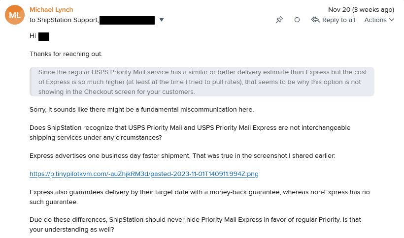
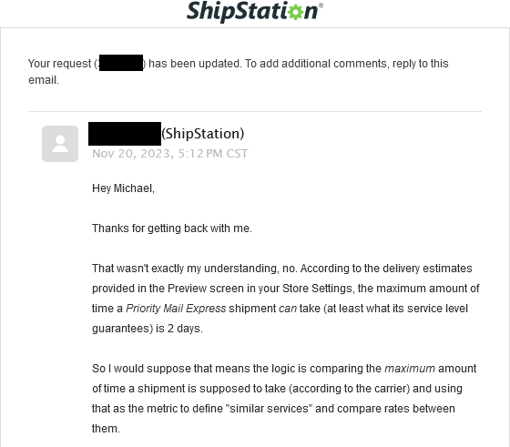



**New here?**

Hi, I'm Michael. I'm a software developer and the founder of [TinyPilot](https://tinypilotkvm.com), an independent computer hardware company. I started the company in 2020, and it now earns $80-100k/month in revenue and employs six other people.

Every month, I publish a retrospective like this one to share how things are going with my business and my professional life overall.


## Highlights

- I had a surprising amount of difficulty offering one-day shipping options.
- I attended the Handmade Seattle conference.
- I experimented with Zig and an open-source AI chatbot.

## Goal Grades

At the start of each month, I declare what I'd like to accomplish. Here's how I did against those goals:

### Shift manufacturing to our contract manufacturer as quickly as possible

- **Result**: The shift is now complete.
- **Grade**: A

The manufacturer is now producing TinyPilot devices to the same quality as when we assembled them in-house. The manufacturer now ships the devices directly to our 3PL's warehouse, which eliminates a strict need for TinyPilot to have its own office location.

### Conduct five customer outreach calls

- **Result**: We reached out to three customers and had zero customer calls
- **Grade**: F

In this case, I forgot to prioritize this. I lost almost two full weeks to conference and holiday travel, and the customer service team had lower bandwidth than usual. I should have followed up more with the team to prioritize this, as we need to continue investing here for the business' long-term sustainability.

### Clear the TinyPilot office of all old inventory and spare parts

- **Result**: I decided to pause this process
- **Grade**: N/A

It turns out our landlord is pretty relaxed about when we move out, so there's less urgency to close the office than I thought. It's also turning out to be harder than I expected to clear the office without just throwing everything in the garbage. We have dozens of items that are worth $1-50 apiece, but we generally have only a handful of each.

As an example, we have three used Arduino Uno boards. Each one retails for $28. We could maybe sell our three on eBay for a total of $30 used, but it would take about two hours to handle the process from end-to-end. So it would cost more in employee wages than we'd actually make selling the boards.

My new plan is to just to wait until we're close to moving out and advertise a time when people can just come by and take what they want for free.

## [TinyPilot](https://tinypilotkvm.com/?ref=mtlynch.io) stats



| Metric                   | October 2023   | November 2023    | Change                                           |
| ------------------------ | -------------- | ---------------- | ------------------------------------------------ |
| Unique Visitors          | 8,700          | 6,400            | -2,300 (-26%)           |
| Sales Revenue            | $98,896.81     | $84,055.05       | -$14,841.76 (-15%)      |
| Enterprise Subscriptions | $290.70        | $290.70          | 0                                                |
| Royalties                | $2,609.84      | $2,824.46        | +$214.62 (+8%)        |
| Total Revenue            | $101,797.35    | $87,170.21       | -$14,627.14 (-14%)      |
| **Profit**               | **$69,280.58** | **-$6,467.98**\* | **-$75,748.56 (-109%)** |

\* Profit is a naïve calculation based on my change in cash holdings over the month. I'll update it after I do real bookkeeping mid-month.

Profit looks scary, but it's just because transitioning to a contract manufacturer has made my expenses more "bursty." In October, I didn't have any bills for raw materials, but in November, I had $57k in raw materials expenses. I should really start reporting these as cost of goods sold, but for now, I'm just reporting the simple cash delta.

$80-100k is TinyPilot's normal, and we're safely in there. I might have tried to take advantage of Black Friday / Cyber Monday, but we were low on inventory due to the manufacturing switch, so we didn't have enough in stock to drop prices.

## One-day shipping: how hard could it be?

For most of TinyPilot's life, we haven't offered overnight or one-day shipping.

When we were fulfilling orders in-house, we staffed our office six days per week for processing orders, but only one person was there per day. I didn't offer one-day shipping because I knew there'd be situations where someone's out sick or on vacation, so a one-day turnaround wouldn't be possible.

When we switched fulfillment to a third-party logistics warehouse (3PL), our fragility around staffing went away. The 3PL has much more worker redundancy than we do, so orders should go out in one business day no matter what.

Finally, we should be able to offer one-day shipping options!

### The complex shipping stack

The problem was that in switching to the 3PL, the logic for showing shipping options had gotten more complicated. The way we used to present TinyPilot customers with shipping options looked like this:

1. Shopify offers a list of shipping options they support.
1. I pick which shipping options I want Shopify to make available to customers.
1. Customers pick a shipping option at checkout.
1. We purchase postage from Shopify to match the customer's shipping choice.

Under this system, Shopify controlled the experience end-to-end, and they did it well.

Our 3PL uses a (not very good) warehouse management solution called ShipStation. That tool integrates with our Shopify store, so now the stack looks like this:

1. ShipStation offers the 3PL a list of shipping options they support.
1. The 3PL chooses from this list of shipping options they want to offer their client (TinyPilot).
1. Shopify queries the ShipStation to find out which shipping options ShipStation and the 3PL agree on.
1. I pick from Shopify which shipping options I want to make available to customers.
1. At checkout, ShipStation makes terrible guesses at which options are "best" for the customer and reduces the set of shipping options to just two or three.
1. Customers pick a shipping option at checkout.
1. The 3PL purchases postage from ShipStation or another vendor to match the customer's shipping choice.

The problem is that with so many players involved, there are tons of ways for things to go wrong and tons of opportunities for finger pointing.

I tried to enable one-day shipping, and I found that there weren't any one-day options available by the time configuration bubbled through from the 3PL to ShipStation to Shopify to me.

After months of back and forth, we narrowed the problem down to ShipStation. They don't show one-day shipping options because they consider one-day and two-day shipping options to be "similar" but the two-day options are always cheaper, so they never present the one-day option.

And I repeat: ShipStation, a company whose primary job is to sell you postage for shipping packages, doesn't understand why anyone would choose one-day shipping if it's more expensive.


{{}}
{{}}


I was having so many issues with ShipStation that I decided to switch back to the old stack for presenting shipping options to customers. Now, we just show the customer the shipping options and rates through Shopify and don't even bother querying rates from ShipStation.

The problem with cutting ShipStation out of the checkout process is that the 3PL is still buying postage at the higher ShipStation rate, but Shopify is collecting shipping fees from customers at the lower Shopify rate. So a customer might only pay $30 for overnight shipping, but the real price of postage is $100 through ShipStation. TinyPilot has to absorb the $70 difference.

Still, this solution allows TinyPilot to offer the shipping options we want without ShipStation dopily overriding us. And absorbing $70 of extra shipping costs is better than not making the sale at all.

### One-day shipping customers are 20x more demanding

Most of the time, the 3PL ships our orders within one business day. But occasionally, something comes up and it takes two business days, and sometimes (very rarely) three. We advertise on our website up to three days of handling time, but customers seem not to pay attention to that.

98% of the time, customers who chose ground or two-day shipping don't say anything about a one-day handling delay

The Monday after Black Friday, UPS had a strange issue where they weren't updating tracking information for any of the orders they picked up. The warehouse swore that UPS picked everything up, but UPS tracking showed nothing.

The UPS tracking bug affected five customers who had requested overnight shipping. Within 24 hours, two of them had emailed us to complain about the delay. So, 40% of one-day shipping customers complained as opposed to about 2% who notice delays in ground or two-day shipping.

And I get it. When I order something with one-day shipping, I'm eager to get it, and I'm annoyed if the merchant sits on it for days.

These one-day shipping customers are a double-edged sword. If they're willing to pay five times the ground shipping rate to get it fast, they're probably big spenders who will boost TinyPilot's sales. But I'm seeing that they're also fairly demanding, and they're going to make things stressful for our support teams because they have urgency expectations that most customers don't have.

## My first Handmade conference

In November, I attended my first [Handmade conference](https://handmadecities.com/seattle/) in Seattle. It's an indie conference for people who work on low-level software.

Here were my takeaways from the conference.

### There are alternatives to the popular tech stacks

David Foster Wallace opened his famous [2005 Kenyon College commencement speech](https://fs.blog/david-foster-wallace-this-is-water/) with a joke about fish:

> There are these two young fish swimming along and they happen to meet an older fish swimming the other way, who nods at them and says “Morning, boys. How’s the water?” And the two young fish swim on for a bit, and then eventually one of them looks over at the other and goes “What the hell is water?”

For me, the web browser is water.

I'm so used to thinking about software as something the user ultimately interacts with through HTML and JavaScript that I almost forget that there are any alternatives. It's been a long time since I considered how weird it is that I design everything around a piece of technology whose primary job is representing documents.

But at Handmade, most of the developers I met didn't deal with web browsers at all, and they didn't use any of the technologies that I'm used to.

I met the creator of [MobileCode](https://mobilecodeapp.com/), an app for writing software on phones and tablets. I asked him what language he used, expecting him maybe to say Flutter or probably React Native. I was gobsmacked when he said "C."

And not only that, he said that he's had a positive experience doing mobile development in C. He can call native graphics APIs on iOS and Android directly rather than working through many layers of abstraction of a modern framework.

### Relentless indie ambition

The reason I first heard about Handmade to begin with is that I follow [Andreas Kling](https://awesomekling.github.io/about/), the creator of SerenityOS. He created the initial OS by himself with no third-party libraries or dependencies. He posted about presenting his project at Handmade in 2021.

And I looked into it and realized Handmade also tends to attract talks about [Zig](https://ziglang.org/), an indie programming language I've been interested in for a while. Andrew Kelly, the creator of Zig, apeared [on the CoRecursive podcast in 2021](https://corecursive.com/067-zig-with-andrew-kelley/) and talked about how he wants to replace all the C code in the world with Zig.

> **Adam**: What does the world look like when you take down C?
>
> **Andrew**: Oh, it’s beautiful. It looks mostly the same, except all your apps just work slightly better, and they just crash less often, and they use less memory, and they just go faster.
>
> When professors teach operating system courses, it’ll just be like obviously assumed that you just use Zig... when textbooks try to show how operating systems work or how embedded devices work, it’ll just be assumed that you’re going to use Zig as the example code, because that’s what everyone does.

I think Andrew's flavor of ambition and enthusiasm for software is so cool and exciting, and that was what I came to Handmade to find.

Handmade delivered on my expectation of indie ambition. The conference celebrated the practice of reinventing the wheel.

It's usually a putdown in software to accuse someone of reinventing the wheel, but Handmade embraces it. Why _not_ reinvent the wheel? Maybe your wheel will be better than the wheel everyone else is using. And just by trying to reinvent the wheel, you'll get a better understanding of how the wheel works.

Cameron Riekes is an undergrad, and he presented about building a 2D RPG game. But then he ["ended up" coding his own 3D game engine from scratch](https://www.youtube.com/watch?v=ANJ7qZgKHVU).

And Yasser Arguelles is 20ish years old and is working on [Tilde](https://yasserarg.com/tb.html), a from-scratch replacement for LLVM. For context: LLVM is a compiler backend that's been under active development for 20 years. In his presentation, Yasser mentioned that he didn't have a background in compilers, but one of the most popular requests he saw in Handmade discussions was for an alternative to LLVM, so he thought, "Sure, I'll do that."

And I got to meet Andrew Kelly, who was very nice. And the conversation inspired me to [finally try writing some Zig code](/notes/zig-call-c-simple/).

### Extreme skepticism of big tech

One complaint I had about the conference was that the tone was critical of big tech to a degree that I found irrational.

The narrative in almost every talk was that big tech is basically poison. Everything they produce is buggy, bloated, unreliable, and overpriced.

The reason more people aren't aware of big tech's shortcomings, according to speakers, is that big tech controls software conferences. They forbid presenters from speaking honestly about the problems in big tech software. I've spoken at a few mid-level conferences, and nobody's ever told me that I can't criticize big tech, so this rang false to me.

I'm sympathetic to the anti-big tech viewpoint. I prefer indie tech over big tech solutions whenever I can, but I also think that big tech does a lot of things very well and does most of the heavy lifting in driving technology forward. I think it's a mistake to simply turn up our noses at it and assume the indie thing is always better than the big tech equivalent.

### Other writeups

- [Carl Sverre](https://carlsverre.com/writing/handmade-seattle-2023/)

If you know of other writeups, let me know, and I'll link to them.

## Side projects

### [WanderJest](https://wanderjest.com)

WanderJest is a web app I started a few years ago to help people find live comedy near them. I [shelved it when COVID hit](/retrospectives/2020/04/), but I've been tinkering with it off and on since then.

One of the biggest challenges of WanderJest was finding out information about upcoming shows. The canonical information about a comedy show is typically a poster that looks like this:

{{}}

Performers don't want to make a poster and then re-type all the information somewhere else, so I've been thinking about ways to get the information from the poster "for free."

My first idea was to create a tool that [helps show producers create the posters](/retrospectives/2023/06/#poster-generators-in-wanderjest). I played around with that for a few days, but the first comedian I pitched it to wasn't interested. I haven't exhausted that idea yet, but I haven't been excited enough to iterate on it.

But now that AI image recognition is improving, my other idea is to find posters for shows and then scrape the show information using open-source AI tools.

When I read [Simon Willison's post](https://simonwillison.net/2023/Nov/29/llamafile/) about using Llamafile, I realized how easy it is to experiment with image-aware chatbots now, so I gave the poster problem a shot.

Unfortunately, LLaVA 1.5 accuracy with images doesn't seem to be high enough to do what I need. When I show it a comedy show poster and ask questions, its answers are only about 70% accurate:

{{}}

I tried blindly fiddling with the settings, but I wasn't able to improve the results.

Still, I'm excited to see progress and competition from open-source solutions in this space. For more details, see:

- [Rough Experiments with Llamafile and LLaVA 1.5](/notes/llamafile-lava1.5/)

## Wrap up

### What got done?

- Published [TinyPilot Pro 2.6.2](https://tinypilotkvm.com/pro/changes#262)
- Attended the Handmade Seattle conference
- Resolved a shipping export issue with one of our critical vendors

### Lessons learned

- One-day shipping attracts customers willing to spend more, but those customers are also more demanding.

### Goals for next month

- Conduct five customer outreach calls.
- Complete design work for TinyPilot license checking.
- Create a process for spot-checking each manufacturing batch of new devices.
