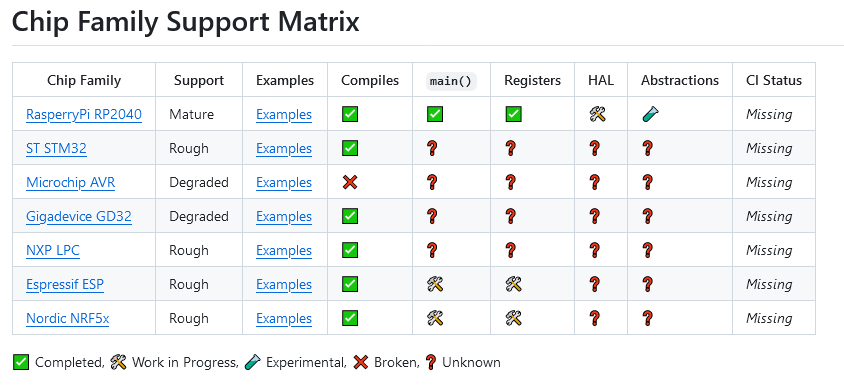



**New here?**

Hi, I'm Michael. I'm a software developer and the founder of [TinyPilot](https://tinypilotkvm.com), an independent computer hardware company. I started the company in 2020, and it now earns $80-100k/month in revenue and employs six other people.

Every month, I publish a retrospective like this one to share how things are going with my business and my professional life overall.


## Highlights

- I think about how I can do a better job delegating product decisions and documentation.
- I compare my experience learning Nix to learning Zig.

## Goal Grades

At the start of each month, I declare what I'd like to accomplish. Here's how I did against those goals:

### Complete design work for TinyPilot license checking

- **Result**: The design document is finished and reviewed.
- **Grade**: A

We now have a plan in place for how we'll check that TinyPilot customers still have active licenses before they update to the latest version. We'll need to fill in some details once we pick a third-party license management solution (we're leaning towards [Keygen](https://keygen.sh/)), but we've figured out the major pieces.

### Create a process for spot-checking each manufacturing batch of new devices

- **Result**: I didn't do this.
- **Grade**: F

This is partially due to time constraints. I had to unexpectedly work around a few issues with our vendors, and that took up a bit of my time.

The other issue is that this is an unpleasant task, so I procrastinated. It's an important thing to do because we want to catch manufacturing errors early, but it requires making a special request to our 3PL, who historically hasn't been so cooperative.

### Handle TinyPilot's end-of-year tax chores

- **Result**: We collected W-9 forms from all of our vendors.
- **Grade**: A-

This is now complete, and I have a better understanding of who needs to give us W-9 forms. I can avoid making it a last-minute task in the future.

## [TinyPilot](https://tinypilotkvm.com/?ref=mtlynch.io) stats



| Metric                   | November 2023  | December 2023   | Change                                           |
| ------------------------ | -------------- | --------------- | ------------------------------------------------ |
| Unique Visitors          | 6,400          | 6,700           | +300 (+5%)            |
| Sales Revenue            | $84,055.05     | $75,198.00      | -$8,857.05 (-11%)       |
| Enterprise Subscriptions | $290.70        | $290.70         | 0                                                |
| Royalties                | $2,824.46      | $1,792.51       | -$1,031.95 (-37%)       |
| Total Revenue            | $87,170.21     | $77,281.21      | -$9,889.00 (-11%)       |
| **Profit**               | **-$5,407.96** | **-$59,117.41** | **-$53,709.45 (-inf%)** |

Revenue is down slightly from November, but that's a seasonal trend that happens every year. Our normal range seems to be $75-90k/month, so we're at the low end of our normal, but not worryingly so.

Profit looks scary because I'm still doing bookkeeping on a cash basis, even though we're spending a lot more on manufacturing up front due to shifting to a third-party contract manufacturer. In the fourth quarter, TinyPilot spent $150k on materials and manufacturing, the most we've ever spent in a quarter. On a cost of goods sold (COGS) basis, TinyPilot's profit for December was actually $9k (as in, positive $9k).

Still, I've been neglecting marketing as I focus on managing our transition to external manufacturing and fulfillment vendors. TinyPilot has fortunately grown without much investment in marketing over the past few months, but I can't bank on that forever, so one of my goals in January is to explore some new marketing channels.

## Can I delegate hard product decisions?

When I think about where my time is going these days, I see a large portion of it going to what I'd call "hard product decisions." This is the time I spend thinking about which features TinyPilot needs, how much to invest in them, and how to reprioritize resources when we run into surprises.

I've tried to delegate hard product decisions to the TinyPilot team, but I haven't made much progress.

It would be great if I could create a chart showing how much a feature costs vs. how much it will satisfy users, and then tell the team to stay above the line.

{{}}

But there are many more factors for deciding how much to invest in a new feature, including:

- Will this feature cause confusion / clutter for users who don't need it?
- What will the long-term burden be of maintaining this feature?
- How will this feature impact our support teams?

And even if I could create this multidimensional chart, it's hard to make meaningful estimates about all the variables. One person might think that 5% of users will benefit from a feature, while another equally reasonable teammate might estimate that it's 15%. That one variable changes the value of the feature by a factor of 3. When you combine all the variables, two people might come up with return on investment estimates that are 100x different.

It feels highfalutin to say, but the person who makes the final call has to have "product vision." They need to be connected with customers, the dev team, and the support teams. And for TinyPilot, the only person in that position is me.

One possible solution is to hire a product manager whose job is to take high-level strategy, turn that into a plan, and execute it with the team. That's not very practical, as it's an additional person to manage and loop into communications with the team. I'm currently managing six people, and that feels like my upper bound on how many people I can manage effectively.

Another possibility is to give an existing team member product manager responsibilities, but that also feels impractical. It's not just another chore like bringing in the mail in the morning &mdash; they'd have to be looped in on almost all of the customer and team interactions, so it's another 10-20 hours per week of work. And even if we did that, I'm not sure I could train someone to the point where they're making sound product decisions.

My plan now is to continue giving the dev team high-level strategy and a rough budget of dev hours for bugs and feature work. That's been working, but I'm still searching for ways to facilitate them making more decisions autonomously.

## Can I do a better job of delegating documentation?

I'm particular about documentation. If I see ways to improve it, I don't want to publish until we've made it as good as it can be.

I still review all of TinyPilot's blog posts, FAQs, and tutorials, and I'm frequently the bottleneck on publishing. And I feel like a large chunk of my founder time goes to documentation review.

It's not so much that I spend so many raw hours on documentation, but I use a lot of my "deep thinking" budget on reviewing documentation. I'm capable of about one hour of writing per day. Reviewing other people's writing is even more draining than writing myself. Because not only am I thinking about how to express an idea, I have to think about why I'm choosing to express it that way.

I used to struggle with perfectionism in code reviews and had to learn to [let little things go](/human-code-reviews-2/#aim-to-bring-the-code-up-a-letter-grade-or-two). It's okay if the code isn't as beautiful as possible because it doesn't impact the user experience. But everyone can see documentation, and there's a tangible difference between A-grade writing and B-grade writing.

So, how do I keep writing standards high without making myself a dependency in the process?

I've considered pulling in a freelance technical writer, but that would complicate our writing pipeline. I also worry that a dedicated writer would discourage people from improving their writing. They might feel like, "I'll write whatever I want, and it's the technical writer's job to fix it."

One of the challenges I run into when reviewing writing is that I have a model in my head of what the typical TinyPilot customer is like, and I don't know how to articulate that model accurately to other people. And even when others understand the model, it's hard for them to write in a way that fits TinyPilot's customer model.

{{}}

Perhaps one way of improving this is to revisit past reviews and look for patterns. If I see patterns, I can say, "Before you send this out for review, check for whether there are sections that would benefit from a screenshot, check that you're explaining new terms before you use them, etc."

We have a team subscription to Grammarly, but it doesn't fit well with our workflows. People maybe use it on the first draft, but nobody wants to keep copy/pasting an entire article into Grammarly after every edit. I've looked at [Vale](https://vale.sh), which is developer-oriented, but it seems primitive relative to Grammarly. Maybe we could configure Vale with some low-noise checks, so I'll give it a shot.

## Learing Nix vs. learning Zig

One of the results of shifting TinyPilot's manufacturing and fulfillment to third-party vendors is that I've had more time and mental bandwidth to learn new technologies. The two technologies I've been eyeing from afar for the past two years are [Nix](/tags/nix/) and [Zig](/tags/zig/), and I finally got to experiment with both of them toward the end of 2023.

Having learned both to a beginner level, it's interesting to compare my experience learning Nix to my experience learning Zig.

### I learn Zig by reasoning &mdash; I learn Nix through copy/paste

One of the complaints I've heard about Zig is that it has poor documentation. I've found the documentation to be pretty terse and written [more from the perspective of a compiler designer than a developer](/notes/zig-unit-test-c/#converting-a-zig-type-to-a-c-type), but I'm still able to scour discussions and experiment until I have an accurate mental model of Zig.

After six months of using Nix, I still have a terrible mental model of Nix. I've read multiple explanations, but the concepts haven't quite crystallized for me. When I create Nix files, I can only do it by copying an existing example and adjusting it to match what I want. Most of the file is just boilerplate, and I don't understand why it is the way it is.

When I hit an error in Zig, I can usually [reason through it](/notes/zig-unit-test-c/#calling-ustreamer-code-from-zig) to understand what the compiler is telling me. When I hit an error in Nix, I feel completely helpless.

I think one major difference is that I have a lot of development experience in C-style languages and no experience in pure functional languages. Zig is aimed at C and C++ developers, so the concepts make sense to me as someone who has worked in those languages for ten years.

Nix seems very inspired by Haskell and other functional languages, which I've never learned. For a Haskell developer, Nix would probably feel more intuitive, and they might be confused by Zig's focus on pointers and memory allocators, which are not as prominent in functional languages.

### Developer experience on Zig feels narrow but deep, whereas Nix feels wide and shallow

Zig doesn't have tooling for [package management](https://news.ycombinator.com/item?id=38837410) or code coverage. One of my disappointments with Zig so far has been that its support for microcrontrollers seems [mostly absent](https://github.com/ZigEmbeddedGroup).

{{}}

But when Zig claims it can do something, it does it well. I was skeptical of its claims that it can be a drop-in replacement for `gcc`, but every time I've swapped out `gcc` for `zig`, everything just works. Zig claims that you can just import a `.c` file into a Zig file, and [you can](/notes/zig-call-c-simple/).

My experience with Nix is that Nix attemps to do a much broader set of things, from simple things like [building a Node.js project](https://nixos.wiki/wiki/Node.js) to grand things like [building and managing an entire OS](https://nixos.org/).

When my project perfectly matches what the Nix tooling expects, then everything works great. But I frequently run into situations where my setup is slightly different from what the Nix tooling expects, and I hit a brick wall. For example, I [still can't figure out](https://github.com/nix-community/pyproject.nix/issues/46#issuecomment-1869238745) how to run arbitrary Python projects under Nix.

One of the most surprising gaps in Nix is that [there's no official way to specify a package version](https://github.com/NixOS/nixpkgs/issues/9682) you want to install. There have been eight years of discussion, and [there doesn't seem to be a solution](https://github.com/NixOS/nixpkgs/issues/93327) or even an official acknowledgement that this will or won't be fixed.

### Nix leadership is decentralized, Zig has a BDFL

Andrew Kelly is the original creator of Zig. Several others have joined the project, but [Andrew is effectively still the benevolent dictator for life (BDFL)](https://kristoff.it/blog/interfacing-with-zig/). When I'd search for Zig documentation or help, I'd frequently encounter Andrew or someone official from the project answering in a Github issue or forum discussion.

When I first heard about Nix, I assumed [Eelco Dolstra](https://edolstra.github.io/) would be Nix's BDFL. He doesn't seem to be, at least not publicly.

Nix is Eelco's brainchild, as it came out of his [2006 PhD thesis](https://edolstra.github.io/pubs/phd-thesis.pdf). Eelco is [president of the Nix Foundation](https://discourse.nixos.org/t/expanding-the-nixos-foundation/19929), but he also works for [Determinate Systems](https://determinate.systems/), a third-party consulting firm that promotes Nix. But Determinate Systems is decidedly third-party and not core to Nix. They release things that sometimes [clash](https://discourse.nixos.org/t/introducing-flakehub/32044/3?u=mtlynch) [controversially](https://discourse.nixos.org/t/parting-from-the-documentation-team/24900?u=mtlynch) with work from internal Nix teams.

While Zig feels centrally-planned, Nix feels rudderless. When I can't figure something out, my searches often bring me to meandering discussions on Github or the Nix Discourse forum. The conversations always sound like people discussing an alien technology that we've discovered by mistake. I never see someone from the Nix core team weigh in, and I don't even know if there is a core team.

### Older solutions usually don't work in Nix or Zig

Zig hasn't declared a stable 1.0 release yet, so it's typical for compiler updates to make breaking changes. Code that was valid in Zig 0.8.0 might not still be valid in Zig 0.11.0. In my experience, Zig tooling is pretty good at fixing the code automatically, but it's not 100% accurate.

In Nix, I've similarly run into problems with older examples. Nix is in the middle of a controversial revolution around [flakes](https://nixos.wiki/wiki/Flakes), a fairly new and still-not-official feature. But all the recent guides use flakes, and all the old discussions use not-flakes, so I have trouble applying pre-flakes solutions to my post-flakes environments.

### Zig requires full team buy-in, whereas Nix facilitates partial adoption

One nice property of Nix is that it's self-contained. I can drop a `flake.nix` into one of my projects to [automatically manage dependencies](/notes/nix-dev-environment/) without changing anything else or asking anything of my teammates.

Even if I'm the only Nix user on my team, the `flake.nix` still provides great value to me without costing anyone else anything or requiring them to use a new tool. It's like adding a `.vscode` directory to your project: helpful for people who use VS Code, doesn't really bother anyone else.

Zig, on the other hand, requires commitment and full-team buy-in. If you've got a C or C++ project, and you decide you want to switch to Zig, you can't just enjoy your better tooling and wait for your teammates to join you. As soon as you introduce Zig code into your project, everyone has to build it with the Zig compiler rather than a C/C++ compiler.

It's not Zig's fault, but it means that I'm only exposed to Zig when I visit Zig-land by tinkering with code or looking at a Zig project, whereas I now bring Nix with me everywhere I go.

## Wrap up

### What got done?

- Completed design work on TinyPilot license checking.
- Published three new [blog notes](/notes/).
  - ["Using Zig to Unit Test a C Application"](/notes/zig-unit-test-c/) was popular on [Hacker News](https://news.ycombinator.com/item?id=38683852), [Lobsters](https://lobste.rs/s/ghttjv/using_zig_unit_test_c_application), and [Ziggit](https://ziggit.dev/t/using-zig-to-unit-test-a-c-application/2502?u=mtlynch).
- Completed year-end tax chores.

### Lessons learned

- Periodic meta-reviews of documentation reviews might be helpful.
  - We're currently only discussing improvements on a per-article level, but the team's writing skills might improve more by reviewing patterns that recur across many articles.
- [Vale](https://vale.sh/) might be useful for catching minor issues before a documentation review.

### Goals for next month

- Publish annual retrospective.
- Reach out to five bloggers about TinyPilot collaborations.
- Get records ready for 2023 taxes.

### Requests for help

- If you've had good experience with a 3PL that serves small order volumes (100-200 shipments per month), let me know. I'm [in the market for a good 3PL](/retrospectives/2023/12/#one-day-shipping-how-hard-could-it-be).
