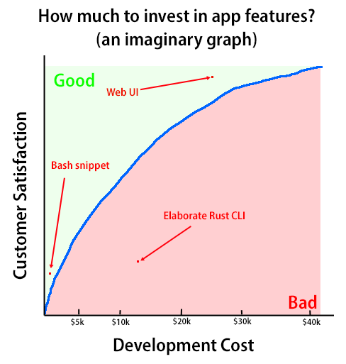



**New here?**

Hi, I'm Michael. I'm a software developer and the founder of [TinyPilot](https://tinypilotkvm.com), an independent computer hardware company. I started the company in 2020, and it now earns $80-100k/month in revenue and employs six other people.

Every month, I publish a retrospective like this one to share how things are going with my business and my professional life overall.


## Highlights

-

## Goal Grades

At the start of each month, I declare what I'd like to accomplish. Here's how I did against those goals:

### Complete design work for TinyPilot license checking

- **Result**: The design document is finished and reviewed.
- **Grade**: A

TODO

### Create a process for spot-checking each manufacturing batch of new devices

- **Result**: I didn't do this.
- **Grade**: F

This is partially due to time constraints. I had to unexpectedly work around a few issues with our vendors, and that took up a bit of my time.

The other issue is that this is an unpleasant task, so I procrastinated it a lot. It's an important thing to do because we want to catch manufacturing errors early, but it requires making an ask of our 3PL, who historically hasn't been so cooperative when we ask them to do things outside of the standard day-to-day work of fulfilling orders.

### Handle TinyPilot's end-of-year tax chores

- **Result**: We collected W-9 forms from all of our vendors.
- **Grade**: A-

This is now complete, and I now have a better understanding of who needs to give us W-9 forms, so I can avoid making it a last-minute thing in the future.

## [TinyPilot](https://tinypilotkvm.com/?ref=mtlynch.io) stats



| Metric                   | November 2023  | December 2023   | Change                                           |
| ------------------------ | -------------- | --------------- | ------------------------------------------------ |
| Unique Visitors          | 6,400          | 6,700           | +300 (+5%)            |
| Sales Revenue            | $84,055.05     | $75,198.00      | -$8,857.05 (-11%)       |
| Enterprise Subscriptions | $290.70        | $290.70         | 0                                                |
| Royalties                | $2,824.46      | $1,792.51       | -$1,031.95 (-37%)       |
| Total Revenue            | $87,170.21     | $77,281.21      | -$9,889.00 (-11%)       |
| **Profit**               | **-$5,407.96** | **-$59,117.41** | **-$53,709.45 (-inf%)** |

Revenue is down slightly from November, but that's a seasonal trend that happens every year.

Profit looks scary because I'm still doing bookkeeping on a cash basis even though we're spending a lot more on manufacturing up front due to shifting to a third-party contract manufacturer. In the fourth quarter, TinyPilot spent $150k on materials and manufacturing, the most we've ever spent in a quarter. On a cost of goods sold (COGS) basis, TinyPilot's profit for December was actually around positive $8k.

## Topic 1

## Can I delegate more?

### Delegating documentation

I'm particular about documentation. If I see ways to improve it, I don't want to publish it until we've integrated the improvements.

It takes [years for writing skills to improve](/guides/hiring-content-writers/3-screening-candidates/).

Writing is mentally taxing. I have to be very focused. Giving constructive feedback on writing is even harder.

It's blocked on me, and not only that, it's blocked on my limited "writing mind" resources. I can think about writing or other hard tasks for about two hours per day.

I've considered pulling in a freelance technical writer, but that introduces more complexity into the writing pipeline, and it's another person to hire and manage. I also worry that it discourages people from improving the writing because the system would imply that you just write however you feel like, and then the technical writer fixes everything for you.

I have the same problem in code reviews, and I've had to restrain myself. It's okay if the code isn't what I would do because users can't see it. But documentation, everyone can see it. There's a tangible difference between A-grade writing and B-grade writing.

This is complicated enough that it requires a screenshot or diagram to explain what's happening. You're assuming that our customers will recognize this term, but I think too many of them won't.

{{}}

### Delegating tasks that depend on product vision

It's hard to articulate. Like ideally, I could show them a graph and say that . Even if they could, they don't really know the implementation cost. It's short-term cost, long-term maintenance burden,

If you can't confirm the change after the change. Whoops, now there's another problem. On my network (but nobody else's), my computer cached the IP address for `tinypilot.local`, so it keeps trying to contact `10.0.0.100` even though the device has moved to `10.0.0.200`. And there's a workaround where instead of trying to go to `tinypilot.local`, we go to the IP address directly. But now there's a new problem because we signed the TLS certificate to be associated with `tinypilot.local` and not `10.0.0.200`.

So, all these things require a delicate balancing of guesses about costs, guesses about how many people this will affect, guesses about how angry users will be if they hit the degraded experience. So I end up being pretty involved. I can't really just give them a graph and tell them to land somewhere above the curve.

{{}}

It feels high-fallutin (sp?) to say, but the only way I can articulate the confluence of all those factors is the person who has the product vision. For TinyPilot, that's me. The developers aren't in a position to decide if something is worth $10k in dev costs to improve a feature by 10%.

## Learing Nix vs. learning Zig

They're not at all competitors. The only similarity is that they're new open-source technologies, and they're both small underdogs trying to compete with larger entrenched competitors.

### I learn Zig by reasoning &mdash; I learn Nix through copy/paste

One of the complaints I've heard about Zig is that it has poor documentation. And I understand that criticism. I've found the documentation to be pretty terse and written more from the perspective of a compiler designer than a developer. But I'm still able to scour discussions and experiment until I have an accurate mental model of how Zig works.

After six months of using Nix, I still have a terrible mental model of how Nix works. I've read explanations of Nix, but it still hasn't clicked for me. When I create Nix files, I can only do it by copying an existing example and adjusting it to match what I want. Most of the file is just boilerplate, and I don't understand why it is the way it is.

When I hit an error in Zig, I can usually reason through it to do what I want. When I hit an error in Nix, I feel completely helpless.

I think one major difference is that I have a lot of development experience in C-style languages and no experience in pure functional languages. Zig is aimed at C and C++ developers, so I think the concepts make sense to me as someone who worked in those languages for ten years. Nix seems very inspired by Haskell and other functional languages, which I've never learned. For a Haskell developer, Nix would probably feel more intuitive, and they might be confused by Zig's focus on pointers and memory allocators, which are not as prominent in functional languages.

The other difference is that Zig is low-abstraction, whereas Nix has a lot more layers of abstraction.

### Developer experience on Zig feels narrow but deep, whereas Nix feels wide and shallow

Zig doesn't have tooling for [package management](https://news.ycombinator.com/item?id=38837410) or code coverage. One of my disappointments with Zig so far has been that its support for microcrontrollers seems mostly absent.

When Zig claims it can do something, it does it well. I was skeptical of its claims that it can be a drop-in replacement for `gcc`, but every time I've swapped out `gcc` for `zig`, everything just works. Zig claims that you can just import a `.c` file into a Zig file, and [you can](/notes/zig-call-c-simple/).

My experience with Nix is that Nix attemps to do a much broader set of things, from [managing your entire OS](https://nixos.org/) to [building your Node.js project](https://nixos.wiki/wiki/Node.js) project for you. I've had great experience with certain Nix tasks and miserable experience with others. I [still can't figure out](https://github.com/nix-community/pyproject.nix/issues/46) how to run arbitrary Python projects under Nix.

One of the most surprising gaps in Nix is that [there's no official way to specify a package version](https://github.com/NixOS/nixpkgs/issues/9682) you want to install. There have been eight years of discussion, and [there doesn't seem to be a solution](https://github.com/NixOS/nixpkgs/issues/93327) or even an official acknowledgement that this will or won't be fixed.

### Nix leadership is decentralized, Zig has a BDFL

Andrew Kelly is [effectively Zig's BDFL](https://kristoff.it/blog/interfacing-with-zig/). In a lot of discussions, I'd encounter Andrew or someone official from the project giving an authoritative answer.

Nix feels rudderless. When I can't figure something out, I visit the Nix Discourse forum, and it's like people are discussing an alien technology that humans have discovered. I never see someone from the Nix core team weigh in, and I don't even know if there is a core team. Whenever I see people describe the direction of Nix, the description I most often see is "there are discussions around &lt;topic&gt;."

I'd expect Eelco Dolstra to be Nix's BDFL, but he doesn't seem to be, at least not publicly. He works for Determinate Systems, a third-party consulting firm that promotes Nix. But they're decidedly third-party and not core to Nix. They release things that sometimes [clash](https://discourse.nixos.org/t/introducing-flakehub/32044/3?u=mtlynch) [controversially](https://discourse.nixos.org/t/parting-from-the-documentation-team/24900?u=mtlynch) with work from internal Nix teams . He's [president of the Nix Foundation](https://discourse.nixos.org/t/expanding-the-nixos-foundation/19929),

https://discourse.nixos.org/t/expanding-the-nixos-foundation/19929

### Older solutions usually don't work in Nix or Zig

Zig hasn't declared a stable 1.0 release yet, so it's typical for compiler updates to make breaking changes. Code that was valid in Zig 0.8.0 might not still be valid in Zig 0.11.0. In my experience, Zig tooling is pretty good at fixing the code automatically, but it's not 100% accurate.

In Nix, I've similarly run into problems with older examples. Nix is in the middle of a controversial revolution toward flakes, a fairly new and still-not-official feature. But all the recent guides use flakes, and all the old discussions use not-flakes, so I have trouble applying pre-flakes solutions to my post-flakes environments.

### Zig requires full team buy-in, whereas Nix facilitates partial adoption

One nice property of Nix is that it's self-contained. I can drop a `flake.nix` into one of my projects to [automatically manage dependencies](/notes/nix-dev-environment/) without changing anything else or asking anything of my teammates.

Even if I'm the only Nix user on my team, the `flake.nix` still provides great value to me without costing anyone else anything or requiring them to use a new tool. It's like adding a `.vscode` directory to your project: helpful for people who use VS Code, doesn't really bother anyone else.

Zig, on the other hand, requires commitment and full-team buy-in. If you've got a C or C++ project, and you decide you want to switch to Zig, you can't just enjoy your better tooling and wait for your teammates to join you. As soon as you introduce Zig code into your project, everyone has to build it with the Zig compiler rather than a C/C++ compiler.

The only way to make Zig as portable as Nix is if Zig retrofitted every C and C++ compiler for Zig compatibility, but that's not realistic. But it means that I'm only exposed to Zig when I visit Zig-land by tinkering with code or looking at a Zig project, whereas I now bring Nix with me everywhere I go.

## Wrap up

### What got done?

-

### Lessons learned

-

### Goals for next month

- Publish annual retrospective.
- Blog invitations?
- Create workflow for double checking batches

### Requests for help

- If you've had good experience with a 3PL that serves small order volumes (100-200 shipments per month).
