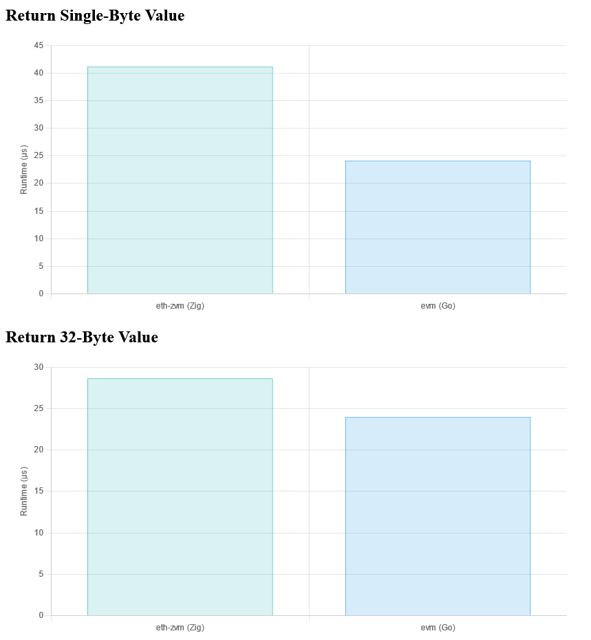



**New here?**

Hi, I'm Michael. I'm a software developer and the founder of [TinyPilot](https://tinypilotkvm.com), an independent computer hardware company. I started the company in 2020, and it now earns $80-100k/month in revenue and employs six other people.

Every month, I publish a retrospective like this one to share how things are going with my business and my professional life overall.


## Goal Grades

At the start of each month, I declare what I'd like to accomplish. Here's how I did against those goals:

### Publish annual retrospective

- **Result**: Published ["My Sixth Year as a Bootstrapped Founder"](/solo-developer-year-6/)
- **Grade**: A

I published this a few weeks late, but I was happy with how it came out.

The post [reached the #1 spot on Hacker News](https://news.ycombinator.com/item?id=39398009), which was fun but also highlights how talking about money is a double-edged sword. Readers are much more interested and excited when you share numbers, but the majority of the comments focused exclusively on the numbers.

### Reach out to five bloggers about TinyPilot collaborations

- **Result**: Reached out to two bloggers
- **Grade**: C

I ended up spending more time than I expected documenting TinyPilot's release process, so I had less available bandwidth for reaching out to bloggers. I did reach out to two, but I didn't hear back from either of them.

### Get records ready for 2023 taxes

- **Result**: Got all my tax documents ready
- **Grade**: A

Taxes are always boring, but everything is on schedule this year.

## [TinyPilot](https://tinypilotkvm.com/?ref=mtlynch.io) stats



| Metric                   | December 2023   | January 2024   | Change                                              |
| ------------------------ | --------------- | -------------- | --------------------------------------------------- |
| Unique Visitors          | 6,700           | 7,800          | <font color="green">+1,100 (+16%)</font>            |
| Sales Revenue            | $75,198.00      | $100,008.98    | <font color="green">+$24,810.98 (+33%)</font>       |
| Enterprise Subscriptions | $290.70         | $290.70        | 0                                                   |
| Royalties                | $1,792.51       | $3,313.11      | <font color="green">+$1,520.60 (+85%)</font>        |
| Total Revenue            | $77,281.21      | $103,612.79    | <font color="green">+$26,331.58 (+34%)</font>       |
| **Profit**               | **$-59,117.41** | **$79,764.14** | **<font color="green">+$138,881.55 (+inf%)</font>** |

TinyPilot had its second-highest revenue month in history. I don't have an explanation except for just regular variation in our sales. Our typical month tends to fall in the $75-95k range, and I think we caught the high side of variance, and a few large orders pushed us over $100k.

Profit was absurdly high, but it's again due to how bursty TinyPilot's expenses are for raw materials after we've switched to the contract manufacturer. I'm happy to see three-month trailing average is positive, albeit lower than usual.

## I accidentally hoarded TinyPilot's release process

When I sold the first few TinyPilot devices, I couldn't duplicate microSDs correctly on my development machine. I prepared each customer's device one-by-one by flashing Linux onto a microSD, then running the TinyPilot install script manually on each device.

Since then, I've learned a lot more about the process of releasing software for a hardware device. Our release process has become more mature with more extensive testing, better reproducibility, and additional automation.

I documented our release process in TinyPilot's shared Notion workspace, and I've delegated most of the process to teammates so that new TinyPilot releases aren't blocked on me.

Or, at least, I _thought_ I had documented most of the release process.

For the latest release, I challenged myself to refrain from performing any of the release steps directly. Instead, I asked teammates to perform the release process based on my documentation.

Before I could even ask a teammate to perform the first task, I realized how much of the process I'd been keeping silo'ed in my head. All of the steps in the release were documented, but there was nothing explaining how everything fit together.

I also realized that some tasks in the process like "update [the changelog](https://tinypilotkvm.com/pro/changes)," or "write [the release announcement](https://tinypilotkvm.com/blog/whats-new-in-2023-11)," were significantly more complicated than those short phrases implied. What features do we highlight in our announcments? What are the unwritten rules about how we explain features without getting bogged down in the boring details?

The benefit of documenting my process is that it forces me to think deliberately about all of my decisions. There were a lot of cases where I looked through past releases and tried to extrapolate patterns only to realize that my decisions had been inconsistent. In other cases, I'd done something consistently, but when I had to explain why, I realized there was a better strategy.

Delegating the entire release has been slower than when I did it myself, but it's been a valuable exercise. It makes our release process less dependent on me, gives us a chance to improve our process, and makes it easier to parallelize subparts of it in the future.

## Side projects

### Implementing a bytecode interpreter in Zig

I've been [exploring Zig](/tags/zig/) for the past few months, and one of the biggest obstacles to learning more is finding projects that are a good match for Zig.

Most of my ideas for projects are web apps, which usually leads me to Go, as it was designed for building web apps, whereas Zig was designed to be a more general-purpose replacement for C.

Over the past few months, I've been occasionally reading [_Crafting Interpreters_ by Bob Nystrom](https://craftinginterpreters.com/) and [_Mastering Ethereum_ by Andreas M. Antonopoulos and Gavin Wood](https://github.com/ethereumbook/ethereumbook). _Crafting Interpreters_ demonstrates [how to implement a bytecode interpreter](https://craftinginterpreters.com/chunks-of-bytecode.html) in C, and _Mastering Ethereum_ describes how the core of Ethereum is a bytecode interpreter called the Ethereum Virtual Machine (EVM).

I realized I could combine a few different interests by writing an implementation of the Ethereum Virtual Machine in Zig. I started a project called [eth-zvm](https://github.com/mtlynch/eth-zvm).

I've only implemented about 2% of Ethereum, but my interpreter can already run real Ethereum programs and return the result.

Here is what it looks like when my interpreter runs a simple program compiled to Ethereum bytecode:

```bash
$ echo '600160005260206000f3' | xxd -r -p | zig-out/bin/eth-zvm -v
PUSH1 0x01
  Stack: push 0x1
---
PUSH1 0x00
  Stack: push 0x0
---
MSTORE
  Stack: pop 0x0
  Stack: pop 0x1
  Memory: Writing value=0x1 to memory offset=0
  Memory: 0x00000000000000000000000000000001
---
PUSH1 0x20
  Stack: push 0x20
---
PUSH1 0x00
  Stack: push 0x0
---
RETURN
  Stack: pop 0x0
  Stack: pop 0x20
  Memory: reading size=32 bytes from offset=0
  Return value: 0x0000000000000000000000000000000000000000000000000000000000000001
---
EVM gas used:    18
execution time:  792.395µs
0x0000000000000000000000000000000000000000000000000000000000000001
```

You can compare my interpreter's results to the JavaScript implementation on the [evm.codes playground](https://www.evm.codes/playground).

I thought I would easily crush other interpreters in terms of performance because Zig itself is so performance-optimized, but it turns out that the official Go implementation of Ethereum is pretty fast:

{{}}

My interpreter is still leaving a lot of performance optimizations on the table, so I bet I can beat the other implementations if I spend some time cutting out memory allocations.

I don't know how far I'll take the project, but it's serving as a practical way to build my knowledge of Zig, Ethereum, and interpreters. It's also a fun type of programming I haven't done in a long time because I have to be deliberate about every single byte I read or allocate from the OS.

## Wrap up

### What got done?

- Published ["My Sixth Year as a Bootstrapped Founder"](/solo-developer-year-6/), which reached [the #1 spot on Hacker News](https://news.ycombinator.com/item?id=39398009) for the day.
- Began documenting TinyPilot's release process.

### Lessons learned

- A process isn't really documented until someone has actually used the documentation to follow the process.

### Goals for next month

- Publish TinyPilot Pro 2.6.3.
- Document TinyPilot Pro's release process internally.
- File 2023 taxes.
