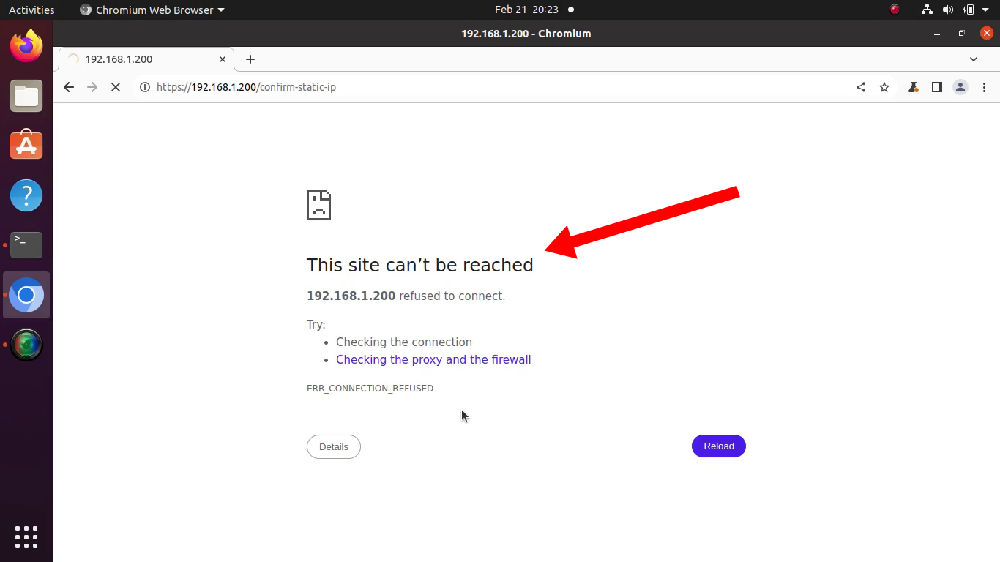



**New here?**

Hi, I'm Michael. I'm a software developer and the founder of [TinyPilot](https://tinypilotkvm.com), an independent computer hardware company. I started the company in 2020, and it now earns $80-100k/month in revenue and employs six other people.

Every month, I publish a retrospective like this one to share how things are going with my business and my professional life overall.


## Highlights

-

## Goal Grades

At the start of each month, I declare what I'd like to accomplish. Here's how I did against those goals:

### Publish TinyPilot Pro 2.6.3

- **Result**: We published the release.
- **Grade**: A

We were trying to expose any release steps that are accidentally silo'ed with me, so this was the first release where I didn't perform any release step directly. The team performed every step based on shared documentation, including things like writing [the changelist](https://tinypilotkvm.com/pro/changes#263) and the [release announcement](https://tinypilotkvm.com/blog/whats-new-in-2024-03).

### Document TinyPilot Pro's release process internally

- **Result**: I documented enough to cover the release, but there are still areas to improve.
- **Grade**: B+

Documenting the release process was a great exercise in that exposed not only undocumented processes but also weaknesses in our process. In documenting our release workflow, I realized that we hadn't critically examined much of it, so there were lots of places that were unnecessarily labor-intensive, error-prone, or pushed us to reinvent the wheel.

### File 2023 taxes

- **Result**: Gathered most documents, but I haven't filed yet.
- **Grade**: B

I ended up getting sidetracked by the TinyPilot release, so I haven't filed yet. Still, I should probably file my taxes at some point this year.

## [TinyPilot](https://tinypilotkvm.com/?ref=mtlynch.io) stats



| Metric                   | January 2024   | February 2024  | Change                                          |
| ------------------------ | -------------- | -------------- | ----------------------------------------------- |
| Unique Visitors          | 7,800          | 13,000         | +5,200 (+67%)        |
| Sales Revenue            | $100,008.98    | $82,517.42     | -$17,491.56 (-17%)     |
| Enterprise Subscriptions | $290.70        | $290.70        | 0                                               |
| Royalties                | $3,313.11      | $3,373.65      | +$60.54 (+2%)        |
| Total Revenue            | $103,612.79    | $86,181.77     | -$17,431.02 (-17%)     |
| **Profit**               | **$79,764.14** | **$24,199.09** | **-$55,565.05 (-70%)** |

We saw a big surge in visitors due to the attention [my annual review](/solo-developer-year-6/) generated, but it didn't seem to impact TinyPilot sales much. There was a 17% drop in sales, but that's mainly due to January being an atypically strong month. $75-95k/month in sales is our typical range.

I need a new way to report monthly profit because switching to the contract manufacturer has made our cash profit numbers basically meaningless at the one-month resolution. Our profit each month is dominated by the timing of manufacturing bills pay every three to four months.

That said, our three-month trailing average profit is back in the $10-20k range I like to see.

## It turns out we have a 25-step release process

Originally, TinyPilot software releases were entirely my job. As the product matured and we added more steps to the process, releases grew to be 10-20 hours of work.

About 18 months in, I delegated the hardest release tasks to my teammates. That included most of the manual testing. That cut my time down to three to five hours per release, and I felt like I'd done a good job delegating.

For the last TinyPilot release, I challenged myself to delegate _everything_. I wanted to make sure releases could move forward at times when I'm not available.

I started writing instructions for the tasks I still owned, expecting to document just a handful of steps.

When I enumerated everything I was still doing every release, I realized we had 25 distinct subtasks as part of every release:

> ### Testing a release candidate
>
> 1. Create a release candidate build
> 1. Draft the changelog
> 1. Draft security advisories (if applicable)
> 1. Draft the release announcement
> 1. Update the test plan to cover any feature changes
> 1. Test release candidate on a Voyager device
> 1. Test updating from a released build to the release candidate
> 1. Test release candidate on a DIY device
> 1. Run automated end-to-end tests against a physical device
> 1. Review test results
> 1. Decide whether to publish the release
>
> ### Publishing the release
>
> 1. Publish security advisories (if applicable)
> 1. Publish the changelog
> 1. Publish TinyPilot Pro production release
> 1. Perform post-release tests
> 1. Announce release to TinyPilot team
> 1. Add image hashes to changelog
> 1. Monitor bug reports for at least 48 hours
>
> ### Announcing the release
>
> 1. Publish TinyPilot Community release
> 1. Publish release announcement blog post
> 1. Share release with EU distributor
> 1. Share release with manufacturer
> 1. Update links in internal playbooks
> 1. Send release announcement to public mailing list
> 1. Share blog post on TinyPilot’s Twitter

I had only documented and delegated three of them: the ones that required manual testing. But I was still doing the other 22 tasks.

Looking at the list, 25 steps just to do a release sounds like a lot. And really, it's far more than 25 steps because there are dozens of substeps within the testing steps.

There are two types of costs in our release process. The simplest is just the wall time. If a single person did all 25 steps, it would probably take 20 hours, so we want to find opportunities to reduce the effort needed to publish a release.

The second type of cost is managing the complexity. If multiple people work together on the release, there's complexity in how they share results with each other and decide when to proceed to the next step.

## How do we catch pre-release bugs?

Some tasks turned out to be much harder to delegate than I expected.

Usually, when I delegate a task, I document what I do. Often, this is a difficult process, as it's hard to take a step back from my process and try to explain how I make decisions.

Delegating release tasks turned out to be harder than normal delegation because I realized that even if I could explain how I made my decisions, my teammates were missing context to make those decisions.

As an example, I'll share a bug we encountered during final testing.

Usually, when you plug a device into your network, it requests whatever IP address the router assigns it. But some users want their devices to request a fixed, predictable IP address, so we added support to that in TinyPilot's web interface.

Here's what the feature looked like during our pre-release testing:



The customer service team ran the test, and they reported no issues. The page loaded at the new IP address, as expected in the test plan. The support engineering team reviewed the video of the test, and they reported that the feature worked correctly.

I reviewed the video, and I saw there was a big problem. For a few moments before the web interface loaded at the new address, the user saw this scary error screen:

{{}}

When I showed the dev team, they were heartbroken.

We had invested weeks of dev time into giving users a smooth transition from their dynamic IP to their static IP. This turned out to be particularly challenging due to complexity around DNS caching and browser security protections for cross-domain requests. After a lot of testing and orchestration code, the dev team thought they finally had it right, but it turned out it didn't work smoothly in TinyPilot's office.

So, how do we catch bugs like that without me micromanaging the process? How do we avoid the disconnect between how different teams expected the feature to work?

One adjustment we've made to our release process is that now the dev team reviews testing footage for new features. I hope that better syncs up the team on how behavior will work between development and testing.

## How do we decide which bugs to fix?

The next challenge is what the release manager does with a bug if they discover it at release testing time. Do they postpone the release or ship with the bug as-is?

When I was hogging more of the release tasks, deciding whether or not to fix last-minute bugs was a bit more straightforward. I'm looped in to the dev team, so I know how long it would take to fix the bug and how much risk there is of breaking something else in the process. I'm also the product owner, so I understand how much this bug would impact customers. If it's an important enough feature relative to the costs of fixing the bug, I'll delay the release so we can fix the bug.

If the release manager is not me, how do they make that decision? The best idea we've come up with is that the release manager doesn't make the decision, but they gather all the information from the other teams to let the product manager decide. That way, the decision that requires the product owner's call is still in the product owner's hands, but we're minimizing the amount of work that only I can do.

## Side projects

### I've written the world's fastest (incomplete) Ethereum implementation

I [mentioned last month](retrospectives/2024/02/#side-projects) that I'd found a fun way to learn more about Zig, interpreters, and Ethereum &mdash; I'm writing an Ethereum bytecode interpreter in Zig.

One of the advantages to working in Zig is that I have a high degree of control over performance. One of my earliest tasks on my interpreter was to set up benchmarks in continuous integration to compare my implementation to the official Go implementation.

For a while, my Zig version was slightly underperforming the Go version. Then, I [refactored my benchmarking scripts](https://github.com/mtlynch/eth-zvm/pull/24), and my performance mysteriously tanked.

{{}}

I [asked for help on Ziggit](https://ziggit.dev/t/zig-build-run-is-10x-faster-than-compiled-binary/3446?u=mtlynch), a Zig forum, and it turned out I had a bug in both [my benchmarking scripts](https://ziggit.dev/t/zig-build-run-is-10x-faster-than-compiled-binary/3446/12?u=mtlynch) and [in my Zig code](https://ziggit.dev/t/zig-build-run-is-10x-faster-than-compiled-binary/3446/8?u=mtlynch). Once I fixed those two simple bugs, my Zig version zoomed past the Go version.

My Zig Ethereum implementation now outperforms the official Go implementation by 30-40%.

{{}}

To be fair, my version only implements about 3% of Ethereum, so I have an unfair advantage, but it continues to be a fun project.

## Wrap up

### What got done?

- Published [TinyPilot Pro 2.6.3](https://tinypilotkvm.com/blog/whats-new-in-2024-03)

### Lessons learned

-

### Goals for next month

- Fill the gaps in TinyPilot's release documentation.
- Complete 2023 taxes.
