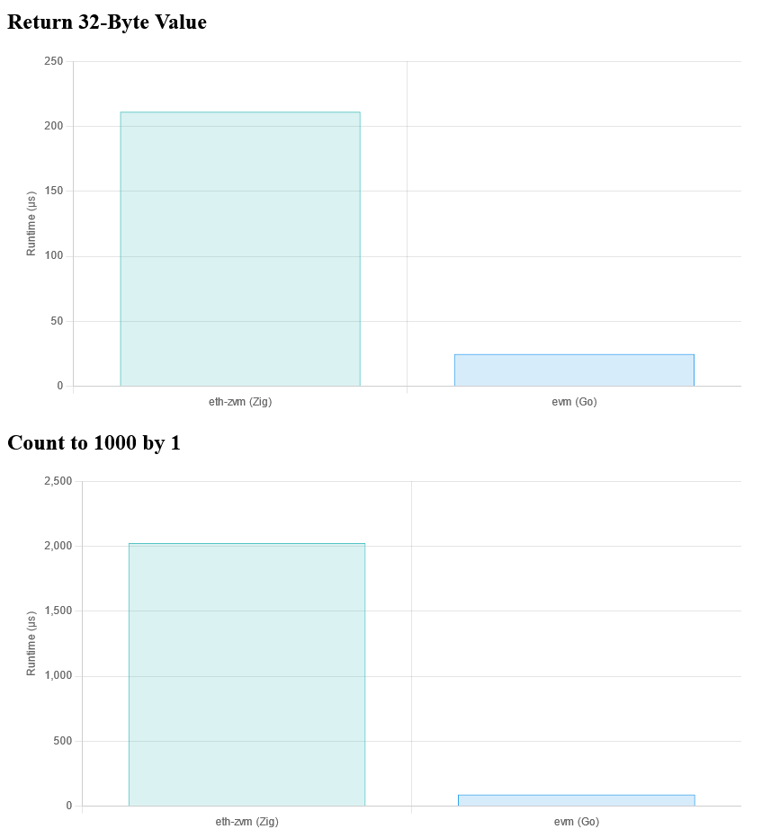
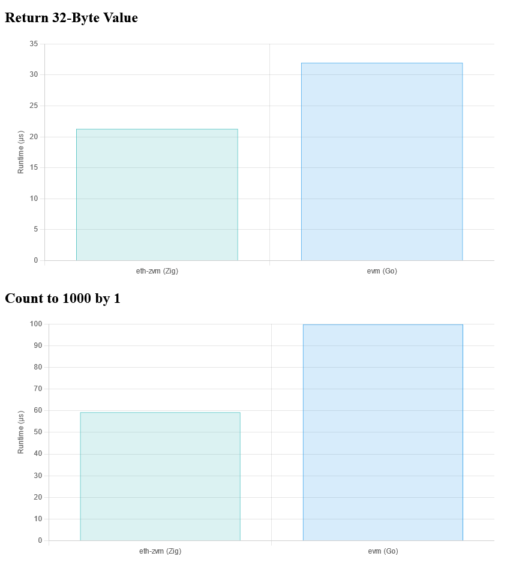



**New here?**

Hi, I'm Michael. I'm a software developer and the founder of [TinyPilot](https://tinypilotkvm.com), an independent computer hardware company. I started the company in 2020, and it now earns $80-100k/month in revenue and employs six other people.

Every month, I publish a retrospective like this one to share how things are going with my business and my professional life overall.


## Highlights

-

## Goal Grades

At the start of each month, I declare what I'd like to accomplish. Here's how I did against those goals:

### Publish TinyPilot Pro 2.6.3

- **Result**: XX
- **Grade**: XX

TODO

### Document TinyPilot Pro's release process internally

- **Result**: XX
- **Grade**: XX

TODO

### File 2023 taxes

- **Result**: XX
- **Grade**: XX

TODO

## [TinyPilot](https://tinypilotkvm.com/?ref=mtlynch.io) stats



| Metric                   | January 2024   | February 2024  | Change                                          |
| ------------------------ | -------------- | -------------- | ----------------------------------------------- |
| Unique Visitors          | 7,800          | 13,000         | +5,200 (+67%)        |
| Sales Revenue            | $100,008.98    | $82,517.42     | -$17,491.56 (-17%)     |
| Enterprise Subscriptions | $290.70        | $290.70        | 0                                               |
| Royalties                | $3,313.11      | $3,373.65      | +$60.54 (+2%)        |
| Total Revenue            | $103,612.79    | $86,181.77     | -$17,431.02 (-17%)     |
| **Profit**               | **$79,764.14** | **$24,199.09** | **-$55,565.05 (-70%)** |

## Do we need a 26-step release process?

I had delegated the hardest tasks, but I was still juggling a lot of them. Out of 26 release tasks, I was still responsible for 23 of them.

Until no

I felt like I wasn't doing that much, but I was still doing

> ### Testing a release candidate
>
> 1. Assign a release captain
> 1. Create a release candidate build
> 1. Draft the changelog
> 1. Draft security advisories (if applicable)
> 1. Draft the release announcement
> 1. Update the test plan to cover any feature changes
> 1. Test release candidate on a Voyager device
> 1. Test updating to the release candidate from a Voyager device
> 1. Test release candidate on a DIY device
> 1. Run automated end-to-end tests
> 1. Review test results
> 1. Decide whether to publish based on tests
>
> ### Publishing the release
>
> 1. Publish security advisories (if applicable)
> 1. Publish the changelog
> 1. Publish the production release
> 1. Perform post-release tests
> 1. Announce release to TinyPilot team
> 1. Add image hashes to changelog
> 1. Monitor bug reports for at least 48 hours
>
> ### Announcing the release
>
> 1. Publish TinyPilot Community release
> 1. Publish release announcement blog post
> 1. Share release with EU distributor
> 1. Share release with manufacturer
> 1. Update links in TinyPilot Suport Playbook
> 1. Send release announcement to mailing list
> 1. Share blog post on TinyPilot’s Twitter

## Some release tasks are deceptively hard to delegate

If there's a question about the code, I generally can figure out the answer because I follow all of TinyPilot's software changes. If there's a question about users, I know that without asking anyone.

### Making a go vs. no-go decision

1. What is the user impact of this bug?
1. How much time would it take to fix this bug?
1. How difficult is it to re-perform the tests that verify this fix?
1. What is the probability that the bugfix accidentally breaks another feature?

### Writing security advisories

We'd only had three security advisories, and I've written all of them. At first, I thought it would be easy. Just look at our previous three advisories, and write a new one like that.

### Recognizing when features misbehave

I'm planning in future release to have the support engineering team work with the dev team so the dev team can see how new or modified features look in our manual tests and verify that it's what they expect.

## Side projects

### I've written the world's fastest (incomplete) Ethereum implementation

{{}}

It turned out I was performing a syscall for every byte read, and I had a separate bug in my benchmarking measurement.

Once I fixed the bugs, my Zig implementation now outperforms the Go implementation by 30-40%.

{{}}

To be fair, my version only implements about 3% of Ethereum, so I have a massive unfair advantage, but it continues to be a fun project.

## Wrap up

### What got done?

-

### Lessons learned

-

### Goals for next month

- Fill in all gaps in TinyPilot's release documentation.
- Complete 2023 taxes.
