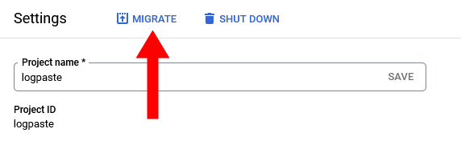
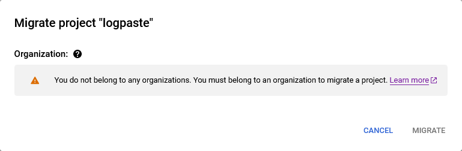

## Overview

In April this year, [I sold TinyPilot](/i-sold-tinypilot/), the bootstrapped business I founded and ran for four years.

My earlier post told the story of how the sale happened, but I'd like to dig a bit deeper into the nuts and bolts of the sale itself.

In this post, I'm sharing what went well, what I want to improve in the future, and what surprised me about the process of selling my business.

## What I'm glad I did

### Invested heavily into documentation

Before I even started my first business, I read the book _Built to Sell_ by John Warrilow. The book encourages founders to design their company so that it doesn't depend on their day-to-day involvement. An effective company has a set of well-defined processes and teams that execute them.

I've always been a fan of clear documentation, so when I started building out the team for TinyPilot, I invested a lot into documentation. Rather than train people in person or on video calls, I would always write a playbook and ask the team member to follow it. If we ran into issues or misunderstandings, we'd update the playbook. When new people would join, they'd onboard via the same playbooks, and we'd continuously improve them.

After I sold TinyPilot, the contract called for a 30-day period during which I would provide up to 80 hours of consulting time to help the buyer with the transition. Most of my time post-transition was just introducing the new owner to the team and our key vendors. There was very little I had to answer outside of that because the buyer had access to all of our documentation, and the team already knew how to run the day-to-day of TinyPilot.

### Created a transition checklist

When I began serious discussions about selling TinyPilot, I started a checklist of all the things I wanted to do before I sold. It included things like deleting outdated information from our playbooks and ensuring that all of our account credentials were in the company Bitwarden account.

As we entered due diligence, I expanded this checklist to include things that would need to happen during the transition. I split the checklist into four categories:

- Things that must happen before closing
- Things that must happen a day or two after closing
- Things that should happen within the first week after closing
- Things that should happen within the first month after closing

It was helpful to start this checklist several months before the actual closing because I added to it as new things came to mind as we approached the final closing date. For example, I'd send a letter to one of TinyPilot's affiliate partners and then remember to add, "Introduce buyer to affiliates" to the post-close checklist.

The checklist turned out to be extremely valuable after the close. The week of closing is chaotic because so many workflows are changing, so it was helpful to have a checklist I created in calmer times.

### Worked with a broker I trusted

Before I started the sales process for TinyPilot, I had a negative view of M&A brokers. The picture in my head of a broker was someone who just wanted to close deals as quickly as possible for the highest possible number and didn't care about anything else. I imagined them saying things like, "Let's bottom line this," or "Time for some jager bombs!"

When I attended Microconf in 2023, I met Chris Guthrie, who's an advisor at Quiet Light Brokerage. He immediately came across as laid back, low-pressure, and founder focused. He was a former founder himself, and he talked about finding the best deal for the founder, not necessarily the quickest payout.

I appreciated about working with Quiet Light because our incentives were aligned throughout the process. Quiet Light is incentivized to find me a large payout because their commissions is percentage-based. They also need deal flow, so they have care about ensuring the seller is satisfied with the overall sales experience, not just the final price. The pool of founders looking for M&A brokers is small and fairly tight-knit, so Quiet Light has to maintain a positive reputation.

In discussions about the sale, some people balked at Quiet Light's $88.9k fee, as it represented 15% of the sale price. I still think that was a fair commission, as they found me a buyer that I couldn't have found one my own.

### Avoided seller financing

When I started thinking about a sale, I didn't need cash desperately, so I was open to receiving payments in installments over several years.

When I spoke to other founders about seller financing, they warned me away from it. One founder had advice that stuck with me: "if you sell to a buyer and finance the purchase yourself, you now work for the buyer."

I was puzzled. How does financing the sale mean I work for the buyer? The founder explained that you don't get paid unless the business makes money, and the new owner knows that. The new owner can dump management responsibilities onto you. If you say no, the new owner can let the business fail, and they stop making payments to you.

The other major risk of seller financing is that I, as a small time lender, don't have tools or experience to collect a loan if a buyer refuses to pay. The buyer might have plenty of cash to pay and simply decide not to pay me. For a deal that's under $1M, I'd probably spend more in legal fees than I could hope to collect from an unscrupulous buyer.

I would have been open to seller financing if there were no other options available, but it would be a major red flag to me that the buyer was unable to obtain a loan from a bank. Further, I'd need interest rates that are much higher than the prevailing rates banks offer because my risk would be so much higher than a bank's.

### Assumed I'd get nothing after closing

From talking to other founders about acquisition stories, most people seemed disappointed with the payments they were supposed to receive after closing. In some cases, the buyer simply refused to pay and it was too small an amount to litigate. In other cases, the new owner used creative bookkeeping to avoid paying performance-based incentives to the seller.

The advice I heard consistently was to structure the deal so that if I got nothing after closing, I'd still be happy. I should treat anything after closing as an unexpected bonus.

The buyer and I did send some money back and forth after closing to account for little costs that we forgot to include in the deal, and that went smoothly. These amounts were a tiny part of the overall transaction, less than $5k. I would have been frustrated had the buyer not paid, but the amounts were so small that I never stressed about the buyer withholding payment.

### Maintained realistic expectations about the business after closing

One of the most important aspects of the deal was that the new owner continued investing in the product, the team and our customers.

I asked other founders for advice about how to avoid a buyer who will simply gut the company and squeeze everything for short-term profits. The advice I heard was that I can't control what the new owner does after closing, so I shouldn't worry about it.

It's true that I can't control how the new owner runs their business, but I think it's possible to screen out buyers who had red flags. For example, if I was approached by a company like Idera, I'd notice that they have a history of buying companies and [laying off their staff](https://news.ycombinator.com/item?id=19218036), so I'd have a good guess about their plans for TinyPilot.

For the TinyPilot sale, I looked for buyers whose vision for the company aligned with mine, but I also maintained the attitude that after the sale, the company is no longer mine.

### Arranged broker agreement so that they get paid when I get paid

The broker agreement that Quiet Light initially sent me said that their broker fee is a percentage of the purchase price, and it's due at closing.

The problem I saw in that agreement was that I, as the seller, may not receive the full purchase price at closing. If the purchase agreement involved deferred payment, I'd have to pay Quiet Light upfront and wait for what could be years until I receive the full amount. Worse, if the buyer fails to make payment after closing, I'd have paid commissions on money I never received.

I pushed back on the contract so that Quiet Light only gets paid when I get paid, and Quiet Light quickly agreed. I was glad for this revision because it kept incentives aligned between me and Quiet Light. They'd have just as much incentive to push back against deferred payments as I would, as it threatens payment for both of us.

### Discussed contentious issues without lawyers first

For this acquisition, the buyer drafted their own asset purchase agreement. For the most part, we agreed on the terms in the initial draft, but there were a few terms where we were far apart.

I realized quickly that lawyers get expensive fast &mdash; mine was $550/hr. They also slow down the process and add complexity.

When the buyer and I would run into disagreements in the contracts, we'd first talk directly. In these conversations, my goal was to go past the terms in the contract and find out the underlying need.

For example, the first draft of the contract called for tight restrictions around publicly disclosing details of the sale or business. So, the buyer and I talked about why the clause was there, and it turned out that there were only a small number of things the buyer cared about me disclosing. We adjusted the wording from "you can't discuss anything publicly" to "you can't discuss [these two things](/i-sold-tinypilot/#what-am-i-allowed-to-say) publicly," and we both felt good about the compromise.

### Used dedicated accounts for the business

One of the things that made ownership handoff particularly smooth was that TinyPilot's accounts and infrastructure were totally separate from my other businesses and personal accounts:

- I always sent emails related to the business from my @tinypilotkvm.com email address.
- I kept TinyPilot's email in a dedicated Fastmail account.
  - This wasn't true at the beginning. TinyPilot originally shared a Fastmail account with my other businesses, but I eventually migrated it to its own standalone Fastmail account.
- Every service TinyPilot used was associated with an @tinypilotkvm.com email address.
- I never associated my personal phone number with TinyPilot, Instead, I always used a Twilio number that forwarded to my real number.
- All account credentials were in Bitwarden.

After closing, handing over control was extremely straightforward. I just added the new owner to Bitwarden, and they took over from there. There were a few hiccups around 2FA codes I'd forgotten to put in Bitwarden, but we worked those out quickly.

## What I'll do differently in the future

### Offer incentives for a cash buyer

I mentioned in my previous post that one of the biggest surprises of the deal was [how much closing time matters](/i-sold-tinypilot/#due-diligence-makes-me-weaker-by-the-day). For a buyer financing the purchase with a SBA-backed bank loan, the typical closing time I've heard is three to five months. During that time, the seller bears most of the risk should the deal fall through or if their business drops in value.

If I sell another business, I plan to offer incentives that make it easier for the buyer to purchase in cash. I could offer a discount for a cash purchase or make other accomodations to attract buyers who can purchase in cash and make a fast close.

The other subtlety of a buyer purchasing with a bank loan is that it makes the contract more complicated. Working through the requirements from the bank probably consumed $10-20k in lawyer time, so a discount for a cash buyer should somewhat offset lower closing fees.

### Shift contract negotiations to earlier in the process

The contract negotiations were the part I found most unpleasant about the whole deal, and I'm still not sure how to do it better.

The main issue was that I felt like I was in terrible negotiating position by the time we got to the APA. By the time we got to serious negotiations over the contract, it was already five weeks into due diligence, so I didn't want to risk starting the whole process over with a new buyer.

The ideal for me would be if the buyer had to present me with an APA before I sign an exclusive LOI with them, but the buyer isn't going to want to invest the time or money unless I'm exclusive with them.

What I'll try next time is to put a few terms I care about into the LOI. I'd want to include things like:

- Transition time
- Restrictions on confidentiality

### Begin working with a lawyer earlier

I found a law firm when I started the process, and they reviewed the broker agreement, but I didn't reach out to them again until I had the APA. It turned out that they wanted to review the LOI as well. At the time, I felt like the LOI didn't matter because it wasn't binding anyway, so why bother reviewing.

In retrospect, I think it would have been helpful to include a few key things in the LOI. It's still not binding, but it sets a baseline before the APA.

They can review existing contracts and help you prepare the documents you'll need for standard due diligence so that you're not holding up the deal later.

It's also a good time to see if you like working with this lawyer. Once you're in the middle of a contract negotiations, it's a big deal to fire your lawyer and pull in someone else.

Review existing contracts that say what happens in a sale (look for terms like "transfer" or "notice").

### Create an unofficial "small stuff agreement" with the buyer

At the time of the sale, TinyPilot had a physical office. We had about $1k worth of equipment there, but it was spread over so many small items that selling everything would be tedious and costly. For example, we could sell our printer for $40, but the cost of interrupting an employee's normal work to sell a printer is higher than $40.

Still, the stuff in TinyPilot's office was a business asset, so the buyer and I felt like we had to define in the asset purchase agreement what should happen to all that stuff. So we spent a few hours enumerating everything of value in the office, working out a timeline of when the buyer would clear it from the office, and how long I'd extend the lease to facilitate that. Between the two of us, we probably spent $2k on lawyer hours trying to work out how to handle this $1k of stuff that neither of us really wanted.

If I were to do this again, I'd propose to the buyer a "small stuff agreement." This would sit outside of the official legal documents and maybe have some header at the top saying "Nothing in here is a legal contract." But it would be a place for the buyer and I to define expectations for small things that don't require lawyers. It would be good for things like office property where we need to decide _something_ but the stakes are so small that if one side

Instead of the asset purchase agreement enumerating all the items in TinyPilot's office and working out how they'd transfer, we could say that the property in TinyPilot office is not part of the sale. And in our small stuff agreement, the buyer and I could privately work out a reasonable way to handle the office property.

Look for opportunities to cut things out of the contract that don't matter. There were parts of the contract where we burned $1k in lawyer time on things that had a value of $500.

If I do this again, one thing I'll propose to the buyer is that we create a separate agreement for stuff we want to do but it's too small to be worth codifying it into a real contract that lawyers have to review.

If we make a handshake agreement and the other person doesn't honor it, how much would it matter?

One example of this is selling the property in the TinyPilot office. The value of everything there was under $1,000 but we burned a lot of time working with the lawyers on how to transfer it. I wish I had just said that the property in the office was excluded from the sale, but the buyer and I make a handshake agreement that, in exchange for clearing the office, he can keep or sell anything there.

What's the worst the buyer could do to me? Not clear the office. So, I clear the office.

What's the worst I could do to the buyer? Not give him what I promised. But so what? He misses out on a $200 desktop PC and lots of obsolete TinyPilot parts?

### Announce the sale to the team later

Deciding when to tell your team about an acquisition is extremely difficult, and I haven't seen anyone come up with a good solution to this problem.

If you keep the sale a secret until the deal closes, you're effectively lying to your team. An acquisition is something that will have a major impact on their lives, and there are important decisions they might make where it would greatly benefit them to know about the sale.

On the other hand, if you're completely transparent about the sale to your team, you take on a huge amount of risk. Members of the team might threaten to leave and put the sale in jeopardy unless you offer them bonuses or promotions. Or they might worry about the sale or lose motivation and their job performance might tank.

In the case of TinyPilot, I had a good relationship with every member of the team, so I didn't think anyone would use the sale against me, but I also find that people to unexpected things when relationships end, so I did worry about that risk.

In the end, I decided to tell the team as soon as I signed the agreement with the broker, but I ended up regretting it slightly. Nothing catastrophic happened, but there were things about the team knowing that made work more difficult.

I had reasoned that I owed it to the team to tell them because I would want to know if I were in their position. The thing I didn't realize at the time was that we had very different levels of risk.

Be more transparent from the start of the company to the team that an acquisition is possible and defer the actual acquisition announcement until it's close to closing.

### Don't catastrophize every setback

I found the due diligence process quite stressful and exhausting. There were so many hoops to jump through and so many approvals to win, so I was constantly worried something would blow up the deal and I'd have wasted so much time and money.

One bad habit that made the closing process even more stressful was my tendency to catastrophize. Every time I recognized the potential for something to go awry, I started playing out what the effect would be if it happened. The more I thought about it, the more likely it seemed that the bad thing would happen.

For example, TinyPilot had a license to use the H.264 video encoding algorithm, which is under patent. It turned out the license terms forbid us from transferring the license in an asset sale. I immediately started worrying that the patent owner would decline the new license or otherwise take too long to grant it and blow up the deal. But then a day after I told the buyer about the license, they had already heard back from the license holder and the wheels were in motion for a new license. I tore my hair out for nothing.

If I sell a company in the future, I hope to worry less about potential disasters. I need to remember to sleep on things and see how they feel in the morning.

### Reveal vendors earlier, but put tighter restrictions in LOI

Put stronger language in the contract that buyer can't contact suppliers if the deal doesn't close. Maybe wouldn't work if I was selling to a competitor. It was just too much of a pain to have to redact information from so many documents. And you only have to screw up once to make all the work worthless.

Forgetting to redact the vendor name in just one spot completely ruins hours of work. I spent hours manually placing black boxes on pages and pages of PDFs to hide vendor names, and then . And then the bank ended up insisting on seeing everything anyway.

### Eliminate inventory from the broker's commission

Negotiate harder about QLB's cut of inventory. I'd rather give them a higher cut of the sale price and 0% of inventory because I make nothing on inventory and it's just a consequence of what's around when the deal closes. Perverse incentives because I'm selling everything to the buyer at cost, but I essentially pay a 10% tax to QLB anyway, so I'm incentivized to keep inventory dangerously low. Also, made it awkward for my manufacturer because they want me to fulfill my PO, and I have to keep stalling but I don't want to explain why in case the deal falls through.

### Assume from the start that nothing written is private

Part of TinyPilot's sale included all of TinyPilot's emails. This seemed reasonable and standard to me, as a lot of institutional knowledge is buried in old emails.

As I started thinking more about the sale, I realized that some of my email would be complicated to hand over. What if my employees had said something personal and private to me an email?

As a fictional example, what if I had an email from an employee that said, "I've been feeling unproductive, as I've fallen into a depression since the death of my father." If someone shared something like that with me, it would be with me, Michael their human co-worker with whom they have a trusting relationship, not Michael the arbitrary owner of TinyPilot's business assets. It felt strange and cold to sell that email to the new buyer.

Fortunately, I worked out an agreement between the buyer and the team that anyone could request that I purge emails before the handoff if they were about private, personal issues.

There were also other sensitive emails, like emails where I'm working with my broker and lawyer on the sale. I didn't want the buyer to see our private discussions even after the sale was complete, so we agreed in the purchase agreement to exclude those from the sale.

In the future, I'd make two changes in how I approach emails in my business:

- Make sure everyone on the team understands that in the case of an acquisition, any emails and meeting notes will transfer to the new buyer.
- When working with lawyers and brokers on the sale itself, do it from a separate email account from the business I'm selling.

### Define what happens to money flows around the time of closing

I didn't realize until late in the process that there's a lot of ambiguity around who's entitled to certain money that's flowing in and out of the business around the time of the closing. The buyer and I were able to find amicable resolutions to all these questions, but I wish I'd thought about them earlier:

- How do you split bills for services that straddle the closing (e.g., a monthly bill that's charged a week after closing)?
- What happens to funds in sales platform accounts that haven't yet transferred to the bank?
- Who pays when a customer purchases before closing but request a refund after closing?
- Who receives revenue from sales on closing day?
- Who pays employees for work on closing day?
- Who pays fees associated with closing (e.g., escrow fees)?

### In the transition agreement, weigh calendar days higher than work hours

Most acquisitions have terms around how much work the seller agrees to do after the sale to help the buyer with the post-close transition.

My initial offer to the buyer was that I'd do free consulting after the closing for two weeks up to 40 hours per week, and after that, he could purchase consulting hours from me for $180/hr for up to 10 hours per week.

The buyer counteroffered a 30-day free consulting period with a maximum of 80 hours per week, so it's the same total hours stretched over a longer period.

I didn't realize until we did the transition that the 30-day deal was actually much more work for me. Because the new buyer is taking over, they can't really find 80 hours of work for me to do in just two weeks.

My initial offer to the buyer for

I agreed to 40 hours per week, but I realized pretty quickly after the sale that it was impossible for the buyer to take.

But I also had time off, so I agreed to extend the duration.

### Disconnect non-transferable accounts from business email before closing

Sales below $1M are usually asset sales, meaning that the buyer is purchasing assets from the business but not the business itself. This is in contrast to a stock sale, where the buyer purchases the business and everything it owns.

Because this was an asset sale, I retained control of TinyPilot's bank accounts and payroll. The problem was that I forgot to change the email address on those accounts before I handed over control of TinyPilot's email account to the new buyer. For example, I didn't want the email address associated with my bank account to be `mybank@tinypilotkvm.com` when I no longer could receive email at that address.

I worked with the new owner to fix up the email address on those accounts after the sale, and it wasn't a big deal, but I wish I'd done it myself while I still controlled the email account.

### Take even fewer dependencies on Google

Most account transitions were smooth. Everything was in Bitwarden, so I just added the new owner as an admin in our Bitwarden organization, and they were able to take possession of all the accounts.

The one account that couldn't transfer over was Google. I used Google Cloud Platform for some TinyPilot services, but I never created a dedicated TinyPilot GCP account. I just used a dedicated TinyPilot GCP project within my normal GCP account. I figured that when the time came, I'd just transfer the project to the new owner. There's a big "Migrate" button at the top of my GCP project settings, so I planned to just push that button and specify the new owner's GCP account as the destination.

{{}}

When closing was complete and I finally clicked that button, I saw this error message:

{{}}

Google Drive and GCP couldn't transfer to the buyer without creating a paid Google Workspace account. The link points to a maze of Google documentation, and the jist seemed to be that both the new owner and I would need to create paid Google Workspace accounts and go through some complicated process from there.

We had a similar issue with some notes and old documents that I'd stored in Google Drive.

The new owner decided it was too much hassle and the value of the data in our Google accounts was too low that I exported what I could, and we deleted the rest.

In general, I've tried to minimize my dependencies on Google, both personally and professionally, as they frequently burn me with corner cases like these, so this is just a further reminder to depend on them even less.

## What surprised me

### Selling the business is all the boring parts of entrepreneurship

There are so many parts of being a founder that are fun and exciting: launching a new product or feature, having full control over what tools you use, deciding exactly who you want to work with.

But there are always parts of running a business that suck, like figuring out how complicated laws apply to your business or dealing with large banks who you desperately need but who don't care about your business at all.

Most of the sales process is the unpleasant parts of running a business. You're constantly gathering contracts, invoices, statements and answering questions about decisions from years ago.

### As you prepare to sell, everything costs 4x as much

Every time you spend money, it costs you 4x as much. For example, suppose the multiple for your business is about 3x. If your SDE is $100k, you can sell for $300k.

Now imagine you decided to give one of your employees a $10k bonus. Now your SDE is $90k, so your sale price is $270k. So to give the employee the $10k bonus, it costs you $40k.

### Optimizing for SDE sucks

Have to continue selling at the same rate or better

But also spending 5-25% of your time on due diligence, legal agreements, logistics of the sale

Wanted to redesign hardware to save costs but couldn't because it would make numbers look bad

### Due diligence is unbounded work

I greatly underestimated how labor-intensive the due diligence process would be.

At the start, I thought due diligence would be somewhat tedious but still straightforward. I'd already shared monthly profit and loss statements before we even started the due diligence process. I thought maybe the buyer would need to see a few of my bank statements to prove that my profit and loss was real. Maybe they'd ask to see my bookkeeping ledger, of which I was quite proud.

It turned out that the due diligence process required me to share _all_ of my bank statements from the last two years. And that was just part of the first round of requests. As we proceeded further, I needed to create lots of one-off reports to demonstrate some other aspect of my business, like how frequently our customers return or which platforms account for what percentage of our revenue.

TODO: I didn't feel like I could negotiate with the bank. The buyer isn't saying, "This is something I want." And I can't very well say, "Is this something you want or that the bank wants? Because if it's you, I'm going to say no."

### Due diligence bound me to a single seller, even beyond the due diligence period

The last time I bought a house, I offered a 10 day period for inspection. The seller pushed back and asked me to reduce it to seven days because if the deal fell through, even three days of keeping the house off-market could make a difference. And that's a house!

I didn't realize when I signed the LOI how much it costs me to take my business off the market for a full three months.

### You don't strictly need a broker to sell

The broker guides you through the process. I'm glad I worked with a broker, and I'd likely work with them again, but they're mainly an advisor.

My only other experience working with brokers is with realtors, but M&A brokers are outside the critical path. Once the broker finds you a buyer, the real heavy lifting is on the founders and the M&A lawyers to put together the asset purchase agreement. The M&A broker should and did provide guidance to keep the deal on track, but if they disappeared, the deal could still go through, whereas if your lawyer disappeared, you don't have anyone to review the closing documents.

If I sell a business in the future, I may forego a broker if I can find a buyer independently. As a first-time seller, it was worth 15% to have an advisor on my side from start to finish. Now that I have experience selling, I might try a future deal using only an M&A lawyer, but I would still always consider working with a broker again to have that support all the way through the process.

### Lawyers insist on Microsoft Word but never learned to use it

I knew the lawyers were going to use Microsoft Word to send contract revisions back and forth, and I knew that was going to be bumpy, but I was surprised by just how bad lawyers are at Word.

The lawyers would do things like manually numbering fields instead of using auto-numbering, so anytime we added or deleted from a list, someone had to manually re-number the list. They didn't know how to cross-reference within a document, so when they said "as mentioned in section 4.3.3," that reference would become invalid if we changed the section numbering.

They also don't seem to know how to use page breaks. Instead, they fill the remainder of the page with dozens of line breaks, so as soon as you change any content, the layout gets screwed up.

### If the non-compete is too restrictive, you're screwed

One of the things my lawyer told me was that judges are less forgiving of a bad non-compete on an acquisition contract.

If work as a rank-and-file developer at a big tech company, and then it turns out you signed a contract saying that you agree never to work for any other company writing software, a judge would likely reject that non-compete. If, however, you sell your company and the purchase agreement says that you agree to never work in software again, then a judge will likely enforce it.

When reviewing TinyPilot's purchase agreement, we looked carefully at the non-compete to ensure that it was limited specifically to the domain of KVM over IP devices and not software or technology in general.

### If there's no cap on liability, you're screwed

When you run a business in the US as a corporation or an LLC, the most you can ever lose from the business is the value of the business itself. If your business is worth $50k and someone sues you for $1M, the most they can get is the assets from your business. The structure of the corporation or LLC should protect you from losing your home.

When you sell a business, ensure that the purchase agreement specifies an explicit cap on liability that's limited to the purchase price, preferably less. Otherwise, you could sell a business for $500k, and the buyer can turn around and sue you for $10M, so you're taking on much more downside risk than you had before you sold.

### Buyers have incentive to keep the seller happy

One of my worries in the sale was that once I handed over all the accounts and domains to the seller, they'd lose incentive to cooperate with me. For example, what if the buyer forgets to update the billing information on one of the accounts I transferred, and I get hit with a $2k credit card charge? What leverage would I have to make the buyer reimburse me?

I trusted the buyer in this case, but you also never know how people are going to behave when power shifts.

It turned out that even if the buyer is devious and wants to take advantage of the seller, the seller still holds the leverage of institutional knowledge. The buyer doesn't want to screw over the seller for $2k if there's a chance that a month later, the buyer stumbles across some key account they don't know how to access or some workflow they don't understand because they won't be able to ask the seller for help.
