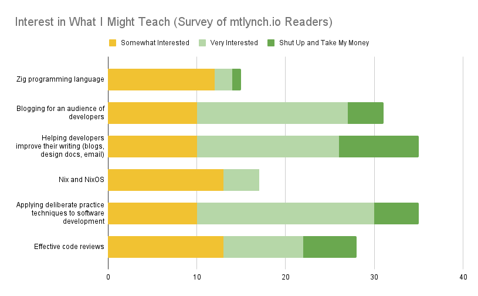

## Highlights

-

## Rebooting Hit the Front Page

In 2020, I created a video course about blogging called ["Hit the Front Page of Hacker News."](https://hitthefrontpage.com/) I was proud of the course material, and I heard positive feedback from students, but I felt like I never gave it the attention it deserved.

When I released the course, TinyPilot was growing quickly at the time, and I didn't have time to market the course or try iterating on the material.

In [my last blog post](/i-sold-tinypilot/), I surveyed readers about what they'd like to see me do next. Of the people who expressed interest in seeing me teach something, here were the results:

{{}}

There are different ways to interpret the data, but my takeaway is that people were especially interested in having me teach writing techniques. I was surprised that deliberate practice was a top answer as well, albeit with slightly less enthusiasm.

I decided that because my existing course was already so close to done and it ranked #2 or #3 depending on how you count, I should dust off that material and re-release an updated version for 2024.

### Finding a group of pilot program students

Rob Fitzpatrick's book _Write Useful Books_ heavily influenced my approach to educational products. He argues that you should always teach a topic live before releasing a book or a course because you want to iterate based on feedback from real students.

My wife and I are also expecting our first baby at the end of August, and when that happens, I plan to disappear for a few months for family time. At the time I was considering this, I had about 10 weeks until the due date, and the course was six weeks, so I didn't have much buffer.

I wrote up [a short blurb about the course](/notes/htfp-live/) and emailed my blog subscribers asking people to fill out a short application asking if they were interested and what timeslots were available. I emailed each applicant individually responding to what they said in their application and sent them the payment link.

Here were the results:

- 1,944 subscribers received the email about my course.
- 11 people filled out a survey to express interest.
- 7 people purchased the course.
  - Of the 4 who didn't sign up after the survey, 3 were because they weren't available at the timeslot I chose.

### Finding a video platform

I was surprised to find that there aren't really viable alternatives to Zoom for video calls. I've avoided Zoom ever since they were [caught lying about their security](https://arstechnica.com/tech-policy/2020/11/zoom-lied-to-users-about-end-to-end-encryption-for-years-ftc-says/), but they seem to be almost the only game in town.

I've used Jitsi Meet for work meetings for the past few years, and I've had a mostly good experience with it, but I've noticed that quality is better when I attend Zoom meetings. I was hoping to find a paid tier of Jitsi Meet, but all of their paid options are priced at "Contact Us," which likely means at least $1k/month.

So, Jitsi's fine albeit a little clunky. It doesn't support recording, so my workaround is to:

1. Host the class video call on my laptop
1. Join the call from my desktop
1. From my desktop, record the call using regular screen-recording software

It's more complex than I'd like, but it does have the side benefit that I can look at my desktop monitor and see everyone's faces even though the slides I'm presenting take up my whole screen.

If you know of a better alternative to Jitsi Meet, [let me know](#requests-for-help).

### Should I pivot away from Hacker News?

One of the surprises in the live course is that about half the students who signed up said that they're not especially interested in Hacker News. They just liked my writing and wanted to learn more about my process, so they signed up in spite of the Hacker News focus.

Looking back at the survey data, there seems to be more interest in writing in general than there is for blogging in particular. And nobody requested Hacker News specifically.

So, I'm wondering if I should pivot away from Hacker News and shift to something more general.

My worry in pivoting from Hacker News is that I'll lose my edge. There are a million people teaching about blogging or writing, so I don't feel like I can stand out in that pool. If I teach Hacker News specifically, I'm the world's best teacher in that domain because nobody else is doing that.

The other issue with pivoting away from Hacker News is that most of my evidence of blogging success is around Hacker News. Among personal bloggers, I've had unusual success on Hacker News that I can point to. If I teach a more general writing course, I have less impressive credentials. I don't make money from my blog or have a massive subscriber count to boast about.

At the same time, I think most people who purchased my course were people who found me first and then found my course. They probably didn't search for the world expert on blogging for Hacker News and decide I was most qualified.

Maybe the takeaway is that I should worry less about competing with a large pool of other people because no matter what, the path to my course is probably going to be through me or through recommendations.

But, I'm 95% done with this course, so I'm going to release this one focusing on Hacker News, but after that's done, I'll try to adapt the material for a more general course.

## Learning htmx

For the past two years, [htmx](https://htmx.org) has been popping up on my radar more and more. I know [Cory Zue uses htmx](/notes/czue-livecoding-2023-05-05/#sharing-code-between-client-side-and-server-side-rendering), so it piqued my interest.

For the longest time, the biggest hurdle was just that I didn't get the point of htmx.

One of the first lines in htmx's landing page is, "Why should only `<a>` &amp; `<form>` be able to make HTTP requests?" When I read that, I felt like, "Yeah, it'd be nice, but a few lines of JavaScript to make any HTML element send any kind of request." Do I need to adopt a whole new methodology to avoid a few lines of JavaScript?

What finally made htmx click for me was the book, [_Hypermedia Systems_](https://hypermedia.systems). It's written by the same authors of htmx, and it explains the motivation for htmx and gives detailed explanations of several scenarios where you can use it.

If I had to pitch htmx to myself four years ago, here's what I'd say.

### My pitch for htmx

You remember how when you first learned to program websites, you'd write HTML like this?

```html
<form action="/users" method="POST">
  <input name="first-name" placeholder="First name" />
  <input name="last-name" placeholder="Last name" />
  <input type="submit" value="Add user" />
</form>
```

Today, you wouldn't write that because you want to avoid the full page reload. You don't want to reload the entire page just to show a message that says, "User added successfully." And you don't want to blow away all the user's input if the server rejected the input.

So, instead, you'd turn to JavaScript, and do something like this:

```javascript
document.body.addEventListener("DOMContentLoaded", () => {
  document.querySelector("form").addEventListener("submit", (evt) => {
    evt.preventDefault(); // Block default submit.
    fetch(`/users`, {
      method: "POST",
      credentials: "include",
      headers: {
        Accept: "application/json",
      },
      body: JSON.stringify({
        firstName: document.querySelector("[name='first-name']"),
        lastName: document.querySelector("[name='last-name']"),
      }),
    })
      .then((response) => {
        if (response.ok) {
          return response.json();
        }
        // TODO: Handle errors too.
      })
      .then((result) => {
        // TODO: Handle success.
      });
  });
});
```

It's not a ton of JavaScript, but you rewrite it every time you need a form. And you can refactor the repeated code, but now you have logic spread across several files. It's extra friction for every client interaction with the server.

Or maybe you'd turn to a heavy framework like React or Vue, and now there are countless layers of JavaScript abstraction between your code and what appears in the browser.

The promise of htmx is a return to the simplicity of when you first learned web programming. Instead of writing HTML and then offloading all of the logic to React or hand-written event handlers, you'd fold htmx into your app and then write your form like this:

```html
<form hx-post="/users" hx-target="this">
  <input name="first-name" placeholder="First name" />
  <input name="last-name" placeholder="Last name" />
  <input type="submit" value="Add user" />
</form>
```

And then htmx makes everything just work without you having to write any custom JavaScript.

### My experience with htmx so far

To test out htmx, I've been [rewriting](https://www.whatgotdone.com/michael/2024-07-05) parts of [ScreenJournal](https://github.com/mtlynch/screenjournal) using htmx. ScreenJournal is my open-source movie review app. It's like Goodreads for movies. Or it's like letterboxd, but open-source and uglier.

A good example of my rewrite was [reimplementing the notification preferences page with htmx](https://github.com/mtlynch/screenjournal/pull/291/files). I've got a page that allows users to specify which emails they'd like to receive:

TODO: Screenshot

The notifications page required a lot of custom JavaScript to do the following:

- Submit the form contents via `fetch` rather than reloading the page.
- Disable the form for input while the request is in-flight.
- Show a status spinner while the request is in-flight.
- Show an error message if the request fails.

https://github.com/mtlynch/screenjournal/blob/ed9b96223eb47ff48739ae04f916c1969d5e805e/handlers/templates/pages/account-notifications.html

#### htmx adds an abstraction layer, but it's intuitive

- With Vue and Angular, I had no idea how it was transforming my code into a web app.
- With htmx, the behavior is intuitive enough that I could probably reimplement htmx myself based on the way I see it work.

#### htmx's error handling is underwhelming

- htmx's model assumes that you send a request to the server and then place the server's response in a single element on the page.
- The problem is that on success, I want to replace the HTML form, but on error, I want to leave the form untouched and show an error below the form.
- htmx's answer is that the server should just re-render the HTML form with all the user's input, but I don't like that as it's re-rendering from scratch something that was already there, and it expands surface area for XSS vulnerabilities.
- I can work around this by writing my own event handlers, but at that point, it feels like I'm fighting the framework a little bit.

#### htmx weakens Content Security Policy (CSP)

- I like CSP as a last line of defense for preventing cross-site scripting (XSS).
- htmx is mostly compatible with CSP, but because htmx does so much, an attacker gaining the ability to write custom HTML is effectively the same as the attacker gaining the ability to write arbitrary JavaScript.
- Examples
  - `<form action=/delete-account" method="post" onload="this.submit()">`
    - CSP will prevent this code from executing.
  - `<form hx-post="/delete-account" hx-trigger="load">`
    - CSP will allow this equivalent code to execute.
- You can still write secure applications using htmx, but it does prevent CSP from being a reliable last line of defense against XSS.

## Wrap up

### What got done?

-

### Lessons learned

-

### Goals for next month

-

### Requests for help

Let me know if you have suggestions for a video call platform that meets these criteria:

- Must: Support up to 10 attendees for 90-minute calls.
- Must: Allow participants to join the call without creating a new account or installing software on their device.
- Must: Cost $80/mo or less.
- Nice to have: Allows me to record video calls.
