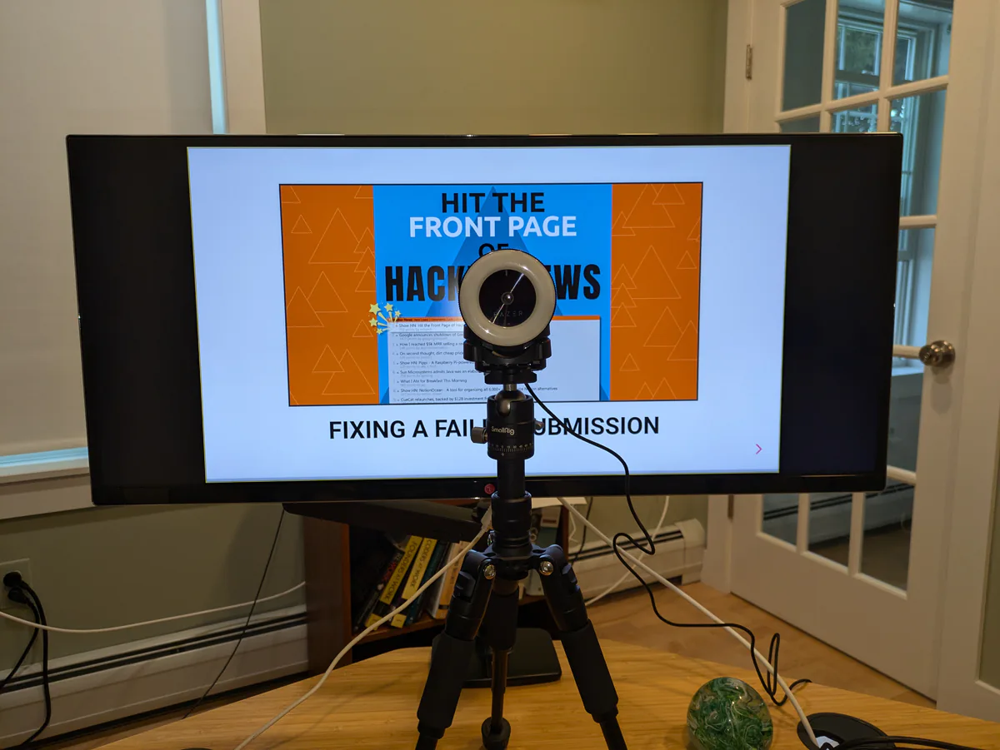
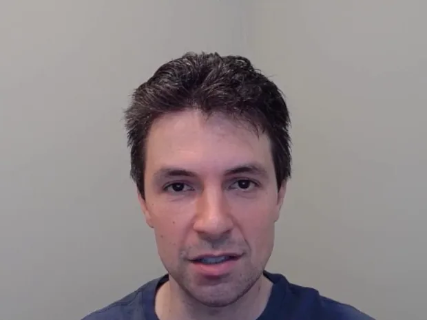
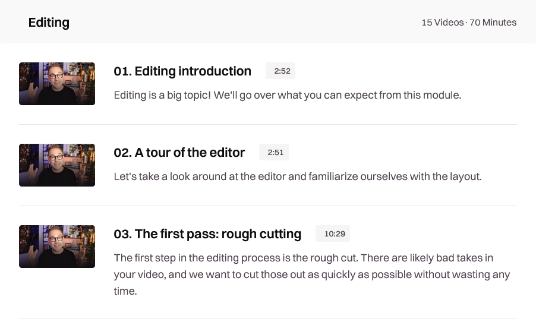
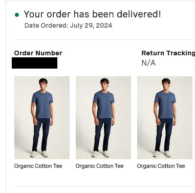
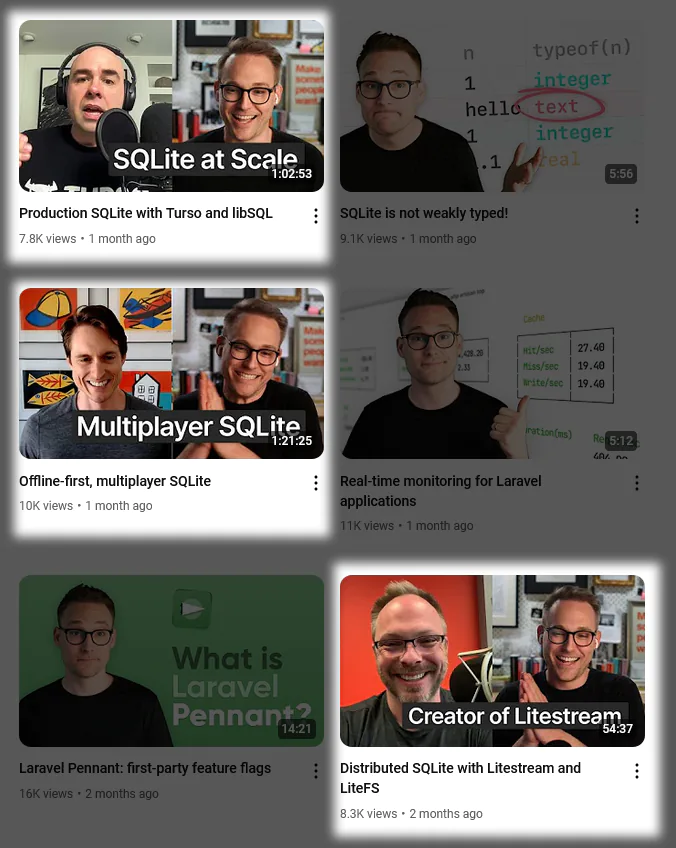
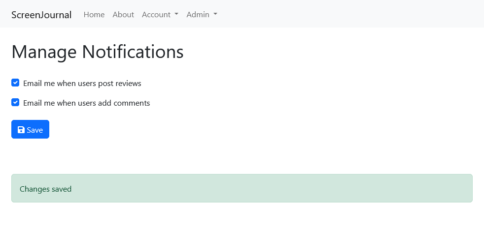

## Highlights

- I learned a few techniques that make it easier for me to record videos for my course.
- I've decided I don't need to use a Merchant of Record service.
- I've integrated [htmx](https://htmx.org) into my standard toolkit for making web applications.

## Goal Grades

At the start of each month, I declare what I'd like to accomplish. Here's how I did against those goals:

### Record publishable versions of four lessons from the course

- **Result**: Recorded most of one lesson
- **Grade**: D

I forgot how long it takes to record videos! And I underestimated the amount of work I had outside of recording. Most weeks, I didn't have time to record at all, but now I'm in the swing of recording.

I can record five to ten minutes of usable footage per hour of recording, and I get exhausted from recording after 90-120 minutes. On a focused week, I recorded a complete 45-minute lesson, but I think I can go faster now that I've finished teaching my live course.

### Start selling the new version of the course

- **Result**: Did a [waitlist](https://hitthefrontpage.com/#section-sign-up) instead of selling a partial course.
- **Grade**: N/A

I decided to hold off on selling the new course. I initially thought I'd offer the new version and advertise the course as discounted for early access while I work on it but offer the old 2020 recordings in the meantime. I realized that it's hard to package that in a clean way.

I might not finish the course by the time my wife goes into labor, and I want to take a few months of paternity leave when the baby arrives. I don't want to feel like I owe students the rest of the material they purchased while I'm on leave, so I decided to offer [a waitlist](https://hitthefrontpage.com/#section-sign-up) instead of a pre-order.

## Improvements in recording videos

When I'm recording videos for my course, there are a lot of things that can interrupt a recording session or prevent me from recording at all. I've been working on reducing the friction to recording so that I can start recording more quickly and make myself less vulnerable to interruptions.

### Get a desk tripod

For video recording, I use a Razer Kiyo webcam that sits on top of my monitor. The problem is that getting the camera to a good height requires a lot of manual adjustment.

{{}}

I normally keep my desktop monitor so that the center of my monitor is roughly at my eye level. But if my monitor is at eye level and the webcam sits on top of the monitor, then the camera angle is looking down on me.

To get a good camera angle, I was adjusting my monitor arm and desk height to keep the camera level with my eyes. But moving my monitor around added a lot of friction to recording, and I couldn't ever reproduce the exact camera position from one recording session to the next.

I solved my camera problem with a small, desk-sized tripod: the [SmallRig VT-20](https://www.bhphotovideo.com/c/product/1799670-REG/smallrig_aluminum_mini_tripod_vt_20.html).

{{}}

I keep the tripod between me and my monitor during recording sessions. I marked the position of the legs on my desk with painter's tape so that I can reproduce the position each time.

Having the tripod means that when I want to record, I just drop the tripod and camera on my desk, and the position is instantly correct. It's a big win in terms of reducing friction, and it's also nice to record in the same desk and monitor height I use for regular work.

The one downside of the tripod is that it partially obstructs my view of my slides, but by the time I'm recording, I've memorized them anway.


{{}}
{{}}


### Keep recording equipment connected

I used to keep my webcam in a drawer between recording sessions. I'd keep the microphone and arm in another room. That meant that the first five minutes of every recording session were me just gathering equipment and setting it up on my desk.

Instead, I now keep as much of my equipment connected and ready to record as possible. I keep my microphone on my desk with the mic already hooked up. And I keep my webcam open on my tripod ready to drop on my desk.

### Record in chapters

As part of my research for the course, I watched Aaron Francis' [screencasting course](https://screencasting.com). His focus is more on live-coding, but enough of the material translates to my course that it was worth the purchase.

I found Aaron's course helpful, but some of the best lessons weren't even things that he said. I learned a lot simply from seeing how Aaron packaged his own course.

The first iteration of my course consisted of seven lessons that were 30-60 minutes each. Aaron's lessons are roughly the same length, but he subdivides his lessons into separate chapters where each chapter is only a few minutes.

{{}}

As a student, I like the short chapter approach, as it lets me skip to the chapters I'm most interested in.

As a course creator, I also appreciate short chapters because it's easier to record and edit 10 four-minute videos than it is to make a larger, more unwieldy 40-minute video. Also, when I'm working on videos, it feels better to have five chapters that are 100% complete than to be halfway through editing a 40-minute video.

### Make lessons order-independent

When I recorded my course in 2020, my videos all started with something like, "Welcome to part 2: Understanding Hacker News." And I'd end each video by saying, "In the next video, I'll talk about how to choose topics to write about."

During the recording for this course, after I divided the lessons into smaller chapters, it meant a larger quantity of videos. And with a larger quantity, I might reorder or delete chapters later in the proceess. If I announced the order in every video, changing the order of any videos would mean re-doing a bunch of intros and outros.

After watching Aaron Francis' course and realizing he never implies an ordering in the video, I decided to remove the lesson numbers from my videos and avoid implying an order when I speak. When I reference something that's in another lesson, I just say, "I talk about that more in the Foo video," rather than saying "a later video."

### Buy three of the same shirt

One of the tips in Aaron Francis' videos is to keep a consistent look through all videos. He wears a solid black t-shirt in all of his videos, and I though it was a nice touch.

I originally set aside a shirt that I'd change into before each recording session and remove afterwards. I figured that I wear regular clothes for about 14 hours, so I should be able to do about 14 one-hour recording sessions in the shirt before it needs to be washed.

It turned out that I had an inaccurate mental model of shirt smelliness. After just three recording sessions, my shirt began feeling gross.

So, I just bought three of the same shirt:

{{}}

It's just a solid navy Bonobos t-shirt, the same style that I'd wear on a normal day. I figure that having three will mean that at least one is available even if two are in the laundry.

## Magic moments from the live course

I've finished teaching all six sessions of my live version of the blogging course, and I had fun teaching it, but there were two moments in particular that stood out.

### Bringing in a guest speaker

As I was preparing for the first lecture of the course, I saw Adam Gordon Bell [announce on Twitter](https://x.com/adamgordonbell/status/1805266602096574673) that his employer had laid him off. Adam is the host of [CoRecursive](https://corecursive.com/), one of my favorite software podcasts. He's also a blogger, and he was responsible for [the most popular blog posts](https://hn.algolia.com/?dateRange=all&page=0&prefix=true&query=earthly.dev&sort=byPopularity&type=story) at his former employer.

Adam had been part of the pilot group of students when I taught the same course in 2020. Seeing that his schedule had suddenly opened up, I asked if he'd like to return to the course as a special guest for a Q&A, and he graciously agreed to join the following week.

The timing was incredible because at the moment he joined the video call in my course, "Hit the Front Page of Hacker News," Adam had just landed in the #1 slot on Hacker News for [his interview with Jeffrey Snover](https://news.ycombinator.com/item?id=40874013), the lead architect of PowerShell.

The interview was fun for me because I've read a lot of Adam's writing, so it was fascinating to peek behind the curtain and hear more about his approach and how he's adjusted it over the years.

I also felt an electricity from the students. The degree of enthusiasm actually surprised me because it was only our second class, so it wasn't like, "Oh, finally, a change of pace." My best explanation was that the students in the class all knew me, but not everyone knew Adam, so it was interesting to see someone else with a proven track record talk about concepts from the course with his own perspective.

### Live teardowns of actual posts

During the course, some of the student asked if we could do an exercise where studnets shared their writing and we gave them feedback. Three students shared articles or drafts, and we critiqued them, and they asked if we could do more of that.

In the next class, I opened the floor up to volunteers but nobody had anything ready to share. As consolation, I offered to just visit Hacker News, pick an article, and break down its strengths and weaknesses. That was fun, but I was picking from the front page, which meant that the articles were already doing well. The class suggested I pick brand new submissions whose fate wasn't yet known.

I felt like that was when it got really interesting because

### How can I use magic moments?

After each of the magic moments from class, I thought about how to lean into those more. How could I create more of that and integrate it into the final course?

For the live group Q&A, it's hard to make that repeatable unless I create a YouTube channel with a team of eight rotating sidekicks. But a decent approximation is 1:1 video interviews with writers I like, and I think that's more achievable.

Expert interviews are, uncoincidentally, something that Aaron Francis uses to promote his courses:

{{}}

The live teardowns, on the other hand, are easy to replicate. I could just turn on my camera right now and make a video of my stream of consciousness as I read Hacker News submissions. I'm not sure if that would be entertaining, but it's quick and easy to experiment with that idea.

## Is Merchant of Record a scam?

Last week, LemonSqueezy, one of the few payment processors that supported Merchant of Record, announced that Stripe had acquired the company. In the Hacker News thread, [one comment](https://news.ycombinator.com/item?id=41082681) caught my eye:

> I find the whole aspect of having MoR a fear mongering tactic to get you to pay extra transaction fees
>
> 99% of SaaS won't reach the MRR needed to justify MoR
>
> Of the 1% those breaking through 7 digit MRR can simply hire in house to manage tax remittance and not confuse their customers with invoices labelled with MoR's branding

I asked my accountant, and he confirmed that for most US states, the [minimum threshold](https://www.salestaxinstitute.com/resources/economic-nexus-state-guide) I have to hit to owe sales tax on a digital product is around $100k or 100 transactions per year depending on the state.

In populous states like California or New York, the minimum is $500k. If I reach the point where I'm exceeding enough states' minimums that it's a pain for me to pay sales tax, I can hire an accountant with the hundreds of thousands of dollars I'm earning from sales.

I'd been planning to sell on Gumroad, largely for their Merchant of Record feature. But Gumroad charges a 10% commission, and that doesn't even include payment processing fees.

Given how unlikely it is for me to meet sales tax thresholds outside of my home state of Massachusetts, it means I can sell my courses outside of Gumroad and save myself the 10%.

## Side projects

### Finding my preferred pattern for htmx forms

In my last retrospective, I talked about how I'd begun using htmx and liked it, but I found error handling awkward.

As an example, here's a form on [ScreenJournal](https://github.com/mtlynch/screenjournal), my movie review web app.

{{}}

When the user submits the form, there can only be two results:

- The settings are saved successfully.
- There was an error in processing the request.

The idiomatic way to handle a form like this in htmx is for the server to render the initial form and then when the browser sends the HTTP request, the server responds with the entire HTML of the form with the values the user selected and a message indicating success or failure.

I find htmx's recommended pattern for forms awkward and bug-prone. The browser already has the form populated correctly, so why would the server give the entire thing back and have the browser redraw it? The only new information is a success message or an error message.

[Here's my slightly adjusted htmx pattern](https://github.com/mtlynch/screenjournal/blob/6d3932de0db03429a6d70189348fe1283b6ef03d/handlers/templates/pages/account-notifications.html) to make htmx forms more lightweight:

<!-- prettier-ignore -->
```html
<form
  hx-put="/account/notifications"
  hx-clear="#result-success, #result-error"
  hx-disabled-elt="input, .btn"
  hx-target="#result-success"
  hx-target-error="#result-error"
  hx-swap="textContent"
>
  <label class="form-check-label" for="new-reviews-checkbox">
    Email me when users post reviews
  </label>
 <input
    class="form-check-input"
    type="checkbox"
    id="new-reviews-checkbox"
    name="new-reviews"
  />

  <label class="form-check-label" for="all-comments-checkbox">
    Email me when users add comments
  </label>
  <input
    class="form-check-input"
    type="checkbox"
    id="all-comments-checkbox"
    name="all-comments"
  />

  <button class="btn btn-primary" value="Save">Save</button>

  <div class="spinner-border htmx-indicator" role="status">
    <span class="visually-hidden">Loading...</span>
  </div>
</form>
<div id="result-success" class="alert alert-success" role="alert"></div>
<div id="result-error" class="alert alert-danger" role="alert"></div>
```

The heavy lifting is in the `<form>` tag, so I'll break down what's happening:

```html
hx-put="/account/notifications"
```

When the user submits the form, make an HTTP PUT request to the `/account/notifications` route on the server.

```html
hx-clear="#result-success, #result-error"
```

When the user submits the form, clear the contents of the elements with IDs `result-success` or `result-error`.

This attribute isn't part of htmx but from a custom extension that I wrote called [clear-before-send](https://github.com/mtlynch/screenjournal/blob/f2f1b4420a5752314a2feb87a42c47147486e222/static/js/htmx-ext/clear-before-send.js). I use it in conjunction with [the CSS rule](https://github.com/mtlynch/screenjournal/blob/ad04f50cd8227783e4c2908da7de68f4cb531bf8/static/css/screenjournal.css#L55-L57) `.alert:empty {  display: none }` to hide `<div>` tags with the `alert` class when they contain no text.

```html
hx-disabled-elt="input, .btn"
```

During the HTTP request, disable all `<input>` tags and elements with the `.btn` CSS class so that the user can't double submit the same request.

Sidenote: The htmx [documentation](https://htmx.org/attributes/hx-disable/) implies that `hx-disabled-elt="this"` should disable the whole form, but it doesn't seem to work. As a workaround, I have to use selectors that match all inputs in the form.

```html
hx-target="#result-success"
```

If the server responds with a status code in the 200-range, put the body of the server's response in the element with ID `result-success`.

```html
hx-target-error="#result-error"
```

If the server responds with a status code outside of the 200-range, put the body of the server's response in the element with ID `result-error`.

This attribute isn't part of the core htmx library but from an htmx extension called [response-targets](https://github.com/bigskysoftware/htmx-extensions/blob/c86568af52c98f0ae14ec70644ef868921ffabc9/src/response-targets/README.md).

```html
hx-swap="textContent"
```

When populating the target of `hx-target` or `hx-target-error`, htmx should replace the `textContent` of the target element (as opposed to replacing its inner or outer HTML).

Here's the result. I've adjusted the dev server so that it waits two seconds to respond, and every other request fails with an error message:



The things to note are:

- When the request is in-flight, the form is disabled.
- The previous success/error message disappears as soon as the user clicks "Save" again.
- The success and error messages have different style.

So, it's a pretty good amount of functionality without having to write custom JavaScript for each form. I wish this is the way HTML had moved instead of requiring third-party libraries for such common functionality, but I'm happy that htmx is filling the gap.

## Wrap up

### What got done?

- Sold Is It Keto [through this blog](/notes/buy-is-it-keto/).
- Completed teaching my live course about blogging.
- Created my first [htmx extension](https://github.com/mtlynch/screenjournal/blob/9cf62daf59a43cc619b0e597f59ea4a4d4006403/static/js/htmx-ext/clear-before-send.js)
- Created Personal Best, a marketing tool for my course.

### Lessons learned

- Look for opportunities to reduce friction from the process of recording videos.
- Most indie founders in the US probably don't need Merchant of Record.

### Goals for next month

- Finish recording my course.
- Begin selling my course.
