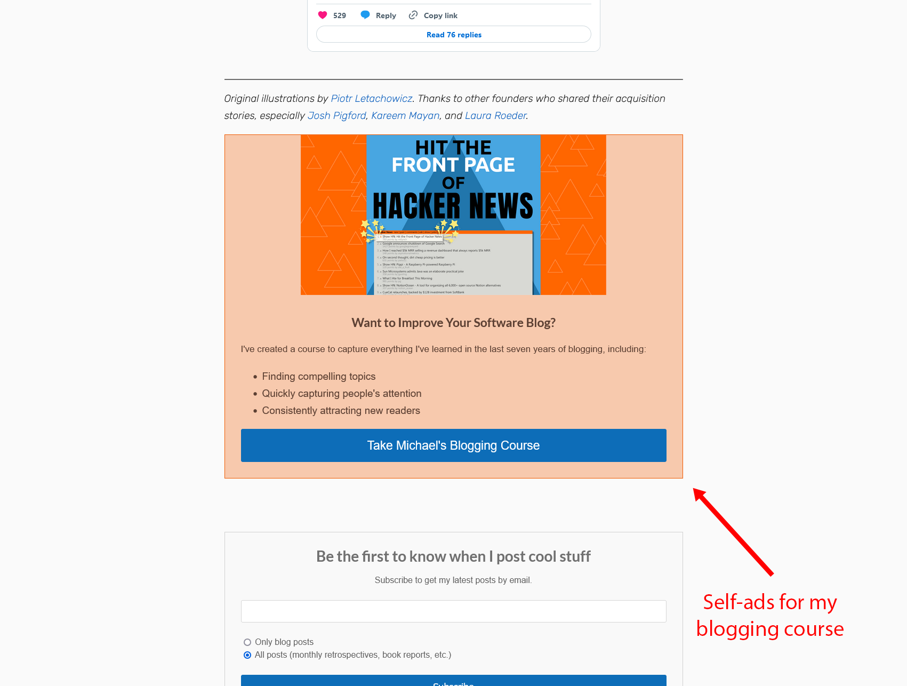
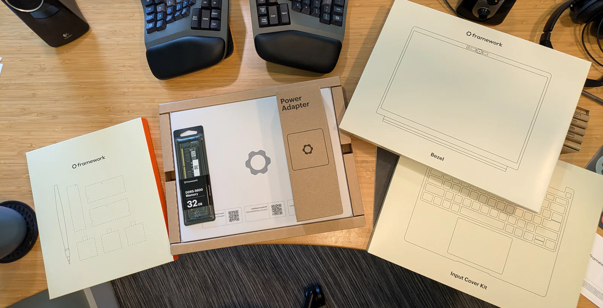
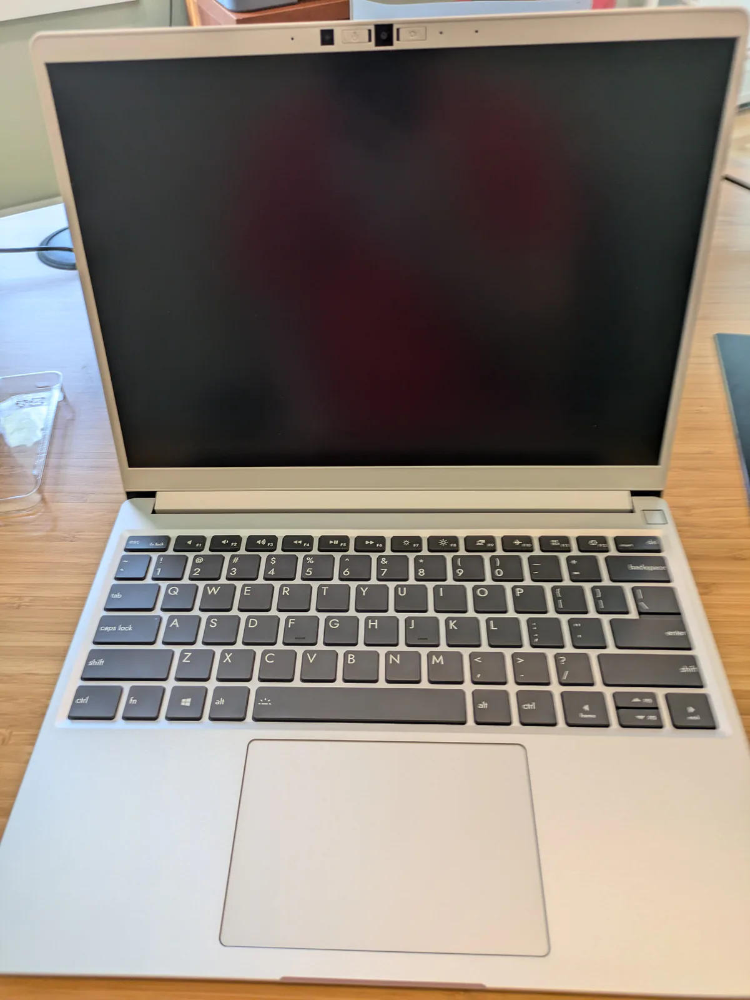

## Highlights

- My wife and I became parents.
- I realized that caring for a newborn takes more time than I expected.
- I'm unsure what to do with my partially-finished Hacker News course.

## Goal grades

At the start of each month, I declare what I'd like to accomplish. Here's how I did against those goals:

### Finish recording my course

- **Result**: Baby arrived early, and I only recorded 20% of the material.
- **Grade**: N/A

Recording the course took longer than I thought, and the baby arrived a few weeks earlier than we expected, so I didn't get to all the material.

### Begin selling my course

- **Result**: Baby arrived early, so I didn't get to this.
- **Grade**: N/A

Same as above. I didn't want to do a pre-order because I was afraid of getting into a situation where I'm unsure when I could deliver the finished version.

## We had a baby

In August, my wife and I became parents with the birth of our son.

We're trying to be protective of our son's privacy, so I took a photo of the three of us shortly after the birth and ran it through a hand-tuned Fast Fourier transform to remove identifying biometric details:

{{}}

## Caring for a newborn takes longer than two hours per day

In preparing for the baby's arrival, I planned to take two to three months of paternity leave, but I didn't know what that would look like. My top priority would be caring for my son and wife, but I couldn't understand how that would occupy entire days.

I knew that newborns needed breastfeeding and diaper changes, but how long could that take? Three, maybe four hours per day, split between two parents?

As you may have guessed, caring for a newborn isn't like my normal day minus two hours. So far, it's like a normal day minus 6-12 waking hours.

If you're an expectant parent wondering like I did, here's my explanation for where the time goes.

The most obvious change in time is sleep. Our baby sleeps well for a newborn, but that means that on a good night, he'll do four sessions of sleep, each 90-180 minutes long.

Before the baby, I thought, "Oh, sleeping in two-hour chunks through the night sounds fine." But I had a hidden assumption that it would be two hours of sleep, five minutes of diaper change, and then back to sleep. In reality, nighttime diaper changes take anywhere from five minutes to an hour, depending on how chaotic things get and how much soothing our son needs to get back to sleep.

So, we get 5-7 hours of sleep per night, but it takes 10-12 hours of real-world time to achieve that. We usually need to nap during the day, too, so that's just even fewer waking hours. And even after sleeping and napping, we're still sleepy, so we're doing everything else more slowly than normal.

The other unexpected impact on time is the feeling that our household is suddenly short one player. Before the birth, I knew I'd have to take on most of the household chores that my wife and I usually share. But at the time, that didn't seem like such a big deal. I can do all of the laundry and dishes and prepare two meals instead of one.

What I didn't anticipate was that while my wife recovered from the birth and took on the new responsibility of breastfeeding for hours each day, she'd need support with things that we normally wouldn't even consider "chores," like picking up heavy jars, grabbing things from floor-level shelves, or just having a fresh glass of water next to her as she nurses.

So, I'm glad that I kept my schedule open so that I wouldn't have any work responsibilities during this time. And each week, we find our rhythm a bit more and gain more free time so it doesn't feel like we're scrambling 24/7 to attend to our son's next need.

## What should I do with my Hacker News course?

Before my son's birth, I taught [my Hacker News course](https://hitthefrontpage.com) live each week to a pilot group of students. The students liked the material on writing and finding places to share your blog posts, but they [didn't care that much about Hacker News in particular](/retrospectives/2024/07/#should-i-pivot-away-from-hacker-news).

At the time, I felt like it was a signal that I should focus less on Hacker News, but I didn't have time to overhaul the course. I wanted to record all the material before my son's birth, and I knew I wouldn't have time to make such a large change and complete everything in time.

But my son arrived a bit early, so I'd only recorded 20% of the material for the course before he was born. Now, I'm wondering whether to keep going with the course or embrace that overhaul.

One other red flag I've noticed is that I put self-ads to my course all over my blog, and they're not attracting any interest from my blog readers.

{{}}

I get about 500 visitors per day on this blog, and the ads have brought no significant change in visitors to the course website.

{{}}

I have other ideas for marketing the course, but I'd like there to be a large overlap between the kind of people who read my blog and the kind of people who would be interested in taking one of my courses.

I found it hard to record videos before, but now that I have a baby, it's even harder. The thing that's feeling more appealing is to try circling back to [_Refactoring English_](https://refactoringenglish.com).

Longtime readers of this blog may recognize _Refactoring English_ as my oft-promised, never-delivered book about how developers can improve their writing. I [promised to write in 2021](/solo-developer-year-3/#publish-six-blog-posts-and-one-book), but then my business swallowed all of my time, and the book has been sitting on hold ever since.

My plan next month is to change my blog self-ad to be about _Refactoring English_ and see if more people visit.

For now, here's an excerpt from [my Hacker News course](https://hitthefrontpage.com) that I recorded before my son was born. It's about why I invest more into each blog post than most other bloggers do.

<iframe src="https://iframe.mediadelivery.net/embed/273218/f04d4f68-e5da-4886-a0f6-a3bedc62c399?autoplay=true&loop=false&muted=false&preload=true&responsive=true" loading="lazy" style="border:0;position:absolute;top:0;height:100%;width:100%;" allow="accelerometer;gyroscope;autoplay;encrypted-media;picture-in-picture;" allowfullscreen="true"></iframe>

## Making NixOS + Framework 13 AMD 7040 my daily driver

I've exclusively used Microsoft Surface tablets for my laptop needs for the past 10+ years, but I've finally gotten fed up enough with the direction Windows is taking that I'm preparing my complete exit from the Windows ecosystem.

I searched for a laptop that treated Linux as a first-class citizen, and I settled on [Framework](https://frame.work).

I initially resisted Framework because the idea of building my own laptop sounded tedious, which is strange because I enjoy building desktops and servers. But I don't enjoy working in tiny spaces or with tiny tools, and building a laptop seemed like it would be a lot of that.

The experience of building my Framework laptop was surprisingly the best unboxing experience I've ever had with anything.


{{}}
{{}}


Assembling my Framework was incredibly easy. I was expecting it to be like building a desktop from scratch where you're assembling the chassis, the motherboard, etc., but most of the Framework is actually pre-assembled. The user portion of the assembly only took me 30 minutes, and I was going very slowly.

Framework's [assembly instructions](<https://guides.frame.work/Guide/Framework+Laptop+13+(13th+Gen+Intel+Core)+DIY+Edition+Quick+Start+Guide/168>) are outstanding. I definitely experienced an "[IKEA effect"](https://en.wikipedia.org/wiki/IKEA_effect) where I feel more satisfied with my laptop from having assembled it myself.

I installed NixOS on my Framework, which has been satisfying but challenging.

In NixOS, all configuration happens through plaintext files. This is amazing when I want to install a program, and all I have to do is add a line to a file and run `nixos rebuild`. It's less amazing when I just want to make the system clock display in AM/PM instead of 24-hour format, and I can't find the magic incantation to make that happen via NixOS config files.

At this point, I like being in NixOS more than I like being in Windows, and I've been primarily a Windows user since Windows 3.1.

## Wrap up

### What got done?

- Welcomed the birth of my son.
- Recorded 10 chapters of my course and edited 9 of them.
- Configured my Framework 13 laptop to be usable as a daily driver with NixOS.
- Published [notes about a blockchain project](/notes/noah-bragg-stokefire-1/) and [why I'm confused about that particular blockchain](/notes/im-still-confused-about-base/).

### Lessons learned

- Caring for a newborn takes a long time.

### Goals for next month

- Enjoy family time.

### Requests for help

There are a few NixOS quests I haven't yet been able to complete. If you know how to complete these, let me know:

- TPM+PIN unlock: There are a lot of tutorials for TPM-only unlock, but I'd like to protect the unlock process with a TPM PIN, which is how I run Windows laptops with BitLocker.
- Stop Gnome from asking if I have a headset: There's a [longstanding bug](https://gitlab.gnome.org/GNOME/libgnome-volume-control/-/issues/14) in Gnome that it can't distinguish between headphones or a headset, so it asks every time. I'd like to find the right NixOS incantation to tell it to assume headphones.
- ~~Configure Syncthing remote folders through NixOS~~ (done: see comments below): The [NixOS wiki for Syncthing](https://wiki.nixos.org/wiki/Syncthing) is pretty good, but one thing I can't figure out is how to programmatically accept folders from peer devices. I can do it through the web GUI, but if I ever wipe the system, I'd have to re-do this step manually, which feels very un-Nix.
