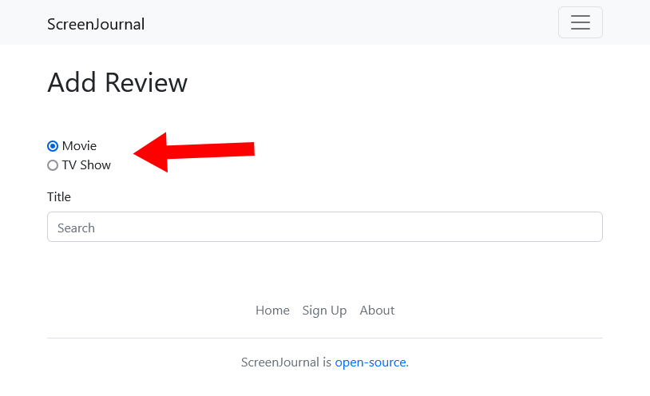
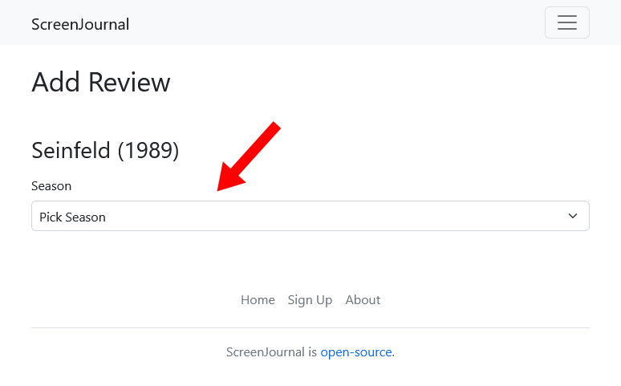
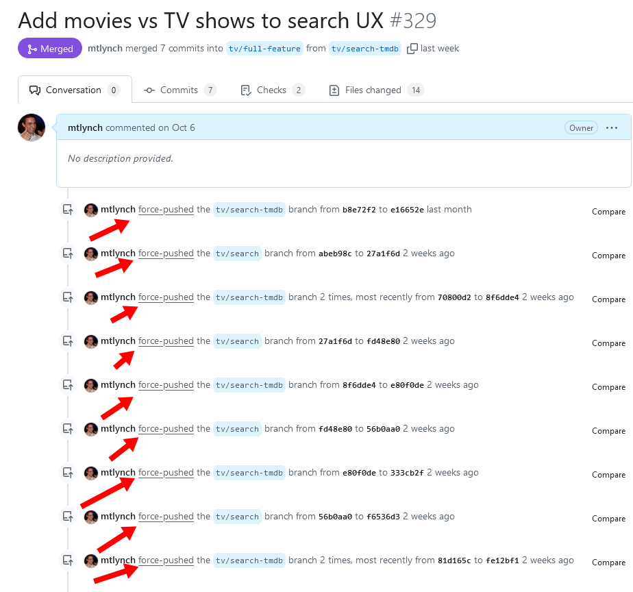

## Highlights

-

## Goal grades

At the start of each month, I declare what I'd like to accomplish. Here's how I did against those goals:

### Enjoy family time

- **Result**: Enjoyed time with my wife and son.
- **Grade**: A

I found it helpful since the last retrospective to remind myself that even when it seems like I'm going long stretches without working, I'm making that choice, and I'm still mostly in control of my time.

I'm still finding the right balance between work and family time, and things continue feeling better.

### Publish my tutorial on fuzz testing with Nix

- **Result**: I finally [finished the post](/nix-fuzz-testing-1/), but it didn't get much traction.
- **Grade**: A

## Easing back into work

When I sat down to write this retrospective, I remembered writing about feeling anxious about not having any time to work. It seemed like such a distant memory that I remembered it being two months ago, but it was actually just last month.

Fortunately, I'm feeling much more relaxed about balancing time with family with time to myself.

There are a few factors that influenced this:

### My son sleeps better at night

He was initially waking up three or four times per night and eating for 60-90 minutes per wakeup, but now he only wakes up two or three times per night and goes back to sleep within 15 to 60 minutes.

### We're getting more help from family

As my son has gotten older, we're more comfortable having family come over and care for him without us. We now have about five hours of help per week, and that will probably keep increasing, as our families are willing to help even more than they currently are.

### My wife gave me guaranteed work time

One of the challenges of finding time to work was that I find it difficult to work on an inconsistent schedule. I was getting time to work, when my wife had our son or when he was napping on my chest, but it's time that I know can be interrupted suddenly, which makes it harder to focus.

My wife offered to give me a guaranteed 90-minute block of focus time each day, so I know that I'll have a solid block of time to work.

## Am I over-investing in blog posts?

I used to have a bad habit of feeling like once I learned something difficult, I absolutely had to write a blog post explaining it. I tried to polish every post to the best they could be, even if the audience for the article was tiny or if I had no way of reaching readers. Previous examples include ["Hiring Content Writers: A Guide for Small Businesses"](/hiring-content-writers/) (there's an audience, but I don't have a good way of reaching them) and ["Retrofitting Apps for Cloud Storage with Zero Code Changes"](/retrofit-docker-gcs/) (very niche and not interesting outside of my strange use-case).

I've spoken to readers who are glad that I've written those articles, but I also have to consider the opportunity cost. In the time I spent writing them, was there another article that would have reached more readers or provided more value in aggregate?

I've since become more strategic in my posts. If I don't think an article can reach a critical mass of readers, I either don't write it or I write a quick 'n dirty version in my ["Notes" section](/notes/).

### ["Using Nix to Fuzz Test a PDF Parser"](/nix-fuzz-testing-1/)

I feel a bit conflicted about how much time I invested into this post.

Writing the article taught me a lot about Nix and fuzz testing, but it took me longer than I expected. At first, I thought, "Oh, I can do a quick writeup in a few hours," but I ended up spending 20+ hours on it.

It's also discouraging to write software tutorials in an age of LLMs. Up until a few years ago, there was a long-term return on tutorials, as people would discover them through web searches later. These days, if I write a niche tutorial, I think LLMs will just steal whatever I write, and the reader will have no idea it came from me.

### ["Lessons from my First Exit"](/lessons-from-my-first-exit/)

I knew from the start that this was a risky post because it has a few things working against it:

- It's about nitty-gritty details of selling a business, which 99% of my readers have no plans to do.
  - My previous post about the sale got traction, but that was a story, so readers could enjoy the story of it even if they weren't interested in doing it themselves.
- It's super long.
  - I aim for each blog posts to be about a 10-minute read, and that one is an estimated 33-minute read.
- The only channel social media channel where it had a decent shot is Hacker News.

I submitted it to Hacker News, but it didn't make the front page at all.

I think it still has a decent shot of getting traction on Hacker News, but even it flops entirely, I'm still happy about writing it. It helped me think through the acquisition for myself, and it will be a useful reference if I ever sell another business in the future. I have gotten positive feedback about it from founders who have been through an acquisition or are thinking about it.

## And suddenly, those posts got traction

After I wrote the above, I realized that [Hackaday](https://hackaday.com/2024/11/09/nix-automated-fuzz-testing-finds-bug-in-pdf-parser/) did a writeup about my Nix fuzzing tutorial, which is validating.

And then the day after I wrote the section about "Lessons from my First Exit" flopping, it was submitted again by a reader and it [reached #2](https://hnrankings.info/42133864/) and [generated a good discussion](https://news.ycombinator.com/item?id=42133864).

Still, I think my initial analysis was correct. I overinvested in the fuzzing post and invested the right amount into the one about selling TinyPilot.

## Implementing major features through stacked diffs

For the past few weeks, I've spent most of my hobby programming time on [ScreenJournal](https://github.com/mtlynch/screenjournal), my TV and movie review app. The idea of it is like letterboxd or Goodreads, but the reviews are only visible to your friends, and the code is open-source.

<figure class="img">

<figcaption><p><a href="https://github.com/mtlynch/screenjournal">ScreenJournal</a>, my open-source TV and movie review app</p></figcaption>
</figure>

I always wanted ScreenJournal to support both movies and TV shows, but I implemented movies first because they were simpler. I intentionally didn't generalize the code to support TV shows. I didn't know if it would ever happen, so I wanted to optimize for the functionality that was there.

In October, I added support TV show reviews, so I had to make a lot of changes to the codebase where I assumed the user would always be reviewing a movie.

The [full change](https://github.com/mtlynch/screenjournal/pull/359) ended up weighing in at over 2k lines of code, which is a bit unwieldy to understand in a single changelist. I'm using the term "changelist," but I'm talking about something like a pull request in Github terms or a merge request in Gitlab terms.

In the past, the way I've tackled large changes like this is that I have a feature branch that's in a broken or incomplete state until I finish the feature. I either make changes directly into the feature branch or I branch off that feature branch again for a subtask and then merge in the subtask when I'm done.

The problem with this approach is that the feature branch becomes a giant blob of changes that are too large to understand. You can see an example of this [when I migrated What Got Done from Firestore to SQLite](https://github.com/mtlynch/whatgotdone/pull/639). There were lots of substeps within that change, but they're not inspectable because everything is mixed together.

So, for this ScreenJournal change, I tried something different. Instead of keeping a big, messy feature branch, I did stacked diffs.



##### What's a stacked diff?

Stacked diffs are where you have a `main` branch, and you want to merge in a large feature, so you break the feature into change `A`, `B`, and `C`. You create `A` by branching off of `main`, create `B` by branching off of `A`, etc.

Github has okay support for stacked diffs in that if your stack is `A`, `B`, `C`, you'd make a PR from `A` into `main`, then a PR from `B` into `A`. When you merge in the `A` into `main` PR, the `B` into `A` PR automatically updates to a `B` into `main` PR.


I broke up the work by making a changelist for each page in the TV show review flow.

The first step of leaving a review is to search for the thing you want to review. It used to only be movies, so my first step in supporting TV shows was to [add a radio button](https://github.com/mtlynch/screenjournal/pull/329/files) that let the user choose between a movie or TV show:

{{}}

The next thing I needed was a way for the user to pick a TV show season, as that's something that I didn't have when it was movies only. So, [that was its own change](https://github.com/mtlynch/screenjournal/pull/342).

{{}}

I kept going like that, where each stage of the flow was a new branch and separate pull request.

Here are some takeaways from that style of development.

### Good: Stacked diffs motivate me better

The nice thing about stacked diffs is that each subtask of a feature is its own changelist.

Breaking the change into smaller pieces gave me a better sense of accomplishment and progress. It's satisfying to finish a changelist and know that it's 100% done rather than having one big messy branch where completing a subtask moves the feature from 30% to 35% complete.

### Bad: I constantly have to delete change history

The thing I dislike most about the stacked diff workflow is that I end up deleting source history, which negates a big benefit of source control.

Whenever I realize I should have made a change earlier in the stack, I have to do `git rebase`, which rewrites history. That means I have to force push to Github, which litters my changelist with all these ugly `force-pushed` entries:

{{}}

I know some people want all of their changes preserved exactly as they occurred, as if each commit was evidence in a murder trial. I don't care about that, but I do want a sensible undo history in case I make a mistake. I don't like that force pushes overwrite the undo history on the remote end and require complicated surgery to recover from the local end.

### Good: `--update-refs` simplifies rebasing stacked diffs

As I was experimenting with the stacked diffs workflow, I [found out about git's `--update-refs` flag](https://andrewlock.net/working-with-stacked-branches-in-git-is-easier-with-update-refs/), which lets you rebase multiple branches at once.

That trick makes stacked diffs easier because I was previously rebasing each branch in order, which got painfully tedious after I had four branches in the stack.

### Bad: Pushing after `--update-refs` is still hard

If I have branches `A`, `B`, and `C`, and I rebase all of them at once, the git output looks like this:

```bash
$ git rebase master --update-refs
Successfully rebased and updated refs/heads/C.
Updated the following refs with --update-refs:
        refs/heads/A
        refs/heads/B
```

While `--update-refs` simplifies the rebase action, there's no "okay, now push the branches I just rebased" command. Instead, I have to copy the output from git into a text editor, edit to pull out the branch names, then put it back into a command like `git push origin A B C -f`. It's an annoying process that always interrupts my flow.

### Bad: I frequently land in an unexpected git state

Even though I thought I was rebasing in the correct way, I frequently found myself in a confusing state. Like I'd rebase, and then it would want me to reconcile conflicts that I'd already reconciled.

I worked around this by squashing commits and rebasing again, but this again rewrites history and makes it harder to undo mistakes. It's also just an annoying amount of mental overhead where I have to think about how to apologize properly to git when I'd much rather than focus on my code.

### Maybe I should give jujutsu a try

I'm seeing more and more chatter about [jujutsu](https://github.com/martinvonz/jj), a new source control system that's on track to become standard within Google.

A few months ago, I thought about trying it and thought, "Eh, git does what I need. Why chase after the next shiny thing?" But then I had this experience with git rebase and remembered there are a lot of times I have to fight with git, and I've just accepted that as normal.

From skimming Steve Kalabnik's tutorial, it sounds like jujutsu [supports stacked diffs and multi-rebase better than git does](https://steveklabnik.github.io/jujutsu-tutorial/advanced/simultaneous-edits.html).

## Recommendations

### ["Why I still blog after 15 years"](https://www.jonashietala.se/blog/2024/09/25/why_i_still_blog_after_15_years) by Jonas Hietala

I related a lot to this post about blogging. As I explored Jonas' site more, I was like, "Oh, this guy is like the Swedish version of me." So if you enjoy my writing, you'd probably enjoy his as well.

### ["Notes on Ukraine"](https://mattlakeman.org/2022/05/15/notes-on-ukraine/) by Matt Lakeman

I discovered Matt's blog last week, and every day since then, I just keep thinking, "Who is this guy?"

Matt travels to not-so-popular destinations, usually for ten days or so and then publishes a blog post about the country. But it's not like postcard to your mom blog posts; these are novella-length blog posts based on hours of study of the history of the country and conversations with locals.

I also discovered that he has a long posting history elsewhere on the Internet under the username `dormin111`, such as this [detailed analysis of the movie _The Disaster Artist_](https://old.reddit.com/r/slatestarcodex/comments/binx8k/disaster_artist_insanity_is_no_shortcut_to/).

The craziest thing about all his work is that there's seemingly no angle. Usually, when you see someone invest so much into their writing, it's usually obvious how it benefits them: they have a Substack or [some paid course](/retrospectives/2024/09/#what-should-i-do-with-my-hacker-news-course) that earns them money, and their free articles are [loss leaders](https://en.wikipedia.org/wiki/Loss_leader). But I can't find any angle or profit motive in any of Lakeman's stuff. He seems to just love [thinking deeply about things and sharing his thoughts](https://mattlakeman.org/2020/10/06/thoughts-on-meaning-and-writing/).

Anyway, back to this Ukraine post. I assumed that he visited before the war, but it turned out that he visited two months into the war and interviewed people within miles of the front lines. I found it interesting to see coverage of the war from someone who's not career journalist but still interviewed a variety of real people in Ukraine. It feels like a more authentic and personal view into the situation than anything I've seen from traditional media channels.

### _Cyberpunk 2077_ (video game)

I don't play video games much. I buy one new game per year and it play until I get bored, which usually takes 5-25 hours over a few days. I'm at about 25 hours of play with this game, and I'm still enjoying it.

I find the depth astounding. I think I've only explored like 10% of the game despite 25 hours of playing, so it amazes me that modern games have such expansive worlds.

I usually don't care about stories in video games and find it irritating when games make me sit through boring exposition, but _Cyberpunk_ is one of the few games where I find the story compelling enough to pay attention. And it's cool to see them invest so much into voice acting to the point that Keanu Reeves plays a major role in the game.

### _Detroiters_ (TV show)

I'd heard of this show, but I think the name always dissuaded me from watching. A show where the defining feature is that the characters live in Detroit? Sounds boring.

And then I saw [this clip](https://www.youtube.com/watch?v=yWBqnpCCasg) from the show and realized that great people are in it, and the tone is like a slightly more grounded version of _I Think You Should Leave_ in sitcom format. I just finished season 1, and I thought it was great.

{{}}

## Wrap up

### What got done?

- Published two full-length articles:
  - ["Lessons from my First Exit"](/lessons-from-my-first-exit/)
  - ["Using Nix to Fuzz Test a PDF Parser"](/nix-fuzz-testing-2/)
- Published five short-form notes:
  - ["Delete the Timestamps from your Static Blog"](/notes/delete-your-timestamps/)
  - ["Massachusetts Residents Can Sue Online Merchants for Spam"](/notes/ma-residents-can-sue-over-email/)
  - ["An Unsuccessful Experiment with Nemotron"](/notes/llama3.1-nemotron-ollama/)
  - ["Creating a Nix Workflow to Fuzz netconsd"](/notes/fuzz-netconsd/)
  - ["Takeaways from Charles Marohn's 'Escaping the Housing Trap'"](/notes/marohn-housing-trap/)

### Lessons learned

-

### Goals for next month

-

### Requests for help

TODO
