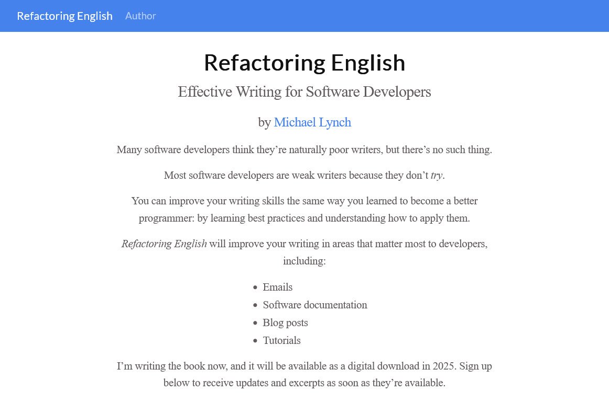
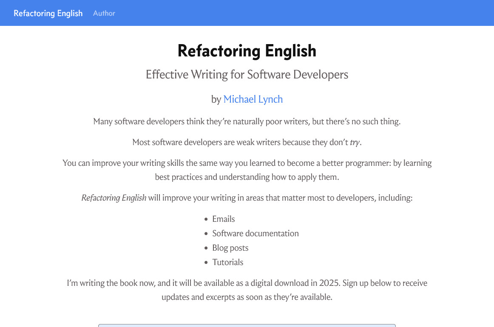
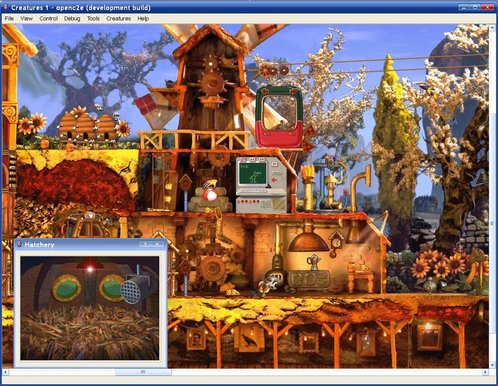
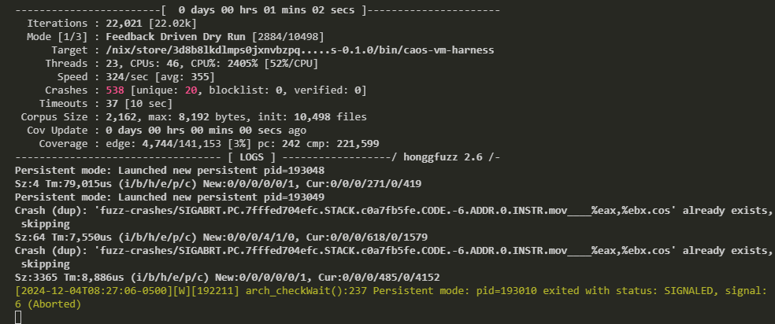
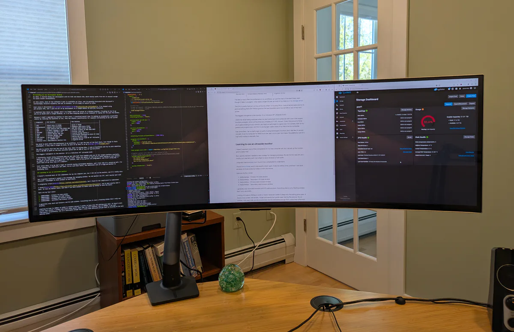
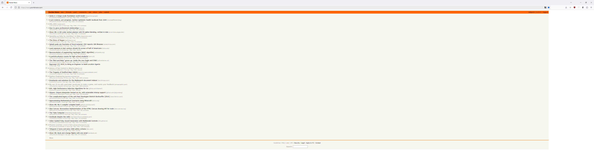
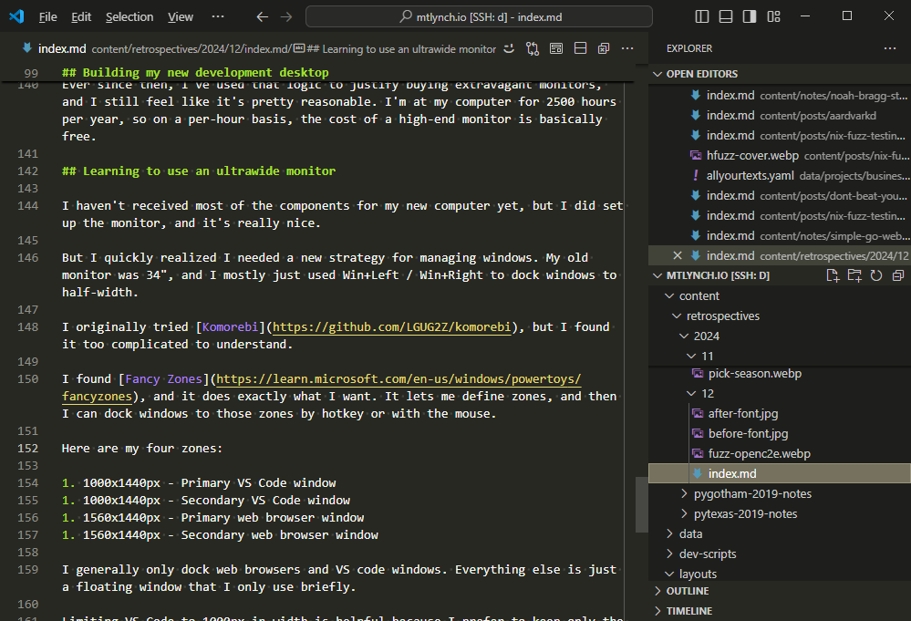
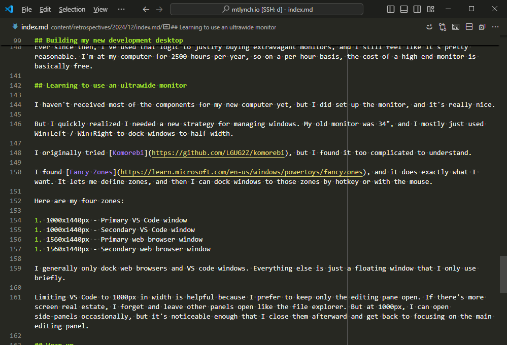

## Highlights

- I found ways to procrastinate writing my book.
- I had fun fuzz testing open-source projects.
- I picked out components for a new high-end desktop computer for software development.

## Goal grades

At the start of each month, I declare what I'd like to accomplish. Here's how I did against those goals:

### Enjoy family time

- **Result**: Continued to enjoy family time.
- **Grade**: A

During my self-managed paternity leave, I'm continuing to enjoy the balance between my family time and my time working on personal and professional projects.

### Complete and publish a chapter of [_Refactoring English_](https://refactoringenglish.com)

- **Result**: Worked on the chapter but didn't publish anything.
- **Grade**: D

I underestimated this goal when I wrote it. I had started one chapter years ago and kept returning to it sporadically. In my memory, the chapter was 80% complete already, but when I returned to it this time, it felt more like 20% complete.

I got the chapter to about 60% done, but I didn't focus as much as I could have.

## I need to stop procrastinating on the book

### Maybe I need new fonts

I started working on the first chapter of my book, but I kept feeling distracted by my site's mediocre design.

{{}}

My book's website uses I simple design theme that I created. It's just Bootstrap's default CSS with some custom styling that I've added. I couldn't point to any specific problem, but the look just felt off.

I began looking at blogs and websites that I liked and tried out their fonts on my site:

- [Jonas Hietala](https://www.jonashietala.se) uses [Concourse](https://practicaltypography.com/century-supra.html) and [Century Supra](https://practicaltypography.com/century-supra.html), which are paid fonts designed by [Matthew Butterick](https://matthewbutterick.com/).
- [Xe Iaso](https://xeiaso.net/) uses Iosevka Aile Iaso, which turns out to be a font that [she designed herself](https://xeiaso.net/blog/iaso-fonts/).
- [fasterthanlime](https://fasterthanli.me/) uses [Atkinson Hyperlegible](https://www.brailleinstitute.org/freefont/), a font that the Braille Institute distributes for free because it's good for people with vision impairment.

The font that looked best for the book's website was [Concourse](https://mbtype.com/fonts/concourse/), which led me to explore all of [Matthew Butterick's fonts](https://mbtype.com). For the first time ever, I purchased fonts instead of using a free font from Google Fonts. I used [Concourse](https://mbtype.com/fonts/concourse/) for the headings and [Heliotrope](https://mbtype.com/fonts/heliotrope/) for the text.


{{}}
{{}}


I was surprised at how much of a difference nice fonts made. It felt like cheating that I didn't have to make any other design changes, and my site looked 3x better.

### Maybe I need a book cover

After installing my spiffy new fonts, I got to thinking about the cover for my book. I plan to commission a cover before I publish the book, so I might as well get it now. More people will be interested if they see a nice cover. So, I wrote [a spec for the cover design](https://docs.google.com/document/d/1SUQ6GTeyL-XWmZYlJdQgyvQHZdHiUvCy0G-dh5nnrQM/edit?usp=sharing) and hired a designer to work on it.

### Maybe I should go back to my previous idea

A few days later, I got an email from a reader asking if they could buy access to the unfinished lessons in _Hit the Front Page of Hacker News_. I sent them my two new unreleased lessons and a link to the old course. They seemed happy with the material. I got to thinking I should pause _Refactoring English_ and finish my reboot of _Hit the Front Page of Hacker News_.

### Maybe I should focus

At this point, I noticed that I was finding an awful lot of activities that weren't writing my book.

It's easy to get distracted because finishing the book feels like such a distant goal. And because it's a book about writing, I feel like my writing has to be perfect, so I get hung up on wordsmithing everything.

I think I'll have a better feel for the book once I publish my first sample chapter and see reader feedback. I'm just going to push on until that's done.

## Fuzzing is super fun

Notwithstanding the previous section, I had a lot of fun last month with fuzz testing.

For most of November, I had a few hours to myself when I was waiting for my three-month-old's first wakeup of the night, which could happen anywhere from 1-4 hours after we put him to bed. In those hours, it's hard to focus on programming because I'm tired from the day and could be interrupted at any moment, but it's the perfect time to fuzz test. Fuzzing requires a relatively low level of focus, as it's mostly trial and error just getting things set up.

### Fuzzing openc2e

Nix [makes it easy](/nix-fuzz-testing-1/) to set up fuzz testing workflows, and I feel like the world hasn't caught on yet.

One night, I read a blog post about [fuzzing a random open-source utility that Facebook published](https://blog.fadyothman.com/meta-bug-bounty-fuzzing-netconsd-for-fun-and-profit-part-1-6ffe96eb1419), so I [spent an hour reproducing that fuzzing workflow with Nix](/notes/fuzz-netconsd/).

A few nights later, I spent a couple of hours [writing a fuzzer](https://gitlab.com/mtlynch/fuzz-openc2e) for [openc2e](https://openc2e.github.io/), the open-source reimplementation of the [_Creatures_ game series](<https://en.wikipedia.org/wiki/Creatures_(video_game_series)>).

{{}}

The original _Creatures_ game from 1996 included a custom scripting language and corresponding virtual machine. The language is called [Creatures Agent Object Script (CAOS)](https://creatures.fandom.com/wiki/CAOS), and it lets players create custom add-ons for the game.

CAOS is a low-level language that looks a bit like assembly:

```text
SETS VA00 "he"
ADDS VA00 "llo"
DBG: ASRT VA00 eq "hello"
```

Enthusiasts have reimplemented a CAOS interpreter within openc2e, and I doubted that anyone had ever fuzzed it. But it's a good thing to fuzz because it parses untrusted third-party code if you install add-ons.

I started by fuzzing the lexer for the CAOS language, and I immediately found a bunch of crashes.

{{}}

One of the crashes was just an unterminated double quote, which confirmed my suspicion that nobody had ever fuzzed the code.

```text
* The following line crashes openc2e's CAOS lexer.
"
```

I made a [pull request to fix the simplest crash with a unit test to demonstrate the fix](https://github.com/openc2e/openc2e/pull/215), but the project is semi-abandoned, so it might be a while before I can get all of my fixes in. I hope they eventually get time to review it because I think my PR is neat.

### Fuzzing means you can do whatever you want

One of the most fun things about fuzzing with Nix is that you can mess around with the underlying project without bothering anyone.

When I was trying to fuzz openc2e, I realized that the code I wanted to link against was compiled into an object that's not friendly to linking. I was trying to figure out how to link against the code when I realized I could just [patch their Makefile](https://gitlab.com/mtlynch/fuzz-openc2e/-/blob/dc48bfbe62bdc4a99eab2e9662a780c253654558/share-openc2e-lib.patch) in my repo and make whatever changes I want.

Usually, when I'm contributing to an open-source project, if I want to make a significant change like converting a library from private to public, I'd have to spend a lot of time understanding why it's private to begin with and then make the case to maintainers for why it makes sense to export the library. But for fuzzing, I'm just off in my own personal sandbox, and I can futz around with whatever I want.

## Building my new development desktop

I'm planning a dramatic transition in my software development habits: I'm going to write code like a normal person again.

Starting around 10 years ago, I found it easier to develop software on Linux, but I still preferred Windows as my main OS. I solved this by running Linux VMs in VirtualBox on my Windows desktop. I used per-project VMs to avoid dependency conflicts (e.g., my Python 2 project messing up my Python 3 project).

In 2017, I got tired of having to reboot all of my VMs every time I rebooted my Windows system, so I [built my first homelab VM server](/building-a-vm-homelab-2017/).

By 2019, I was doing all of my development with VS Code and Remote SSH, which mostly works but is unusual enough to cause issues occasionally.

Then, two changes happened in the last year:

1. I realized that virtually all of the software I want is available on Linux. I'm growing frustrated with Microsoft's increasingly invasive telemetry and ads in Windows, so I'm ready to switch to Linux.
1. Ever since I discovered [per-project environments in Nix](/notes/nix-dev-environment/), I've stopped using per-project VMs, and I do all of my development in a single Debian VM with Nix installed.

These two changes mean I no longer need a VM server or a Windows desktop. I'm going to consolidate down to a single desktop running Linux with NixOS, as I've been enjoying NixOS on [my Framework 13 laptop](/retrospectives/2024/09/#making-nixos--framework-13-amd-7040-my-daily-driver) for the past few months.

I'm making an economically responsible choice by reducing two machines to one, which was how I rationalized overspending on my new system:

| Component   | Old Desktop                    | New Desktop                           |
| ----------- | ------------------------------ | ------------------------------------- |
| CPU         | Intel Core i7-4790K            | Ryzen 9 7950X                         |
| Motherboard | ASRock X99 Extreme4            | Gigabyte X870 Aorus Elite             |
| GPU         | ASUS GeForce GTX 970 STRIX 4GB | MSI RTX 4060 Ventus 2X 8GB            |
| RAM         | G.SKILL Ripjaws 4 32GB DDR4    | G.Skill Trident Z5 RGB 64GB DDR5      |
| Storage     | Samsung 980 PRO 2 TB           | Crucial T705 2TB                      |
| Case        | Cooler Master HAF 912          | Fractal Design Define 7 Compact       |
| PSU         | Corsair HX750i 750W            | SilverStone Platinum PS-ST55F-PT 550W |
| CPU Cooler  | Noctua NH-U9DXi4               | Noctua NH-U12S redux                  |
| Monitor     | LG 34UMP95 34"                 | Samsung Odyssey OLED G9 49" Ultrawide |
| Monitor Arm | AmazonBasics Monitor Arm       | Ergotron HX HD                        |

The disk is most often the bottleneck in my workflows, so I got the best of the best there, even though it feels indulgent. I only need a single OS disk, as most of my data is on my [storage server](/budget-nas/).

The CPU is fast but not top-of-the-line. When I'm buying CPUs, I look at benchmarks and try to pick something that's 80-90% as good as the best possible option but at 50% or less of top-end prices.

The biggest extravagance is the monitor. It's a ridiculous 49" ultrawide OLED:

{{}}

I distinctly recall the joy I felt when I was 11 years old, and my dad came back from CompUSA and presented me with a box containing one of the largest monitors available, which was probably a 17" CRT. "Given the amount of time you'll spend looking at your monitor," he explained, "we might as well invest in a good one." For context, both of my parents are programmers, and from a young age, I spent most of my free time at a computer.

Ever since then, I've used my dad's logic to justify buying premium monitors, and it's served me well. I'm at my computer for 2500 hours per year. On a per-hour basis, the cost of a high-end monitor is basically nil.

Plus, now that I've experienced [Hacker News](https://news.ycombinator.com/) at 5120x1440px resolution, I can never go back.

{{}}

## Learning to use an ultrawide monitor

I haven't received all of the components for my new computer yet, but I already set up my new monitor. I quickly realized I needed a new strategy for managing windows on my desktop.

My old monitor was 34", and I mostly used Win+Left / Win+Right to dock windows to half-width on my desktop. With 5120px of width on my new monitor, I wanted to dock more than two windows at a time.

I tried [Komorebi](https://github.com/LGUG2Z/komorebi), but I found it too complicated. Then, I found [Fancy Zones](https://learn.microsoft.com/en-us/windows/powertoys/fancyzones), and it does exactly what I want. It lets me define zones through a GUI, and then I can dock windows to those zones by hotkey or with the mouse.

Here are my four zones:

1. 1000x1440px - Primary VS Code window
1. 1000x1440px - Secondary VS Code window
1. 1560x1440px - Primary web browser window
1. 1560x1440px - Secondary web browser window

I generally only dock web browsers and VS code windows. Everything else is just a floating window that I only use briefly.

Limiting VS Code to 1000px in width is helpful because I prefer to keep only the editing pane open. If there's more screen real estate, I forget and leave other panels open like the file explorer. But at 1000px, I can open side-panels occasionally, but it's noticeable enough that I close them afterward and get back to focusing on the main editing panel.


{{}}
{{}}


I also didn't think I'd care about the sharpness of OLED vs. LED, but I do appreciate the difference. The blacks are blacker, which makes the image feel more crisp.

Similarly, I didn't think I'd care about refresh rate, but I do notice a difference in 60 Hz vs. 120 Hz. The monitor supports 240 Hz, but Windows doesn't show me that option for some reason, so I'll try tinkering when I switch to NixOS.

## Wrap up

### What got done?

- Cleaned up a lot of my blog's templating and CSS code and reorganized [the homepage](/).
- Selected and ordered components for a new main desktop workstation.
- Worked on design elements for _Refactoring English_.
- Published a quick tutorial on [how to run simple services on NixOS](/notes/simple-go-web-service-nixos/).

### Lessons learned

- Workflows that let you apply custom patches to other projects provide a pleasant sense of freedom.
  - You get to do whatever you want because the changes only affect you. And if you have a workflow that makes patching easy, you don't feel the burden of building a special version of the code.

### Goals for next month

- Finish two chapters of _Refactoring English_.
- Work with a designer to complete the cover design for _Refactoring English_.
