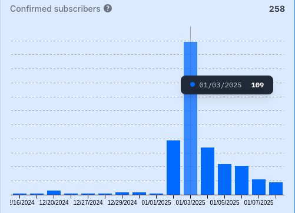
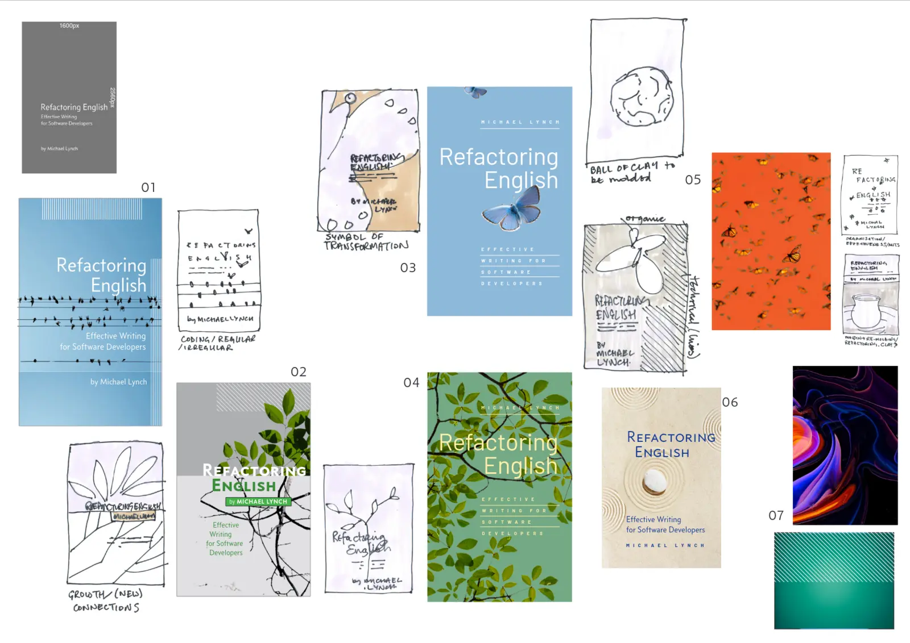

## Highlights

- I published the first chapter of my book and was happy with the reception.
- My attempt to hire a book cover designer flopped.
- I may have figured out how to support large files on PicoShare.

## Goal grades

At the start of each month, I declare what I'd like to accomplish. Here's how I did against those goals:

### Finish two chapters of _Refactoring English_

- **Result**: Finished one chapter and got 75% through the next.
- **Grade**: B

The first chapter took longer than I expected, as I kept finding parts that I wanted to rewrite. I did find it helpful to take a break for a week to write a second chapter and come back fresh.

### Work with a designer to complete the cover design for _Refactoring English_

- **Result**: Decided to do the cover design on my own.
- **Grade**: C

I got partway through working with the designer, but I pulled the plug because I didn't like the direction it was going. I decided to do my own cover for now.

## Thoughts on finishing the first chapter of _Refactoring English_

I published the first chapter of my book, _Refactoring English_. The chapter is called ["Rules for Writing Software Tutorials,"](https://refactoringenglish.com/chapters/rules-for-software-tutorials/) and it's based on years of following tutorials and noticing when they do things well or poorly.

### A successful reception for the first chapter

The chapter's reception was on the high end of my expectations. It's a list of rules about tutorials, so I didn't think it would set the Internet on fire, but it got a respectable response on a few sites I thought would be a good match:

- [Hacker News](https://news.ycombinator.com/item?id=42574641): 375 points and [reached the #10 position](https://hnrankings.info/42574641/)
- [/r/programming](https://www.reddit.com/r/programming/comments/1hrux0b/rules_for_writing_software_tutorials/): 159 points and reached #1 position for the day (I think?)
- [Lobste.rs](https://lobste.rs/s/7t86dw/rules_for_writing_software_tutorials) 27 points and reached the #2 position

The main metric I'm tracking is mailing list subscribers. 245 new subscribers signed up the week after the post, increasing total subscribers of the book by 31%.

{{}}

### What's the right way to iterate on an article after I publish it?

A few years ago, [Salvatore Sanfilippo](http://antirez.com), creator of Redis, paused his programming work to [write a sci-fi novel](http://invece.org/). While working on the novel, he [observed](https://antirez.com/news/135):

> I believe the most sharp difference between writing and programming is that, once written, edited and finalized, a novel remains immutable, mostly.

Salvatore went on to say that programmers should learn from novelists and resist the urge to rewrite the core logic of their app after it's done. I actually took the opposite lesson: authors should write books more iteratively, like programmers.

For _Refactoring English_, I'm trying to publish chapters in near-finished state, but I also want to let reader feedback shape my writing.

Having chapters live in flux creates a problem I've never dealt with before: I'm messing up comment threads. On Hacker News, Lobsters, and reddit, commenters disagreed with my point about ["Let computers evaluate conditional logic."](https://web.archive.org/web/20250102175032/https://refactoringenglish.com/chapters/rules-for-software-tutorials/#let-computers-evaluate-conditional-logic) And I think they're right. That was my weakest point, so I've cut it.

The problem is that anyone reading those discussions will wonder why people are disagreeing with a point that never appears in my article.

The best solution I can think of is to include [a note at the bottom](https://refactoringenglish.com/chapters/rules-for-software-tutorials/#revisions) saying that I'm still revising the book with a link to the original and a list of notable edits.

### How do I keep finding readers to give feedback?

So far, I feel like my plan to iterate based on reader feedback is working.

I'm happy with what I published in the first chapter, but I also received a lot of thoughtful critiques from readers that will help me revise it.

I thought, "Okay, I can keep sharing preview chapters to those same channels."

Then, I reviewed my table of contents and realized that no other chapter would be a match for the channels where I shared the first one. Most of those sites have a written or unwritten rule that says, "If there's no code in the post, it doesn't belong here." For example, /r/programming is probably not going to be excited to read my impassioned chapter about why I hate the passive voice.

One idea I've had is to do freelance editing for other writers and use that to inform _Refactoring English_.

Except I don't think "editing" is exactly what I'd be good at. People hear "editor" and think I'm going to polish their writing for them. What I actually want to do is identify problems in their writing and explain principles and techniques to help them improve it themselves. I don't know what to call that. Writing mentorship? Coaching?

Either way, if that sounds interesting to you, [reach out](/about). I can help with blog posts, documentation, or any software-related writing. I can show you how to attract more readers and make your writing more engaging. Basically, if you like the way I write on this blog, I can show you the techniques I'm using here.

- I'll charge $100 for two rounds of review.
  - The cost covers me reviewing your initial draft and then reviewing changes you make based on my feedback.
- The piece can be up to 2,500 words.
- The money is mainly so you have skin in the game, so if $100 is beyond your budget, maybe we can still work something out.

## My poor experience hiring a book cover designer through Reedsy

One of my distractions from working on my book in November was to convince myself I needed [a professionally designed cover](/retrospectives/2024/12/#maybe-i-need-a-book-cover). I started the process in November, but the work happened in December.

I found the designer through Reedsy, a platform that several people recommended in the [Write Useful Books community](https://www.usefulbooks.com/community). The common review was that it was pricey but worth it.

I wrote [a design brief](https://docs.google.com/document/d/1SUQ6GTeyL-XWmZYlJdQgyvQHZdHiUvCy0G-dh5nnrQM/edit?usp=sharing) explaining what I wanted and sent it to four designers on Reedsy. I listed my budget as US$350-650. One designer bid 20% over my max budget, and his reply was a generic, "Sure, I can do this for you," with nothing that suggested he read my brief. Another designer declined, saying that my budget was too low, and one never responded.

The only valid bid came from Gary, who offered to do the cover for £350 (US$434). He sent a thoughtful note that referenced specifics from my brief, his portfolio had dozens of book covers, and he had a perfect 5.0 rating on Reedsy. He proposed a one-month timeline, with the fee split into three payments. That sounded fine to me, so I hired him.

### Working with Gary

A week went by, and I hadn't heard anything from Gary. After my first payment was auto-billed, I asked for an ETA on initial drafts. Gary said he'd send concepts the next day, which he did.

{{}}

Sample 1 looked good, but it was a pretty on-the-nose ripoff of [_Beautiful Code_](https://www.oreilly.com/library/view/beautiful-code/9780596510046/), which I had cited in my brief.
I found the rest underwhelming, but I blamed myself for not spending more time on my brief.

As I reviewed the concepts, I realized what I cared about conveying was the idea of careful, deliberate work. I felt like Sample 6 of the zen garden and Sample 5 of the clay mold were on the right track, so I asked to explore those. I suggested an image of a sculptor carving stone.

Another week went by, and Gary sent a minor variation on the zen garden idea. He also attempted the sculptor concept with an image showing a chisel with raw stone. But the photo was of stone that hadn't been carved at all, so it wasn't capturing the idea of careful work.

The following week was Christmas, and I started to worry that the project wouldn't complete by the December 30th finish date. Gary emailed me the Monday before Christmas to say he was returning to work on December 27th, so he was still on track.

By the end of the day on the 27th, I hadn't heard from Gary, and I realized I was in a bit of a pickle.

It was 4 PM on a Friday for me in US Eastern Time, but Gary was in the UK, so his business day was long over. Reedsy was going to auto-bill me at noon Eastern Time on Monday. The last day Reedsy allows me to dispute a bill is 24 hours before it's charged, so I had zero business days left to get completed work.

I asked Reedsy's customer support to push back my final payment a week, as Gary hadn't delivered his work. Reedsy told me that I had to take it up with Gary. I explained that if I waited until the next business day to get a response from Gary, it would be too late to move the payment. Reedsy support insisted I try to resolve it with Gary anyway.

I emailed Gary at 5 PM ET on Friday, and he responded that he didn't work "corporate hours," so he was still on track to finish the project by working the weekend. He pushed back my payment as a courtesy but seemed miffed that I'd complained to Reedsy.

I, on the other hand, do try to stick to regular working hours and didn't feel like spending my weekend with Gary rushing to finish this project. When I checked back on Monday, Gary had sent updates on the two concepts, but they were both pretty mediocre. One looked clearly AI-generated and unrealistic. The other was just not capturing the tone I asked for.

I asked Gary whether the images were AI-generated and if they met the license requirements I'd specified in my brief. He got cagey at that point, so I asked to cancel the project. I offered him the £231 (US$287) I already paid if he'd allow me to cancel the final payment and terminate the project. He agreed, so that was that.

I gave Gary a 3-star review across the board. I didn't think he was awful, but just kinda meh and bad at communicating timelines. My review is public, but Reedsy still claims that Gary has a perfect 5.0 rating even though I gave him a 3.0, and he only has four other reviews.

{{}}

### My DIY book cover

With Gary out of the picture, I decided to try making my own cover. I found [a royalty-free image on Unsplash](https://unsplash.com/photos/shallow-focus-photo-gray-balance-stone-HWRAHxoBlpU) that captured the spirit of quiet, careful work, and I added some text.

{{}}

I know it looks amateurish, but I'm about 80% as satisfied as I expected to be with Gary's work. But this was free and took me an hour. I'm treating it as a placeholder. I can always hire someone or invest more time later.

## Side projects

### Making PicoShare work with large files

[PicoShare](https://github.com/mtlynch/picoshare) is my minimalist, easy-to-host web app for sharing files over the Internet. I created it a few years ago, and I use it on a weekly basis.

My minor shame about PicoShare is that it scales poorly for large files. On a VM with a shared CPU and 256 MB of RAM, PicoShare works great for files up to about 1 GB in size. If you try uploading files larger than 1 GB, PicoShare typically exhausts RAM and crashes. You can solve it by [throwing more hardware](https://github.com/mtlynch/picoshare/issues/355#issue-1488397399) at the problem, but it would be nice if PicoShare supported uploading arbitrarily large files.

I've dug into the issue a few times, and my strong hunch is that this performance issue is because PicoShare stores all file data in SQLite. It's an unusual choice, but it means that the SQLite data captures the app's full state, including file data. So, I think what's happening is that PicoShare tries to write a ton of data to SQLite, exhausts RAM, and dies.

I'd been curious about using [SQLite's streaming I/O APIs](https://www.sqlite.org/c3ref/blob_open.html), as they seem like they should let me write to the database more efficiently. But I wrote PicoShare in Go, and the Go SQLite driver I was using didn't support the streaming I/O APIs.

Luckily, Nuno Cruces published [a new SQLite driver for Go](https://github.com/ncruces/go-sqlite3) that supports streaming I/O, and he [offered to help me](https://github.com/mtlynch/picoshare/pull/567#issuecomment-2330295660) port PicoShare to his library. I [worked with him](https://github.com/ncruces/go-sqlite3/issues/148) a little bit in September, and we made some progress, but we realized that even with streaming I/O, PicoShare still exhausts memory on large files.

Nuno suggested that I might lower RAM consumption if I broke the files up and wrote them to SQLite in chunks. I actually [already do that](https://github.com/mtlynch/picoshare/blob/1.4.5/store/sqlite/file/writer.go) in my current implementation, but the different streaming I/O semantics meant I'd have to rewrite a lot of delicate code. So, I ran out of steam at that point and shelved the work.

In December, I came back to the streaming I/O problem with fresh eyes. I realized the chunking problem was easier than I thought. PicoShare exhausted RAM when I wrote large files but not when I read them. So, I only had to reimplement the writing side of things with the more efficient streaming APIs.

Writing files in chunks with streaming I/O turned out to be simpler than what I implemented with SQLite's default APIs. I had initially thought the easiest thing to do would be to abstract the SQLite database with [an `io.Writer` object](https://github.com/mtlynch/picoshare/blob/1.4.5/store/sqlite/file/writer.go) and let `io.Copy` dump the data in. But on this go-around, I realized it's easier if I [do all the writes directly](https://github.com/mtlynch/picoshare/blob/af05ce01eee7d26acb1247fd6878f97c426893ba/store/sqlite/entries.go#L221-L257) without bothering with `io.Copy`.

The streaming I/O version has been stable in my limited testing, but I still need to test more extensively. The obstacle there is that my home upload speeds are pitiful, so I've been working on a way to get a desktop OS running on fly.io that I can access remotely via VNC.

## Wrap up

### What got done?

- Published ["Rules for Writing Software Tutorials"](https://refactoringenglish.com/chapters/rules-for-software-tutorials/)
- Published ["if got, want: A Simple Way to Write Better Go Tests"](/if-got-want-improve-go-tests/)
- Set up my new NixOS system and haven't used Windows at all in the last month.
- Set up [offlineimap](https://www.offlineimap.org/) to keep a local copy of my email, and I back it up with daily snapshots.
- Made [a few contributions](https://github.com/0x2E/fusion/pulls?q=is%3Apr+is%3Aclosed+author%3Amtlynch) to [fusion](https://github.com/0x2E/fusion), an open-source RSS reader I like (built with Go and SQLite).

### Lessons learned

- Takeaways for hiring a graphic designer
  - Consider doing a DIY placeholder version before hiring a professional.
  - Tie payments to project milestones, not dates.
  - Be explicit about whether you're okay with the designer using AI-generated images or AI-assisted image compositing.
  - Be explicit about needing to see license information for third-party assets like photos or fonts.
    - I had said in the brief that all the assets needed to have compatible licenses.
    - It would have been better to say the contractor had to deliver the license information and not just pinky promise that they're providing an asset in compliance with its license.
  - Don't plan a project that's supposed to end right after Christmas.
  - Reedsy biases the experience heavily to favor contractors rather than its clients.

### Goals for next month

- Publish my 2024 [annual review](/tags/annual-review/) blog post.
- Finish another chapter of my book.
- Revise my tutorials chapter based on reader feedback.

### Requests for help

- [Reach out](#how-do-i-keep-finding-readers-to-give-feedback) if you're interested in hiring me to help you with your writing.
