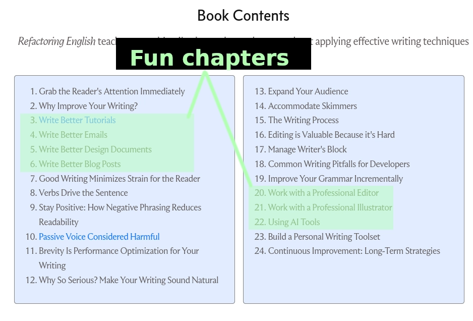
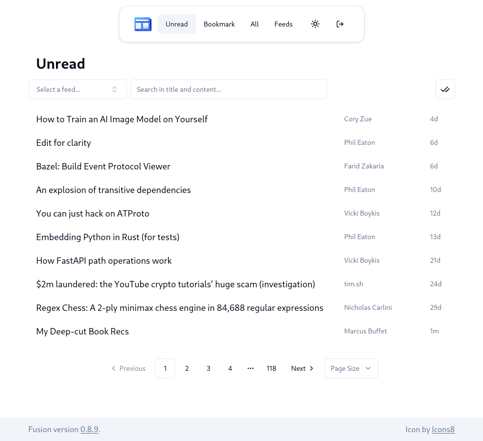
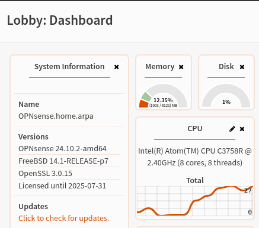
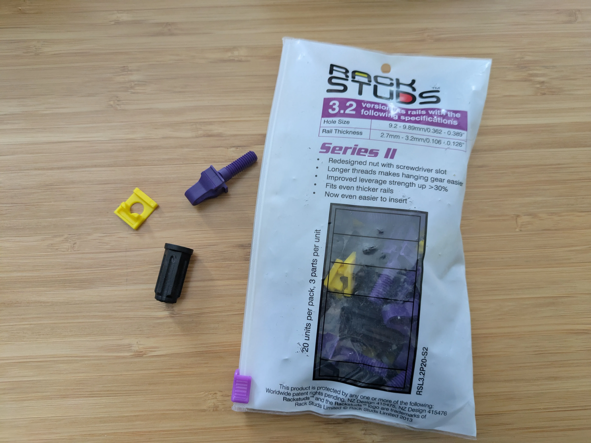

## Highlights

- I'm having doubts about sitting out the AI revolution.
- I should prove to myself that customers are willing to buy my book before investing more time into it.
- I'm probably the last person on the planet to discover that RSS is a great way to read blogs.

## Goal grades

At the start of each month, I declare what I'd like to accomplish. Here's how I did against those goals:

### Publish my 2024 [annual review](/tags/annual-review/) blog post

- **Result**: I published [My Seventh Year as a Bootstrapped Founder](/solo-developer-year-7/)
- **Grade**: A

I was happy with how this came out. I had a hard time figuring out what to include because the year felt fragmented from different major events that I'd already written about. I felt like the result was a good summary of the year.

It [briefly reached the #1 spot](https://hnrankings.info/42932492/) on Hacker News, but they suddenly kicked it down to #63, and I'm not sure why.

### Finish another chapter of my book

- **Result**: Published ["Passive Voice Considered Harmful"](https://refactoringenglish.com/chapters/passive-voice-considered-harmful/) and an accompanying [interactive exercise](https://refactoringenglish.com/exercises/recognize-passive-voice/).
- **Grade**: A

I got a bit more done on this than I expected, as I didn't plan to include the quiz. I don't think the quiz is amazing, but it's a fun way to combine text content with something more interactive.

### Revise my tutorials chapter based on reader feedback

- **Result**: Added a new section, ["Use unambiguous example values."](https://refactoringenglish.com/chapters/rules-for-software-tutorials/#use-unambiguous-example-values)
- **Grade**: A

I made some line-level fixes based on reader suggestions, but the biggest revision was adding a new section. A few people had wished for guidance on using useful dummy data in examples, and I agreed that it belonged in the article.

## Is it stupid to write a book during an AI revolution?

It's clear to me that AI is causing a revolution in software development.

AI models now [operate at the level of a competent junior engineer](/notes/cline-is-mesmerizing/). At the pace they're improving, AI will outperform even the best humans at most programming tasks within two years.

I expect a lot of the software industry to restructure around AI. The closest parallel in my lifetime is the shift from desktop software to the Internet.

I have no job and no company to run, so I have complete freedom to work on anything I want to take advantage of recent AI developments.

And I'm writing a book that has nothing to do with AI...

I don't want to just chase the newest, shiny thing, but I also feel like sitting out the AI revolution is like seeing the Internet happen in the late 90s and saying, "I think I want to publish software on a CD that customers order by mail."

The reasons I chose to focus on the book are still valid, but there's a bigger opportunity cost than I expected when I was planning this six months ago.

## Is there even a market for this book?

The other issue is that writing my book is a long commitment, and I don't yet have confidence that people want to read it.

The [first chapter I released](https://refactoringenglish.com/chapters/rules-for-software-tutorials/) got a positive reception, but that's one of the fun, broad-appeal chapters. I fear that chapters like "Passive voice considered harmful," are more of an "eat your vegetables" lesson. People might recognize it as beneficial, but it's not fun to read. And my usual haunts like Hacker News or reddit wouldn't showcase a post about the passive voice.

The problem is that most of the chapters in my book are "eat your vegetables" chapters.

{{}}

I could restructure it so that I talk about a tip like "read your post aloud" as part of the blogging chapter, but it wouldn't quite make sense because that applies to all kinds of writing, not just blog posts.

But maybe I'm approaching it wrong. I don't think people browsing the web want to read an article about the passive voice, but if they decided to read a book about effective writing, they'd probably read the passive voice chapter.

I'd assumed that the samples I publish for free online would be word-for-word chapters from the book, but I don't need to do that. I can adapt the content for the web however I want, so if I talk about reading your writing aloud as part of a sample chapter on blogging, that's okay. In the actual book, I can structure it so that the reading aloud tip isn't part of the blogging chapter.

Still, I need to validate that there are customers for this book before I spend another few months on it. So, my plan is to focus on another fun, accessible chapter like, "Write blog posts that developers read," and then start a Kickstarter for people to pre-order based on the initial three chapters. I'll need to set some goal for what I think is a reasonable minimum of pre-orders to justify continuing to write.

## Late to the game: RSS is great

RSS has been around for 25 years, but I never got into reading articles via RSS.

I tried Google Reader back in 2011, but I didn't have a critical mass of interesting articles in my feed, so I just stopped checking and forgot about it.

In the past few years, several things have increased my interest in RSS:

- The tech people I used to follow on Twitter have all fragmented to different spaces.
- I've become more aware of social media amplifying attention-grabbing posts over interesting technical posts.
- I switched to NixOS as my OS, which makes it easy to self-host [a free, open-source RSS reader](https://github.com/0x2E/fusion).
- I realized I don't like subscribing to blogs via email, as it clutters my inbox and makes me feel like I have to read when I'm not in a good reading mode.
- As AI slop takes over the web, I want to follow particular people that I like.

So, I installed [the fusion RSS reader](https://github.com/0x2E/fusion), and I've found it to be one of my favorite ways to read new blog posts. Whenever I find a blog post on social media that I like, I skim their other posts. If they write about things I find interesting, I just add them to my feeds.

{{}}

## Side projects

### wordword: Find lexical illusions in your blog posts

I recently read a blog post by Matt Might where he explains [the idea of "lexical illusions."](https://matt.might.net/articles/shell-scripts-for-passive-voice-weasel-words-duplicates/) It's when you fail to recognize a duplicate word in text, for example:

> Many readers are not aware that the<br>
> the brain will automatically ignore<br>
> a second instance of the word "the"<br>
> when it starts a new line.

I make this mistake when writing my blog, so I wanted a tool that could catch this mistake for me automatically.

I wrote the tool leaning heavily on [Cline](https://cline.bot/), an AI assistant. I [found it impressive and scary](/notes/cline-is-mesmerizing/) how good Cline was at implementing the tool based on my prompts and test cases.

And the tool works well. I used it to find [seven lexical illusions](https://github.com/mtlynch/mtlynch.io/pull/1414) in already-published articles.

```text
# Find lexical illusions (and also some false positives like "Duck Duck Go").
$ wordword ./content/
./content/retrospectives/2019/11/index.md:114: the
./content/retrospectives/2022/05/index.md:175: Duck
./content/retrospectives/2022/05/index.md:175: Duck
./content/retrospectives/2022/05/index.md:175: Duck
./content/retrospectives/2022/05/index.md:175: Duck
./content/retrospectives/2022/05/index.md:177: Duck
./content/notes/nix-git-bash-shell/index.md:78: time
./content/notes/cypress-vs-playwright/index.md:278: makes
./content/posts/simple-vue-pre-rendered/index.md:36: for
./content/posts/solo-developer-year-6/index.md:132: case
./content/posts/ansible-role-clipbucket/index.md:83: a
./content/posts/solo-developer-year-1/index.md:177: NOW
./content/posts/solo-developer-year-1/index.md:177: NOW
./content/book-reports/chaos-monkeys/index.md:8: names
./content/book-reports/go-programming-blueprints/index.md:50: of
212 total files checked
15 total errors found
```

I've added `wordword` to my blog's [CI build](https://github.com/mtlynch/mtlynch.io/pull/1414/files#diff-78a8a19706dbd2a4425dd72bdab0502ed7a2cef16365ab7030a5a0588927bf47) and to my [git pre-commit hook](https://github.com/mtlynch/mtlynch.io/pull/1414/files#diff-c901cafe102063c4ca0cb0d0c42723a4fbe06baefab7c7c4feb8484f54b3ccc5).

And because I wrote it in Zig, it's super fast. It checks 212 Markdown files in my blog in just 28.7 milliseconds:

```bash
$ hyperfine 'wordword ./'
Benchmark 1: wordword ./
  Time (mean ± σ):      28.7 ms ±   1.3 ms    [User: 11.7 ms, System: 16.5 ms]
  Range (min … max):    26.8 ms …  31.7 ms    90 runs
```

## Other small things

### I joined Codeberg as a member

I've been looking for a less corporate, more open-source git hosting service.

I'd been using Gitlab. But they made [the bizarre decision](https://gitlab.com/gitlab-org/gitlab/-/issues/419602#note_2030565051) to forcefully log out every user every two weeks.

Every time I use Gitlab, I'm signed out. And then to sign in, Gitlab forces me out of flow to check my email for a one-time code rather than allowing my password manager to auto-fill my credentials.

I tried [Codeberg](https://codeberg.org/), and I liked it. It's simpler than Gitlab, which works for me because Gitlab always felt overly complex for my needs. And it's [fully open-source](https://codeberg.org/forgejo/forgejo) and implemented in Go and HTML templates, which is my favorite web stack.

I saw that one of the ways you can pay for Codeberg is by joining as a voting member of the company, so I did that. I haven't used my membership to do anything yet, but it's fun to feel like I'm part of a cooperative rather than just a user.

The biggest downside of Codeberg is that there don't seem to be any managed continuous integration vendors that support it:

- [WoodpeckerCI](https://woodpecker-ci.org/): No vendor offers paid managed hosting.
- [Forgejo Actions](https://docs.codeberg.org/ci/actions/): Experimental project with no paid support.
- CircleCI: No support for Forgejo/Gitea.
- Garnix: No support for Forgejo/Gitea.
- Buildkite: No support for Forgejo/Gitea.
- Drone: They support Forgejo/Gitea, but it seems like they only offer managed hosting for Enterprise.
- Harness: This is a new Drone thing, it seems, but I can't figure out if they support Forgejo/Gitea.

Codeberg officially recommends self-hosting Woodpecker CI, which sounded fun and impractical, so I spent a day setting that up on [my free Oracle cloud VM](/notes/nix-oracle-cloud/). Now, [I self-host CI for wordword](https://ci.mtlynch.io/repos/1) and a few of my other projects. But I don't trust myself to secure it as well as paid vendors, so I'm not willing to store secrets there. That severely limits how much I can use it as a real CI/CD solution.

### Got a 10 Gbps router

For the first time ever, my ISP is offering 2 Gbps symmetrical speeds, so I wanted to take advantage of the full capacity.

My router was a Qotom Q355G4, which has served me well, except it's not rack-mountable, and it only has 1 Gbps ports.

I wanted to buy a router from a trusted hardware vendor like OPNsense or Protectli, but OPNsense's cheapest 10 Gbps rack-mounted router is [$1,200](https://shop.opnsense.com/product/dec2752-opnsense-rack-security-appliance/), and Protectli doesn't have any rack mountable options.

I ended up buying the [Qotom C3758R 1U 10 Gbps router](https://www.servethehome.com/everything-homelab-node-goes-1u-rackmount-qotom-intel-review/) ($417 after shipping and taxes) and installed OPNsense business on it.

{{}}

I always worry that I'm not getting enough RAM or disk space on my router, but OPNsense barely needs anything. I went with 8 GB of RAM and 128 GB of disk. I just checked system load while running a speed test, and RAM never went above 13% and CPU peaked at about 30%, so the hardware is more than sufficient for my needs. Note that I don't have a ton of firewall rules, and I don't use OPNsense's IDS/IPS features.

{{}}

### Officially converted to rack studs

After I published my article about building my first home server rack, several readers recommended I try [Rackstuds](https://www.rackstuds.com/) instead of cage nuts.

{{}}

I was skeptical because Rackstuds are plastic, so they seem more liable to break than metal cage nuts. But Rackstuds has lab tests showing they can [support equipment of up to 40 lbs](https://www.rackstuds.com/certification).

Rackstuds are definitely easier to work with than cage nuts. Cage nuts made it [difficult to mount equipment](/building-first-homelab-rack/#test-the-ups-before-mounting-it), especially heavy stuff. You need one hand to hold up the component and keep it level, and you need to use your other hand to screw nuts in to secure the equipment in place.

Rackstuds solve this problem because you install the studs first, and then just hang the component onto the studs.

One thing that confused me was that Rackstuds come in two variants: red and purple. They're different in a confusing way. The product page for the purple studs says:

> Suitable for rails between 2.7mm/0.106 and 3.2mm/0.125". If ≤ 2.2mm/0.086", use the new red version instead

Huh?

I think of "rails" in a server rack as the things attach to the server to slide it in, and they're way bigger than 3mm in every dimension.

{{}}

I finally figured out that when Rackstuds talks about rail thickness, they mean the piece of metal on the front of the rack:

{{}}

On my StarTech rack, purple Rackstuds seemed to fit more comfortably.

Another gotcha: if you buy the Rackstuds Duo, they only work on components that are exactly 1U, whereas the loose Rackstuds work for rack mounting anything. I bought the sample pack of eight first, and then I bought myself a bag of 20 for future rack components.

## Wrap up

### What got done?

- I published the ["Passive Voice Considered Harmful"](https://refactoringenglish.com/chapters/passive-voice-considered-harmful/) chapter of _Refactoring English_ and an accompanying [interactive exercise](https://refactoringenglish.com/exercises/recognize-passive-voice/).
- I published [My Seventh Year as a Bootstrapped Founder](/solo-developer-year-7/).
- I published five short note posts:
  - [The Cline AI Assistant is Mesmerizing](/notes/cline-is-mesmerizing/)
  - [Increase Your Reply Rate on Cold Emails to Me](/notes/emailing-me/)
  - [Install NixOS on a Free Oracle Cloud VM](/notes/nix-oracle-cloud/)
  - [How to Resolve Local Hostnames in OPNSense](/notes/opnsense-local-dns/)
  - [Overcoming Gotchas in Samsung Secure Erase](/notes/samsung-secure-erase/)
- I created [a new blog error-checking tool in Zig](https://codeberg.org/mtlynch/wordword).

### Lessons learned

- I need to reassess whether my book idea is the right strategy given the time it will take and alternative projects that make better use of changes in AI.
- I can adapt content from my book to fit the web better and attract readers. I don't need my excerpts to 100% match what appears in the full book.

### Goals for next month

- Complete the blogging chapter of _Refactoring English_.
- Begin selling pre-orders for _Refactoring English_.

### Requests for help

- If you have suggestions for a Kickstarter alternative that's more focused on publishing ebooks, [let me know](/about).
  - I know about [LeanPub](https://leanpub.com/), but I'm looking for Kickstarter's "reach this minimum, or it doesn't happen" mechanics.
- Please [reach out](/about) or leave a comment below if you have opinions on tools for writing a book in a markup language that supports rendering to both PDF and HTML.
  - The options I'm considering are:
    - [AsciiDoc](https://asciidoc.org/)
    - [mdBook](https://rust-lang.github.io/mdBook/)
    - [Pollen](https://docs.racket-lang.org/pollen/index.html) - I like the idea, but I'd have to learn Pollen, which means learning Racket, which means learning Lisp, so it's a lot.
