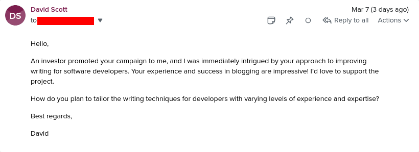
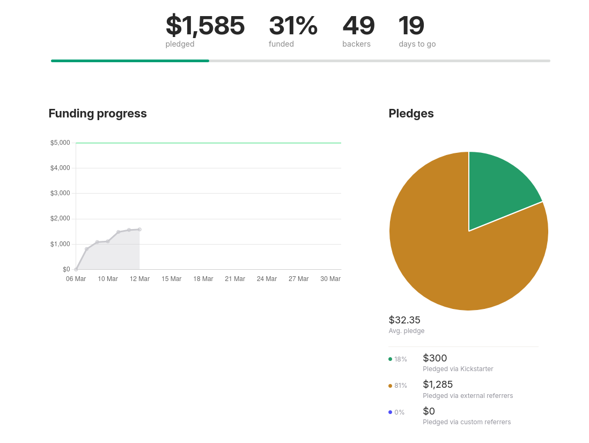
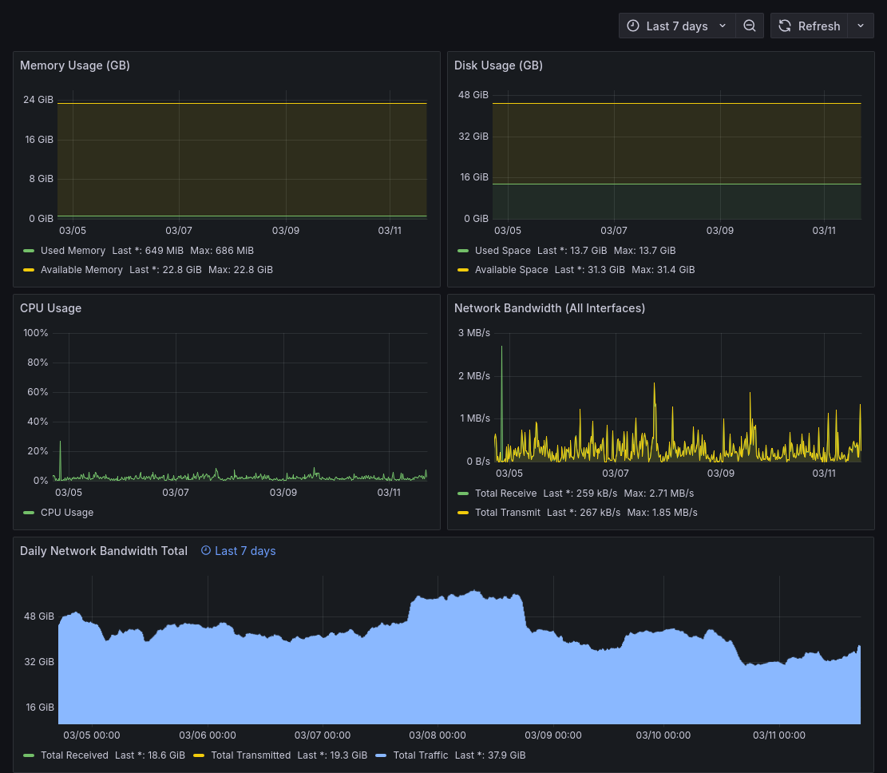

## Highlights

- I launched [my first Kickstarter project](https://www.kickstarter.com/projects/mtlynch/refactoring-english/) and found Kickstarter surprisingly painless.
- I'm kind of on track to reach my Kickstarter goal, but I'll need to get creative in raising the last 2/3rds.
- I'm soliciting suggestions for fun services to run on my 4x ARM CPU / 24 GB cloud server.

## Goal grades

At the start of each month, I declare what I'd like to accomplish. Here's how I did against those goals:

### Complete the blogging chapter of _Refactoring English_

- **Result**: I decided to focus on the [commit message chapter](https://refactoringenglish.com/chapters/commit-messages/) instead and finished it on time.
- **Grade**: A

Midway through writing the blogging chapter, I realized I could write about commit messages, and that would be a good chapter to share on dev-oriented social networks like Hacker News, /r/programming, and Lobsters.

Unfortunately, the article was a huge miss on Hacker News and didn't get much traction on /r/programming or Lobsters, which was disappointing but I knew was a possibility.

### - Begin selling pre-orders for _Refactoring English_

- **Result**: Started selling pre-orders on Kickstarter
- **Grade**: A

## Kickstarter: I'm pleasantly surprised

I decided to do [the pre-order for _Refactoring English_ on Kickstarter](https://www.kickstarter.com/projects/mtlynch/refactoring-english/). I'd never used Kickstarter before, and I was bracing myself for it to be a miserable experience.

My typical experience with "creator platforms" is that they try to make their money by squeezing me for upsells rather than helping my project.

I'm pleased to report that launching my first project on Kickstarter was surprisingly painless. They never asked me to pay for anything at all. They do a good job of aligning incentives so that they make their money helping projects raise money rather than milking their project creators via upsells.

All in all, it took me six to eight hours of work on Kickstarter to fill out all the paperwork, verify my banking information, and create the public-facing text, video, and images.

I like the Kickstarter model for this project. If I were to do regular pre-orders, I'd be in an awkward position if I found myself three months in with not enough customers. I'd have to refund everyone even though I did three months of work. I appreciate that Kickstarter explicitly tells backers that they're paying for the ride. The creator should make their best effort to deliver, but the backers accept the possibility that things might not work out.

I also like that I can set a goal and make the project all or nothing. I set the goal to $5k because I felt like it's ambitious but doable, and it's high enough to give me hope that I could still make another $10-20k after I publish the book. If I fall short of the goal and get nothing, I'll be disappointed but take solace in the fact that I'm getting a concrete "no" on this idea.

### Except for Kickstarter spammers...

The one downside of Kickstarter is spam. A ton of spammers must watch Kickstarter because I get about three new emails per day offering some scammy way to help my campaign succeed. They start the conversation by posing (poorly) as an interested customer, and then they steer the conversation towards their friend I should pay to help me.

{{}}
{{}}

## Fundraising: How it's going so far

As of today, there have been $1,585 in pledges to my Kickstarter project, so I'm at 31% of my goal.

{{}}

I launched the project on Friday, and it ends at the end of the month, so I'm on day 6 of 25 of the fundraising period (24% complete).

It sounds good to be at 31% of my goal in only 24% of the timeline, but the problem is that I've played my best cards already. I announced the Kickstarter to the book's mailing list, on social media, and on the little self-ads at the bottom of this blog.

So, what else can I do?

I can think of two remaining cards to play.

The first is to get on the front page of Hacker News. That's usually difficult to do, but I'm [supposed to be the expert](https://hitthefrontpage.com). I feel confident that I can do it at least once, hopefully two or three times by the end of the month. I have a few post ideas that are basically like "bunts." They won't be homerun posts that reach the #1 spot, but I can probably write them in 5ish hours and land somewhere in the #10-20 range of Hacker News.

My second idea is to reach out to companies that invest heavily in public writing to see if they'd be interested in sponsoring the project. I've never seen a book with corporate sponsors, so maybe this is a bad idea, but it seems like it could work.

## Side project: What should I run on my hobby cloud server?

I recently got a free [4x ARM CPU / 24 GB RAM Oracle Cloud server](/notes/nix-oracle-cloud/). The problem is that this rather competent server is about 99% idle:

{{}}

So far, I've installed:

- [Woodpecker CI](https://woodpecker-ci.org/), which is helpful for projects I host on Codeberg, as [no commercial CIs support Codeberg yet](/retrospectives/2025/02/#i-joined-codeberg-as-a-member)
- [Snowflake proxy](https://snowflake.torproject.org/) to help people defeat censorship

I'm looking for suggestions for fun things I could run on the server. My criteria are:

- I'd like it to be a service that's fun to operate when I have time but not an obligation that demands my time.
  - I don't want to spend time moderating something like a forum or chat room.
- It could be a volunteer computing thing that supports a cause I like.
  - I wanted to run [ArchiveTeam Warrior](http://warrior.archiveteam.org/) to archive websites to the Internet Archive, but they [don't support ARM](https://wiki.archiveteam.org/index.php/ArchiveTeam_Warrior#Can_I_run_the_Warrior_on_ARM_or_some_other_unusual_architecture?).
  - For a volunteer computing opportunity, I'd like it to be fun for the operator, the way it was fun to just watch SETI@home run if you donated compute time to the project.
- I'd like it to be open-source.
- Oracle can blow away my server, and it shouldn't impact anyone.
  - i.e., I don't want anyone to lose data that they're storing on my server.
- I don't want to mine cryptocurrency.

[endlessh-go](https://github.com/shizunge/endlessh-go) is a good example of what I'm looking for, and I'm planning to add that.

If you have suggestions for fun projects that my server should run, let me know in the comments or shoot me an email.

## Interesting links

- ["Writing commit messages"](https://www.chiark.greenend.org.uk/~sgtatham/quasiblog/commit-messages/) by Simon Tatham
  - Before writing [my article](https://refactoringenglish.com/chapters/commit-messages/), I read a lot of blog posts about commit message practices, and I thought this was the best one.
    - Actually, it's more accurate to say that all the others were bad, and Tatham's was the only one that was good.
    - Every other article focuses on style considerations that don't matter (e.g., "the title _must_ be imperative voice") or makes edicts without explaining the reasoning.
  - Based on the URL and site's design, I thought the author was a university student and was surprised he had so much wisdom about commit messages. I dug deeper and realized [the author](https://www.chiark.greenend.org.uk/~sgtatham/) is the creator of the PuTTY SSH client and [just likes hosting everything on his friend's server](https://www.chiark.greenend.org.uk/~sgtatham/putty/faq.html#faq-domain).
- ["Programming without Pointers"](https://www.hytradboi.com/2025/05c72e39-c07e-41bc-ac40-85e8308f2917-programming-without-pointers) by Andrew Kelley
  - Andrew Kelley, founder of Zig, says he escaped his programming skill plateau by creating a style he calls "programming without pointers."
  - Kelley's style is to represent his app's state using a single struct that contains various data types the app needs, but none of the types can contain pointers. The top-level struct can contain arrays or hashmaps, but the objects they store can't have pointers.
    - His groovebasin project [is an example of this](https://codeberg.org/andrewrk/groovebasin/src/commit/9022521c445c2ba398f2f646aa24241ecd1a715a/shared/Db.zig#L8-L49).
  - He gives the example of storing strings. You can't store an array of strings because that would be a pointer to a pointer. Instead, he creates a custom structure that aggregates all strings into a single array, and then he maintains a list of indexes into that array.
  - Advantage of this technique:
    - It's trivial to serialize and deserialize state. Serializing is just dumping the struct's bytes into a file or network socket. Deserializing is just reading an entire file and mapping it back into the original struct.
    - It's easy to share state across environments (e.g., a Zig backend and a WASM frontend).
    - Memory management also becomes simpler because you can free memory for each field of the top-level struct. You never have to iterate through lists or walk a tree structure to free memory for child objects.
  - I find the technique surprising because it feels like the indexes are essentially pointers without compiler support. If I heard this proposal from a random person, I'd dismiss it, but because I think Andrew Kelley is smart, I want to try this out.
- ["Reviving an Old Kindle Paperwhite 7th Gen"](https://terminalbytes.com/reviving-kindle-paperwhite-7th-gen/) by Hemant Kumar
  - I desperately want to buy an old e-reader on eBay for $30 and make my own dashboard, but I don't have any ideas for what to display on it.
- ["If You Ever Stacked Cups In Gym Class, Blame My Dad"](https://defector.com/if-you-ever-stacked-cups-in-gym-class-blame-my-dad) by Kit Fox
  - I woke up at 2 AM one night and couldn't fall back to sleep, and I spent about two hours reading this article and watching cup stacking videos.

## Wrap up

### What got done?

- Launched pre-orders for _Refactoring English_ [on Kickstarter](https://www.kickstarter.com/projects/mtlynch/refactoring-english)
- Published ["How to Write Useful Commit Messages"](https://refactoringenglish.com/chapters/commit-messages/)
- Published [My Zig Configuration for VS Code](/notes/zig-vscode-nix/) and created a [Zig dev flake](https://codeberg.org/mtlynch/zig-vscode-flake)
- Published [my notes for _Never Pay The First Bill_](/book-reports/never-pay-the-first-bill/)

### Lessons learned

- Fundraising on Kickstarter is surprisingly painless.

### Goals for next month

- Reach my $5k Kickstarter goal for _Refactoring English_.
- Publish the blogging chapter of _Refactoring English_.
- Reach the front page of Hacker News twice by the end of March.

### Requests for help

- If you have suggestions for my Kickstarter project, and you're not a spambot, shoot me an email.
