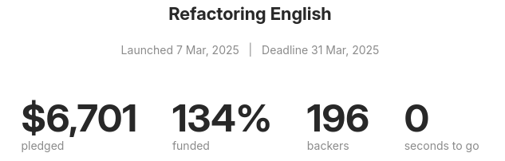
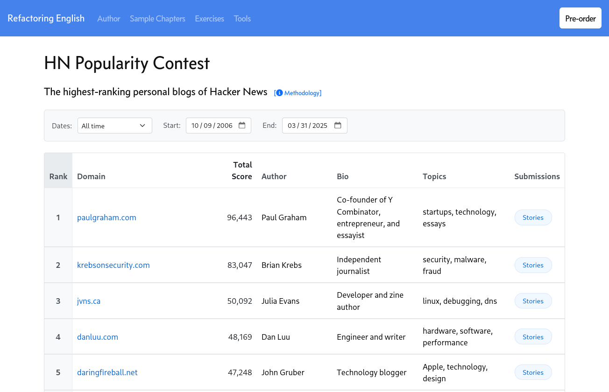
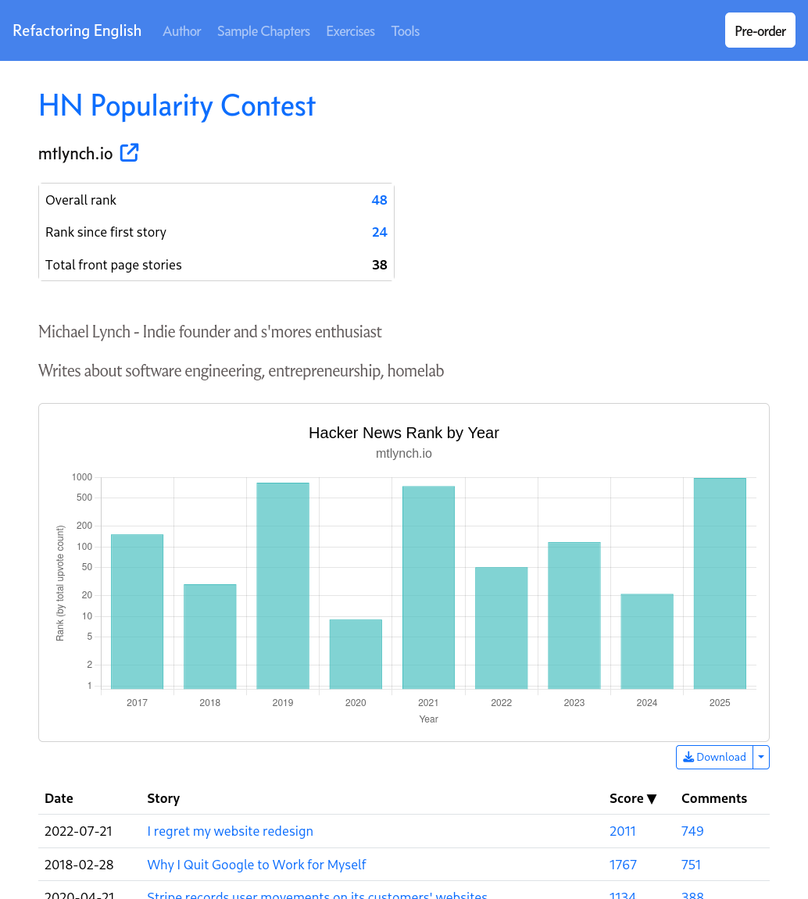
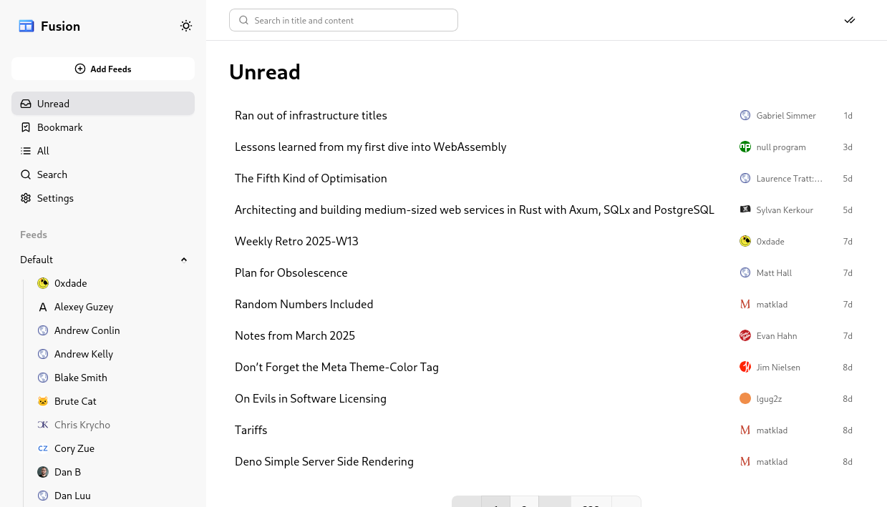

## Highlights

- My book's pre-sale succeeded (just barely).
- I wrote a bunch of blog posts, and I was bad at predicting their performance.
- Now, I need to pick a markup language for writing my book.

## Goal grades

At the start of each month, I declare what I'd like to accomplish. Here's how I did against those goals:

### Reach my $5k Kickstarter goal for _Refactoring English_.

- **Result**: The Kickstarter reached $6,701 from 196 backers.
- **Grade**: A+

The Kickstarter did better than I expected, making a last-minute comeback.

### Publish the blogging chapter of _Refactoring English_.

- **Result**: Published ["How to Write Blog Posts that Developers Read"](https://refactoringenglish.com/chapters/write-blog-posts-developers-read/)
- **Grade**: A

This did well [on Hacker News](https://news.ycombinator.com/item?id=43503872) and [Lobsters](https://lobste.rs/s/youq7y/how_write_blog_posts_developers_read) but not [reddit](https://www.reddit.com/r/programming/comments/1jl3wgw/how_to_write_blog_posts_that_developers_read/).

### Reach the front page of Hacker News twice by the end of March.

- **Result**: ["How to Write Blog Posts that Developers Read"](https://news.ycombinator.com/item?id=43503872) and [HN Popularity Contest](https://refactoringenglish.com/tools/hn-popularity/) both reached the front page.
- **Grade**: A

I feel good about this goal now that I managed to pull it off, but I was worried for most of the month about how dumb I'd look if all five of my post ideas failed. Thankfully, two out of the five made it.

## My book's pre-sale succeeded

For most of the month, my book seemed doomed. The pre-sale was on track to fall short of the $5k goal by $1.5k.

Four days before the pre-sale closed, one of my blog posts got attention on Hacker News and completely turned sales around.

In the end, the Kickstarter raised $6,551, exceeding its $5k goal. It's now at $6,701, including late pre-orders.

{{}}

I wrote a longer account of the pre-sale last week:

- [My Book's Pre-Sale Just Barely Succeeded](/book-pre-sale-just-barely-succeeded/)

I plan to write a dedicated post about Kickstarter, but I had a great experience with it. It turned out to be a good way to measure interest in my book. And the $6.5k in pre-orders is higher than a traditional publisher would pay me as an advance.

## Can I make the Julia Evans business model work for me?

The thing that's exciting about _Refactoring English_'s pre-sale is that it's a glimmer of hope that I could earn a living by blogging.

When I was running TinyPilot, blogging definitely helped me find my first few dozen customers. Eventually, it felt like my personal blog wasn't helping sales at all. And that makes sense because people who are interested in an indie founder's diaries are not necessarily interested in buying a $400 KVM over IP device.

With the complexity of a hardware business, I was almost always limited in hours, so it was hard to dedicate most of my day's "deep thinking" hours to my personal blog. Ever since, I've been trying to figure out what business I could run where blogging aligns well with profitability for my business.

My hypothesis is that I can make blogging sustainable by creating educational products. If I write about something I'm doing, and I have a book or course that goes into more depth, readers can learn more and fund my work.

The best example of a blogger who earns money with related content is [Julia Evans](https://jvns.ca). She maintains a software blog and monetizes her work by selling [illustrated zines](https://wizardzines.com/).

Julia doesn't disclose her revenue publicly anymore, but she was making [~$100k/yr from zines as of 2019](https://jvns.ca/blog/2019/10/01/zine-revenue-2019/). That $100k/yr was before [she started working on her blog full-time](https://jvns.ca/blog/2019/09/13/a-year-explaining-computer-things/). Granted, it was revenue, not profit, but I'd expect the margins were around 90-95% since the zines were digital, so she just had to pay fees to payment processors and content platforms like Gumroad.

So, $100k in revenue when it was still a side project is quite good. Let's imagine that Julia tripled her sales by working on her business full-time instead of after hours. If I can be half as successful as she was, then that's $150k/yr from blogging and selling related products. It sounds challenging but achievable.

## Blogging like my livelihood depends on it

March was an interesting blogging challenge because I was trying to find customers for my book by writing successful blog posts. That's unusual for me, as I'm usually not writing to a deadline or choosing topics for maximum readers.

I have a long list of topic ideas and half-written posts, so I evaluated them on these dimensions:

- **Ease**: How easy would it be to write a post that feels complete?
- **Potential audience**: If this post succeeds, how large is the potential audience that would enjoy it?
- **Probability of success**: How likely is this post to reach its intended audience?
- **Overlap with book**: If a reader discovers this post, how likely are they to be interested in my book?

I didn't sit down and formally score my ideas, but the rough mental calculation looked like this:

| Title                                                                                                                     | Ease | Potential audience | Probability of Success | Overlap with book |
| ------------------------------------------------------------------------------------------------------------------------- | ---- | ------------------ | ---------------------- | ----------------- |
| [No Longer My Favorite Git Commit](https://mtlynch.io/no-longer-my-favorite-git-commit/)                                  | 4    | 5                  | 4                      | 4                 |
| [How to Write Useful Commit Messages](https://refactoringenglish.com/chapters/commit-messages/)                           | 2    | 5                  | 3                      | 4                 |
| [How to Write Blog Posts that Developers Read](https://refactoringenglish.com/chapters/write-blog-posts-developers-read/) | 2    | 4                  | 2                      | 5                 |
| How to Maintain an Open-Source Project and Remain Happy                                                                   | 3    | 3                  | 4                      | 2                 |
| Fine Tuning Your Writing: Using Strong Verbs                                                                              | 5    | 1                  | 1                      | 5                 |
| Three Months Using NixOS after 35 Years on Windows                                                                        | 3    | 2                  | 5                      | 1                 |
| Use Zig to Build C Applications                                                                                           | 3    | 3                  | 4                      | 1                 |

I ended up picking the top three from that list, but they didn't perform as expected. Here were the results:

| Title                                                                                                                     | Impact on Sales | Total Readers | Hacker News | reddit |
| ------------------------------------------------------------------------------------------------------------------------- | --------------- | ------------- | ----------- | ------ |
| [How to Write Blog Posts that Developers Read](https://refactoringenglish.com/chapters/write-blog-posts-developers-read/) | High            | 22.3k         | 9.7k        | 325    |
| [How to Write Useful Commit Messages](https://refactoringenglish.com/chapters/commit-messages/)                           | Medium          | 2.6k          | 126         | 1.2k   |
| [No Longer My Favorite Git Commit](https://mtlynch.io/no-longer-my-favorite-git-commit/)                                  | Low             | 31.6k         | 87          | 6.4k   |

"No Longer My Favorite Git Commit" felt like my strongest idea because I knew I could write it quickly, and I thought there was a large potential audience since the original was so popular. It did well [on Lobsters](https://lobste.rs/s/1hexlm/no_longer_my_favorite_git_commit), [okay on reddit](https://www.reddit.com/r/programming/comments/1jexuzb/no_longer_my_favorite_git_commit/), and flopped on Hacker News. I didn't realize until I sat down to write this post that [Google Discover](https://blog.google/products/search/introducing-google-discover/) (a thing I didn't even realize existed) featured my post, which brought in 15k readers.

That post was a bit unusual for me because I've never written a rebuttal to a blog post before. When I started the post, I was excited because I had strong opinions about [the original](https://dhwthompson.com/2019/my-favourite-git-commit). When I finished the first draft, I started having second thoughts. It felt like I was needlessly attacking another blogger for something they wrote six years ago. I adjusted the language to make it feel less like an attack, but it still felt antagonistic.

"How to Write Useful Commit Messages" was the post that was supposed to kick off the pre-sale. It did well [on Lobsters](https://lobste.rs/s/1hexlm/no_longer_my_favorite_git_commit) and [okay on reddit](https://www.reddit.com/r/programming/comments/1j5nvm5/how_to_write_useful_commit_messages/) but flopped on Hacker News. It's hard to tell how much of an impact it had on sales because I can't distinguish between readers who pre-ordered because of the post and those who pre-ordered because I announced the pre-sale to the book's mailing list on the same day.

"How to Write Blog Posts that Developers Read" was the surprise hit that saved the book. It did [okay on Lobsters](https://lobste.rs/s/youq7y/how_write_blog_posts_developers_read) and [bombed on reddit](https://www.reddit.com/r/programming/comments/1jl3wgw/how_to_write_blog_posts_that_developers_read/). My first submission to Hacker News flopped, but then someone else resubmitted it the next morning, and it got [an amazing reception](https://news.ycombinator.com/item?id=43503872), ending at [#4 for the day](https://news.ycombinator.com/front?day=2025-03-28). Best of all, many of the people who found the post through Hacker News became customers through the pre-sale.

## Hacker News Popularity Contest

"Engineering as marketing" is a marketing technique that's popular with engineers who are bad at marketing (e.g., me).

The idea is that you create a free tool that's related to your paid product, and then hope that people are impressed enough with your free thing that they check out your paid thing.

I've had an idea to build a Hacker News blog ranking system for a long time because I always wondered how I compared to other popular Hacker News authors. I created a basic prototype last summer because I was planning to use it for the reboot of my [_Hit the Front Page of Hacker News_ course](https://hitthefrontpage.com).

When I shelved my course and focused on _Refactoring English_, I didn't know what to do with the blog ranking tool. When March rolled around, and I was desperate to make the pre-sale succeed, I realized I could invest a day or two of work into getting my prototype ready to publish.

{{}}

The tool successfully [reached the front page of Hacker News](https://news.ycombinator.com/item?id=43503872), but it didn't have any impact on book sales.

One of the unexpected reactions was how many people in the top 100 cared about their rank. I assumed that if you were one of the most popular personal bloggers on Hacker News, you're famous enough that Hacker News isn't a big deal to you, but a lot of people in the top 100 commented on it either publicly or privately to me in DMs/emails.

A lot of the top bloggers seemed especially interested in how their rank changed over time, most notably John Gruber, who felt my tool supported his theory that Hacker News [had applied manual penalties to his site](https://daringfireball.net/2025/03/the_website_hacker_news_is_afraid_to_discuss) in recent years.

Based on that reaction, I added functionality to view more detailed stats for [individual blogs](https://refactoringenglish.com/tools/hn-popularity/domain/?d=mtlynch.io), but I haven't seen much reaction to that feature yet.

{{}}

## Picking a markup language for the book

So far, I've been writing my book using Markdown with Hugo. I haven't started on the official PDF version yet, so I've been punting on the decision to pick a book publishing technology.

Now that the book is officially happening, I need to pick a method for writing it. The features I'm interested in are:

- Can the tool natively output PDF?
- Can the tool natively output epub?
- Can the tool natively output HTML?
- How mature is the tool? How likely am I to hit new bugs or dead ends trying to achieve simple things?
- Which DRM-free technical traditional publishers support this format?
  - I'm going to self-publish the first edition, but it would be nice to have the option to work with a traditional publisher on a print version for a second edition.

The options seem to be:

| Tool                                                     | PDF | epub | HTML | Maturity  | Publisher Support                        |
| -------------------------------------------------------- | --- | ---- | ---- | --------- | ---------------------------------------- |
| [Asciidoctor](https://asciidoctor.org/)                  | ✅  | ✅   | ✅   | High      | None                                     |
| [LaTeX](https://www.latex-project.org/)                  | ✅  | ❌   | ❌   | Very high | [No Starch Press](https://nostarch.com/) |
| [Pollen](https://docs.racket-lang.org/pollen/index.html) | ❌  | ❌   | ✅   | Low       | None                                     |
| [Typst](https://typst.app/)                              | ✅  | ❌   | ❌   | Low       | None                                     |
| [mdBook](https://rust-lang.github.io/mdBook/)            | ❌  | ❌   | ✅   | Low       | None                                     |

It looks like the winner is either Asciidoctor or LaTeX.

There are third-party tools to convert from AsciiDoc to LaTeX. It's probably not fun, but if _No Starch_ tells me they want to publish a second edition of my book, I can probably suck it up and do a one-time conversion.

I spent a few hours with Typst. I like that it's open-source, and it's simpler than LaTeX, but it's not enough of an improvement to justify using a newer, less mature tool. Also, it seems optimized for writing research papers and not as much for writing books.

## Side projects

### Getting more of the fusion RSS reader under test

Since switching to NixOS a few months ago, I've enjoyed hosting [more services on my personal machine](/retrospectives/2025/02/#late-to-the-game-rss-is-great). My favorite is [fusion](https://github.com/0x2E/fusion), a minimal RSS reader built with Go, Svelte, and SQLite.

{{}}

My favorite thing about fusion is that its maintainer has been friendly and receptive to code contributions, so I've been working on [small improvements](https://github.com/0x2E/fusion/pulls?q=is%3Apr+author%3Amtlynch) to the code in my spare time.

The contribution I'm most proud of is refactoring the `pull` package and getting more of it under test:

- The `pull` package [before (v.0.8.9)](https://github.com/0x2E/fusion/tree/v0.8.9/service/pull) vs. [after (v0.9.3)](https://github.com/0x2E/fusion/tree/v0.9.3/service/pull)

It started because I wanted to [add support for the `If-Modified-Since` HTTP header](https://github.com/0x2E/fusion/pull/113), but when I looked at [the code responsible for initiating HTTP requests](https://github.com/0x2E/fusion/blob/v0.8.9/service/pull/handle.go#L16-L78), it was difficult to modify. There were a few issues:

- The code was mixing together lots of different responsibilities: reading the database, logic about when to query a feed, parsing external data, and writing results back to the database.
- The code had no automated tests to exercise it.
- If I wanted to write tests, the only exported function that exercised this code was [`Puller.PullAll`](https://github.com/0x2E/fusion/blob/v0.8.9/service/pull/pull.go#L55-L99), which adds even more complexity because that function also manages a pool of worker processes.

The main changes I made were:

- I moved [HTTP logic to its own file](https://github.com/0x2E/fusion/blob/v0.9.3/service/pull/client/client.go).
- I moved [RSS parsing to its own file](https://github.com/0x2E/fusion/blob/v0.9.3/service/pull/client/parse.go).
- I untangled the logic for [querying a single feed](https://github.com/0x2E/fusion/blob/v0.9.3/service/pull/singlefeed.go#L78-L90) from the component that manages multiple workers, which simplifies testing the logic for a single feed.
- I created [a simpler, clearer interface](https://github.com/0x2E/fusion/blob/v0.9.3/service/pull/singlefeed.go#L24-L28) for how this piece of code interacts with the database, which made it easier to mock out the database in tests.
- I created [a dedicated function for deciding whether to update a feed](https://github.com/0x2E/fusion/blob/v0.9.3/service/pull/handle.go#L65-L80) rather than intermingle the decision with other parts of the update workflow.

I'd like to tidy it up a bit further, but I'm pleased with the progress so far, and it's helped me fix several bugs and improve fusion's functionality.

### I should officially sunset What Got Done

In 2019, I [created a web app called What Got Done](/status-updates-to-nobody/). It was my first attempt at a real SaaS business, but I couldn't find any customers.

I still use it every week. I'm now on a five-year streak of posting weekly updates, but I'm the only consistent user. Occasionally, other people pick it up, but they typically get bored of it after a few weeks and stop posting.

I wrote it when I knew much less about web development. The site originally used Go, Vue 2, AppEngine, and Google Cloud Firestore. I've since [replaced AppEngine with fly.io and Firestore with SQLite](https://github.com/mtlynch/whatgotdone/pull/639), which made development a bit more pleasant, but I still find it miserable to work in Vue. I don't know of a good way to incrementally move from Vue to vanilla JavaScript, and I don't want to invest 30+ hours in a giant rewrite.

I realized recently that the site would make more sense as a static site that I generate with Hugo: I'd write my weekly updates in whatever editor I want, and then when I push them to my main branch, continuous integration would build the site and publish it. That's how this blog works. And for What Got Done, that would eliminate a lot of complexity around user accounts, authentication, and database management. Plus, it means that all of my updates are searchable plaintext files rather than records trapped in a SQL database.

It costs me nothing to keep the site running, and I've only had to spend about five hours per year on maintenance. So, I'm not in a rush to sunset it, but I did take the first step of closing signups.

At some point, I'll probably email recent users to announce sunsetting the project and let them export their data.

## Interesting links

- [Four years of running a SaaS in a competitive market](https://maxrozen.com/on-four-years-running-saas-competitive-market) - This is one of the best blog posts I've ever read about building a bootstrapped company. I [agree with](https://news.ycombinator.com/item?id=43581755) almost all the lessons Max shares. Everything rings true for me based on my experience as a bootstrapped founder.

## Wrap up

### What got done?

- Published ["No Longer My Favorite Git Commit"](/no-longer-my-favorite-git-commit/)
- Published ["How to Write Blog Posts that Developers Read"](https://refactoringenglish.com/chapters/write-blog-posts-developers-read/)
- Published ["My Book's Pre-Sale Just Barely Succeeded"](/book-pre-sale-just-barely-succeeded/)
- Released [Hacker News Popularity Contest](https://refactoringenglish.com/tools/hn-popularity/) as a marketing tool for the book

### Goals for next month

- Write a blog post about lessons from Kickstarter.
- Complete a new book chapter or teach a live session about a topic from the book.
- Coordinate rewards with all the Kickstarter backers who opted for a public thanks or editorial help with a blog post.

### Requests for help

If you have experience publishing a book in a markup language (i.e., not Word or Google Docs), tell me about your experience.

