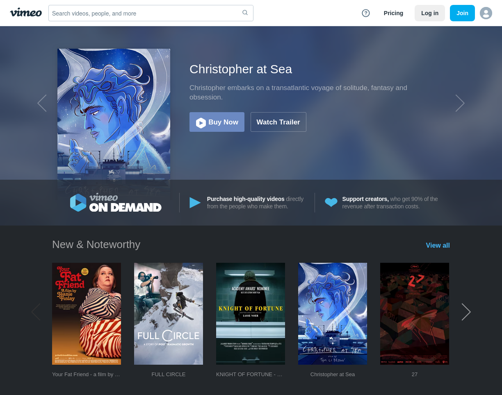
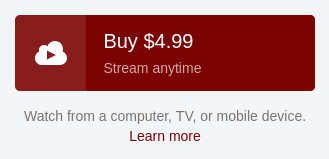
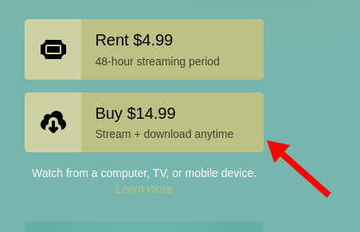

## Highlights

- Why am I making slower progress than I'd like on my book?
- I optimize my Asciidoctor write and preview workflow.
- I'm working on a side project to track Hacker News performance in real-time.

## Goal grades

At the start of each month, I declare what I'd like to accomplish. Here's how I did against those goals:

### Write a blog post about lessons from Kickstarter

- **Result**: Published [My $6k Advance as a Self-Published Technical Author](/my-6k-advance/)
- **Grade**: A

I originally set out to write a guide that focused on Kickstarter, but the more I wrote, the less I felt like Kickstarter was the interesting part. I was more excited about crowdfunding as a path for self-published authors, and Kickstarter is just one way of crowdfunding.

### Complete a new book chapter or teach a live session about a topic from the book

- **Result**: Taught a live session and started working on a new chapter.
- **Grade**: A

I invited everyone who pre-ordered the book to attend a live class, and I enjoyed the session. I got to meet people who had been reading my blog for years, but we'd never talked or emailed, and the questions helped me shape the material for the book.

### Coordinate rewards with Kickstarter backers

- **Result**: Reached out to all Kickstarter backers who purchased a premium reward.
- **Grade**: A

I felt stressed about not reaching out to people soon enough. I worried that backers would feel like, "Hey, why are you writing [new](/retrospectives/2025/04/) [blog](/book-pre-sale-just-barely-succeeded/) [posts](/my-6k-advance/) about your Kickstarter instead of talking to the people who actually supported you?" But I didn't want to send bulk messages because if people pre-ordered $75-150 packages, I felt like that deserved a personalized response.

I kept putting off the emails, but when I finally did, it only took me about two hours to write to everyone. If the backer had a website or we'd talked before, I personalized the message to make it clear I was writing them one by one.

## Managing my time as I write a book

I'm working on my book every week, but my progress feels slow.

It's difficult to gauge my progress because I know which chapters I've completed and which ones I haven't, but they vary a lot in difficulty and length.

Another issue is that I can keep writing and rewriting the same chapter forever. I have to reach a point where I decide it's good enough and move on to other chapters. If there's no pressure to finish any particular chapter by a certain time, I feel like I can just keep rewriting forever.

I also find that my efficiency drops significantly after about an hour of writing. I just run out of steam and get distracted more easily or overinvest in things that don't matter. I can somewhat mitigate this by writing about a different topic in the morning and afternoon, but I still run out of steam after about an hour in either session.

Fortunately, I haven't experienced writer's block or a loss of motivation. I'm able to write every workday, and I still feel excited about the book.

With all those things in mind, here's my plan for more focused writing going forward:

- Dedicate time to writing in flow state for at least 60 minutes per day.
  - If I need to research more, fix formatting, or add an image, add TODOs, so I don't have to break my flow state.
  - If I get bored, resist the urge to check email or social media. Just keep writing until the end of the block, even if I don't like the writing.
    - I initially found [LeechBlockNG](https://www.proginosko.com/leechblock/) helpful for this, but it caused Firefox to hang frequently, so I stopped using it. I assume it's related to the known issue, ["LeechBlock doesn't get along well with Firefox's GC."](https://github.com/proginosko/LeechBlockNG/issues/124) I submitted a couple of [small](https://github.com/proginosko/LeechBlockNG/pull/573) [fixes](https://github.com/proginosko/LeechBlockNG/pull/578), but they didn't seem to make a difference.
- Plan my workday the first thing in the morning, so I decide how much time I allocate to which writing tasks.
  - I check my calendar and to-do list, then schedule my day as a series of 30-minute blocks on a piece of paper.
- Decide how much writing time each chapter deserves.
  - For example, I should decide ahead of time that I only want to spend 10 hours writing the chapter on emails before I send a draft to readers.

Some of the items on the list are things that I'm already doing and want to do more diligently. Some are new things I'm adding to meet the challenge of writing a book for the first time.

## Asciidoctor: So far, so good

I wrote last month about [evaluating different options for writing a book](/retrospectives/2025/04/#picking-a-markup-language-for-the-book), and I settled on Asciidoctor. I'm enjoying it so far.

I used Liran Tal's [asciidoc-book-starter](https://github.com/lirantal/asciidoc-book-starter) as a starting point and adapted it to Nix. I now have a Nix flake set up so that if I run `nix run`, it renders the book as PDF, epub3, and HTML. I can also render individual formats with commands like `nix run .#pdf`.

I'm not sure if I'll support all three formats. I haven't tried any custom formatting yet or even embedding images or tables, so it will come down to how much extra work it is to get the layout and style right in all three formats.

The biggest limitation of Asciidoctor is that I can't do live reload. I'm used to writing in Hugo, so I have VS Code open in one window and the rendered output open in a browser window. Every time I hit save in VS Code, I see it render in the browser in a few hundred milliseconds.

With Asciidoctor, my write-build-read flow is:

1. Save the file.
1. Switch to the terminal.
1. Run `nix run .#pdf`.
1. Switch to my browser window.
1. Reload the PDF.

Now that I write this out, I realize I should automate this, so I asked an LLM and got this simple script:

```bash
#!/usr/bin/env bash
set -euo pipefail

nix run .#pdf

zathura dist/Refactoring\ English.pdf &
ZATHURA_PID=$!

trap 'kill $ZATHURA_PID' EXIT

find book -type f \
  | entr -dr nix run .#pdf
```

I'd never heard of zathura, but it's an [open-source PDF reader](https://pwmt.org/projects/zathura/) that automatically reloads on file changes. Here's what it looks like in practice:



My DIY hot-reload flow is significantly slower than the near-instant performance I'm used to with Hugo, but it's 5x easier than doing it manually.

## Side project: Hacker News Observer

One of my special Hacker News superpowers is that I usually know why a post disappeared from the front page. But really, anyone can do this if they know about [HN Rankings](https://hnrankings.info/), a site that charts historical Hacker News data. You just have to recognize a few patterns.

The main thing you can see in HN Rankings is when a post's rank suddenly increases or decreases dramatically. If a post is slowly increasing to the #3 spot, and then the next tick in the chart, it's suddenly at the #45 spot, that means a moderator probably downranked the story.

{{}}

Charts can also reveal when moderators manually boost a story. If you see a post drowning in the #300 spot, and then suddenly it's ranked #10, it means that a moderator boosted the story, possibly due to the [second chance pool](https://news.ycombinator.com/item?id=26998308), a system where moderators and volunteers hand-pick stories that missed the front page in regular voting.

HN Rankings is great, but I'd like to see more data like upvote counts and comment counts alongside rankings, so I built my own version. I haven't published it yet, but it polls the [Hacker News API](https://github.com/HackerNews/API) every minute to track metadata about all of the current Hacker News stories.

I've always been curious about what patterns emerge if you aggregate votes and comments of all the stories on the front page of Hacker News over time:

{{}}

The thing that jumps out to me most is that around noon ET every day, the average age of posts drops significantly, so that's when older posts drop off the front page and make room for newer posts.

It's been interesting to see more details on my submissions, like [the HN discussion](https://news.ycombinator.com/item?id=43803343) for "My $6k Advance as a Self-Published Author." The chart reveals that the post never made it to the front page, but it continued receiving upvotes, which is surprising. I'm still not sure how that happened, as I didn't link to the Hacker News discussion anywhere:

{{}}

Here are some features I'd still like to add:

- Automatically determine whether it's a slow news day or a crowded front page on Hacker News.
- Automatically tag stories that the moderators have boosted or suppressed.
- Predict a story's trajectory based on how voting and commenting begins.

This is the closest thing I've had to a "big data" project in a long time, as most of my sites generate about 1 MB per month of data, whereas HN Observer generates 30-40 MB per day. I can dial that up or down depending on how much data I collect and how frequently I update it.

HN's data storage feels like a good opportunity to try out [Turso](https://turso.tech). I've been watching it distantly, and it seems like a database as a service that preserves most of the benefits of using SQLite.

## Buying DRM-free movies

I was complaining to a friend recently that nobody offers DRM-free movies or TV shows for legal purchase. I know big studios and streaming platforms have no interest in giving up DRM, but it seems easy for small studios or indie filmmakers to put up a checkout page where customers can buy a 4K DRM-free mp4 of their movie for $10.

I searched around and found that there _kind of_ is something like this. [Vimeo on Demand](https://vimeo.com/ondemand/) offers DRM-free movies. They're mostly indie and non-English films, but it's the biggest selection I've ever seen of DRM-free films to purchase legally.

{{}}

I tried out Vimeo on Demand, and the experience was only so-so. But they're the only ones selling DRM-free films, so I'll recommend them with caveats.

Make sure the title you're buying offers downloads, as not all titles do. If the button says "Stream anytime," that's not DRM-free:


{{}}
{{}}


The experience of making this mistake and canceling the purchase also made me reluctant to recommend Vimeo. They don't give any obvious option to talk to a human. Instead, I had to talk to a chatbot who told me that "for security reasons" they can't refund video on demand purchases (despite the fact that they can see that I haven't viewed the purchase). The only option was to contact the film's distributor to request a refund, so I did that. But if I don't hear back in a week, I'm just going to do a credit card chargeback.

Vimeo's terms of service require binding arbitration, so if Vimeo does something illegal, you can't sue them in court or participate in class action lawsuits. It's absurd that clauses like this are legal in the US, as [arbitrators heavily favor](https://arbitrationinformation.org/) corporations over consumers. You can [opt-out of the binding arbitration](https://vimeo.com/terms#30_day_right_to_opt_out), which I did.

## Wrap up

### What got done?

- Taught a live session for _Refactoring English_.
- Reached out individually to every Kickstarter backer who purchased a premium reward.

### Lessons learned

- I should set time limits per chapter of my book to avoid working on it forever. Time goals also will give me a better sense of my total progress on the book.
- It's easy to set up your own makeshift live reload flow with Asciidoctor.

### Goals for next month

- Publish two chapters of my book to pre-order readers.
- Assign soft writing time limits to every chapter of my book.
- Adapt [preview chapters](https://refactoringenglish.com/chapters/) of my book to Asciidoctor.

### Requests for help

If you know any developers trying to improve their writing, especially bloggers, [send them my way](https://refactoringenglish.com/consulting/). I enjoy giving feedback to other developers, and working with real people helps me write my book.
