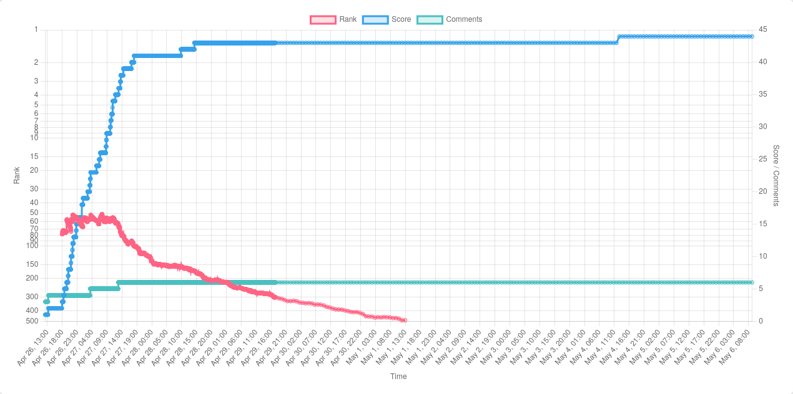

## Highlights

- I try to diagnose why I'm making slower progress than I'd like on my book.
- I optimize my Asciidoctor write and preview workflow.
- I'm working on a side project to track Hacker News performance in real time.

## Goal grades

At the start of each month, I declare what I'd like to accomplish. Here's how I did against those goals:

### Write a blog post about lessons from Kickstarter

- **Result**: Published [My $6k Advance as a Self-Published Technical Author](/my-6k-advance/)
- **Grade**: A

I originally set out to write a guide that focused on Kickstarter, but the more I wrote, the less I felt like Kickstarter was the interesting part. It felt more interesting that crowdfunding is a viable path for self-published authors, and Kickstarter is just one way of crowdfunding.

### Complete a new book chapter or teach a live session about a topic from the book

- **Result**: Taught a live session and started working on a new chapter.
- **Grade**: A

I invited everyone who pre-ordered on Kickstarter to a live class on a Friday afternoon, and I enjoyed the session. I got to meet some people who had been reading my blog for a long time, but we'd never talked or emailed, and the questions helped me shape the material for the book.

### Coordinate rewards with Kickstarter backers

- **Result**: Reached out to all Kickstarter backers who purchased a premium reward.
- **Grade**: A

I felt stressed about not reaching out to people soon enough. I worried that backers would feel like, "Hey, why are you writing new blog posts about your Kickstarter instead of talking to the people that actually supported you?" And I also didn't want to send bulk messages because if people pre-ordered $75-150 packages, I felt like that deserves more than a mass email.

I kept putting it off the emails, but when I finally did, it only took me about two hours to write to everyone. If the backer had a website or we'd talked before, I tried to personalize the message to make it clear I was writing them one by one.

## Managing my time as I write a book

I've been feeling I'm making progress on my book too slowly. It's difficult to gauge my progress because I know which chapters I've completed and which ones I haven't, but they vary a lot in difficulty and length.

Another issue is that I can keep writing and rewriting the same chapter forever. I have to reach a point where I decide it's good enough and time to move on to other chapters, but if there's no pressure to finish any particular chapter by a certain time, I feel like I can just keep polishing forever.

With writing, I also find that my efficiency drops significantly after about an hour. I just run out of steam, and I find myself getting distracted more easily and overinvesting in things that don't matter. I can somewhat mitigate this by writing about a different topic in the morning and afternoon, but I still run out of steam after about an hour in either session.

Fortunately, I haven't experienced writer's block or a loss of motivation. I'm always able to write, and I still feel excited about the book.

With all those things in mind, here's my plan for more focused writing going forward.

- Dedicate time to writing in flow state for at least 60 minutes per day.
  - If there are things I need to research more, fix formatting, or add an image, I add TODOs so I don't have to break flow.
  - If I get bored, resist the urge to check email or social media and just keep writing until the end of the block, even if I don't like the writing.
    - I found LeechBlockNG helpful for this, but it caused Firefox to hang frequently, so I stopped using it. I assume it's related to the known issue, [LeechBlock doesn't get along well with Firefox's GC](https://github.com/proginosko/LeechBlockNG/issues/124). I submitted a couple of [small](https://github.com/proginosko/LeechBlockNG/pull/573) [fixes](https://github.com/proginosko/LeechBlockNG/pull/578) but they didn't seem to make a difference.
- Plan my workday the first thing in the morning so I decide how much time I allocate to which writing tasks.
  - I check my calendar and to-do list, then break my day into 30-minute blocks and write on a piece of paper how I'll spend each block of time.
- Decide how much writing time each chapter deserves.
  - For example, I should decide ahead of time that I only want to spend 10 hours writing the chapter on emails before I send a draft to readers.

Some of the items on the list are things that I'm already doing and want to do more diligently. Some are new things I'm adding to meet the challenge of writing a book for the first time.

## Asciidoctor: So far, so good

I wrote last month about evaluating different options for writing a book, and I settled on Asciidoctor. I'm enjoying it so far.

I used Liran Tal's [asciidoc-book-starter](https://github.com/lirantal/asciidoc-book-starter) as a starting point and adapted it to Nix. I now have a Nix flake set up so that if I run `nix run`, it renders the book as PDF, epub3, and HTML. I can also render individual formats with commands like `nix run .#pdf`.

I'm not sure if I'll support all three formats. It will depend on how easy it is to keep styling options consistent between the three.

The biggest limitation is that I can't do live reload. I'm used to writing in Hugo, so I have VS Code open in one window, and the rendered output open in a browser window. Every time I hit save in VS Code, I see how it renders in under a second.

With Asciidoctor, my write-build-read flow is:

1. Save the file.
1. Run `nix run .#pdf`.
1. Switch to my browser window.
1. Reload the PDF.

Now that I write this out, I realize I should automate this, so I asked an LLM and got this simple script:

```bash
#!/usr/bin/env bash
set -euo pipefail

nix run .#pdf

zathura dist/Refactoring\ English.pdf &
ZATHURA_PID=$!

trap 'kill $ZATHURA_PID' EXIT

find book -type f \
  | entr -dr nix run .#pdf
```

I'd never heard of zathura, but it's an [open-source PDF reader](https://pwmt.org/projects/zathura/) that automatically reloads on file changes. Here's what it looks like in practice:



My DIY hot-reload flow is significantly slower than the near-instant performance I'm used to with Hugo, but it's 5x easier than doing it manually.

I haven't tried any custom formatting yet or even embedding images or tables, so I'll have more to report next month.

## Side project: Hacker News Observer

One of my special Hacker News superpowers is that I usually know why a post disappeared from the front page. But really, anyone can do this if they know about [Hacker News Rankings](https://hnrankings.info/), a site that charts historical Hacker News data. You just have to recognize a few patterns.

The two main things you can see from historical Hacker News chart is when a post's rank suddenly incrases or decreases dramatically. Like if a post is slowly increasing to the #5 spot, and then the next tick in the chart, it's suddenly at the #200 spot. That means that a moderator probably downranked the story manually.

{{}}

Charts can also reveal when moderators manually boost a story. If you see a post drowning in the #300 spot, and then suddenly it's ranked #10, it means that a moderator boosted the story, possibly due to the [second chance pool](https://news.ycombinator.com/item?id=26998308), a system where moderators and volunteers hand pick stories that missed the front page in regular voting.

Hacker News Rankings is great, but I'd like to see more data like upvote counts and comment counts alongside rankings.

So I built my own version. I haven't published it yet, but it polls the [Hacker News API](https://github.com/HackerNews/API) every minute to track the metadata about all of the current Hacker News stories.

It's been interesting to see more details on my submissions, like [the HN discussion](https://news.ycombinator.com/item?id=43803343) for "My $6k Advance asa Self-Published Author."

{{}}

It's a strange graph, and I can't figure it out. It continued receiving upvotes for days even though it never reached the front page, so I don't know how users were finding it. I didn't link to it in the post itself.

{{}}

Here are some features I'd still like to add:

- Calculate whether it's difficult or easy for a new story to reach the front page at the current time.
  - In other words, automatically determine whether it's a slow news day or a crowded front page.
- Automatically tag stories that the moderators have boosted or suppressed.
- Predict a story's trajectory based on how voting and commenting begins.

This is the closest thing I've had to a "big data" project in a long time, as most of my sites generate about 1 MB per month of data, whereas the frequent polls and rich data here generate 30-40 MB per day.

This might be a good opportunity to try out Turso, as it seems like a good way to have a database as a service without forfeiting the benefits of using SQLite.

## Wrap up

### What got done?

- Taught a live session
- Reached out individually to every Kickstarter backer who purchased a premium reward.

### Lessons learned

- It's easy to set up your own makeshift live reload flow with Asciidoctor.

### Goals for next month

-

### Requests for help

If you know any developers trying to improve their writing, especially blog posts, [send them my way](https://refactoringenglish.com/consulting/). I enjoy giving feedback to other developers, and working with real people helps me write my book.
