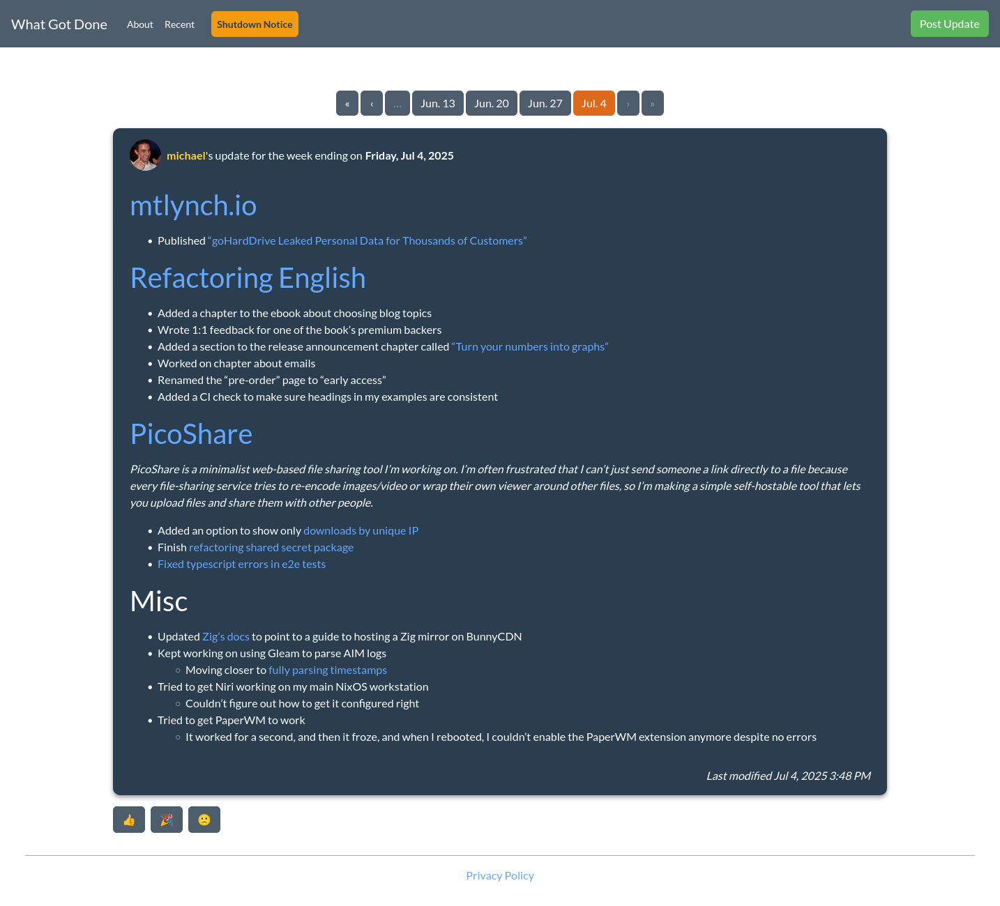
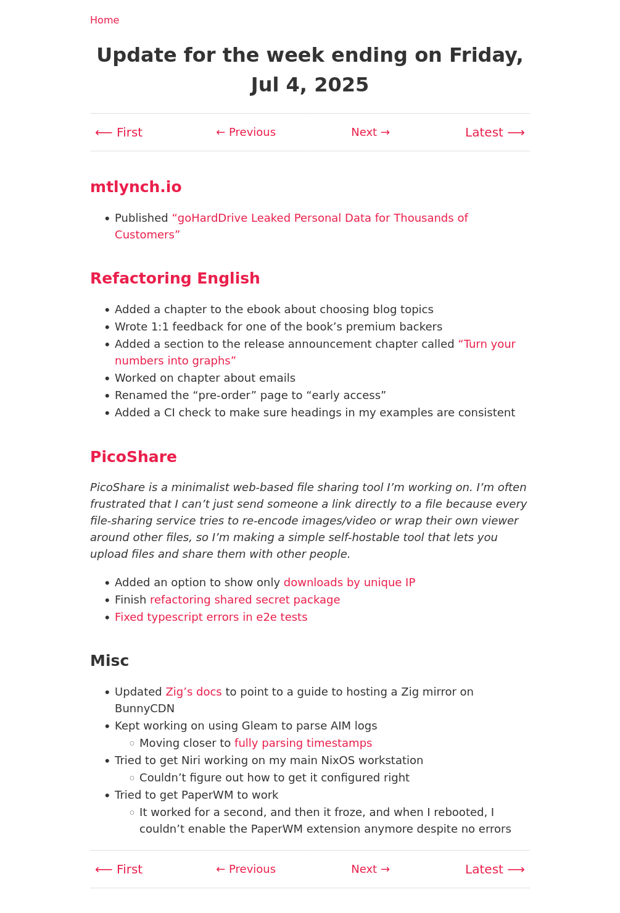
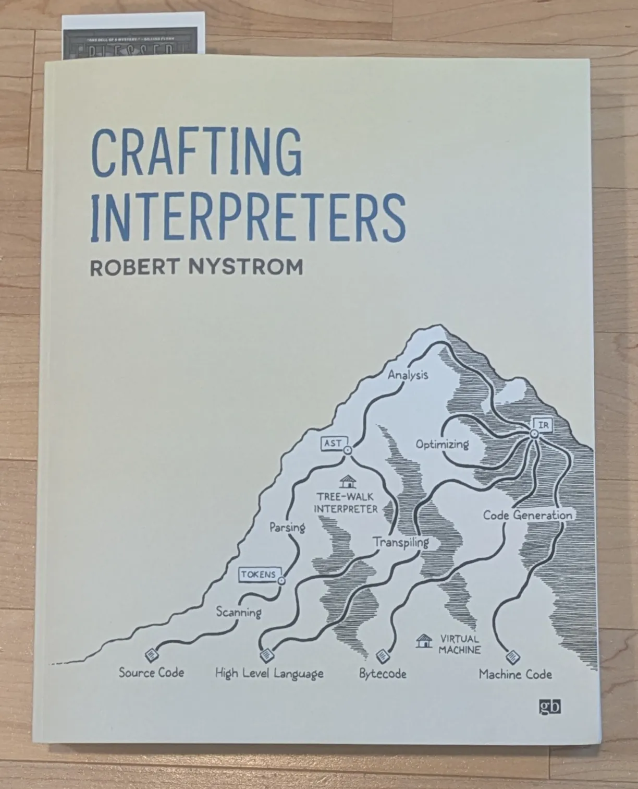



**New here?**

Hi, I'm Michael. I'm a software developer and founder of small, indie tech businesses. I'm currently working on a book called [_Refactoring English: Effective Writing for Software Developers_](https://refactoringenglish.com).

Every month, I publish a retrospective like this one to share how things are going with my book and my professional life overall.



## Highlights

- I find that not every reader who purchases early access to my book wants to give me feedback about rough drafts.
- I figure out where all my time is going and think of ways to minimize time drains.
- I spend 10 hours reimplementing a web app from scratch that originally took me 300 hours to build.
- I continue to learn functional programming with Gleam, but I might be cheating.

## Goal grades

At the start of each month, I declare what I'd like to accomplish. Here's how I did against those goals:

### Talk to at least 10 readers I haven't spoken to before

- **Result**: Emailed seven readers, got three replies, had one live conversation
- **Grade**: C

Until I sat down to count, I thought I had a much worse response rate, but a lot of readers are responding. The issue is that I'm just not reaching out enough.

I'm probably spending too long on each email trying to say something unique and conspicuously not AI-generated, but I go down a rabbit hole of reading the person's blog for an hour.

### Clear the backlog of [my marketing ideas](/retrospectives/2025/07/#how-can-i-improve-marketing-for-the-book)

- **Result**: Completed about 70% of what I intended to do
- **Grade**: C

I got through most of these tasks, though I still haven't gotten around to publishing an interview I recorded a year ago, so I'd like to get that done.

### Publish a new chapter of _Refactoring English_

- **Result**: Published ["Underused Techniques for Effective Emails"](https://refactoringenglish.com/chapters/techniques-for-writing-emails/)
- **Grade**: A

I'm happy with how this chapter turned out, but I knew sharing it on social media would be a gamble. It got [a positive reception on Lobsters](https://lobste.rs/s/tfauzy/underused_techniques_for_effective) but [no traction on Hacker News](https://news.ycombinator.com/item?id=44625726).

## _Refactoring English_ metrics



Visits to the website are up, which is good because I didn't have any popular new posts. I see it as a positive sign that visits stay healthy just from people reading the existing sample excerpts.

Total revenue is down slightly, but it's just because I went from one paid consulting job to zero, so not much change there. I'm more excited to see that pre-orders are up by 34% compared to June.

## What if everyone just likes the _feeling_ of buying a book?

As I reach out to readers and meet them on video calls, there's one piece of feedback I'm hearing over and over: "I haven't started reading it yet."

I hear this from people who purchased a few days ago and from people who had access to the book for months.

My biggest fear is that the book is a "vitamin rather than a painkiller." People see good writing as something that's [important but not urgent](/book-reports/7-habits-of-highly-effective-people/#time-management-matrix). They might read a book called, "How to Nail Your Next Coding Interview," ahead of an upcoming interview, but it's easy to defer indefinitely on improving writing.

Part of my motivation in [pre-selling the book](/my-6k-advance/) before writing it was to see if there were enough people willing to pay for the book. There were, and people continue to buy it, but I'm worried that might not be as predictive a signal as I thought.

What if my book is the kind of thing people buy because it's a way to feel like they're investing in their writing without actually putting in time to do anything? What if it's like Planet Fitness, the popular gym franchise that supposedly makes its money from people who sign up and then never use the gym?

{{*Photo [by Mike Mozart](https://www.flickr.com/photos/39160147@N03/14561958486), used under [CC-BY-2.0 license](https://creativecommons.org/licenses/by/2.0/deed.en)*">}}

Even if I can be the Planet Fitness of books, that's not sustainable. For my book to be financially viable, I'm banking on word of mouth recommendations from people who read the book and like it. I hope popular bloggers cite my book as a resource that helped them. When a developer says they want to improve their writing, I want my book to be the obvious thing people recommend.

### Maybe customers don't want to be in my focus group

Another reason I pre-sold the book was that I predicted that readers who pre-ordered would be especially enthusiastic about giving feedback during the writing process.

From talking to friends who are also customers, most of them say that they pre-purchased to support the project and want to read the book when it's done, but they don't necessarily want to participate in a focus group or give feedback on a rough draft. They just want to read the finished version, and that's totally fair.

### I should just keep reaching out to people one by one

What I've found from reaching out to customers one by one and arranging live calls is that _some_ readers are extremely enthusiastic and want to give feedback. I've only found a handful, but they've given me excellent feedback.

The most effective way I've found enthusiastic readers is to email them one by one, so I'll keep doing that.

## Where does my time go?

[Every](/retrospectives/2022/02/#how-can-i-manage-tinypilot-with-only-20-hours-per-week) [year](/retrospectives/2023/07/#where-does-my-time-go) [or so](/retrospectives/2024/09/#caring-for-a-newborn-takes-longer-than-two-hours-per-day), I look back at what I accomplished in the previous month and think, "Wait, why is that all I did last month? What was I doing instead?"

July was that kind of month. I worked my regular, full-time hours, but I'm looking back at the month thinking, "How did I only finish one new chapter?"

So, let me look back and think about where my time is going when I'm not working on my monthly goals.

### Overinvesting in chapters

A few months ago, I realized I was [spending too much time wordsmithing my writing](/retrospectives/2025/06/#becoming-less-precious-about-my-writing) rather than just getting chapters to readers when they were 80-90% perfect. My solution was to set time limits on each chapter and write whatever I could complete within my time budget.

For the emails chapter I wrote in July, my budget was five hours, but I actually spent 17.5 hours on it. Part of that was intentional because I realized after I set the target that it would work well as a standalone excerpt on the website. It takes longer to write an excerpt and then fold it back into the book.

But I'm also doing the same thing on the chapter I'm currently working on. I'm 6.5 hours into my 6-hour budget, and I probably have at least 3 hours of writing left before I'm comfortable sharing it with readers. I think this is both a problem of me polishing too much but also setting too low a budget for the first and most important chapter of the book.

**Solution**: Budget extra time for chapters that will have public excerpts, and constrain writing time to the defined limits.

### Extracurricular blog posts

I like capturing what I learn soon after I learn it by writing blog posts, but I could spend 20 hours per week blogging and still not write all the blog posts I want to write.

Some of my blog posts attract people who might read my book, whereas others likely won't. I have to be deliberate about how much time to invest in the "just for fun" blog posts.

Last month, I published a new blog post, ["Migrating a ZFS pool from RAIDZ1 to RAIDZ2."](/raidz1-to-raidz2/) I knew it wouldn't help with the book, but I also thought it would be just a few hours of writing, and I'd be explaining something that I hadn't seen anyone else explain well.

In reality, the ZFS post took seven hours to write, so it was more investment than was sensible for a "just for fun" post, especially in a month where I didn't have a more crowd-pleasing _Refactoring English_ chapter to share.

**Solution**: Be more selective about non-book blog posts, and prioritize posts that attract readers who would also read my book.

### Bad social media habits

I find myself checking social media whenever I feel bored or low on motivation to think hard about a difficult piece of writing or software. I tell myself I'll just check quickly and get back to work, but then I get sucked into an article. If I write a comment, then I keep obsessively checking for responses.

I usually set aside a day to respond to comments if my article makes a big splash on Hacker News or reddit. My ZFS post didn't make a big splash, but I still spent the day responding to comments.

At one point, I was using a browser extension called LeechBlockNG to curb bad social media habits, but it seemed to [leak memory and slow down my whole browser](https://github.com/proginosko/LeechBlockNG/issues/124), so I disabled it. I'm trying it again and haven't noticed memory leaks, so maybe it can work this time.

**Solution**: Give productivity browser extensions another try to add more friction to unwanted timewaster sites.

### Recovering from sleep disruptions

My toddler is sleeping poorly, which means my wife and I are sleeping poorly.

The sleep disruptions themselves are probably the smaller part of the problem. The more significant bit is that I use sleep disruptions to justify lazy behavior, like skipping writing sessions or checking social media. I'll think, "I shouldn't have to work hard today. I had such a bad night of sleep last night!" In reality, I could work 80-90% as effectively as usual, but I use poor sleep to justify slacking off.

**Solution**: Stop using sleep disruptions as an excuse to slack off.

### Procrastinating paid editing work

I've been doing editing work as part of [the services I offer](https://refactoringenglish.com/services/blog-editing/) for _Refactoring English_.

I like editing other people's blog posts, but I find it mentally taxing. It's hard to edit my own writing, so it's even harder for me to edit for other people. With my writing, I can edit by feel without having to explain why I'm making the edit. When I give editing notes to other bloggers, I have to articulate what weaknesses I see in their draft and why I think my suggestion is better.

I've found myself procrastinating my editing work, so even if I have time to complete it in a day, I'll let it drag on for multiple days. And when I'm procrastinating editing work, I'm also procrastinating my own writing because I want to prioritize my clients' work ahead of my own.

**Solution**: Recognize that procrastinating on editing eats up a lot of time, and tackle it sooner.

## Side projects

### Replacing a 300-hour Vue app with a static site generator in 10 hours

In 2019, I [tried to build a business called What Got Done](/retrospectives/2019/06/#what-got-done-business-or-hobby). It was an app that allowed teammates to share weekly summaries of their work with one another.

{{}}

When I was at Google, they had an internal tool called Snippets that did the same thing as What Got Done. I loved it and [kept writing weekly updates after leaving Google](/status-updates-to-nobody/), even when I was working by myself.

I never could find customers for What Got Done, so I [open-sourced it](https://github.com/mtlynch/whatgotdone) and maintained it as a hobby project for the last six years.

I initially built What Got Done with Vue, Firestore, and AppEngine, and I've come to strongly dislike all of those technologies. I spent a long time [replacing Firestore with SQLite and AppEngine with fly.io](/retrospectives/2021/12/#migrating-my-side-projects-away-from-google-cloud-platform), but Vue stuck around, and it made development unpleasant.

Every week, I'd post updates to What Got Done and think about how I prefer my blog authoring workflow with VS Code and Hugo. So, one weekend, I just reimplemented What Got Done as a simple static site with Hugo, which I now host at [weeks.mtlynch.io](https://weeks.mtlynch.io).

{{}}

So, in six years, I probably spent about 300 hours implementing and maintaining What Got Done as a Go + Vue + SQLite + fly.io app. It only took 10 hours to reimplement it as a static site with simple Markdown files and Hugo.

Because the new version is a just-for-me app, I can add personalized features like [pre-populating my weekly updates from my git commits](https://github.com/mtlynch/weeks.mtlynch.io/blob/b7a79b5f7d8b6ed8d1ed93e19b221c2f889efc4b/dev-scripts/new-week). And of course, it's orders of magnitude simpler and cheaper to host, maintain, and back up because it's just a static site with source control instead of a full-blown web app with separate tech stacks for the frontend, backend, and database.

### Sunsetting What Got Done

I don't want to maintain What Got Done forever, especially now that I'm not even using it.

Even though What Got Done only has a handful of active users, I hate abandoning people who started using something I offered, so I tried to make the offboarding experience on What Got Done nice:

- I [announced on the website](https://www.whatgotdone.com/shutdown-notice) that What Got Done would stop running at the end of the year.
- I added a feature to [let users export their posts in Markdown format](https://github.com/mtlynch/whatgotdone/pull/963).
  - I needed to do this anyway to port my data to Hugo, so I figured it would be nice to build this feature into the web app itself so that any user could do it.
- I added a feature that lets users [set up a forwarding address for post-What Got Done shutdown](https://github.com/mtlynch/whatgotdone/pull/970).
  - For example, I've configured my profile page [whatgotdone.com/michael](https://whatgotdone.com/michael) to permanently redirect to [weeks.mtlynch.io](https://weeks.mtlynch.io).

### Progress on my AIM log parser in Gleam

I'm still learning the [Gleam programming language](https://gleam.run) by tinkering with a parser for my old AIM logs from high school and college. The most basic logs look like this:

```text
Session Start (AIM - DumbAIMScreenName:Jane): Mon Sep 12 18:44:17 2005
[18:44] Jane: hi
[18:55] Me: hey whats up
Session Close (Jane): Mon Sep 12 18:56:02 2005
```

#### Parsing timestamps

In June, I had my parser working at a basic level in that it could take the log above and extract the sender and messages like this:

```gleam
[
  Message(sender: "Jane", body: "hi"),
  Message(sender: "Me", body: "hey whats up"),
]
```

I made progress in July, so the parser can now understand the timestamps, which are a little tricky because it has to combine the date from the session metadata with the simple `HH:MM` information from the message. So, my log parser can convert the above log to this:

```gleam
[
  Message(
    timestamp: must_parse_rfc3339("2005-09-12T18:44:00-04:00"),
    sender: "Jane",
    body: "hi",
  ),
  Message(
    timestamp: must_parse_rfc3339("2005-09-12T18:55:00-04:00"),
    sender: "Me",
    body: "hey whats up",
  ),
]
```

#### Collapsing lexing and parsing to a single step

I also simplified the parser to do a single pass instead of separate lexing and parsing.

I initially thought it was more proper and elegant to split the logs into a list of tokens then parse those tokens. So, instead of the parser seeing a line like `Session Start (AIM - DumbAIMScreenName:Jane): Mon Sep 12 18:44:17 2005` and parsing it, I wanted the lexer to first change it to [a series of tokens](https://codeberg.org/mtlynch/gleam-chat-log-parser/src/commit/480c45c9e76117635ff7b0509f500799297eaa94/test/plaintext_tokenizer_test.gleam#L84) like this:

```gleam
[
    SessionStart,
    Word("(DumbAIMScreenName:Jane)"),
    ColonSpace,
    Word("Mon"),
    Word("Sep"),
    ...
]
```

But that meant I needed a secret first pass to split the string into substrings that the tokenizer could recognize like `["Session", " ", "Start"]`, and I had to implement my own string split logic because Gleam's built in libraries have no way of splitting a string by substring and then keeping the substring, too. For example, if I split by newlines then by spaces, then I'd have a list of strings, but I would lose track of whether the separators were spaces or newlines.

It felt like I was actually parsing the input three times: [once for my custom string splitting](https://codeberg.org/mtlynch/gleam-chat-log-parser/src/commit/2474457033d4900631e4fb443981cd3f1d523f48/src/plaintext_tokenizer.gleam#L15-L73), [once for the lexing](https://codeberg.org/mtlynch/gleam-chat-log-parser/src/commit/2474457033d4900631e4fb443981cd3f1d523f48/src/plaintext_tokenizer.gleam#L75-L86), and [once for the actual parser](https://codeberg.org/mtlynch/gleam-chat-log-parser/src/commit/2474457033d4900631e4fb443981cd3f1d523f48/src/plaintext_parser.gleam#L27-L59). I initially assumed it was because I didn't know enough about functional languages or text parsers, and I'd find a more elegant way to lex and parse.

I used my confusion to justify finally purchasing a print copy of [_Crafting Interpreters_](https://craftinginterpreters.com/), the most beautifully-designed software book I've ever seen.

{{}}

After reading the lexing chapter of the book, I concluded that my AIM logs weren't structured enough for lexing. I tried [collapsing everything down to a parser](https://codeberg.org/mtlynch/gleam-chat-log-parser/pulls/20) that reads the input character by character, and that felt simpler.

The bummer of parsing character by character is that Gleam's pattern matching looks much uglier. In the old implementation, I could look for string patterns [like this](https://codeberg.org/mtlynch/gleam-chat-log-parser/src/commit/480c45c9e76117635ff7b0509f500799297eaa94/src/plaintext_tokenizer.gleam#L76-L79):

```gleam
  case contents {
    ["Session", "Start", ..rest] -> tokenize_list(rest, [SessionStart, ..acc])
    ["Session", "Close", ..rest] -> tokenize_list(rest, [SessionClose, ..acc])
```

And now it's [a longer, messier pattern match](https://codeberg.org/mtlynch/gleam-chat-log-parser/src/commit/926124b4a660adeea0795e10a2979f73cfa6dcb5/src/plaintext_parser.gleam#L218-L242):

```gleam
  case state.remaining_graphemes {
    [
      "S",
      "e",
      "s",
      "s",
      "i",
      "o",
      "n",
      " ",
      "S",
      "t",
      "a",
      "r",
      "t",
      ...
```

#### Am I forcing classes into Gleam?

As I progressed with my parser, I found that I was writing functions that had the same signature over and over:

```gleam
fn parse_tokens_with_messages(
  tokens: List(Token),
  messages: List(Message),
) -> List(Message) {
```

A bunch of my functions took the same parameters and had the same return value, and as I added more code, the list of parameters and return values grew larger.

So, I created a `ParseState` type and [passed that around instead](https://codeberg.org/mtlynch/gleam-chat-log-parser/src/commit/926124b4a660adeea0795e10a2979f73cfa6dcb5/src/plaintext_parser.gleam):

```gleam
type ParseState {
  ParseState(
    last_timestamp: timestamp.Timestamp,
    messages: List(Message),
    remaining_graphemes: List(String),
  )
}

fn parse_graphemes(state: ParseState) -> ParseState {
```

But that felt like sneaking object-oriented classes into Gleam. Because if this was Go, the code would look like this:

```go
type Parser struct {
  LastTimestamp       time.Time
  Messages            []Message
  RemainingGraphemes  []rune
}

func (p Parser) Parse() {
```

Functional programming nerds: am I cheating? Or is this the right way to pass around state in functional languages?

## Wrap up

### What got done?

- Published ["Underused Techniques for Effective Emails"](https://refactoringenglish.com/chapters/techniques-for-writing-emails/) and sent an expanded version to early access readers.
- Migrated the last of the web-only content of _Refactoring English_ into the ebook.
- Published the blog post ["Migrating a ZFS pool from RAIDZ1 to RAIDZ2."](https://mtlynch.io/raidz1-to-raidz2/)
- Created a better [password reset flow for ScreenJournal](https://github.com/mtlynch/screenjournal/pull/429).
- Added [file expiration options for guests on PicoShare](https://github.com/mtlynch/picoshare/pull/694).
- Did unpaid editing on an upcoming blog post in exchange for publishing the feedback as marketing for my editing services.
- Created a [sunsetting plan for What Got Done](https://www.whatgotdone.com/shutdown-notice) and migrated my data to [weeks.mtlynch.io](https://weeks.mtlynch.io).

### Lessons learned

- It's fine if not every early reader of _Refactoring English_ wants to give feedback. I can keep reaching out to readers to find the few that want to be more actively involved.
- It's always useful to evaluate the ways I'm wasting time and think of ways to mitigate them.

### Goals for next month

- Write personalized emails to 20 readers I haven't spoken to before.
- Publish a new chapter of _Refactoring English_.
- Complete [my remaining marketing tasks](/retrospectives/2025/07/#how-can-i-improve-marketing-for-the-book).

### Requests for help

If you're a developer who's interested in improving your writing, or you know someone who is, [reach out](/about/).
