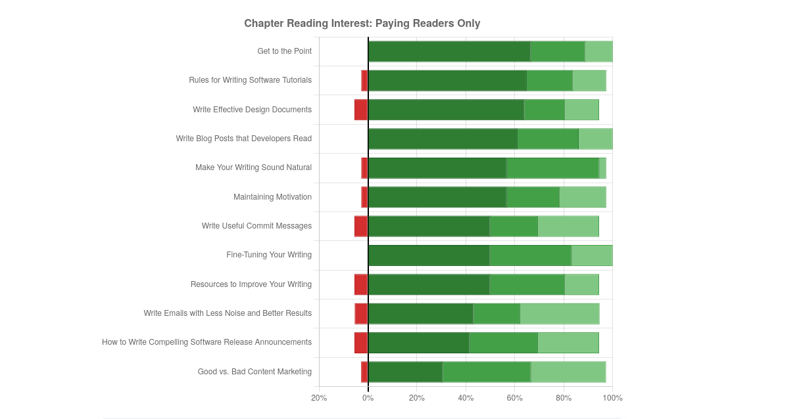
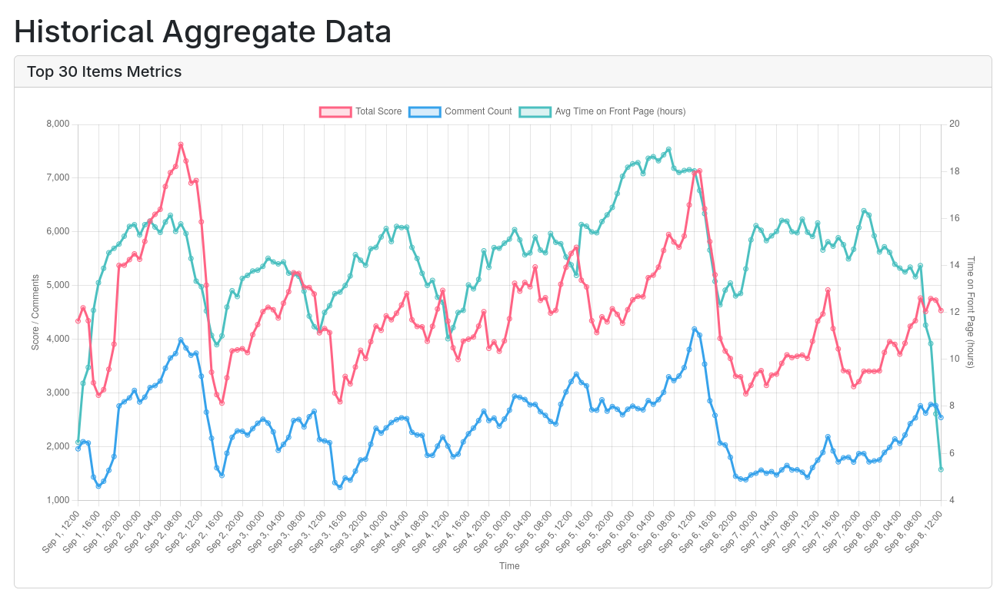



**New here?**

Hi, I'm Michael. I'm a software developer and founder of small, indie tech businesses. I'm currently working on a book called [_Refactoring English: Effective Writing for Software Developers_](https://refactoringenglish.com).

Every month, I publish a retrospective like this one to share how things are going with my book and my professional life overall.



## Highlights

- I got useful feedback from early readers by surveying them about my chapter list.
- I found it frustrating to edit video of an interview but had fun creating a written transcript.
- My plan to promote my freelance blog editing services went better than I expected.

## Goal grades

At the start of each month, I declare what I'd like to accomplish. Here's how I did against those goals:

### Write personalized emails to 20 readers I haven't spoken to before

- **Result**: Decided to do a [chapter survey](#interpreting-reader-feedback-about-my-chapter-list) instead
- **Grade**: N/A

From talking to a few readers, I realized a better strategy at this point would be to do [a broad survey of all readers](#interpreting-reader-feedback-about-my-chapter-list).

### Publish a new chapter of _Refactoring English_

- **Result**: Published "Get to the Point"
- **Grade**: A

I finally finished my chapter on introductions. This was the hardest chapter to write because introductions are the most difficult things for me to write. So, this was both an introduction and my attempt to reverse engineer how I write introductions.

I also went way over-budget on this chapter. I initially [budgeted just six hours](/retrospectives/2025/08/#overinvesting-in-chapters) to complete it, but I ended up spending 19 hours on it.

### Complete [my remaining marketing tasks](/retrospectives/2025/07/#how-can-i-improve-marketing-for-the-book)

- **Result**: I finished the interview but not the call-to-action
- **Grade**: B+

I finished editing the interview, which was the big unfinished task. I still haven't gotten around to adjusting my book's website design to focus on purchasing early access rather than subscribing to the free mailing list.

## _Refactoring English_ metrics



Last month, I thought metrics for the book were healthy. Website visits and revenue were both up despite not having any popular new posts.

Since then, I've added graphs for my metrics, and now I see a different pattern. Revenue for the book does seem to correlate pretty closely with visitors to the book's website. And even though I thought I didn't have any popular posts in July, metrics cratered in August when I didn't publish anything to the book's website, so it seems like I can't rest on my laurels forever.

My takeaway is that I actually _do_ need to keep publishing new things to the book's website to continue finding new readers, especially readers who are willing to pay for the book.

## Interpreting reader feedback about my chapter list

In individual conversations with readers, there was a lot of variety in what chapters they found relevant. I felt like a better way to find out which chapters readers cared most about would be to send out a survey.

I wasn't sure how many people would respond, as I've asked for feedback on the mailing list before and only gotten a handful of responses. I was surprised that readers were much more enthusiastic about this survey, with 133 responses in two weeks.

{{}}

I did a detailed analysis of the responses on the book's website:

- [Reader Feedback about my Chapter List](https://refactoringenglish.com/blog/chapter-interest-results/)

The short version is that I got useful feedback, and it prompted me to reorder the chapters and reframe one of the chapters that readers disliked.

It was also interesting to see the difference in response rate here compared to previous requests for feedback. In the past, I'd asked for feedback after sending out a sample chapter, and I think the difference is the amount I'm asking the reader to invest. For this survey, you can do it in a few minutes, whereas to give feedback on a chapter, you have to spend 30 minutes reading the chapter and thinking about it, and maybe you're not ready to do that when you receive the survey.

## The surprising difficulty of editing a 30-minute video interview

Back in July 2024, I recorded an interview with [Adam Gordon Bell](https://adamgordonbell.com/) as part of my reboot of my blogging video course, [_Hit the Front Page of Hacker News_](https://hitthefrontpage.com/). I ended up not finishing the course before I took paternity leave, so I shelved the reboot indefinitely.

That left me in an awkward spot with this interview. Adam was kind enough to volunteer his time to me, so I felt guilty not publishing the interview at all.

When I started offering early access to _Refactoring English_, I thought it would be a good time to release the interview. If people liked the interview, maybe they'd check out the book.

You know those tasks you put off forever, and you think, "I've been putting this off for so long, and it's so silly because if I just sat down and did it, I'd be done in an hour and I could stop carrying it around in my head." I thought for sure this interview would be like that.

It ended up not being like that.

### The return of the plague of audio skew

I recorded the interview using a service called Riverside. After the call, Riverside generated video files for both ends of the call and a merged, synced version of the conversation. I spot-checked the videos at the time to verify they worked but never watched them from start to finish.

I thought the work would just be taking the merged version and throwing it up on YouTube. Maybe if there were interruptions or long digressions, I'd trim them out, but I figured the video was nearly done.

When I finally sat down to watch the video carefully a year after recording it, I realized that the audio and video were [out of sync](/digitizing-1/#the-pernicious-plague-of-audio-skew). You could hear our voices before our lips moved in the video.



Okay, no problem. I could reprocess the video with [FFmpeg](https://ffmpeg.org/) to shift the audio slightly.

Nope, it turned out that the audio skew was different on either end of the conversation. Adam's end was shifted about 425ms, while mine was about 150ms. That meant I had to go back to the original, unmerged videos of each end of our conversation, fix the skew in those, then re-merge them myself.

### Searching for a usable open-source video editor

My standard tool for editing video used to be Adobe Premiere, but I switched to Linux last year, and Premiere isn't available for Linux. Plus, I'm sick of Adobe as a company at this point.

I started editing the videos in Shotcut, a video editor I'd been learning last summer. It took a while to figure out how to even arrange videos side-by-side in Shotcut, but I eventually hacked something together with zoom and crop filters.

When I edited in Shotcut, playback was incredibly choppy because even on my [fairly new, high-end desktop](/retrospectives/2024/12/#building-my-new-development-desktop), it was choking while merging two 1080p videos. So, to hear how the video actually sounded, I had to export the video. And Shotcut doesn't support exporting only a portion of a video, so I was exporting the full 30 minutes, which took several hours each time. Sidenote: I eventually discovered you can downscale playback in Shotcut for faster performance during editing.

When I watched the video Shotcut exported, I noticed that every time I split a clip, Shotcut would insert a loud pop. Even if I didn't actually cut anything at the split point, it still happened. The mere act of splitting one contiguous clip into two adjacent clips created the pop artifact.

{{}}

I discovered the pops are [a known issue in Shotcut](https://forum.shotcut.org/t/splitting-audio-adds-pops-clicks/24903), which I couldn't believe. How can anyone edit video when every split in the video adds a distracting audio artifact? But a lot of commenters said that _every_ video or audio editing tool has this same problem.

What?!?

I've edited hundreds of media files using other tools, and I've never seen any of them insert pops when I split a clip.

I tried other open-source video editing tools for Linux. [Kdenlive](https://kdenlive.org/) crashed a few minutes into me trying to edit. [Flowblade](https://jliljebl.github.io/flowblade/) couldn't load at all, but I eventually found [a workaround](https://github.com/jliljebl/flowblade/blob/af9610bdc12c453ac9bd03bd1b97f68ab6a0482e/README.md). And Flowblade seemed like a simpler version of Shotcut, so I started the editing process again in Flowblade and had to figure out how to create side-by-side video.

After about an hour of editing in Flowblade, I tried exporting the video, and the pops were back. They [had a bug about it, too](https://github.com/jliljebl/flowblade/issues/799), and their understanding of it was [based on an explanation from Dan Dennedy](https://github.com/jliljebl/flowblade/issues/799#issuecomment-634252961), who is... the author of Shotcut. And it seemed like Flowblade was built on top of MLT, the same media framework that powers Shotcut. So, I was back to the exact same bug.

Anyway, this recounting of my editing adventure is already too long and boring, so to skip to the end: I eventually worked around the pops by converting the audio sampling rate on the videos from 44.1 kHz to 48 kHz. That eliminated the pop artifacts, but I don't know why.

I ran into lots of other bugs while editing the video, but they're too tedious to recount here.

### Takeaways for editing video

- Do as much pre-processing as possible using FFmpeg scripts.
- Save the FFmpeg scripts in case you need to tweak the pre-processing later.
  - Even if you're _so_ confident you won't need to do any pre-processing again, save the scripts, ideally under source control.
- Test the FFmpeg scripts with extreme values to confirm they're doing what you think.
  - I tried correcting the audio skew by shifting audio 200ms, but it still was out of sync. Then I tried 300ms, and it was still out of sync. Then, 400ms. I finally skipped to 2000ms and realized there had to be a bug in my script because the 200ms and 2000ms corrections were exactly the same.
- When you're not sure of the right setting, script FFmpeg to produce several different versions so you can see options.
  - I did this to test different strategies for eliminating background noise from my end of the conversation.
- An audio sampling rate of 44.1 kHz apparently causes problems in editing, whereas I don't have any issues if I convert the rate to 48 kHz during pre-processing.
  - I have no idea why.
- Try exporting video soon into editing to examine the final output.
- Apply video/audio editing filters at the track level rather than at the clip level.
  - Even if you just have one giant clip, once you start editing, you have dozens of clips with independent filter settings.
  - If you realize you got a filter wrong, you're stuck re-doing it in every clip.

## Having too much fun with an interview transcript

When I finished editing the video with Adam Gordon Bell, that should have been it, right? I spent so much time editing the video that surely I must have been eager to publish it and call it a day.

Wrong!

Once I finished editing the video, it was time to obsess over the transcript. Except, I actually had fun doing that part.

I feel like every interview transcript I read online, the designer was like, "Let's take a typewritten court transcript from 60 years ago and bring exactly that level of fun and interactivity to the web."

{{}}

Come on! Let's use the web to do stuff that's not possible on a typewriter.

So, I generated an initial transcript with [whisper-ctranslate2](https://github.com/Softcatala/whisper-ctranslate2) and spent a lot of time making it accurate, interactive, and fun to read:

{{}}

- Each end of the conversation appears in a distinct color of speech bubble, so you can see at a glance who's talking.
- There are little play button icons in each speech bubble that jump to the video and start playback at the moment from the transcript.
- I pulled out my favorite quotes into callouts.
- I added headings to help frame the structure of the discussion.
- I reviewed the text for transcription errors.

I haven't published the video yet because I just sent the book mailing list subscribers a new chapter on Friday, so I'm waiting until the end of the week, but it will be up on [the book's blog](https://refactoringenglish.com/blog/) by the end of this week (by 2025-09-12).

## Helping Tyler Cipriani reach #1 on Hacker News

Sometimes, a plan just comes together better than I even hoped.

Giving feedback to real writers helps me write my book, so I've been doing [freelance editing](https://refactoringenglish.com/services/blog-editing/) for other indie dev bloggers. On the page explaining my editing services, I wanted to include a sample of my editing work, but I didn't want to ask one of my paying clients to use work they already paid for as my own marketing.

So, my plan was to find someone who would let me edit their post for free in exchange for publishing the notes and them crediting me as the editor in the article.

My stretch goal was that the article would gain traction in places where potential readers of my book might hang out, like Hacker News, Lobsters, and reddit. If the reader reached the end of the post and saw, "Edited by _Refactoring English_," they'd think, "Hey, what's that?"

It also looks good to potential clients if I can point to a past client and say, "Look, this person hired me, and their article succeeded in the places where you want to succeed."

A few months ago, Tyler Cipriani hired me for [a high-level review](https://refactoringenglish.com/services/blog-review/) of his blog. He seemed happy with the results, so I pitched him my free editing idea, and he agreed.

I worked with Tyler on a few rounds of feedback for his article, ["The future of large files in Git is Git."](https://tylercipriani.com/blog/2025/08/15/git-lfs/) We enjoyed working together, and it gave me good ideas for the book.

My bonus goal was just for the post to reach the front page of Hacker News, but it exceeded even that and got [all the way to #1 on Hacker News](https://news.ycombinator.com/item?id=44916783), [Lobsters](https://lobste.rs/s/vew3ph/future_large_files_git_is_git), and [reddit](https://www.reddit.com/r/git/comments/1mrukfp/the_future_of_large_files_in_git_is_git/).

One of the biggest takeaways for both of us was the importance of tuning the writing for the target audience. Earlier drafts of Tyler's post assumed that the reader was familiar with [Git LFS](https://git-lfs.com/), a Git extension for managing large files.

I suggested that the average Git user didn't necessarily know Git LFS well enough to understand everything in the article. Tyler pushed back, as he felt like the average Git user who has dealt with large files must know Git LFS.

As part of trying to convince Tyler to assume the reader knows less about Git LFS than his article assumed, I listed my knowledge and experience of Git LFS:

> - If I have large files in my git repo or I frequently update binary data in my git repo, I’m supposed to use git LFS
> - I’ve never used git LFS
>   - I’ve maybe worked on 1-2 open-source projects that use Git LFS, but I never touched any of the LFS parts.
> - I don’t know what the size limits are for various forges, but I assumed that if I hit it, the forge would give me grief, and I’d deal with it then
>   - If I ever want to store a file >5 MB in a git repo, I start looking for ways to avoid it
> - I thought Git LFS was a forge-agnostic feature I could use anywhere.
> - I thought Git LFS is a 10+ year old technology and is mature and stable
> - I didn’t know your repo is stuck with Git LFS once you start using it
> - I’d be interested in ways to store large files in git, and I’d click a story about it on HN/Lobsters, but it’s not a problem I’d think about and try to solve proactively unless I ran into a situation where I really wanted to store large files in a git repo.

Tyler said that this list was the "ah-ha" moment for him. He had resisted the feedback before because he felt confident that his readers would know about Git LFS. Seeing my list made him realize that even if his readers were superficially aware of Git LFS and what it's for, they might not know how it works.

The neat thing about Tyler's realization was that he could have written my list himself. He had the same predictions about what his target reader would know; he just had to think one level deeper about what it means for the reader to "know" a technology.

If you're curious, you can read my notes for the first draft of Tyler's article below:

- [My editing notes for Tyler Cipriani's blog post, "The future of large files in Git is Git"](https://refactoringenglish.com/services/blog-editing/sample-future-of-git/)

## Side projects

### Switching [Hacker News Observer](/retrospectives/2025/05/#side-project-hacker-news-observer) to a time-series database for a 500x speedup

Over the past few years, I've heard people talk about "time-series databases," but I never understood what they do or how they differ from regular relational database. I even used InfluxDB for a side project last year because I needed something compatible with Grafana. But I still didn't understand what made it a "time series" database or why it couldn't just be SQLite.

I was talking to another developer recently, and he mentioned using a time-series database for different views of his data, like seconds-level granularity vs. days-level. And he didn't even explain beyond that, but a lightbulb went off, and I thought, "Oh! That must be what time-series databases are for!"

Hacker News Observer is a side-project that queries Hacker News every minute and records upvotes, comments, and rank of every story from the last few weeks. I hope to dig deeper and find interesting patterns, but for now I've just been looking at high-level aggregates, like total upvotes and comments on the front page:

{{}}

I initially used SQLite as the database, and the graph above took two minutes to render. And that makes sense because there are thousands of stories per day, thousands of snapshots of each story, and then I have to find the top 30 (front page) in each snapshot, then put those into hour-level buckets. SQLite doesn't have any special functions for aggregating per-minute data into hour-level views, so it was a lot of expensive queries.

Once I got the idea of time-series databases, I asked an LLM for database options that were similar to SQLite, and it recommended DuckDB. And then I just had the LLM migrate my database from SQLite to DuckDB. That migration alone reduced the load time for the graph from two minutes to 250ms, a speedup of about 500x.

So, I guess that's what time-series databases are for.

### Chipping away at old logs with [Gleam Chat Log Parser](https://codeberg.org/mtlynch/gleam-chat-log-parser)

I made only little bits of progress on my chat log parser project to help me learn the [Gleam programming language](https://gleam.run).

I handled logs [that contain away messages](https://codeberg.org/mtlynch/gleam-chat-log-parser/pulls/34) and logs that had [Windows-style line endings (`\r\n`)](https://codeberg.org/mtlynch/gleam-chat-log-parser/pulls/30). Strangely, in Erlang (and therefore also in Gleam), [`\r\n` counts as a single character](https://www.erlang.org/docs/23/man/string), which tripped me up for a while.

## Wrap up

### What got done?

- Published the "Get to the Point" chapter of _Refactoring English_.
- Published ["Give Your Spouse the Gift of a Couple's Email Domain"](/couples-email-domain/)
- Published a [tutorial on flashing an AirGradient air quality monitor](/notes/flash-airgradient-cli/) from the command line.
- Published ["Reader Feedback about my Chapter List"](https://refactoringenglish.com/blog/chapter-interest-results/)
- Went back to using LeechBlockNG to protect focus during the day.
  - It's working well this time around! I'm [not running into memory leaks](/retrospectives/2025/08/#bad-social-media-habits), and it's preventing me from straying into social media during my workday.

### Lessons learned

- Be [more disciplined about editing video](/retrospectives/2025/09/#takeaways-for-editing-video)
- Editing the video of an interview is tedious, but editing and styling the transcript is fun.
- An order of magnitude more customers are willing to give feedback if it requires only a few minutes of work rather than 30 minutes of work.

### Goals for next month

- Publish something that attracts new readers to the _Refactoring English_ website.
- Publish a new chapter of _Refactoring English_.
- Write personalized emails to 20 readers I haven't spoken to before.
