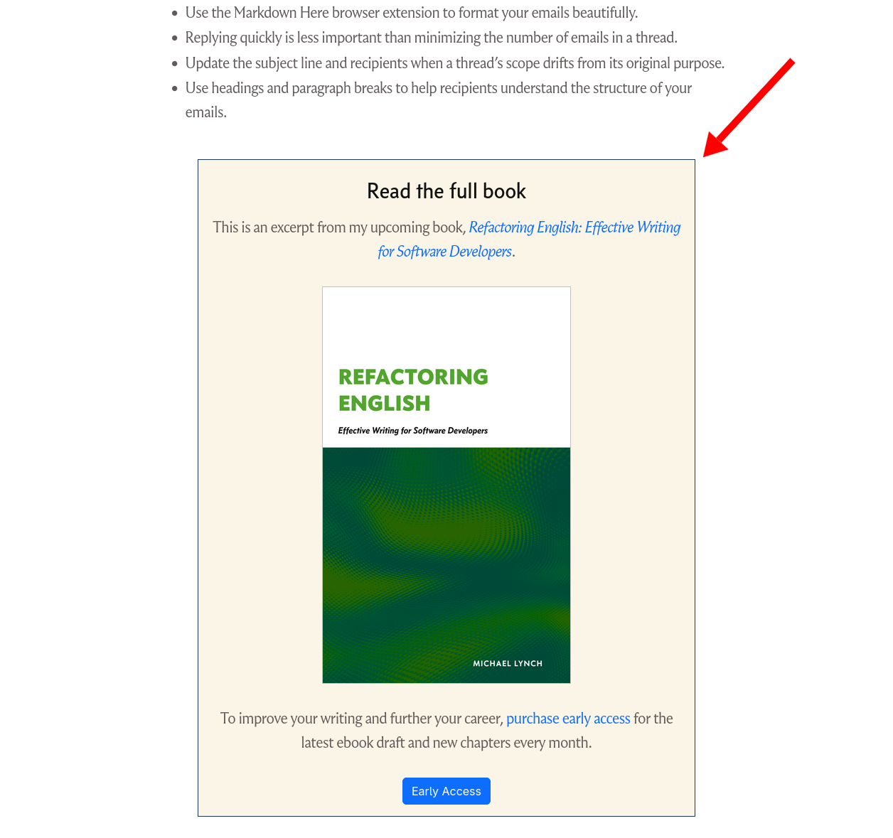
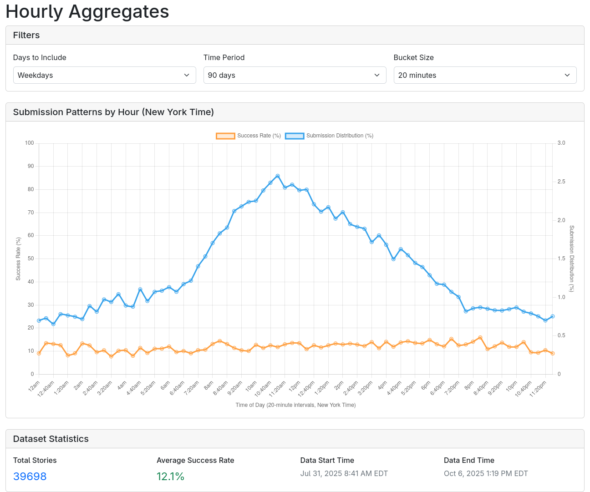



**New here?**

Hi, I'm Michael. I'm a software developer and founder of small, indie tech businesses. I'm currently working on a book called [_Refactoring English: Effective Writing for Software Developers_](https://refactoringenglish.com).

Every month, I publish a retrospective like this one to share how things are going with my book and my professional life overall.



## Highlights

- I'm experimenting with low-investment, low-payoff-style blog posts.
- I'm adjusting my strategy for freelance editing to work specifically with people who have read my book.
- My intuition was way off about the odds of reaching the front page of Hacker News.

## Goal grades

At the start of each month, I declare what I'd like to accomplish. Here's how I did against those goals:

### Publish something that attracts new readers to the _Refactoring English_ website

- **Result**: Published ["The Software Essays that Shaped Me"](https://refactoringenglish.com/blog/software-essays-that-shaped-me/), which attracted 16k readers in the first three days
- **Grade**: B+

I did complete this successfully, but I spent too long on the post and felt somewhat underwhelmed with my final result.

### Publish a new chapter of _Refactoring English_

- **Result**: Didn't publish anything new
- **Grade**: F

I wrote a first draft of a new chapter but didn't publish it. I ended up spending more time than I planned on "The Software Essays that Shaped Me" and freelance editing clients.

### Write personalized emails to 20 readers I haven't spoken to before

- **Result**: Emailed two new readers
- **Grade**: D

I was going to write this off and say that I'm not learning anything new anymore by reaching out to customers. Then, a few days ago, I heard back from a reader I'd reached out to who said he used what he learned from my book to get an article on the front page of Hacker News for the first time. So, that was pretty indisputably valuable and tells me I should be doing more of this.

I brainstorm more about this [below](#why-do-i-keep-skipping-reader-outreach).

## _Refactoring English_ metrics



September had a nice bump in website visitors and pre-orders. I'd like to get to the point where there's a virtuous cycle of readers referring other readers, but I don't think I'm there yet. Still, nice to make almost $1k for the month.

## Experimenting with bunts

In baseball, a bunt is when you hold the bat in the ball's path rather than swinging the bat. The upside is that you're less likely to miss, but the downside is that you won't hit the ball very far. The best you can hope for with a bunt is making it to first base, but a bunt is almost never going to be a home run.

Most of my blog posts are "swing for the fences" posts. I put in a lot of effort because I want to reach #1 on Hacker News, reddit, or search results.

The problem is that my "swing for the fences" posts take me about a month to write, so if I'm publishing blog posts as I write my book, I'd have to put my book on hold for a month every time I write a blog post.

I've been thinking about whether I could do some "bunt" posts instead. That way, I can only put my book on hold for a week rather than the whole month.

I don't want to take a topic that deserves a lot of care and just do a lazy version of it. Rather, I want to take a topic that's easy to cover and just see how it does.

My first bunt was, ["I Once Appeared in The Old New Thing."](/my-old-new-thing-cameo/) It was about an experience I had at 22 at my first real job. I didn't have a lot of insightful things to say about it, but I thought it was an interesting story. I was able to write it in about four hours, and it felt complete for what it was.

My next bunt was, ["The Software Essays that Shaped Me."](https://refactoringenglish.com/blog/software-essays-that-shaped-me/) I've seen other people share lists of their favorite software blog posts, and I thought it would be an easy, fun thing to do. Best of all, the people who appreciate good software writing might also find my book interesting.

As I started to write "The Software Essays that Shaped Me," it turned into more than just a bunt. I ended up spending almost all of September on it.

I originally thought I'd list my favorite blog posts and call it a day, but that felt too boring. So, I tried to include short commentary about each post. Then, I got carried away and ended up writing commentary that was longer than the originals themselves. It took me several drafts to figure out what commentary felt interesting, and I still don't feel like I quite succeeded.

I ended up spending 17 hours on "The Software Essays that Shaped Me" and never stopped to evaluate whether it was still worth writing if it was going to be all that work.

I think the post is interesting to people who read my blog. If someone I knew published a list of articles that influenced them, I'd find that interesting. But in comment threads about the post, people shared their own lists, and I found strangers' lists totally uninteresting. Maybe I counteracted that some by investing a lot in my commentary, but I just don't think a list of good blog posts can be all that interesting.

Both posts did well. They both reached the front page of Hacker News, though they did it through the [second chance pool](https://news.ycombinator.com/item?id=26998308), which feels a little like winning through TKO rather than a real knockout.

| Post                                                                                                        | Writing Hours | Unique Readers | Hacker News score                                    | Lobsters score                                                 | reddit score                                                                                      |
| ----------------------------------------------------------------------------------------------------------- | ------------- | -------------- | ---------------------------------------------------- | -------------------------------------------------------------- | ------------------------------------------------------------------------------------------------- |
| ["The Software Essays that Shaped Me"](https://refactoringenglish.com/blog/software-essays-that-shaped-me/) | 17            | 20.2k          | [307](https://news.ycombinator.com/item?id=45425568) | [85](https://lobste.rs/s/rouky6/software_essays_shaped_me)     | [125](https://www.reddit.com/r/programming/comments/1nug0oo/the_software_essays_that_shaped_me/)  |
| ["I Once Appeared in The Old New Thing"](/my-old-new-thing-cameo/)                                          | 4             | 3.8k           | [49](https://news.ycombinator.com/item?id=45274779)  | [49](https://lobste.rs/s/pulpod/i_once_appeared_old_new_thing) | [28](https://www.reddit.com/r/programming/comments/1nx8l6q/i_once_appeared_in_the_old_new_thing/) |

It's interesting that the results scaled almost linearly with the effort I invested, which I typically [don't find to be the case](/solo-developer-year-7/#i-worked-on-educational-products).

## Squandering my moment of glory

Previously, when one of my _Refactoring English_ posts did well on Hacker News, there was a noticeable uptick in readers [purchasing the book](/my-6k-advance/#publishing-book-excerpts). This time, “The Software Essays that Shaped Me” [reached #2](https://hnrankings.info/45425568/) and stayed on the front page for 11 hours, but only one person purchased.

Maybe everyone seeing my post on Hacker News has already seen that I'm writing a book, so everyone who's interested has already bought?

I woke up the morning after my article had already fallen off the front page of Hacker News and suddenly realized: I never included the ad for the book!

All the sample chapters on the book's website include a little self-ad to tell the reader I'm writing a book on this topic, and they can buy early access.

{{}}

I forgot to include the self-ad for the blog post, so the first 14k readers saw my post and had no idea I'm writing a book. D'oh!

I've updated my blog template so that I can't possibly forget to include the self-ad in the future.

## Adjusting my approach to freelance editing

A few months ago, I decided to offer freelance editing services to help other developers improve writing on their blogs. My idea was that it's an opportunity to make sure the way I explain concepts in my book makes sense to real people.

The downside is that there's a high cost to the editing. Each job takes me between four to seven hours, and it eats up my "hard thinking" of the day, so it's tough to do my own writing in the same day. I also feel pressure to offer quick turnaround, even though nobody has asked me to hurry. But just knowing my own writing process, it sucks to be stuck for days waiting on feedback.

At the beginning, freelance editing worked as I planned: it gave me good ideas for my book. As I do more jobs, I'm getting fewer ideas for my book. Now, most of the feedback I write is basically writing a personalized version of something I've already written for my book.

I want to keep doing the editing, but _only_ for authors who have read my book. I doubled my rates, so now my price for editing a blog post is $400. But I'm going to offer a 90% discount to readers who have read my book.

At a 90% discount, it's almost not worth charging at all, but I want clients to pay _some_ amount so that they feel like they have skin in the game, too.

I'll continue to take on clients who haven't read the book, but I want to charge enough that I feel like it's worth the tradeoff of taking time from my book. $400 might still be too low, but we'll see.

## Why do I keep skipping reader outreach?

I'm trying to figure out why I keep missing my goal of reader outreach. On its face, it doesn't seem that hard, but it never seems like the most important thing, so I keep deferring it.

There are other tasks I procrastinate because I don't enjoy doing them, but I actually enjoy reaching out to readers. It's fun to see what different readers are up to and how they might apply my techniques.

Part of the issue is that emailing readers requires activation energy because I have to:

1. Go to my list of pre-paid readers
1. Look for ones that have a website (so I can say something personalized)
1. Read through their website to learn more about them
1. Write an email and word it carefully to avoid sounding AI-generated

It might help if I first gather a list of customers to email and their websites. That way, when I'm in the mood to reach out, I'm not starting from scratch every time.

## The hassle of sending post-purchase emails with Stripe

A few _Refactoring English_ customers have emailed me confused because they paid but never got an email with a link to the book. I collect payment through Stripe, and Stripe redirects customers to the book's URL after they complete payment. If the customer doesn't notice the redirect or forgets to bookmark the page, they lose access to the book.

Whenever customers tell me they can't find the link to the book, I dig around in Stripe to look for a setting to customize post-purchase emails, give up after a few minutes, and then email the correct link to the customer.

Last month, I finally sat down and searched through Stripe's documentation and forum posts, and I can't find any way to customize the email Stripe sends after a customer completes a one-time payment. As far as I can tell, the only option is to spin up your own web server to listen for Stripe webhooks, then send your own emails from your own email provider. All because Stripe can't be bothered to let merchants customize any text in the payment completion emails...

Setting up a web server to respond to webhooks shouldn't be _that_ hard for me, but it means writing code to glue together Stripe, Buttondown, and Netlify functions, and they all have their little gotchas and bugs. Especially Stripe. I've spent about 10 hours so far just trying to get emails to send after a customer makes a purchase, and I'm still not sure it's working correctly.

Here are the gotchas I've hit so far:

- Stripe's [Go client library](https://github.com/stripe/stripe-go) is compatible with _exactly_ one version of the Stripe webhook API.
  - No, the documentation doesn't say which one. Run it and find out from the webhook failures!
- If you update your Stripe account to use the latest webhook API version and then resend a webhook for a previous event, Stripe still uses the old API version even though it claims to use the new version.
- Netlify silently converts HTTP header names to lowercase, so if you're looking for the `Stripe-Signature:` header, you have to look for `stripe-signature`.
- Instead of a normal [v2 Go module](https://go.dev/blog/v2-go-modules), Stripe for some reason decided to make every package upgrade a source change as well, so when I upgrade from v83 to v84, I have to replace `"github.com/stripe/stripe-go/v83"` in every file that imports the Stripe package.
  - Normally, you'd upgrade the version in one place without affecting imports.
- The Stripe webhook signing secret is different from your Stripe API key.

## Side projects

### Breaking down Hacker News success by the hour

I'm still tinkering with Hacker News Observer, a product that I still haven't released and don't know what to do with. For now, I'm just gathering data and using it to satisfy some curiosities about success on Hacker News.

One curiosity I've had for a long time is whether there are times of day when it's easier for a post to reach the front page of Hacker News, so I aggregated what percentage of posts reach the front page over the course of a day:

{{}}

I initially thought I had a bug that overcounted the success rate, as the percentage of Hacker News submissions that reach the front page feels lower than 12% in my experience. Then, I looked at some random slices from the last few days, and it seems to match up. If I browse [`/newest`](https://news.ycombinator.com/newest), there will typically be 2-5 stories that reached the front page. I found [a 30-minute slice from a few days ago](https://news.ycombinator.com/newest?next=45440276&n=1081) where 27% of submissions reached the front page, which is surprising.

I thought that success rate would be significantly higher on the weekends, when there are fewer submissions. Weekend posts are more likely to reach the front page, but the effect is much smaller than I thought.

- Weekdays: 12.1% of submissions reach the front page.
- Weekends: 13.2% of submissions reach the front page.

I thought it was going to be like 5% on weekdays vs. 20% on weekends. It makes submitting on the weekend less attractive because your chances of hitting the front page are only slightly better, but if you succeed, there are substantially fewer readers.

I'd like to try limiting the data to personal blogs [like I do on HN Popularity Contest](https://refactoringenglish.com/tools/hn-popularity/methodology/), as I'm curious to see if personal blogs have better chances at certain times.

## Wrap up

### What got done?

- Published ["The Software Essays that Shaped Me"](https://refactoringenglish.com/blog/software-essays-that-shaped-me/)
- Published ["I Once Appeared in The Old New Thing"](/my-old-new-thing-cameo/)
- Published ["Get xkcd Cartoons at 2x Resolution"](/notes/xkcd-2x-resolution/)
- Worked with two freelance clients for _Refactoring English_
- Set up a webhook handler to send post-purchase emails to _Refactoring English_ customers
- Added "success by hour of day" feature to Hacker News observer
- Started [contributing to the Jellyfin Roku client code](https://github.com/jellyfin/jellyfin-roku/pulls?q=is%3Apr+author%3Amtlynch)
- Had [a call with AirGradient](https://forum.airgradient.com/t/tutorial-flash-an-airgradient-one-from-the-command-line/4768/14) to discuss improving relations between the company and community members

### Lessons learned

- Consider bailing if a low-investment post turns out to be high-investment.
- Stripe does not allow you to customize post-purchase emails.
  - You have to do a bunch of other stuff to send your customers an email.

### Goals for next month

- Set up editing discounts for readers who have read the book.
- Create a list of early access customers to reach out to.
- Publish a new chapter of the book.
