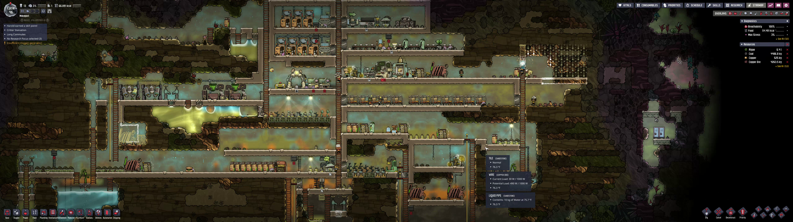



**New here?**

Hi, I'm Michael. I'm a software developer and founder of small, indie tech businesses. I'm currently working on a book called [_Refactoring English: Effective Writing for Software Developers_](https://refactoringenglish.com).

Every month, I publish a retrospective like this one to share how things are going with my book and my professional life overall.



## Highlights

-

## Goal grades

At the start of each month, I declare what I'd like to accomplish. Here's how I did against those goals:

### Set up editing discounts for readers who have read the book

- **Result**: Created a page explaining discounts
- **Grade**: A

I'm intentionally not advertising it as a perk of early access. My goal is to do editing work with people who are already enthusiastic about the book. I'm not trying to entice people to early access by promising discounts for editing.

I am revealing the discount publicly here because if you're interested enough in my work to read these monthly updates, you're also the kind of person I'd like to take on as a freelance editing client.

There have been no freelance editing customers since I doubled my standard rate and added a discount for early access customers, but that's actually fine. I've had more writing output as a result, and I'd like the numbers to work out so that if freelance editing pulls me away from writing, the financial compensation makes me feel like it's a good tradeoff.

### Create a list of early access customers to reach out to

- **Result**: Created a list of 63 customers I can contact
- **Grade**: A

I keep setting a goal to reach out more to readers one on one. I realized there was a lot of friction to finding customers to reach out to, so I simplified my goal to just create a list of customers that are a good match for me to reach out to, according to this criteria:

1. Their email address isn't Gmail/Yahoo/Hotmail or another email-only domain
1. The domain name from their email address serves a website that responds to HTTP requests

Basically, I'm looking for the readers whose websites I can look at to allow me to say something unique and personal to them. I reached out to three customers based on this list. Two of them responded, and one attended last month's live session. I suspect the personalized email was a factor in their attendance. So, I continue to get positive results on this 1:1 outreach; I just need to do it more.

### Publish a new chapter of the book

- **Result**: I published 2.5 new chapters
- **Grade**: A

I published ["How to Get Meaningful Feedback on Your Design Document,"](https://refactoringenglish.com/chapters/useful-feedback-on-design-docs/) "Verbs Drive the Sentence," and "Stay Positive." The design docs one is technically half a chapter, as I plan to expand it for the actual book with more details about what goes into a design doc.

## _Refactoring English_ metrics



Visits to the website are way up. Visitors to the website in October were highest since [my big Kickstarter blitz in March](/retrospectives/2025/04/#blogging-like-my-livelihood-depends-on-it). There were 22.3k unique visitors. Of those, 93% came through ["The Software Essays that Shaped Me"](https://refactoringenglish.com/blog/software-essays-that-shaped-me/).

I wish pre-orders scaled a bit more linearly with visitors, but I'm still happy that my blog posts let new readers find my book.

## I'm running late

When I started writing the book, I felt confident I'd be done by October. I announced that the book would be done by December, just to give myself some padding, but I doubted I'd need it.

Well, it turns out, I need it and then some.

Back in May, I wrote down estimates of [how long I expected to spend writing each chapter of my book](/retrospectives/2025/06/#becoming-less-precious-about-my-writing). Six months later, how accurate was I? I underestimated the effort by about 40%.

I originally thought I'd finish the book in 114 hours, but my current estimate (after 99 hours of writing) is 157 hours, meaning I estimate 58 hours remaining.

I also estimated that I could write the book for five hours per week, but that was incorrect as well, as 99 hours over six months works out to about 3.8 hours per week.

I generally can only write for a maximum of an hour per day. I can write for longer, but my productivity goes way down, so I feel like my second hour of writing is about 20% as productive as the first. I can sometimes squeeze in a second hour in the afternoon, but that's rare.

I also didn't take into account regular occurrences that prevent me from getting a good writing session in:

- Non-book writing
  - e.g., blog posts, retrospectives, notes
- Childcare change-ups
  - Our family normally helps out with childcare, but if someone is sick or unavailable, and we can't find a replacement, my wife or I take time off to cover.
- Freelance editing work
  - I find it hard to [do both in the same day](/retrospectives/2025/10/#adjusting-my-approach-to-freelance-editing).
- Sick days
- Time off
- Days where I just can't get motivated to write.

If I assume I keep going at a rate of around 3.8 hours per week, my remaining 58 hours of writing should take 15.3 weeks, which brings me to mid-February 2026. For padding, I'm going to say I'm aiming to finish the book by the end of March 2026.

I feel more confident about the timelines for the remaining chapters. Early chapters of the book like "Get to the Point" (about writing compelling introductions) are challenging because I have to formalize and refine a thought process that's mushy in my head. But topics about my personal writing process or hiring an editor are easier to explain because it's easier to explain concrete actions I take rather than how I think.

## Topic 2

## Topic 3

## Recommendations

### Evan Hahn's convenience scripts

The best article I read last month was Evan Hahn's, ["Scripts I wrote that I use all the time."](https://evanhahn.com/scripts-i-wrote-that-i-use-all-the-time/) Evan shares several dozens of scripts that make life easier as a developer. My favorites were:

- [`copy`](https://codeberg.org/EvanHahn/dotfiles/src/commit/843b9ee13d949d346a4a73ccee2a99351aed285b/home/bin/bin/copy): Read from stdin and store it in the system clipboard.
  - I'm embarrassed to admit I never thought to do this, and I've always copied from the terminal with my mouse like a savage.
- [`pasta`](https://codeberg.org/EvanHahn/dotfiles/src/commit/843b9ee13d949d346a4a73ccee2a99351aed285b/home/bin/bin/pasta): Print from the system clipboard to stdout.
- [`pastas`](https://codeberg.org/EvanHahn/dotfiles/src/commit/843b9ee13d949d346a4a73ccee2a99351aed285b/home/bin/bin/pastas): Watch the system clipboard and print to stdout every time it changes.
  - The first time I read the post, I overlooked [just how clever this script is](/notes/guis-are-antisocial/).
  - You can run `pastas | wget --input-file=/dev/stdin` in one terminal and then in a browser, just keep copying URLs to your clipboard, and the `pastas` command will download every URL you copy without you having to switch back and forth.
- [`emoji`](https://codeberg.org/EvanHahn/dotfiles/src/commit/843b9ee13d949d346a4a73ccee2a99351aed285b/home/bin/bin/emoji): Search for emoji by text. Like `emoji cool` prints out all the emoji that are associated with the idea of "cool."

So many of Evan's scripts were great ideas that I immediately adopted.

More importantly, I liked the meta-idea of Evan's post: developers should think about scripts that remove friction from their typical workflows. It also expanded my perception of what could even be a script. Like `emoji`, I wouldn't have thought to make a script because I don't have a list of every emoji and a description, but after reading Evan's post, I realized I could have generated it just like Evan did.

It inspired me to add a `chat` script to my path to ask questions to a locally-hosted LLM. I often find myself going to the web browser to look up semantics for command-line tools, so I can instead stay on the command line and just type it to `chat`:

```bash
#!/usr/bin/env bash

# Read prompt from command-line arg.
PROMPT="$1"

# Add implicit context for the prompt.
PROMPT+=' Assume a Linux OS.'
PROMPT+=' Prefer command-line tools.'
PROMPT+=' Optimize for the simplest possible response.'
PROMPT+=' If there are multiple methods, show me the simplest one.'
PROMPT+=' If possible, show me just a code snippet with no additional explanation.'

MODEL='llama3.2:1b'

ollama run $MODEL "$PROMPT"
```

For example, I used it yesterday to remember how to resize an image:

````bash
$ chat 'how do I use imagemagick to resize an image to 1600px in width?'
```bash
convert input.png -resize 1600x output.png
```
````

And it's super fast! That prompt completed on my system in 265ms, so it's much faster than me switching to a browser, searching, clicking for an answer, then switching back to my task.

Evan's companion article, ["Why 'alias' is my last resort for aliases"](https://evanhahn.com/why-alias-is-my-last-resort-for-aliases/) dovetails well with his scripts, as it argues that putting convenience scripts in a folder under your `PATH` (e.g., under `~/.local/bin`) affords you much more flexibility than using shell aliases.

### _Oxygen Not Included_

I'm not an active gamer, but I buy one computer game per year. I typically only play each game for 10-20 hours before I get bored, but I consider the $15-50 I spend to be good value for 10-20 hours of entertainment. Some games, I get really into and play for 25-100 hours (_Stardew Valley_, _XCOM2_, _Cypberpunk 2077_).

_Oxygen Not Included_ been on my mind for almost a year since I saw [Andrew Kelly and Mitchell Hashimoto talking about](https://phanpy.social/#/mastodon.social/s/113602735590180420) how much they love it. Andrew Kelly declared it so good at teaching systems thinking that it should be its own required course in elementary school.

{{}}

I started playing _Oxygen Not Included_ in October, and it's really fun. I've seen it compared to Factorio and Rimworld, but I've never played those games. The game it most reminds me of is _Stardew Valley_, specifically the farming part of the game. In both games, you're trying to build a system that produces something. In the beginning, you have rudimentary tools that force you to do a lot of tasks manually, but as you progress, you get more powerful tools that allow you to automate more of the work and scale up productivity.

The biggest challenge of _Oxygen Not Included_ is that it's hard to learn. There are in-game explanations of some concepts, but a lot of stuff, I've had to learn from trial and error. There are YouTube tutorials, but they're bizarrely long. Like, you eventually get to a point where you can build plumbing, but I didn't understand how it worked, so I looked up tutorials on YouTube, and they're all an 60+ minutes! But it's because they're explaining some super complicated version of plumbing that scales to a million, when all I want to do is build one toilet.

The best tutorial I've found so far is [this written guide by a player named Jahws](https://steamcommunity.com/sharedfiles/filedetails/?id=1359110726).

If you're an _Oxygen Not Included_ fan, tell me the dumb things I'm [doing with my colony](oxygen-not-included.webp).

## Wrap up

### What got done?

- Published ["How to Get Meaningful Feedback on Your Design Document,"](https://refactoringenglish.com/chapters/useful-feedback-on-design-docs/)
- Published two new chapters: "Verbs Drive the Sentence" and "Stay Positive."
- Published ["Hold Off on Litestream 0.5.0"](/notes/hold-off-on-litestream-0.5.0/)
- Published ["Read My Blog With Javascript"](/notes/read-my-blog-with-javascript/)

### Lessons learned

-

### Goals for next month

- Publish two new book chapters
-
