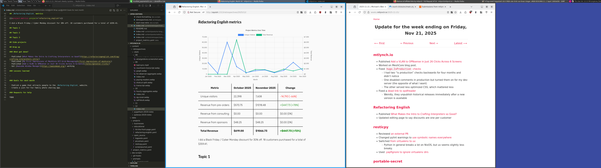



**New here?**

Hi, I'm Michael. I'm a software developer and founder of small, indie tech businesses. I'm currently working on a book called [_Refactoring English: Effective Writing for Software Developers_](https://refactoringenglish.com).

Every month, I publish a retrospective like this one to share how things are going with my book and my professional life overall.



## Highlights

-

## Goal grades

At the start of each month, I declare what I'd like to accomplish. Here's how I did against those goals:

### Goal 1

- **Result**: XX
- **Grade**: XX

TODO

### Goal 2

- **Result**: XX
- **Grade**: XX

TODO

### Goal 3

- **Result**: XX
- **Grade**: XX

TODO

## _Refactoring English_ metrics



I did a Black Friday / Cyber Monday discount for 30% off. 18 customers purchased for a total of $359.41.

## Topic 1

## Topic 2

## Switching to Awesome Window Manager

Here's what it looks like on the desktop for my blog:

{{}}

## Side projects

## Misc

[Firefox Enhanced Tracking Protection](https://blog.mozilla.org/en/firefox/fingerprinting-protections/)

## Wrap up

### What got done?

- Published [What Makes the Intro to Crafting Interpreters so Good?](https://refactoringenglish.com/blog/crafting-interpreters-intro/)
- Published [My First Impressions of MeshCore Off-Grid Messaging](/first-impressions-of-meshcore/)
- Published [Add a VLAN to OPNsense in Just 26 Clicks Across 6 Screens](/notes/opnsense-clicks/)
- Got [Awesome Window Manager](https://awesomewm.org/) working

### Lessons learned

-

### Goals for next month

- Publish a game that attracts people to the _Refactoring English_ website.
- Create a just-for-fun family photo sharing app.

### Requests for help

TODO
