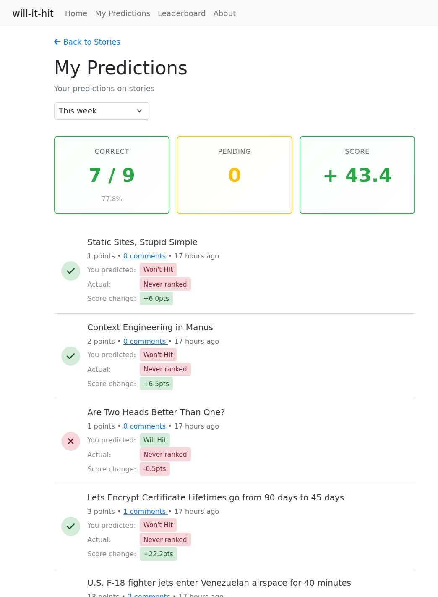
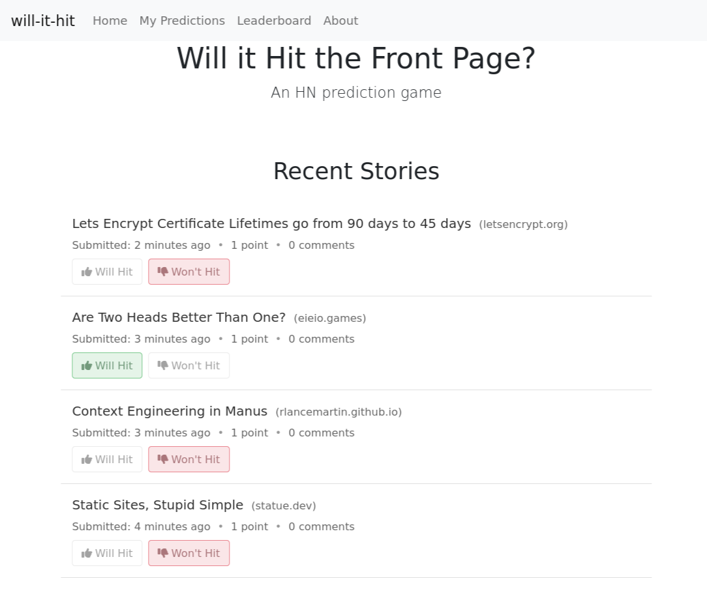
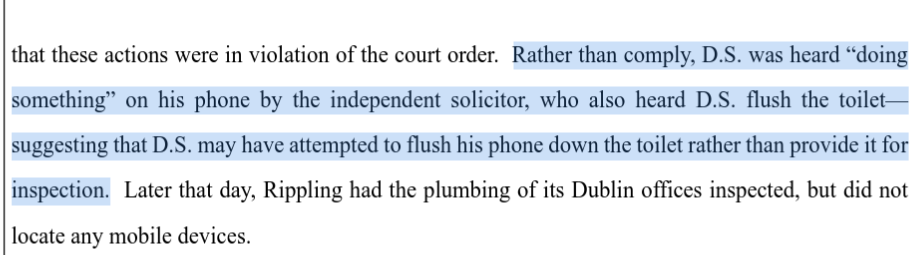



**New here?**

Hi, I'm Michael. I'm a software developer and founder of small, indie tech businesses. I'm currently working on a book called [_Refactoring English: Effective Writing for Software Developers_](https://refactoringenglish.com).

Every month, I publish a retrospective like this one to share how things are going with my book and my professional life overall.



## Highlights

- I'm working on a game to predict which posts will reach the front page of Hacker News.
- I'm creating a family photo sharing app out of spite.
- I switched to a keyboard-first window manager.

## Goal grades

At the start of each month, I declare what I'd like to accomplish. Here's how I did against those goals:

### Publish two new book chapters

- **Result**: Published one new chapter
- **Grade**: C

I've gotten stuck on my design docs chapter. There's a lot I want to cover, and I'm having trouble articulating some of it and deciding how much of it belongs in the book.

Part of the problem is that the chapter is so long that it feels overwhelming to tackle all at once. My new plan is to break the chapter into smaller sections and focus on those one at a time. I think this is my last "hard" chapter, as I have a better sense of what I want to say in the remaining chapters.

### Reach out to 10 readers

- **Result**: I only reached out to two readers (one responded).
- **Grade**: D

I keep procrastinating on this even though I enjoy doing it and get useful responses. I keep automating more of the logistical work in the hopes that reducing initial friction will motivate me to do it more.

### Create a tool or blog post that brings people to the _Refactoring English_ website

- **Result**: Published ["What Makes the Intro to Crafting Interpreters so Good?"](https://refactoringenglish.com/blog/crafting-interpreters-intro/)
- **Grade**: B

3,508 people read the post, so it was somewhat successful at attracting new readers. Bob Nystrom, the author I was writing about, [liked my article](https://lobste.rs/s/jlf6y8/what_makes_intro_crafting_interpreters#c_8kxvys), which was gratifying. I figured even if my article flopped, at least it would let Bob Nystrom know how much I appreciated his work.

## _Refactoring English_ metrics



November was a good month in terms of visits and sales. Visits were down slightly from October, but it was still one of the strongest months of the year.

I did a Black Friday discount for 30% off. I only advertised it to readers on my mailing list, as I always feel strange spamming a sale everywhere. But the announcement was successful, as 18 customers purchased for a total of $359.41.

[Peter Spiess-Knafl](https://spiessknafl.at/peter/), co-founder of [zeitkapsl](https://zeitkapsl.eu/), cited _Refactoring English_ in [a blog post](https://nobloat.org/articles/2025-07-01-hello-blog.html), which [reached #1 on Lobsters](https://lobste.rs/s/wkuvhx/hello_blog). I was glad to see Peter's post, as my plan for the book has always been for it to help readers write successful blog posts and be happy enough about the book that they recommend it.

## "Will it Hit the Front Page?" the game

I read Hacker News so often that I feel like I'd be good at predicting which stories will reach the front page, but I've never tested this belief rigorously. So, I made a game to test my accuracy.

{{}}

The game shows me the newest submissions to Hacker News, and the player predicts whether or not they'll reach the front page:

{{}}

The biggest problem with the game is that a story can take up to 24 hours to reach the front page. Waiting 24 hours for results sucks the fun out of the game.

I tried changing the rules so that you're predicting whether an article will reach the front page in its first 30 minutes, but 30 minutes still feels painfully slow.

My new idea is to make a tentative call 10 minutes after a story has been submitted. Given the story's age, upvotes, and comment count, I can calculate some rough probability of whether it has a chance of hitting the front page. So, if you predicted a story would reach the front page, but 10 minutes later, it still has no upvotes or comments, the game will tentatively tell you that you got it wrong, but you can still get the points back if the story makes a miraculous comeback in the next 24 hours.

I thought about making a version of the game where you guess the results of past stories. That way, I could give instant feedback because the answer is already available, but that feels less fun, as other people have made similar games. Plus, for the HN diehards I'm hoping this game appeals to, past data ruins it because you kind of remember what was on the front page and what wasn't.

## Building a free TinyBeans alternative out of spite

My wife and I had [our first child last year](/retrospectives/2024/09/), so we wanted a way to share baby photos with our family privately. Some of my friends had used apps like this, but they were all ad-supported. I hate the idea of companies slapping ads on photos of my child, so I looked for other options.

When I came across TinyBeans, I thought I'd found a winner. They had a paid version that disabled ads, and privacy was the main feature they advertised: perfect!

Then, I started using TinyBeans, and there were ads everywhere. "Buy our photo books!" "Give us more personal information!"

I opened the app just now and had to dismiss three separate ads to see photos of my own child.



{{}}
{{}}
{{}}



It also turns out that my family members receive even more ads than I see, including for third-party services. Here's a recent one that encourages my family to invest in some scammy AI company:

{{}}

The "no ads" promise of the paid tier is limited to me and my wife; TinyBeans bombards everyone else in my family with ads and upsells.

I wanted to ditch TinyBeans early on, but I was too busy with new parent stuff to find a new app and migrate my whole family to it. So, each month, I begrudgingly give TinyBeans my $9.

Then, Black Friday happened.

TinyBeans sent me an email patting themselves on the back for not cluttering my inbox with Black Friday deals because all the deals would be in the app.

{{}}

Great, an email congratulating yourself about how little you'll email me.

But that wasn't even true! TinyBeans proceeded to send me four more emails telling me to check my app for Black Friday deals:

{{}}

That pushed me over the edge, and now I'm on a spite mission to create my own TinyBeans replacement and stop giving TinyBeans my money.

{{}}

The only functionality I care about in TinyBeans is:

- My family can browse the baby photos and videos I've uploaded.
- My family members can subscribe to receive new photos and videos via email.
- My family members can comment or give emoji reactions to photos.

How hard could that be? 20 hours of dev work? The TinyBeans web and Android apps suck anyway, so I'll be glad to move away from them. And because the experience is mostly email-based, I can replace TinyBeans with my own app without my family noticing or caring.

I'm not starting a company to compete with TinyBeans. I just want to make a web app that replaces TinyBeans' functionality.

## Switching to Awesome Window Manager

One of my shameful secrets as a developer is that I'm bad at managing windows on my screen. I compensate by overusing my mouse, even though that's slow and inefficient.

Last year, I switched from Windows to Linux and [got a 49" ultrawide monitor](/retrospectives/2024/12/#building-my-new-development-desktop). While Windows was designed for mouse-happy users like me, Linux desktops are much more keyboard-focused, so my lack of keyboard discipline began catching up with me. I'd keep opening windows and never close them, so I'd end up with 10+ VS Code windows, 10+ Firefox windows, and 5 different instances of the calculator app for one-off calculations. They were all in one big pile in the middle of my desktop.

At that point, it was obvious I was wasting tons of screen real estate and burning time locating my windows. I tried a few different window managers, but I kept running into issues. Like I couldn't get lockscreens to work, or they'd fail to use my monitor's full 5120x1440 resolution.

The fastest person I've ever seen navigate their computer is [my friend okay zed](https://oky.moe). I asked him for advice, and he explained [his approach to window management](https://oky.moe/a-philosophy-for-window-management/). His strategy is to use many virtual desktops where windows are almost always full screen within the desktop. He uses xmonad, but he suggested I try Awesome Window Manager.

I liked okay's philosophy of single-purpose virtual desktops, so I created [an Awesome window manager configuration](rc.lua) around it. So, I have a dedicated desktop for my blog, a dedicated desktop for my book, one for email, etc. I try to limit myself to 1-2 windows per desktop, but sometimes I'll pull up a third or fourth while looking something up.

Here's what my blog desktop looks like, which is pretty typical: one VS Code window for editing, one Firefox window for viewing the result, and sometimes a second Firefox window for looking stuff up:

{{}}

I didn't like any of the default desktop modes, so I had to [roll my own](singlerow_flex.lua). It gives each window 25% of my screen's width, and if I open more than four, it squishes everything to fit. I can also manually expand or contract windows with Shift+Win+H and Shift+Win+L. Except sometimes I accidentally lock myself out because Win+L is my hotkey for locking the screen.

Based on a few weeks with Awesome, here's how I'm feeling:

- What I like
  - Encourages me to keep single-purpose desktops for better focus.
  - Encourages me to navigate via keyboard hotkeys rather than mouse clicks.
  - Doesn't crash on suspend 2% of the time like Gnome did.
- What I dislike
  - Everything is implemented in and configured through Lua, a language I don't know. I'm using LLMs to write all my configs.
  - The configuration is fairly low-level, so you have to write your own logic for things like filling the viewport without overflowing it.
  - I don't like any of the default desktop modes, so I had to roll my own.
  - The documentation is all text, which feels bizarre for software designed specifically around graphics.
  - If you accidentally define conflicting hotkeys, Awesome doesn't warn you.
  - If I click a link outside of Firefox, sometimes it loads the link in a browser that isn't on my current desktop. I'm guessing it loads it on whatever Firefox window I most recently touched.
- What I still need to figure out
  - How to implement "scratchpad" functionality. Like if I want to pull up my password manager as a floating window or summon the calculator for a quick calculation, then dismiss it.
  - How to put more widgets into the status bar like network connectivity and resource usage.

## Interesting links

### Caching external content in your blog

I was [talking to LGUG2Z](https://m.mtlynch.io/@michael/115538492543985760) on Mastodon about how annoying it is to embed tweets on my blog. If the user deletes their tweet, I end up with dead content in my post. Even when it works, my readers have to load trackers from Twitter. I've been working around it by just screenshotting tweets, but that's an ugly solution.

I want to embed tweets in Hugo (the static site generator I use for this blog) with a shortcode like `{<tweet id="12345">}`, and then Hugo could fetch the tweet data and store it under source control so that I don't have an ongoing dependency on Twitter.

LGUG2Z [explored this idea and implemented support](https://lgug2z.com/articles/version-control-external-content-referenced-in-your-blog/) for it on his Zola blog. He runs a script to pre-download data once from external sources (like tweets), and then he can embed the content in his blog without re-retrieving it at blog build time or reader visit time.

I tried to adapt LGUG2Z's solution for Hugo, but it [got too complicated](https://github.com/mtlynch/mtlynch.io/compare/tweet-embed?expand=1). I wrote [a standalone script](https://github.com/mtlynch/mtlynch.io/compare/tweet-embed?expand=1#diff-900db5d815f28c61d4dd3187315a92f57266a567a028172d8ce9f75bcd8a0a6a) that downloads [data from Twitter](https://github.com/mtlynch/mtlynch.io/compare/tweet-embed?expand=1#diff-ec93853072d628faa14809a2064c79884eec296dca5718c2df5da600c8315d28) and then I'd render it in [a tweet-like UI](https://github.com/mtlynch/mtlynch.io/compare/tweet-embed?expand=1#diff-a1b03c6c84ab4fb445d03326b8ba14611b392fa0bd2074f7a41bd7905e244447). Regular text tweets worked okay, but once I got to tweets with embedded media or retweets, it felt like I was building too much on shaky foundation.

### Michael Stapelberg's experience with Immich

I used to store all of my photos on Google Photos. Despite my privacy concerns, Google Photos was just so much better than anything else that I held my nose and just gave them all my photos. I've since become more privacy sensitive and distrustful of Google, so I stopped uploading new photos to Google Photos, but I haven't found a replacement.

I've heard good things about Immich and Ente, so I was glad to see this detailed writeup from Michael Stapelberg about his experience [setting up an Immich server using NixOS](https://michael.stapelberg.ch/posts/2025-11-29-self-hosting-photos-with-immich/).

### Firefox Enhanced Tracking Protection

Firefox recently improved their [Enhanced Tracking Protection](https://blog.mozilla.org/en/firefox/fingerprinting-protections/), a feature I didn't realize existed. I turned it on, and it blocks trackers that uBlock was allowing and hasn't had any false positives.

### "Rich Friend, Poor Friend"

I just discovered ["Rich Friend, Poor Friend"](https://www.jenn.site/rich-friend-poor-friend/) from 2022 and [the follow up](https://www.jenn.site/contra-contra-rich-friend-poor-friend/) from a few weeks ago. I definitely relate to hiring professionals instead of asking my friends for help (e.g., hiring movers instead of asking friends).

I'm maybe in the worst part of the curve where I'm wealthy enough to not want to ask friends to help me move but not so wealthy that I have a separate guest house to make it easy to host them.

### More evidence that Deel hired a corporate spy

The Deel corporate espionage story is getting surprisingly little attention in my bubble.

In March 2025, Rippling [revealed](https://www.rippling.com/blog/lawsuit-alleges-12-billion-unicorn-deel-cultivated-spy-orchestrated-long-running-trade-secret-theft-corporate-espionage-against-competitor) that they discovered one of their employees was actually a corporate spy working for their competitor, Deel. When they caught the spy, he ran into the bathroom and tried to flush his phone down the toilet.

{{}}

Rippling posted [an update in November](https://www.rippling.com/blog/new-banking-records-prove-deel-paid-thief-who-stole-trade-secrets-from-rippling) that they found banking records showing that Deel had routed payments to the spy through the wife of Deel's COO. The wife was, coincidentally, a compliance lead at Robinhood, another company known for its [scummy ethics](https://www.scu.edu/ethics/focus-areas/business-ethics/resources/robinhood-reddit-and-gamestop-what-happened-and-what-should-happen-next/).

As an unhappy former Deel customer, I'm happy to see them get their comeuppance.

## Wrap up

### What got done?

- Published ["What Makes the Intro to Crafting Interpreters so Good?"](https://refactoringenglish.com/blog/crafting-interpreters-intro/)
- Published ["My First Impressions of MeshCore Off-Grid Messaging"](/first-impressions-of-meshcore/).
- Published ["Add a VLAN to OPNsense in Just 26 Clicks Across 6 Screens"](/notes/opnsense-clicks/)
- Created a tiny Zig utility called [count-clicks](https://codeberg.org/mtlynch/count-clicks) to count clicks and keystrokes on an x11 system.
- Got [Awesome Window Manager](https://awesomewm.org/) working.

### Lessons learned

- Quick feedback is important in creating a fun game.
- TinyBeans actually has a lot of ads, even on the paid version.
- The Awesome window manager is a better fit for my needs than Gnome.

### Goals for next month

- Publish a game that attracts people to the _Refactoring English_ website.
- Publish two chapters of _Refactoring English_.
- Write a design doc for a just-for-fun family photo sharing app.

### Requests for help

- If you're interested in beta testing the "Will it Hit the Front Page?" game, [reach out](/about).
