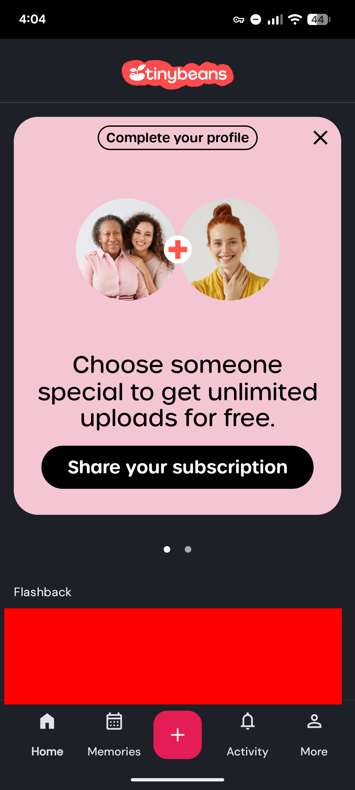
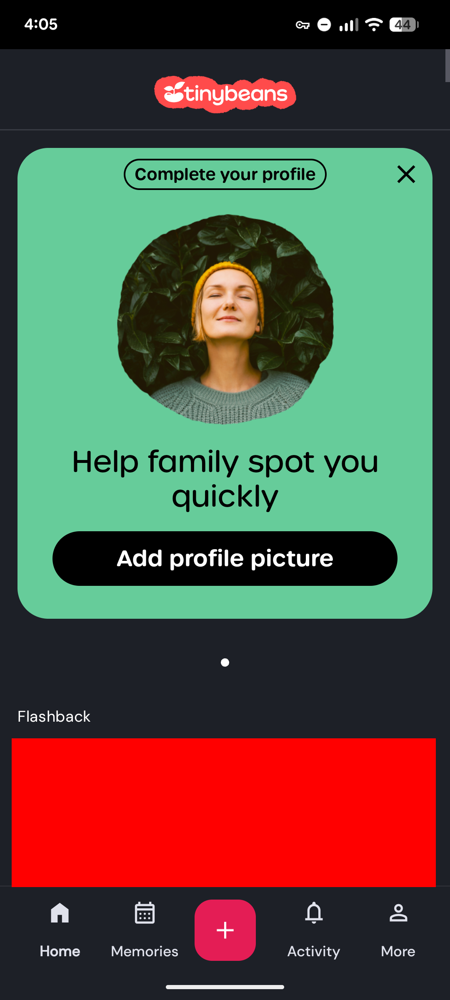
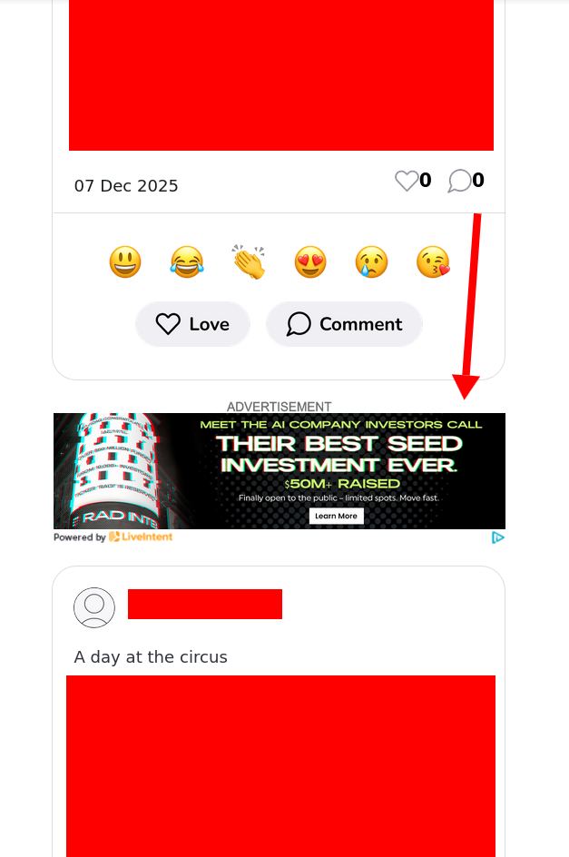
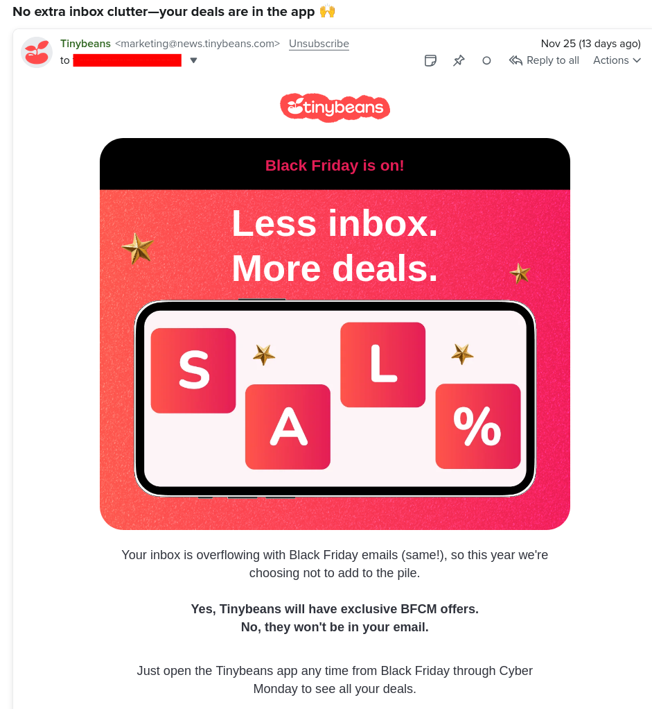
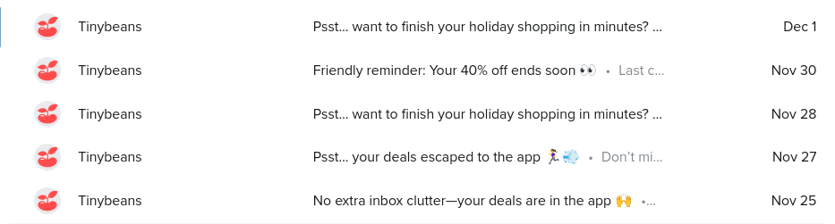
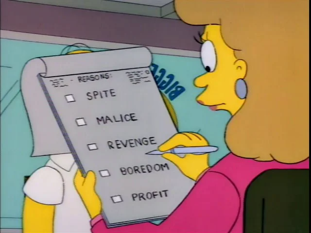



**New here?**

Hi, I'm Michael. I'm a software developer and founder of small, indie tech businesses. I'm currently working on a book called [_Refactoring English: Effective Writing for Software Developers_](https://refactoringenglish.com).

Every month, I publish a retrospective like this one to share how things are going with my book and my professional life overall.



## Highlights

-

## Goal grades

At the start of each month, I declare what I'd like to accomplish. Here's how I did against those goals:

### Publish two new book chapters

- **Result**: Published one new chapter
- **Grade**: XX

TODO

### Reach out to 10 readers

- **Result**: XX
- **Grade**: XX

TODO

### Create a tool or blog post that brings people to the _Refactoring English_ website

- **Result**: Published ["What Makes the Intro to Crafting Interpreters so Good?"](https://refactoringenglish.com/blog/crafting-interpreters-intro/)
- **Grade**: XX

3,508 people read the post, so it was a good. The author of _Crafting Interpreters_ [liked my article](https://lobste.rs/s/jlf6y8/what_makes_intro_crafting_interpreters#c_8kxvys), which was gratifying.

## _Refactoring English_ metrics



I did a Black Friday / Cyber Monday discount for 30% off. 18 customers purchased for a total of $359.41.

## "Will it Hit the Front Page?" the game

I worked on a second thing to attract users to the Refactoring English website. I feel like I read so much Hacker News that I'd be really good at predicting what makes it to the front page. So, I made a game to test myself.

The biggest problem is that it takes an entire day to verify whether a prediction was right or wrong. Waiting 24 hours for any feedback really sucks the fun out of the game.

I tried reducing changing the rules so that you're predicting whether an article will reach the front page in its first 30 minutes, but 30 minutes is still a long time.

My new idea is to make a tentative call 10 minutes after a story has been submitted. Given the story's age, upvotes, and comment count, I can calculate some rough probability of whether it has a chance of hitting the front page. So, if you predicted a story would reach the front page, but 10 minutes later, it still has no upvotes or comments, the game will tentatively tell you that you got it wrong, but you can still get the points back if the story makes a miraculous return in the next 24 hours.

I thought about doing it on past data, but that's kind of boring and other people have done that already. Plus, for the HN diehards I'm hoping this game appeals to, past data ruins it because you kind of remember what was on the front page and what wasn't.

## Building a free TinyBeans alternative out of spite

My wife and I had [our first child last year](/retrospectives/2024/09/), so we wanted a private way to share baby photos with our family. Some of my friends had used apps like this, but they were all ad-supported. I hate the idea of companies slapping ads on photos of my child, so I looked for other options.

When I came across TinyBeans, I thought I'd found a winnder. They had a paid tier where you could disable ads, and privacy was the main feature they advertised: perfect!

Then, I started using TinyBeans, and there were ads everywhere. "Buy our photo books!" "Give us more personal information!" I just tried opening the app and had to dismiss three separate ads to see photos of my own child.



{{}}
{{}}
{{}}



It also turns out that all of my family members receive not just ads for TinyBeans but for third-party services. Here's a recent one that encourages my family to invest in some scammy AI company:

{{}}

It turns out that the "no ads" promise of the paid tier is limited to just me and my wife, but everyone else gets bombarded with ads and upsells.

The final straw happened on Black Friday. TinyBeans sent me an email telling me that they wouldn't clutter my inbox with Black Friday deals because all the deals would be in the app.

{{}}

Great, an email congratulating yourself about how little you'll email me.

But that wasn't even true! TinyBeans proceeded to send me four more emails telling me to check my app for exciting deals:

{{}}

That pushed me over the edge, and now I'm on a spite mission to create my own TinyBeans replacement and stop giving TinyBeans my money.

{{}}

The only functionality I care about in TinyBeans is:

- My family can browse the baby photos and videos I've uploaded.
- My family members can subscribe to receive new photos and videos via email.
- My family members can comment or give emoji reactions to photos.

How hard could that be? 20 hours of dev work? The TinyBeans web and Android apps suck anyway, so I'll be glad to move away from them.

## Switching to Awesome Window Manager

My shameful secret is that I'm sloppy about managing windows on my computer desktop. I compensate by overusing my mouse, even though I know it's slow and inefficient.

Last year, I switched from Windows to Linux and [got a 49" ultrawide monitor](/retrospectives/2024/12/#building-my-new-development-desktop). While Windows was designed for mouse-happy users like me, Linux desktops are much more keyboard-focused, so it was harder to access already-open windows. I'd keep opening windows and never close them, so I'd end up with 10+ VS Code windows, 10+ Firefox windows, and 5 different instances of the calculator app for one-off calculations that I never closed. They were all in one big pile in the middle of my desktop.

At this point, it was obvious I was wasting tons of screen real estate and wasting time managing my windows. I tried a few different window managers, but I kept running into issues. Like I couldn't get lockscreens to work. Or it wouldn't use my monitor's full 5120x1440 resolution.

The fastest person I've ever seen navigate their computer is [my friend okay zed](https://oky.moe/a-philosophy-for-window-management/). I asked him what window manager I should try, and he suggested Awesome Window Manager. His strategy is to use many virtual desktops where windows are almost always full screen within the desktop.

So, I've created single-purpose desktops

Here's what it looks like on the desktop for my blog:

{{}}

- What I like
  - Encourages me to keep single-purpose desktops for better focus.
  - Encourages me to navigate by keyboard hotkeys rather than mouse clicks.
- What I dislike
  - Everything is implemented in and configured through Lua, a language I don't know.
  - I don't like any of the default desktop modes, so I had to roll my own.
  - The documenation is all text, which is bizarre for software designed specifically around graphics.
  - The configuration is fairly low-level, so you have to write your own logic for filling and not overflowing the viewport.
  - If you accidentally define conflicting hotkeys, Awesome doesn't warn you anywhere.

## Misc

- Firefox recently improved their [Enhanced Tracking Protection](https://blog.mozilla.org/en/firefox/fingerprinting-protections/), a feature I didn't realize existed. I turned it on, and it blocks trackers and had any false positives.
- I just discovered ["Rich Friend, Poor Friend"](https://www.jenn.site/rich-friend-poor-friend/) from 2022 and found it describes me. I feel like I'm maybe in the worst part of the curve where I'm wealthy enough to not want to ask friends to help me move but not so wealthy that I have a separate guest house to make it easy to host friends.

## Wrap up

### What got done?

- Published [What Makes the Intro to Crafting Interpreters so Good?](https://refactoringenglish.com/blog/crafting-interpreters-intro/)
- Published [My First Impressions of MeshCore Off-Grid Messaging](/first-impressions-of-meshcore/)
- Published [Add a VLAN to OPNsense in Just 26 Clicks Across 6 Screens](/notes/opnsense-clicks/)
- Got [Awesome Window Manager](https://awesomewm.org/) working

### Lessons learned

-

### Goals for next month

- Publish a game that attracts people to the _Refactoring English_ website.
- Create a just-for-fun family photo sharing app.

### Requests for help

- If you're interested in beta testing the, "Will it Hit the Front Page?" game email me.
