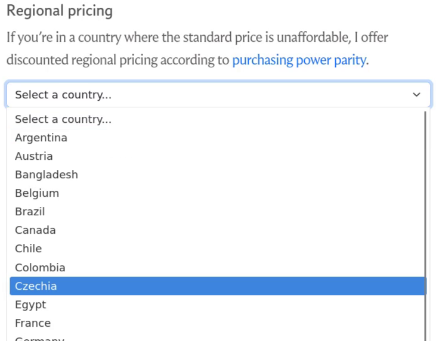



**New here?**

Hi, I'm Michael. I'm a software developer and founder of small, indie tech businesses. I'm currently working on a book called [_Refactoring English: Effective Writing for Software Developers_](https://refactoringenglish.com).

Every month, I publish a retrospective like this one to share how things are going with my book and my professional life overall.



## Highlights

- I added regional pricing for my book based on purchasing power parity.
- I created my first Flutter app.
- I'm writing my first cross-language library.

## Goal grades

At the start of each month, I declare what I'd like to accomplish. Here's how I did against those goals:

### Publish a game that attracts people to the _Refactoring English_ website

- **Result**: Published [The Most Popular Blogs of Hacker News in 2025](https://refactoringenglish.com/blog/2025-hn-top-5/) instead
- **Grade**: B

The blog post was a risky bet because it _only_ could reach new readers if it hit the front page of Hacker News, and its only chance of that is the first couple weeks of the 2026.

Fortunately, the post reached #1 on Hacker News and remained on the front page for almost 22 hours. It continues my strategy of finding readers by [highlighting](https://refactoringenglish.com/blog/software-essays-that-shaped-me/) [other](https://refactoringenglish.com/blog/interview-adam-gordon-bell/) [successful tech writers](https://refactoringenglish.com/blog/crafting-interpreters-intro/), a strategy I like because it feels like a win-win for me, readers, and the writers I showcase.

I still have the Hacker News prediction game at about 80% complete. I'm not sure what to do with it because it's almost done, but I feel like it's not fun, so I'm never motivated to complete it. But I feel like I should at least get it over the finish line to see what people's reaction is.

### Publish two chapters of _Refactoring English_

- **Result**: Made progress on two chapters but didn't complete them
- **Grade**: D

Ironically, the chapters I'm working on are about motivation and focus, but I keep letting my experiments with MeshCore interfere with my writing. I've been better at maintaining focus in the new year, and the experience of getting distracted is actually helpful because it does happen, and I write about how to recover from that in the book.

### Write a design doc for a just-for-fun family photo sharing app

- **Result**: Got 80% through a [design doc draft](https://codeberg.org/mtlynch/little-moments/src/branch/design-doc/DESIGN.md)
- **Grade**: C

Again, I got distracted by MeshCore experiments in December and didn't make as much progress as I wanted. I love design docs and find them helpful but they're also incredibly boring to write, so it was always tempting to shelve the design doc for something with more instant gratifaction.

## _Refactoring English_ metrics



Pre-sales are down because I didn't have any new posts to attract new readers (I didn't publish the Hacker News post until January). Still, I see it as a positive sign that my "passive sales" continue to grow. In December, I had almost $500 in pre-sales. If I compare that to months with similar website visitors, May had only $241 in pre-sales, and August had $361, so the numbers are trending up. I hope that as the book is more complete and more readers recommend it, the passive sales continue to grow without relying on me finding a successful marketing push each month.

## Adding regional pricing for my book

When I ran my [Black Friday promotion](/retrospectives/2025/12/#refactoring-english-metrics) in November, a reader emailed to say that 30% off (US$20) is still an unaffordable price in Argentina for a book. He asked if I'd consider regional pricing. He mentioned that Steam games are typically priced 50% lower in Argentina than the US, so I figured that was a good anchor.

I collect payments through Stripe, and I couldn't find any option for regional pricing in my Stripe dashboard. I found an article in Stripe's knowledge base called ["Geographic pricing in practice: Why it matters and how to implement it"](https://stripe.com/resources/more/geographic-pricing-in-practice) and was delighted until I read the entire article and discovered they'd forgotten to write the "and how to implement it" part of the article.

So, Stripe advocates for regional pricing, but they don't actually offer it. It was a helpful reminder that Stripe is the worst payment processor [except for all those other payment processors](https://winstonchurchill.org/resources/quotes/the-worst-form-of-government/).

So, for my Argentinian customer, I used a one-off process where I manually created a custom payment link for him at a discounted price. And when I went through the process, I realized I could set the price in Argentine pesos so he wouldn't have to pay a conversion fee. I set the price to 22,000 ARS (about US$15), and he seemed happy with the price and checkout experience.

The reader suggested I publicly offer regional pricing, at least for countries like Brazil and India, which have high numbers of developers but relatively low purchasing power.

Even without native Stripe support for regional pricing, it seemed like it wouldn't be that hard to automate the thing I did manually for the reader in Argentina. I read about [Sebastien Castiel implementing regional pricing](https://scastiel.dev/implement-ppp-fair-pricing-for-your-product) for his course, which led me to [Wes Bos' post about the same thing](https://scastiel.dev/implement-ppp-fair-pricing-for-your-product).

Sebastien shared a lot of technical details, but his solution was heavy on React, whereas my site is vanilla HTML and JavaScript. He also relied on discount codes, which I don't like because it means most customers see that there's a special deal they're _not_ getting.

I spent a few hours implementing a solution around a cloud function that determines the right price on the fly and dynamically creates a Stripe checkout link. Then, I realized I could do precompute everything and eliminate the need for server-side logic, so I got to delete my cloud function.

My implementation looks like this:

1. Manually get a list of all countries / currencies that Stripe supports.
1. Write a script that pulls data from the World Bank to calculate the [purchasing power parity](https://en.wikipedia.org/wiki/Purchasing_power_parity) (PPP) for each country in the list from (1).
1. Calculate each country's discount based on their purchasing power relative to the US.
   - e.g., the PPP of Brazil is 54% lower than the US, so they get a 54% discount.
1. Filter out countries where the PPP is within 15% of the US (too small a discount to bother)
1. Filter out countries where the discount would be negative.
   - Othwerise, customers in Luxembourg would have to [pay double](https://www.youtube.com/watch?v=yi8IZAyN5IA).
1. Limit the discount to a maximum of 75%
   - Otherwise the price in someplace like Egypt would be US$4, meaning I'd get like $3.50 after conversion fees.
1. Automatically generate country-specific Stripe price objects and Stripe payment links for each country remaining in the list.
1. Put all the countries in an HTML dropdown on my site:

{{}}

The user just picks their country and it activates the Stripe purchase link for that country, and they pay in their own currency.

I'm just going by the honor system, so I don't bother with IP geolocation or VPN prevention because I expect the rate of fraud to be low. I do hide the discount for each country to discourage people from picking the cheapest option. And part of the benefit of pricing to each country's local currency is that if someone cheats and picks a region that's not really their home currency, they lose some money in conversion fees.

The downside is that the numbers feel probably not correct. According to strict PPP, the equivalent of $30 in the US is $4 in Egypt, but I suspect you can't really buy non-bootleg books for programmers in Egypt for $4.

When Wes Bos did this, he just asked his readers to tell him fair prices, so I'll try that too. Leave a comment or [email me](/about) the normal price range for developer-oriented books in your country.

## Creating my first Flutter app

In December, I published ["My First Impressions of MeshCore Off-Grid Messaging"](/first-impressions-of-meshcore/). I was excited about the technology but disappointed to discover that [the clients are all closed-source](/first-impressions-of-meshcore/#wait-meshcore-isnt-open-source).

At that point, I decided to pause my exploration of MeshCore, but [Frieder Schrempf](https://fris.de/), a MeshCore contributor, replied to my post with [this interesting perspective](https://mastodon.social/@frisch/115651257976050705):

> I share a lot of your thoughts on this topic. Personally I see the value of MeshCore in the protocol and not so much in the software implementations of the firmware, apps, etc. [...] If MeshCore as a protocol succeeds and gets widely used (currently it looks like it does) then properly maintained open-source implementations will follow (at least I hope).

I agreed with Frieder and thought, "Maybe I should just write a proof of concept open-source MeshCore app?"

Actually, there already was a proof of concept MeshCore app. Liam Cottle, the developer of the official MeshCore app, previously wrote [a web app for MeshCore](https://meshcore.liamcottle.net/) as a prototype for the official version. He deprecated it when he made the official (proprietary) MeshCore app, but [the source code](https://github.com/liamcottle/meshcore-web) for his prototype was still available, and the prototype had most of the features I needed.

I wondered how difficult it would be to port the prototype to mobile. MeshCore is too hard to use as a web app, as it requires Bluetooth access and offline mode. I've heard somewhat positive things about [Flutter](https://flutter.dev), Google's solution for cross-platform mobile development. I suspected that an LLM could successfully port the code from the web version to Flutter without much intervention from me.

My plan was to have an LLM create a Flutter port of the prototype in three stages:

1. Write end-to-end tests for the prototype web app using Playwright.
1. Port the prototype implementation (Vue) to a Flutter web app, keeping the end-to-end tests constant to ensure feature parity.
1. Add an Android build to the Flutter project.

That worked, but every step was clunkier than I anticipated:

- Before I could write end-to-end tests for the prototype, I had to [convert it](https://codeberg.org/mtlynch/howdy-neighbor/pulls/5) to use semantic HTML and use ARIA attributes because a lot of the input labels were just bare `
`s.
- I couldn't keep the Playwright tests constant because Flutter actually doesn't emit semantic HTML for web apps. It creates its own Flutter-specific HTML dialect and draws everything on an HTML canvas. Most Playwright element locators still work somehow, but I had to make a lot of Flutter-specific changes to the tests.
- It took a long time, even with an LLM, to figure out how to [build an Android package](https://codeberg.org/mtlynch/howdy-neighbor/pulls/15) with Flutter.
  - Gradle, Android's build system, is buggy on NixOS. I kept running into situations where it was failing with mysterious errors that eventually turned out to be stale data it had cached in my home directory.
- Flutter makes it surprisingly difficult to communicate over Bluetooth. On the web (at least on Chrome), you essentially just get it for free by calling [`navigator.bluetooth.requestDevice`](https://developer.mozilla.org/en-US/docs/Web/API/Bluetooth/requestDevice`), but with Flutter, you have to use a [proprietary third-party library](https://pub.dev/packages/flutter_blue_plus) and roll your own device picker UI.

I thought it would be a quick weekend project I could whip together in a few hours. 30 hours and $200 in LLM credits later, I finally got it working.

{{}}

But the day I got my Flutter implementation to feature parity with the prototype, I went to share it on Reddit and saw someone had just shared [meshcore-open](https://github.com/zjs81/meshcore-open), a MeshCore client implementation in Flutter. It was the same idea I had but with far better execution.

I was disappointed someone beat me to the punch, but I was also relieved. From my brief experience working with Flutter, I was eager to get away from Flutter as quickly as possible. I only wanted to make a proof of concept hoping someone else would pick it up, so I'm happy that there's now an open-source, feature-rich MeshCore client implementation.

## Maybe what MeshCore needs is a cross-language library

While working on my MeshCore Flutter app, I had to implement low-level logic to parse MeshCore device-to-client messages. There's a public [spec](https://github.com/meshcore-dev/MeshCore/blob/6b52fb32301c273fc78d96183501eb23ad33c5bb/docs/payloads.md?plain=1#L54-L57) that defines MeshCore's peer-to-peer protocol, and even that's fairly loose. But there's another undocumented protocol for how a device running MeshCore firmware communicates with a companion client (e.g., an Android client) over Bluetooth or USB, though it shares many of the data structures with the peer-to-peer protocol.

The de facto reference implementation is [the MeshCore firmware](https://github.com/meshcore-dev/MeshCore/tree/companion-v1.11.0/examples/companion_radio), but it intermingles peer-to-peer protocol logic with device-to-client protocol logic and UI logic, and it spreads the implementation across disparate places across the codebase.

For example, a MeshCore client can fetch a list of contacts from a MeshCore device over Bluetooth, but it has to deserialize the raw bytes back into contacts. There's no library for decoding the message, so each MeshCore client and library is rolling their own separate implementation:

- [meshcore.js (JavaScript)](https://github.com/meshcore-dev/meshcore.js/blob/3a9fd3dab2d06a205625cee72dcdf9571268fc17/src/connection/connection.js#L479-L492)
- [meshcore-open (Dart)](https://github.com/zjs81/meshcore-open/blob/e3d7607db91940640fd1b7008b3b13b9abaaddfd/lib/models/contact.dart#L113-L151)
- [meshcore_py (Python)](https://github.com/meshcore-dev/meshcore_py/blob/01e3f21992d24fafd2b160f762eb0a5a6a3f3a41/src/meshcore/reader.py#L84-L112)

What I notice about those implementations:

- They have to use magic numbers like `32` rather than referring to constants defined in some authoritative location.
- None of them have automated tests for their parsers.
- They're dragging unnecessary low-level work into high-level languages. For example, everyone is storing `outPath` and `outPathLen` variables. That's an artifact of the C implementation, where arrays don't know their size. You don't have to manually track an array's size in languages like JavaScript, Python, or Dart.
- They don't check data carefully, so they'll happily pass on garbage data like a negative path length or GPS coordinates that are outside of Earth's bounds.
- They all ignore the flags field even though the flags are supposed to indicate [which fields are populated](https://github.com/meshcore-dev/MeshCore/blob/6b52fb32301c273fc78d96183501eb23ad33c5bb/docs/payloads.md?plain=1#L54-L57). Or at least they're supposed to in the peer-to-peer messages. For device-to-client messages, they seem to be meaningless.

My first thought was to rewrite the logic using a protocol library like [protobuf](https://protobuf.dev/) or [Cap'n Proto](https://capnproto.org/). But I don't see a backwards-compatible way of integrating a third-party library at this point.

So, what if I wrote a core implementation of the MeshCore device-to-client protocol in C? I could add language-specific bindings so that we don't need whole separate implementations for Dart, Python, JavaScript, and any other language you'd want to write in.

So, I started my own MeshCore client library:

- <https://codeberg.org/mtlynch/libmeshcore-client>

The library is not ready to demo as a proof of concept, but it's close.

It's entirely possible the MeshCore maintainers won't like this idea, and it's basically dead in the water without their buy-in. But I did it anyway because I'd never tried writing a cross-language library, and that was an interesting experience. The last time I'd done something similar was 20 years ago when I had to get Python to call a C library using [SWIG](https://en.wikipedia.org/wiki/SWIG). Back then, it felt painful and hacky, and it seems to have gotten 80% better.

I desperately wanted the core implementation to be Zig rather than C, but I saw too many blockers:

- Zig does [not yet compile](https://ziglang.org/download/0.15.1/release-notes.html#Support-Table) to xtensa architecture, which most of the MeshCore devices use.
- PlatformIO, which most of the MeshCore firmware projects use, does not support Zig.
- Dart's [ffigen](https://pub.dev/packages/ffigen) would maybe work with Zig since Zig supports C's ABI, but it was hard even getting it to work with C.
  - Ditto for Python's [cffi](https://cffi.readthedocs.io/en/stable/).

## Wrap up

### What got done?

- I got most of the way through writing two new chapters of _Refactoring English_.
- I got most of the way through writing the [design doc](https://codeberg.org/mtlynch/little-moments/src/branch/design-doc/DESIGN.md) for my photo sharing app idea.
- I published ["The Most Popular Blogs of Hacker News in 2025"](https://refactoringenglish.com/blog/2025-hn-top-5/).
- I created my first Flutter app.
- I created my first cross-language library.
- I made some [contributions](https://github.com/meshcore-dev/meshcore.js/pull/10) [to](https://github.com/meshcore-dev/meshcore.js/issues/12) [MeshCore](https://github.com/meshcore-dev/meshcore.js/pull/9) [meshcore.js](https://github.com/meshcore-dev/meshcore.js/pull/11).
  - Most of which, the maintainers are ignoring.

### Lessons learned

- Minimize in-flight projects
  - One of the things I'm finding with LLMs getting better is that it's easier than ever to start projects. So, LLMs are good at exploring little ideas I have, but I'm still the bottleneck on turning them into something production-ready. The result is that I have a lot of tasks that are in-flight and waiting for me to review them before I publish them. There's mental overhead in so much context-switching and task tracking.

### Goals for next month

- Publish three chapters of _Refactoring English_.
- Publish my 2025 [annual review](/tags/annual-review) (year 8).

### Requests for help

Is $30 (USD) for a developer-oriented book expensive where you live? If so, let me know what you'd expect to pay for a programming book like _Designing Data-Intensive Applications_ in your country (in local currency).
