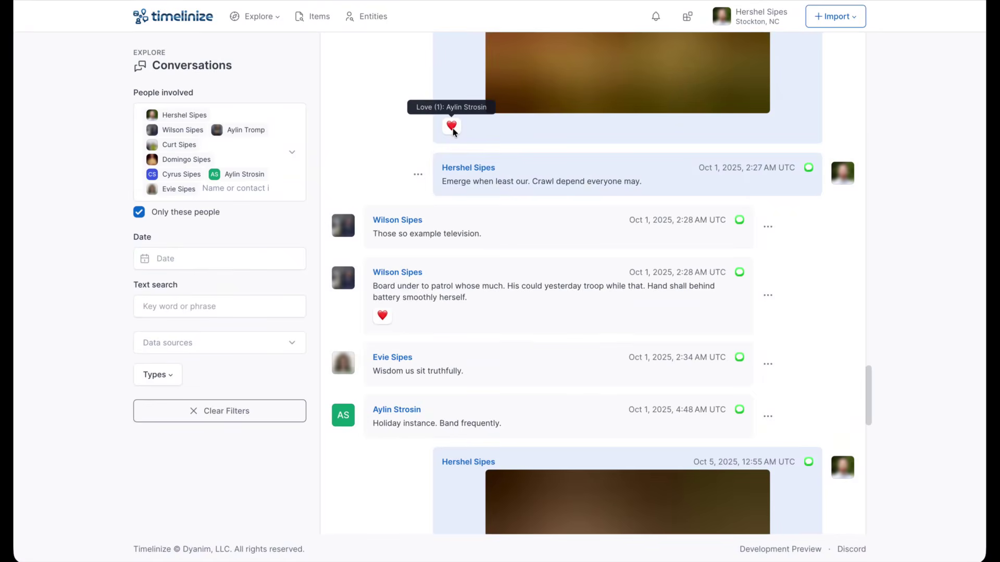



**New here?**

Hi, I'm Michael. I'm a software developer and founder of small, indie tech businesses. I'm currently working on a book called [_Refactoring English: Effective Writing for Software Developers_](https://refactoringenglish.com).

Every month, I publish a retrospective like this one to share how things are going with my book and my professional life overall.



## Highlights

- I'm torn between focusing on my book and pursuing security bug bounties.
- I'm considering a course to teach what I've learned about using AI to find security vulnerabilities.

## Goal grades

At the start of each month, I declare what I'd like to accomplish. Here's how I did against those goals:

### Finish writing _Refactoring English_

- **Result**: I've still got about 1-2 weeks of writing left
- **Grade**: C

I keep feeling like I'm close to done, but then I spend more time than I intend to on bug bounties.

## _Refactoring English_ metrics



Revenue dropped for the book, as I haven't done any marketing [since March](https://refactoringenglish.com/blog/ai-vs-human-design-doc/). Instead, I've been getting distracted by [bug bounty hunting](#three-months-of-bug-bounty-programs). I'm glad I've been able to skate by on past effort, but I see the numbers trending toward zero if I neglect marketing.

## Three months of bug bounty programs

For the past three months, I've been spending a lot of time using AI to find security vulnerabilities. I haven't talked about it publicly because I didn't want to attract competition to the limited supply of bug bounty programs. I wasn't sure if other people realized just how effective AI is at security research, but I think [the cat is out of the bag](https://red.anthropic.com/2026/mythos-preview/).

If you haven't been following along with AI and security research, Firefox is an astonishing case study. Throughout 2025 (before AI was any good at security research) Mozilla and external researchers collectively found 10-20 security vulnerabilities in Firefox each month.

In February 2026, Anthropic used Claude Opus to [find 22 Firefox vulnerabilities](https://www.anthropic.com/news/mozilla-firefox-security). In other words, that month, Anthropic alone found more than everyone else combined in any of the previous 13 months. Two months later, Anthropic used Claude Mythos to find a whopping [271 more vulnerabilities](https://blog.mozilla.org/en/privacy-security/ai-security-zero-day-vulnerabilities/) in Firefox.

I _sort of_ spotted this early, but I got it slightly wrong. Back in January, I thought that AI might be able to revolutionize cybersecurity research, but I thought the value was in creating security tools. I was using AI to write fuzz testing tools and was amazed at how much faster I could perform fuzz testing than when I [did it by hand](/nix-fuzz-testing-1/).

Despite the fact that I could write fuzzers 10-20x faster, it turned out that my strategy was way more work than was necessary. Instead of asking AI to create a fuzz testing tool and evaluate its output, you can just ask AI, ["Hey, look at the source code and tell me all the vulnerabilities."](/claude-code-found-linux-vulnerability/#how-claude-code-found-the-bug)

After I saw how good AI was at directly auditing source code, I stopped fuzzing and focused on source auditing. I've now reported 50+ bugs to five different bug bounty programs and earned about $10k in bug bounties.

## The bugs have gotten easier to find, but the bounty programs have gotten harder

While I've successfully used AI to find security vulnerabilities, I've been less successful at finding companies willing to pay me for my findings.

Here are my results so far:

- Vendor 1: Meta
  - I submitted eight reports, including one remote code execution bug.
  - I received no response for several weeks.
  - I found email addresses for developers that worked on the product and pinged them, and they escalated my reports to get them past triage, but there's been no movement since then (two weeks and counting).
- Vendor 2
  - I submitted one report.
  - Vendor triaged it in one business day, but said it would be several weeks before they could investigate thoroughly.
  - I haven't heard anything in over 30 days.
- Vendor 3:
  - I submitted one report.
  - Vendor claimed it was a duplicate, so no bounty.
- Vendor 4
  - I've submitted 40ish reports.
  - Eight were paid after two weeks for a total of $9,700.
  - Two were rejected as duplicates.
  - The remaining are all awaiting triage, though the most valuable ones were in the first eight that have received payouts.
- Vendor 5: Firedancer (crypto project)
  - Found a few medium-severity issues.
  - When I started the bounty reporting process, I realized that they require researchers to upload their passport to a service I've never heard of, so I stopped there.
  - Their program rules are also sketchy in that they seem to contradict the rules of the bounty platform they're using.

So, the $10k from vendor 4 only took two weeks of part-time work. That would be a great return on investment had I not also spent 6+ weeks on bounty programs that paid nothing. It would also be great if I could find more vendors like vendor 4, but I don't know how to do that.

## Should I focus on the book or bug bounties?

I'm now torn on how to allocate my time between the book and bug bounties. Here's my thinking:

- Focus on my book
  - **Pro**: The book is nearly done, so if I focus on finishing, it will be complete and more valuable than a partially-finished book.
  - **Pro**: The book is something only I can create, whereas lots of people can participate in bug bounties.
  - **Pro**: I'm already late on delivering the book, so finishing it makes me feel less guilty about making readers wait.
  - **Pro**: I can talk publicly about my book, and not only does it help me think out loud, it helps new readers discover the book.
  - **Con**: The expected value of the book feels lower than bounty hunting, at least in the short-term. In theory, I could find a $100k bug next week, whereas it's unlikely I could do anything that would drive $100k in book sales by next week.
- Focus on bug bounties
  - **Pro**: I made more in two weeks of bug bounties than I did in all of 2025 on my book.
  - **Pro**: There's still a massive amount of undiscovered, bounty-paying bugs that AI tools can find.
  - **Pro**: If I pause for a few months, the value of the remaining bugs will be significantly lower, as many other researchers will have claimed the easy-to-find bugs.
  - **Con**: Participating in bug bounties is frustrating, as you have no leverage. The vendor can completely lowball or shaft you, and you have no recourse or negotiating power unless you sell the exploit to buyers who want to use it for nefarious purposes.
  - **Con**: Bug bounty hunting is addictive like gambling in that there are [variable rewards](/retrospectives/2026/03/#ai-coding-offers-variable-rewards) that appear semi-randomly.
  - **Con**: Bug bounties push me back into [bad AI usage habits](/retrospectives/2026/03/#ai-assisted-coding-is-becoming-a-problem-for-me). If I have an AI agent searching for bugs in the background, I constantly want to check on its progress and redirect it based on early results.
  - **Con**: I'm much more limited in what I can share publicly about my work, both because bounty programs often require it and because I don't want to attract competition to the same places where I'm focusing effort.

Rationally, I have a hard time justifying why I should continue chasing bug bounties, but I do want to keep at it a little bit, maybe like a 70/30 split between the book and bug bounties.

## Maybe I should be teaching AI for improving software security

A third possibility is that instead of chasing bug bounties, I teach people what I've learned in the last few months about using AI to find security vulnerabilities.

I'm thinking about offering a small, cohort-based course where we find bugs in open-source projects. We'll pick projects with no bug bounty attached so that students can internally share findings without worrying about someone running off with their reward. The format will be some combination of live or recorded screencasts + a private group chat for 2-4 weeks.

The course is not going to be about making money from bug bounties. Maybe I'll cover that some, but that won't be the focus because that's not what I've learned most about in the last three months.

The course will be about using AI to find security vulnerabilities in large codebases. I'll show the techniques I've learned for getting AI tools to focus on likely areas of bugs and avoid wasting time and tokens on bad leads. You can apply these lessons internally with your own closed-source code or on open-source projects you want to help secure.

If you're interested, sign up for my interest list below:

- [Early interest list - Using AI to find security vulnerabilities](https://tally.so/r/jaGvQR)

## Recommendations

### [Timelinize](https://timelinize.com/) lets you reclaim your data from social media

A few weeks ago, I saw [a question on reddit](https://www.reddit.com/r/DataHoarder/comments/1ssq0xv/i_want_to_delete_my_facebook_but_i_dont_want_to/) from someone who wanted to delete their Facebook account but capture an archive of their data in a usable format. That reminded me of a project I'd seen on Hacker News but never explored much called [Timelinize](https://timelinize.com/).

Timelinize lets you import data you exported from Facebook, Google, Twitter, and similar services, and the app creates a unified timeline to explore your data. The creator is [Matt Holt](https://matt.life/), who also created [Caddy](https://caddyserver.com/), the popular reverse web proxy.

Timelinize still feels pretty alpha-stage, and I had to add a bunch of local patches to make it usable, but I like where it's going. I plan to upstream [more of my patches](https://github.com/timelinize/timelinize/commits?author=mtlynch) as I use it more.

Whenever I find a local, offline solution for something that previously required a cloud service, it feels oddly refreshing. When I switched from streaming services to [Jellyfin](https://jellyfin.org/), I was surprised at how different it felt to just watch what I'm watching without a company watching me back for ways to squeeze money from me.

The weird thing was, when I watched Netflix or HBO, I never consciously thought, "Oh no! I'm being monitored." But when I started exclusively watching TV and movies locally, it was as if I spent so much time in an office cubicle that I forgot that there's an outside at all. Then, I went outside and enjoyed fresh air and sunshine. Metaphorically, I mean. Literally, I was still sitting inside watching TV on my computer. But it was so much faster and freer than before!

I had a similar "breathing fresh air" experience with Timelinize. Timelinize's interface is user-oriented, which makes me realize just how user-hostile the interface is on cloud platforms. Facebook and Twitter don't want you to just scroll through your old messages because that doesn't make money for them. To discourage you from reading your old messages, they make the experience subtly uncomfortable: they squeeze the conversation into a tiny box, they force you to stop and wait for new messages to load every few seconds, and they constantly show you distracting notifications to lead you back to the new content they can monetize.

With Timelinize, the reading experience is designed to let me just read my archive. There's nothing trying to steal my focus and check out what's new because Timelinize shows a historical snapshot. I find it fun to jump to a date 10 years ago and read what my conversations were at the time.

{{}}

### The React2Shell Story and What Happened Next.js

I didn't follow [React2Shell](https://react2shell.com/) at the time, but it was a critical vulnerability in React.js that allowed an attacker to gain code execution on many React.js and Next.js apps.

Last week, the two researchers who discovered React2Shell wrote about what happened behind the scenes:

- ["The React2Shell Story"](https://lachlan.nz/blog/the-react2shell-story) by Lachlan Davidson, the lead researcher on finding the vulnerability.
- ["The React2Shell Story and What Happened Next.js"](https://sylvie.fyi/posts/react2shell/) by Sylvie Mayer, who assisted Lachlan in exploring the vulnerability, notifying vendors, and identifying bug bounty programs that would pay for the vulnerability.

Lachlan's post got more attention, but I found Sylvie's more interesting, especially given that she was a 20-year-old college student at the time.

Lachlan and Sylvie both realized they'd found a "nuclear bomb" that affected hundreds or thousands of major websites. After reporting the bug to Meta (who maintains React) and Vercel (who maintains Next.js), they wanted to identify other bug bounty programs that would pay them for their work on this massive bug.

The researchers couldn't disclose the bug to the other vendors until Meta publicly announced the security advisory. The problem was that once React2Shell was public, Lachlan and Sylvie would lose their edge over everyone else rushing to claim the same bounties.

To get a head start, Sylvie scouted bug bounty programs during the bug blackout period and checked whether those vendors' sites were vulnerable to React2Shell. That way, as soon as Meta announced the vulnerability, Sylvie and Lachlan could claim these third-party bounties.

The problem was that before React2Shell became public, Vercel created a filter for the bug in their web application firewall (WAF) that would protect Vercel customers even if the customer sites were running vulnerable versions of React or Next.js. Meta and Vercel also worked with Cloudflare and similar WAF platforms to teach them how to filter React2Shell attacks.

So, after Meta announced React2Shell, Sylvie tried reproducing the bug against the sites she scouted ahead of time, but the bug didn't trigger. Almost all of the sites with bug bounties were on Cloudflare or Vercel, so the WAFs blocked Sylvie's exploit.

So, now Lachlan and Sylvie had to figure out how to sneak their exploit past Cloudflare's and Vercel's WAFs to trigger React2Shell, but bypassing enterprise WAFs is a massive research project in itself. Fortunately, Sylvie found a bypass in Cloudflare's WAF and five distinct bypasses in Vercel's.

Interestingly, the "vast majority" of what Sylvie earned came not from React2Shell itself but for the WAF bypasses, as Vercel paid $50k per reported bypass.

## Wrap up

### What got done?

- Published new chapters: "Improve Your Writing with AI" and "Meet the Reader Where They Are"
- Held a live session with readers about using AI to improve writing
- Reported a bunch of security bugs through bug bounty programs

### Lessons learned

- It's better for me long-term to focus on my book than on security bug bounties.
  - The hard part is that bug bounties are so short-term rewarding, whereas the rewards for the book typically lag my investments by at least a month.
- It's unexpectedly satisfying to migrate from a cloud service to something you run locally.

### Goals for next month

- Get _Refactoring English_ to "content complete."
- Create a tool that allows _Refactoring English_ readers to give feedback as they read the book.

### Requests for help

If you're interested in learning about using AI to find security vulnerabilities in your team's code, sign up for my interest list. If there's enough interest, I'll put together a course.

- [Early interest list - Using AI to find security vulnerabilities](https://tally.so/r/jaGvQR)
