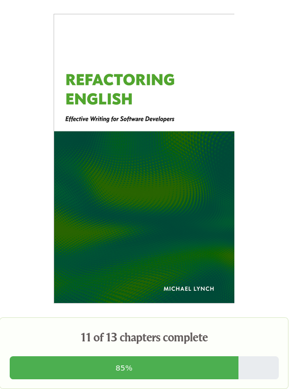



**New here?**

Hi, I'm Michael. I'm a software developer and founder of small, indie tech businesses. I'm currently working on a book called [_Refactoring English: Effective Writing for Software Developers_](https://refactoringenglish.com).

Every month, I publish a retrospective like this one to share how things are going with my book and my professional life overall.



## Highlights

- I've completed all 22 chapters of my book.
- I thought AI made prototyping faster, but now I'm not so sure.

## Goal grades

At the start of each month, I declare what I'd like to accomplish. Here's how I did against those goals:

### Get _Refactoring English_ to "content complete"

- **Result**: I've completed all chapters
- **Grade**: A

This has felt like it was a week away for six weeks, so I'm glad to finally have all the chapters done.

### Create a tool that allows _Refactoring English_ readers to give feedback as they read the book

- **Result**: Tool is only about 40% complete.
- **Grade**: C

This seemed like it should basically be a 2-3 day project, but I realized it's more difficult than it seeemed, especially due to [the great blockade](#ai-projects-and-the-great-blockade)

## _Refactoring English_ metrics



Eep, I continue to neglect marketing, and the numbers are suffering for it.

I was desperate to get the last few chapters of the book done, so I focused only on that rather than investing in any marketing.

## Bug bounty metrics

I've continued pursuing security bug bounties, but I've reduced my time on them. I'm not quite doing the 70/30 split I planned, but maybe like 60/40.

The main vendor I've been working with paid me another $7k (bringing me to $17k total) for reports, but they've slowed down on processing reports, so I've mostly stopped searching for new bugs in their code.

I submitted bugs to a few other programs to check if any are processing bug reports quickly, but none of them are:

- KeePassXC - I submitted an RCE to Zero Day Initiative on May 18th, but I haven't heard any response.
  - For KeePassXC users, this isn't a zero-click attack or something that could compromise your database by just visiting a malicious website, so don't get too worried.
- Cloudflare - I submitted a DoS / logic bypass via HackerOne on May 22nd. No response.
- Proton - I submitted one low severity issue. They asked for a video proof of concept, so I made one on May 29th, and they said to wait to hear back.

## When is the book "done?"

I've completed all the chapters of the book, which is a relief, but I don't consider it officially "done."

I wrote the book over the past year and a half, usually focusing on a single chapter at a time. I haven't ever read my own book cover-to-cover to make sure it's all consistent. I want to do at least a few complete readthroughs before I call it done.

## Why wasn't I continuously revising the book?

I originally planned to continuously edit the book based on reader feedback. That way, when I got to the last chapter, the book would be pretty much done because the rest of the book would have had so many revisions based on comments from readers.

In reality, I integrated reader feedback far less than I expected.

I found it hard to split my focus between revising past chapters and writing new ones. If I spent a week revising old chapters, it didn't feel like forward progress. When I added a new chapter, it meant that my public progress meter got a little fuller, which was motivating.

{{}}

The other reason I didn't continuously revise is that I didn't reach out to readers as much as I planned. Part of that is that I constantly felt behind on the book, so there was always a sense of, "I want to get this chapter out, and _then_ I'll invest more into reader outreach."

But even when I reached out to readers, it rarely impacted the book. The most common responses from readers were, "I like the book" or, "I haven't started it yet."

When I did get detailed feedback, I wasn't always sure how to integrate it. In some cases, I agreed with the feedback, so it was an easy decision. Usually, though, the reader would suggest adding something that I didn't think was necessary. And that's not to say the reader was wrong, but I'd want to see a pattern in reader feedback before I go against my intuition, and I wasn't getting enough feedback to see a pattern.

### My reader feedback tool

Now that I've completed all the chapters, I feel like I have more space to reach out to readers.

I like the idea of [_Help this Book_](https://helpthisbook.com/), a web app that allows readers to give feedback directly in your ebook, but I didn't want to store all of my feedback with a third party and pay monthly rent.

I saw that Julia Evans [made her own reader feedback tool](https://jvns.ca/blog/2023/03/31/zine-feedback-site/), customized to her products, and I thought that was neat, so I'm working on that.



##

## AI projects and the great blockade

Overall, I've found that AI makes me more productive when programming. There are certain tasks like resolving git merge conflicts, debugging unfamiliar code, or making simple tools where AI is a clear win.

I used to think AI was great at helping me start projects, but now I'm not so sure. I keep hitting what I call "the great blockade."

### Just have AI make the prototype

Six months ago, I'd give the AI agent a high-level overview of what I wanted and tell it to implement a basic v1 implementation. I knew the agent's output would be messy, but it was just a prototype, so I could keep giving it feedback until it matched my programming sensibilities.

It turns out that it's harder than I expected to clean up a bad prototype. Once the prototype is bad enough, I have a hard time untangling what the code is even trying to do.

AI seems to have a weird bias to justify whatever code is already present. If I tell the AI that a component seems confusing because it's iterating over the same data three times, it just keeps insisting we have to iterate over the data three times because of X, Y, and Z. But it never questions whether X, Y, and Z are artificial constraints.

This is the blockade. I get stuck trying to move beyond a giant wall of confusing code that AI constructed.

If I don't fix the core logic, the problem keeps getting worse. The code smells grow like fungus and spread throughout the codebase. I'm building on top of a weak foundation, and the AI just keeps duplicating bad patterns that already exist.

### Break down the prototype

Okay, easy fix: have the AI agent create the prototype in smaller pieces. Keep the AI on a tighter leash so it can't go so far into the weeds. Instead of having the AI create the whole prototype, have it start with a welcome page. Once that's reviewed and merged, add one simple feature, and so on.

That works fine until I get to a complex chunk, like authentication. AI creates a pull request that's 2-5k LOC of confusing code, and that becomes a huge wall. I can't think of a way to break down the feature any further, so I'm stuck with this massive PR, another great blockade.

Not only does a 4k LOC change takes 20x as long to review as a 400 LOC change, but it also requires larger review windows. If I have a 20-minute block available, I can tackle the 400 LOC change, but if I have a 4k LOC change, I need 20 minutes just to build up context. To make meaningful progress on a 4k LOC change without wasting most of it on context friction, I need a 90-minute window, which is hard to come by especially for weekend projects.

### Example: Implementing authentication for Little Moments

Here's an example. For [Little Moments](https://codeberg.org/mtlynch/little-moments), I'm doing authentication [with magic login emails](https://codeberg.org/mtlynch/little-moments/src/commit/c388029a761628fa48467b25a83d213220394213/docs/design/DESIGN.md#authentication). And for several weeks, I couldn't think of a way to break that feature down without introducing dead code or broken features. I can't implement half a login flow.

After several weeks of chipping away at a giant PR little by little, I realized I actually _could_ implement half a login. [PicoShare](https://github.com/mtlynch/picoshare), another app I maintain, has a simple authentication flow. The app assumes a single authorized user, so authentication is just a passphrase, not even a username/password pair. Instead of a huge switch from no authentication to email-based authentication, I could go from no authentication to passphrase authentication.

So, I [got passphrase authentication working](https://codeberg.org/mtlynch/little-moments/pulls/131), but moving from passphrase to magic email logins was still a pretty massive PR that would take me weeks to review. After hacking on it over several days, I realized I could break it down further.

Instead of actually sending emails with a login link, I could just immediately redirect the user to the link I _would have_ sent them. That was still [a 1.7k LOC PR](https://codeberg.org/mtlynch/little-moments/pulls/167), but it was more manageable than sending actual emails. And it reduced the [actually sending emails part](https://codeberg.org/mtlynch/little-moments/pulls/103) to a mere 1k LOC.

### How AI makes this harder

The thing that makes me wonder if AI is a net positive on this type of work is that I know I would have spotted these opportunities to break down the problem had I not been using AI. I would never create a 4k LOC PR and then say, "Hmm, this is pretty big." As the PR grows larger, it becomes more painful to work with, so I naturally see opportunities to break the change into smaller pieces.

AI disrupts that natural feedback loop. With AI, there's no pain in creating a 4k LOC PR because it happens in two minutes while I check my email. And I can easily give notes to improve the 4k LOC PR and feel like I'm making progress, but the big change makes it hard for me to identify what pieces can lift out into their own smaller changes.

Now that I recognize how easy it is to generate huge, unmanageable PRs for complex changes, I can change the way I use AI to invest more upfront into breaking features down into tinier changes.

## Wrap up

### What got done?

- Published the last chapters of my book.
- Created a partial prototype of a book feedback app.
- Partially implemented authentication for Little Moments.
- Cut two new releases of PicoShare

### Lessons learned

- Using AI eliminates the natural feedback cycle that motivates me to build software in smaller chunks.
  - I think the solution is to work harder earlier in the lifecycle of complex features to break things down into smaller chunks and be more strict in checking the AI's output.

### Goals for next month

- Invest at least five hours into improving the _Refactoring English_ website.
- Attract 30k unique readers to the _Refactoring English_ website.
- Complete my reader feedback tool.
