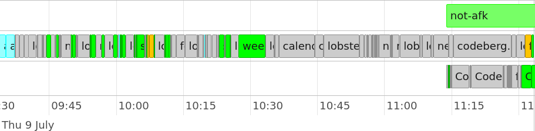
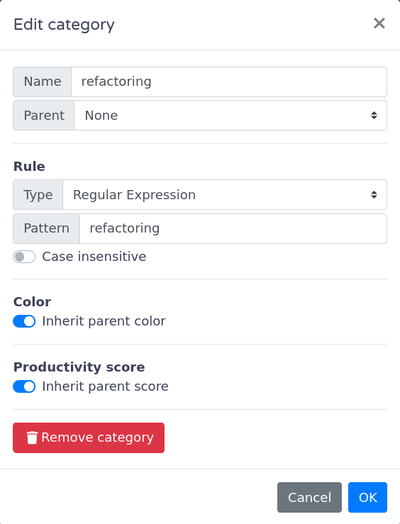



**New here?**

Hi, I'm Michael. I'm a software developer and founder of small, indie tech businesses. I'm currently working on a book called [_Refactoring English: Effective Writing for Software Developers_](https://refactoringenglish.com).

Every month, I publish a retrospective like this one to share how things are going with my book and my professional life overall.



## Highlights

-

## Goal grades

At the start of each month, I declare what I'd like to accomplish. Here's how I did against those goals:

### Invest at least five hours into improving the _Refactoring English_ website

- **Result**: Spent about three hours improving the website
- **Grade**: B-

TODO

### Attract 30k unique readers to the _Refactoring English_ website

- **Result**: Got 17.5k unique readers.
- **Grade**: B-

I adapted my chapter on design docs to [a free excerpt](https://refactoringenglish.com/excerpts/write-an-effective-design-doc/). It did well on [Lobsters](https://lobste.rs/s/kmx6wx/how_write_effective_software_design) and [reddit](https://www.reddit.com/r/programming/comments/1uevttg/how_to_write_an_effective_software_design_document/), but it flopped on Hacker News.

I was surprised at how positive the reaction was to the design docs chapter. Generally, when I talk to developers about design docs, their main reaction is that they hate design docs and everything about them. The comments on my post were refreshingly supportive of design docs in general and my recommendations in particular.

### Complete my reader feedback tool

- **Result**: The tool is up and running
- **Grade**: A

I got stuck for a while on [the great AI blockade](/retrospectives/2026/06/#ai-projects-and-the-great-blockade), but I pushed through by thinking more critically about breaking up large features and being less precious about code quality, as "done is better than perfect" in this case.

## _Refactoring English_ metrics



This was a great month! It was the best month of book revenue since the initial crowdfunding launch, beating out the previous #2 by about 30%. The increase in visitors came from publishing my [excerpt about design docs](https://refactoringenglish.com/excerpts/write-an-effective-design-doc/).

## How much difference does the last 8% make?

For the last few months, the _Refactoring English_ website has listed the book as _almost_ complete in early access. I was curious to see what the sales impact would be of going from almost complete to fully complete.

<canvas id="book-sales-chart"></canvas>

<canvas id="all-currencies-completion-revenue-chart"></canvas>

But the thing I noticed anecdotally was that more _Americans_ were purchasing the book after I declared it complete, so I checked the data to see if that was true:

<canvas id="completion-revenue-chart"></canvas>

Interesting! Completing the book had no impact on sales for customers purchasing with regional pricing, but customers purchasing in USD purchased at a 20% higher rate in the three weeks after the book was complete compared with the three weeks before.

I didn't include sales after I published my latest excerpt because that obviously changes the numbers a lot, but let's treat that as its own category:

<canvas id="design-docs-excerpt-revenue-chart"></canvas>

But that's always a little skewed because Americans make up my largest readers. What if I normalize it to per-visitor to the website?

<canvas id="revenue-per-visitor-chart"></canvas>

That's an interesting wrinkle. On a per-visitor basis, Americans were not more likely to buy after the book was completed, but there just happened to be more website visitors in that time. Outside the US, readers spent about 20% more on a per-visitor basis after I finished the book.

## My custom book feedback tool

I thought I'd make a feedback tool, and it seemed so easy, but it's taken me XX months. I haven't been working on it full-time for XX months, but that's the problem: with AI, so many projects seem easy, but then I have five projects going at once and make too little progress on all of them.

My feedback tool has only been live for a few days, but it does seem to encourage more feedback and questions.

## Topic 3

## Trying out ActivityWatch

I go through periods of feeling like, "Where is all my time going?"

About 15 years ago, I tried RecueTime, and I didn't find it that useful, and then I realized I was letting a random company collect everything that appeared on my screen, and I promptly uninstalled it.

I was wishing that there was an open-source version of RescueTime, and then I thought, "Wait, there probably is one." And there is. It's called ActivityWatch.

The problem is that it's way less polished than RescueTime. I couldn't understand what the web interface was trying to report to me at all:

{{}}

And the process for adding categories through the web UI felt really confusing and coarsely-grained:

{{}}

So, I was going to abandon ActivityWatch, and then I thought, "Well, the data collection part probably works. What if I vibecode my own frontend?"

And [I did](https://codeberg.org/mtlynch/aw-web-ng), and it was pretty easy. I create a config file that lets me categorize activities based on app name, window title, and/or URL (for browsers):

```yaml
- name: Book/Feedback Site
  rules:
    - url: "*refactoring-english-feedback*"
    - window_title: "*refactoring-english-feedback*"

- name: Book/Website
  rules:
    - url: "*refactoring-english-landing*"
    - window_title: "*refactoring-english-landing*"

- name: Book/Writing
  rules:
    - app: Zathura
    - app: Code
      window_title: "*refactoring-english*"
    - app: firefox
      window_title: "mtlynch/refactoring-english *"
```

And then the output looks like this:

```text
$ go run ./cmd/app --config data/config.yaml
...
Book               1h34m   19.7%
  Feedback Site      48m   10.0%
  Writing            46m    9.7%
```

I started with just a command-line app, but I'm working on a web version as well.

## Wrap up

### What got done?

- Finished the _Refactoring English_ feedback tool.
- Made fixes to _Refactoring English_ for consistency and EPUB compatibility.
- Made a [demo video for Little Moments](https://refactoringenglish.com/excerpts/write-an-effective-design-doc/#an-example-design-doc).
  - I'm quite proud of this.

### Lessons learned

-

### Goals for next month

- Pitch to 5 podcasts to talk about _Refactoring English_.
- Attract 30k unique readers to the _Refactoring English_ website.
- Wrap up early access, and declare the 1.0 release of my book.

<script src="/third-party/chart.js/2.9.4/Chart.min.js"></script>
<script src="script.js"></script>
