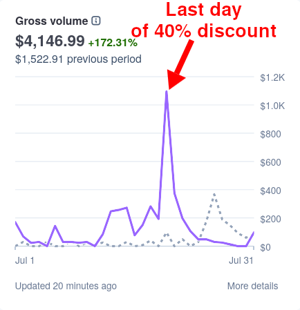
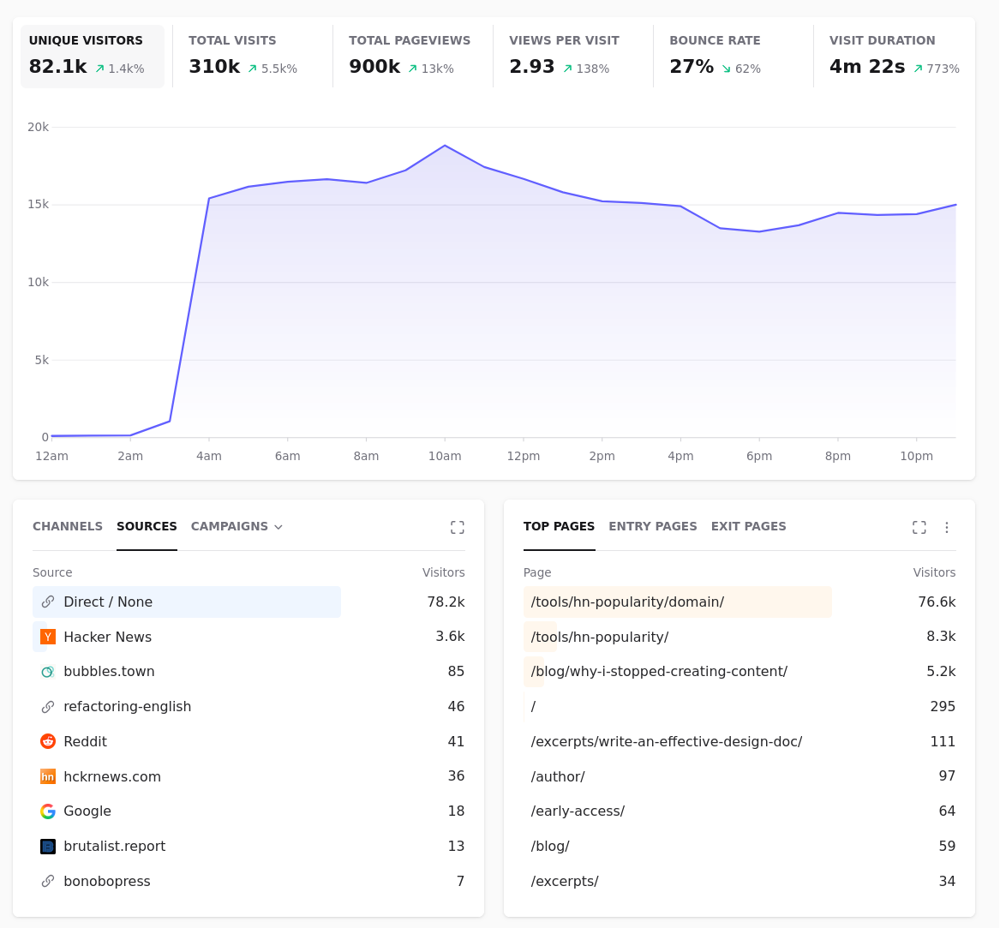
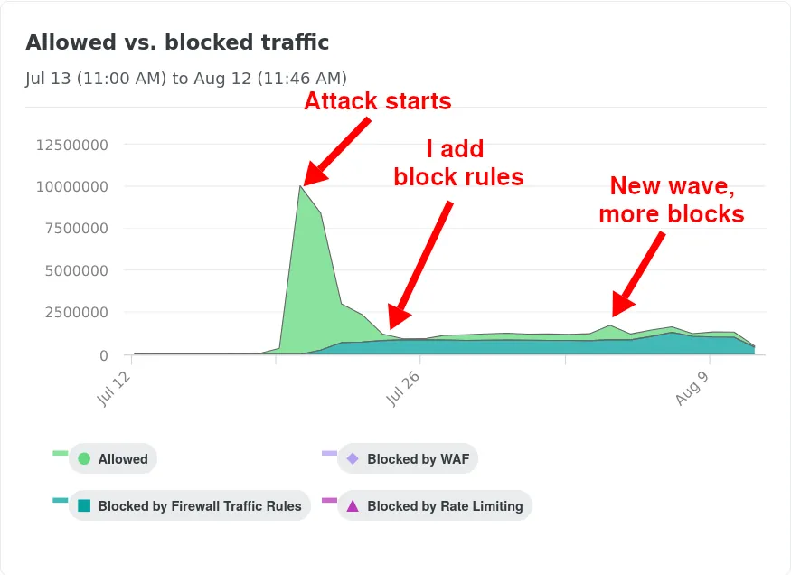



**New here?**

Hi, I'm Michael. I'm a software developer and founder of small, indie tech businesses. I'm currently working on a book called [_Refactoring English: Effective Writing for Software Developers_](https://refactoringenglish.com).

Every month, I publish a retrospective like this one to share how things are going with my book and my professional life overall.



## Highlights

- July's book sales tripled the already-strong sales I saw in June.
- I'm fighting the world's dumbest scraper bot.
- I'm using AI to make a multiplayer browser game.

## Goal grades

At the start of each month, I declare what I'd like to accomplish. Here's how I did against those goals:

### Pitch to 5 podcasts to talk about _Refactoring English_

- **Result**: Pitched to only one podcast
- **Grade**: D

I spent a lot of time working on a pitch to _Talking Postgres_, but then I realized the host has no contact information except for LinkedIn. So, I sent her a LinkedIn message but never heard back. I was [a guest on _The TMPDIR Podcast_](https://tmpdir.org/053/), though they invited me even before I pitched to them, so I can't count that one.

### Attract 30k unique readers to the _Refactoring English_ website

- **Result**: The site had 23.8k unique readers
- **Grade**: B

I was secretly thinking of this goal as "get one post on the front page of Hacker News," but I did and still didn't reach 30k readers.

### Wrap up early access, and declare the 1.0 release of my book

- **Result**: Still not at 1.0 release
- **Grade**: D

I ended up spending more time than I expected responding to user feedback. My [feedback app](/retrospectives/2026/07/#readers-are-leaving-useful-feedback-in-my-books-app) is working, but it also generates new work that's hard to predict.

## _Refactoring English_ metrics



June was the second best month of sales for my book since the Kickstarter, but then July's sales tripled June's.

The main reason for the jump in sales was that I ended the early access discount. I announced on July 13th that early access pricing would end on July 20th, so the price would increase from $30 to $49.

{{}}

On the last day of the sale, I published a blog post called ["Why I Stopped 'Creating Content,'"](https://refactoringenglish.com/blog/why-i-stopped-creating-content/), which reached the front page of Hacker News. And then it was [the top post of the day on bubbles.town](https://bubbles.town/entry/44752223), a Hacker News-style site that's more indie and less tech-centric.

There was a huge spike in sales on the last day of the sale, with over $1k in sales on that day alone.

When I bumped the price to $49, sales quickly plummeted, which I expected. I plan to experiment more with pricing after I get to the book's official 1.0 release.

## I'm fighting the world's dumbest scraper bot

I published my blog post on Monday and got a big jump in visitors. Then, Tuesday, there was another huge surge:

{{}}

All the visitors were going to the [Hacker News Popularity Contest](https://refactoringenglish.com/tools/hn-popularity/). It's happened before where a blogger talks about their rank in the contest and links to my tool, and I see a big jump in visitors, but never like this, and never such a sustained wave of visitors.

When I saw the second spike, I thought, "Wow, I'm on a roll this week!" I was telling my wife about it when I had a startling realization:

> I got another fifty thousand visitors today! I'm not even sure where they're coming from. My guess is someone tweeted it.
>
> Hmm, actually, if someone tweeted it, I'd see Twitter as the referrer.
>
> Oh... It's bots.

And I checked the logs and saw that all of the requests had the exact same browser user agent:

```text
Mozilla/5.0 (Macintosh; Intel Mac OS X 10_15_7) AppleWebKit/537.36 (KHTML, like Gecko) Chrome/125.0.0.0 Safari/537.36
```

That's Chrome 125, a browser version that's over two years old. The browser version made it easy to identify the bots, as it's unlikely that any human users who read my blog still use a browser that old.

The scraper seemed to just repeatedly load the [root contest page](https://refactoringenglish.com/tools/hn-popularity/) and then click every link over and over again, so I tried getting sneaky with it. I put a rewrite script on Bunny that checked the user agent and returned a fake response if it was the scraper. So instead of generating a page with 3,000+ links, it would generate a page with only three links.

For whatever reason, my fake responses didn't work. I suspect the scraper had already added the full set of URLs to a database, and so hiding them from the homepage didn't do anything.

I tried rate-limiting, but the lowest rate limit Bunny supports is 1 KB/s, and most of the app's data is in files that are only a few KB each. The scraper was rotating around 100ish different IP blocks, so I couldn't throttle by IP.

Finally, I just blocked by IP range. I vibecoded a tool that scraped my Bunny logs for the specific user agent and collected all the IPs associated with the attack. That worked, but then the attack started up again a week later from new IPs and a new, slightly more recent user agent, so I just re-ran my script and updated my list of IPs to block, and that seems to be working.

The weirdest thing about the attack is that the bots don't care about being blocked. They just keep hammering the server anyway. I'd expect them to say, "Oh, no use wasting compute and bandwidth on requests that have 100% been blocked at the TCP level for the past two weeks," but they don't mind apparently.

{{}}

I reached out to Netlify support the day the attack began, but they were useless. I had to wait a week for each response. I think the first response was AI-generated because it told me to modify settings that didn't exist. And then the second response seemed more human, but it basically said, "It looks like you solved this problem in the two weeks it took for me to respond, so nothing left for me to do!" Fortunately, they did refund me the $55 in overage fees after I asked.

## Where can I host a static site?

I host all my static sites with Netlify, and they've been getting progressively worse, but their complete indifference to the scraper bot attack has inspired me to find a vendor that will handle scraper bots more proactively.

The obvious answer is "Cloudflare," but I'm alarmed at how much of the Internet's infrastructure has centralized around Cloudflare, so I don't want to centralize it further.

I also considered just hosting on a VPS or a VPS + Bunny as a CDN, but I don't want my site to go offline the day I'm on the front page of Hacker News because my VPS crashes or I misconfigure caching on Bunny. I want a solution where I just pay someone else to keep my site online.

- [Surge](https://surge.sh/)
  - Pros
    - Focused exclusively on static hosting, which is exactly what I want
    - Unlimited bandwidth, so they assume the cost of scraper bot attacks
  - Cons
    - Run by a single person (I think), so increased outage risks
    - All management is through their terminal app. There's no web app
    - It doesn't look like they support multi-factor authentication, though it looks like they're working on it
    - The upload process unconditionally uploads every file rather than an rsync-like sync of only the changed files, which is a pain for my large sites that only change incrementally
- [statichost](https://www.statichost.eu/)
  - Pros
    - Run by a single person, so customer service is responsive and comprehensive
    - Focused mainly on static hosting without extra complexity
  - Cons
    - Run by a single person, so increased outage risks
    - The upload process unconditionally uploads every file rather than an rsync-like sync of only the changed files, which is a pain for my large sites that only change incrementally
    - Bot scraper protection is not included
    - Bundles together site builds and hosting, but I only want hosting
    - A big selling point is being EU-centric, but I'm in the US
- [Vercel](https://vercel.com)
  - Pros
    - Claims to prevent DDoS / scraper bots
    - I think they support rsync-style uploads
  - Cons
    - Giant, complicated service
    - I have no reason to believe Vercel will treat me any better than Netlify does
- Roll my own solution on top of Bunny CDN
  - I considered this, but implementing incremental uploads and atomic deploys on Bunny would be its own complicated project

## Mikeville: My unfinished multiplayer browser game

I've been experimenting with a small cloud-hosted server, but it has 4 CPUs and 8 GB of RAM, and it mostly sits idle. If I have a decent server sitting around with excess capacity, what would be a fun thing to host for my friends?

What about a game? I've seen self-hostable games like [Valheim](https://www.valheimgame.com/) and [ARK](https://playark.com/), but it seems like for those, you need other players on at the same time, or it's no fun.

As someone who only plays computer games every few months, I want something where I can pop in and have fun if other people are there at the same time, but it's also fun to see what happened in my absence. The feeling I have in mind is like if I co-owned a beach house with my friends, and we vacationed there together sometimes, but we left notes and gifts for each other if we visited separately.

The problem is that I can't think of how to translate my beach house feeling concept into a tangible concept for a game.

For now, I'm exploring what vibecoded game development is like and seeing what feels fun. The two games I had in mind designing this prototype were Stardew Valley and Ultima Online, two games I've spent many hours playing.



The game is available if you'd like to play it in your browser:

- [Mikeville Public Demo](https://mville.mtlynch.io/#password=i%20love%20unit%20tests)

I'll be online a little today if you'd like to visit. Source is currently [on GitLab](https://gitlab.com/mtlynch/mikeville) until I find a better git forge.

## Blog posts I enjoyed

- [Stripe Just Wants a Number](https://blog.exe.dev/billable-facts)
  - I enjoy the exe.dev blog, and I find that they have an interesting way of thinking about problems, especially software problems that affect small software vendors. I don't have any billing logic that's complicated enough to benefit from this, but I think it sounds neat in principle.
- [99% of My Website Traffic Is Bots](https://patronview.com/news/99-percent-of-my-website-traffic-is-bots/)
  - Given my experience with scraper bots this month, I found this relatable and helpful. I also appreciated the custom illustrations.
- [I Regret Migrating to Codeberg](https://マリウス.com/i-regret-migrating-to-codeberg/)
  - I've been moving my projects from GitHub to Codeberg for the past year, and I'm a paying member, but I now regret investing in that platform. There are so many outages and days where the servers are overloaded. The final straw was Codeberg's decision to ban projects that use AI. I'm probably below the arbitrary threshold of "too much" AI, but I'm still planning to move elsewhere.
- [Super Mario Derivations](https://fzakaria.com/2026/08/05/super-mario-derivations)
  - This was a neat Nix trick where the author encoded the play state of Super Mario 3 in an emulator using Nix attributes, like `nix build '.#level1.rightb.rightb.rightab.rightb'` means to start level 1 and press Right + B (run right) twice, Right + A + B (run and jump), and Right + B again (run right). Nix caches all the game states so you can change a button press and only recalculate what was unique from your previous runs.

## Wrap up

### Goals for next month

- Pitch to 5 podcasts to talk about _Refactoring English_.
- Attract 30k unique readers to the _Refactoring English_ website.
- Declare the 1.0 release of my book.

### Requests for help

- If you have recommendations for static site hosting, let me know.
- If you know [Claire Giordano](https://talkingpostgres.com/people/claire-giordano), tell her I'd be a good guest on _Talking Postgres_ (to talk about technical writing, not Postgres).
