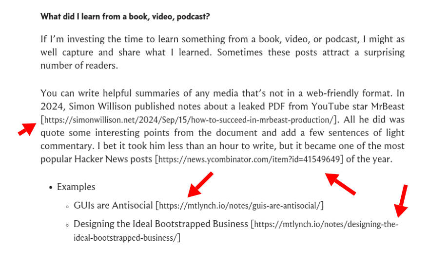
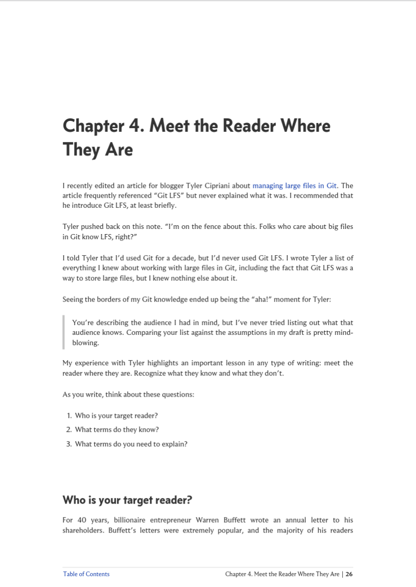
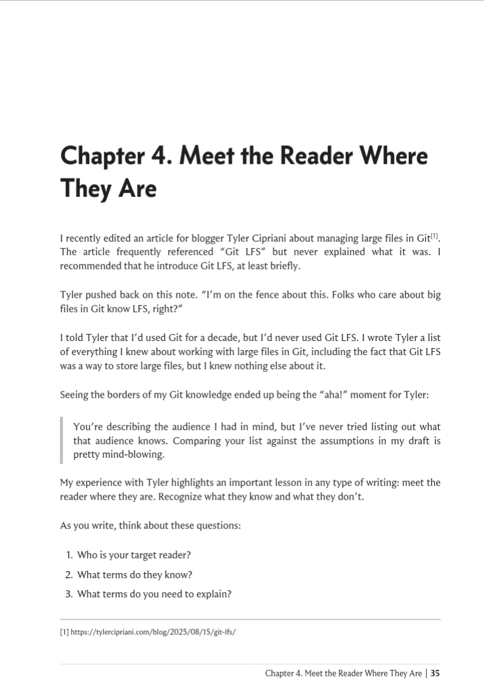



**New here?**

Hi, I'm Michael. I'm a software developer and founder of small, indie tech businesses. I'm currently working on a book called [_Refactoring English: Effective Writing for Software Developers_](https://refactoringenglish.com).

Every month, I publish a retrospective like this one to share how things are going with my book and my professional life overall.



## Highlights

-

## Goal grades

At the start of each month, I declare what I'd like to accomplish. Here's how I did against those goals:

### Pitch to 5 podcasts to talk about _Refactoring English_

- **Result**: Pitched to one new podcast
- **Grade**: D

I keep skipping this because to pitch to a podcast, I want to actually listen to a full episode of the podcast so I'm not just spamming random podcasts. But after becoming a parent, I don't have many activities that I can do while listening to a podcast, so I almost never listen to podcasts. And then listening to a podcast never feels like the most important thing to do during a workday.

I think I need to just recognize that the right podcast could have a huge impact on the book, so I

### Attract 30k unique readers to the _Refactoring English_ website

- **Result**: Did zero promotion to the website, but still got 7.8k unique readers
- **Grade**: F

TODO

### - Declare the 1.0 release of my book

- **Result**: Announced the 1.0 version
- **Grade**: A

TODO

## _Refactoring English_ metrics



## I've reached 1.0 of the book

## My fear of selling physical books

When I started writing _Refactoring English_, I wanted to keep things simple and publish it just as a PDF. I was open to other formats, and I intentionally chose authoring tools that supported EPUB, HTML, and print just in case there was demand, but I wanted to wait until there was a critical mass of customers willing to pay for other formats.

The format I was least excited to support was print copies, like physical books. My only experience selling a physical product was with TinyPilot, and the physical parts were consistently the most stressful and tedious parts of the work for me. Among my memories of shipping physical products:

- In the early days of TinyPilot, never wanting to travel because nobody would be home to pack orders and leave them out for the mail carrier.
- Customers who threatened to cancel their order or do a credit card chargeback if their order didn't ship the same day that they placed it.
- Having to eat the cost of hundreds of dollars of merchandise each month for packages that customers reported lost or stolen.
- Dealing with the complexity of syncing my website [with a third-party warehouse's internal logistics software](https://mtlynch.io/retrospectives/2023/04/#everyone-just-gives-us-their-admin-password).

As I've gotten closer to the finish line on the book, I've realized a lot of the problems I remember with TinyPilot are either solvable or don't exist with the book.

- Customers expecting immediate shipping: Probably not so common for people buying self-published books from an indie author.
- Eating the cost on products lost in the mail: The risk for a book is ~$20 in manufacturing costs and $3 in shipping as opposed to $150 + $20 for a hardware product

## How do you even print a book?

I know a lot of self-published authors default to Amazon's print on demand service to create physical copies of their books, but dealing with Amazon is also high on my list of things I don't miss about selling a physical product. I want to avoid Amazon as long as possible.

So, how do I print a book?

### Printing with a local print shop

I tried asking a local print shop. I reached out to one in July and never heard back. I assume they saw "initial run of 50-100 copies" and decided I wasn't worth the time. A few weeks later, I tried calling a local print shop that mainly does flyers and business cards and asked if they do books, and they said definitely, and they said they could quote me 50-100 books, and a few days later, I received their quote:

- Grayscale: $24.35/book @ 50 books
- Color: $78.73/book @ 50 books

Yikes!

The color price was a total non-starter. If it costs $79 to print, I probably have to charge $90 to break even after all my costs, and that probably prices out too many potential readers. I asked what volume I'd have to hit for price breaks, and they admitted that they just aren't set up to print this kind of book inexpensively.

### Printing with an online print-on-demand vendor

I checked online for print on demand vendors and found more viable prices for color prints:

- IngramSpark: $12.91/book
- Lulu: $19/book
- Blurb: $25.17/book

## How do I ship a self-published print book?

Printing the books is only half of it. Once I print the books, I to get them to the customer.

1. Print a bunch of books, send them from the printer to my house, and ship out books myself as orders come in.
   - Fun and personal, but it's also probably 3-10 minutes of work per order, and books take up a lot of space.
1. Order a bunch of books to a 3PL (warehouse and shipping vendor) (TODO: link) and connect a Shopify or Woo store to the 3PL
   - A lot of moving parts to manage.
1. Sell on Amazon with Amazon's print on demand service
   - I've hated working with Amazon on the seller side.
   - I might sell on Amazon eventually, but I definitely don't want it to be the first place I try because they're 100x more complicated and merchant-hostile than everyone else.
1. Sell with a vendor that does print on demand + fulfillment
   - This is like the Amazon option except you don't have to deal with Amazon.

Of these options (4) sounded like the best fit for me right.

Lulu added an option I think just in the last few weeks called [Buy Button](https://www.lulu.com/sell/sell-on-your-site/buy-button) that seems low-complexity and low-fee. I think they're using [Stripe Connect](https://stripe.com/connect) so the customer's payment goes directly to my Stripe account with some fee taken out for Lulu.

Lulu's Buy Button option seems like a great path for me at this point because I'm already selling the ebook through Stripe, and it's nice to have everything in a single payment platform.

The downside I see is that Lulu forces me to give customers a mailing address for returns, which means either paying for a virtual mailbox or revealing my home address to customers.

## Printing a test book

I wrote my book using Asciidoctor. The syntax awkward and the features limit your layout options a lot, but one strong positive is that Asciidoctor can generate multiple output formats from the same source markup. I tinkered with my settings to adapt my ebook PDF to a print-optimized PDF.

Asciidoctor's defaults for a print-optimized PDF were mostly good, though its standard method to adapt links for print looks terrible:

{{}}

I wanted to convert my links to footnotes, but Asciidoctor _only_ supports endnotes. I was able to vibecode an Asciidoctor extension that converted the links to proper footnotes.



{{}}

{{}}



I ordered my first print with Lulu, but it's going to take a couple of weeks to receive it.

## Side project: Mail Archiver

I'm a [longtime data hoarder](https://mtlynch.io/budget-nas/#why-build-a-nas-server). I still have 20+ year old [AIM logs from my college days](/notes/gleam-first-impressions/#my-project-parsing-old-aim-logs) and an offline copy of all my emails since 2004 when I got an early Gmail account.

There's so much useful information in my email archives that even though I keep an offline copy, I also keep everything at my email host. For 15 years that was Gmail, and then I switched everything over to Fastmail a few years ago. I use Fastmail with 2FA, and it's the one account I'm so paranoid about that I don't even keep the password in my password manager.

This year, everyone discovered that LLMs could hack everything, and I successfully hacked into my own Fastmail account without my password or security key (blog post coming). I reported the bug to Fastmail, and they fixed it, but what are the odds that I found the _last_ serious security vulnerability in Fastmail?

After hacking into my own Fastmail account, I realized that the value of having all my email easily accessible in a cloud email service wasn't worth the risk of someone downloading 20+ years of my email, especially as that risk has increased so drastically in 2026.

How do I move my mail offline but minimize the risk of losing any emails? The naive solution is to just run a program like offlineimap, trust that it got everything, and then delete whatever I want from my live email server. That felt too haphazard. What if I thought offlineimap had archived everything, but it actually didn't, and so I deleted emails where I don't have a backup?

I created a custom solution to archive my emails in a more defensive way:

1. I back up all my emails to my local computer
1. The app has a web UI that lets me view my local emails in a Gmail-like format
   - The app is creating a view of my local backup, not what's available at Fastmail's IMAP server, though the two _should_ match.
1. I can click any message and hit "Archive"
1. The app checks Fastmail and finds the same email by `Message-ID` and verifies that my local copy matches the copy on Fastmail
1. The app moves the email from my "live mirror" folder to my "offline backup" folder on my local computer.
1. The app deletes the email from my Fastmail account
1. The app confirms that the email disappears from the "live mirror" folder when imapgoose next syncs with Fastmail

With this flow, I minimize the chances of deleting a message unless I confirm that there's a safe copy offline.

The process gets more complicated as I scale up because I don't want to click "Archive" one by one on millions of emails, so I added support for archiving message threads in addition to individual messages. And then I added support for archiving sets of threads based on search criteria (e.g., all emails with label "PayPal" before 2023-12-31).

There are lots of wacky corner around translating emails from the IMAP/JMAP representation with labels to the local maildir format with folders, but after a couple weeks of whack-a-mole, I seem to have it working.

I also captured a snapshot of my "live" copy before I started deleting anything to make sure that if I find a bug later that a

## Wrap up

### What got done?

-

### Lessons learned

-

### Goals for next month

-

### Requests for help

TODO
