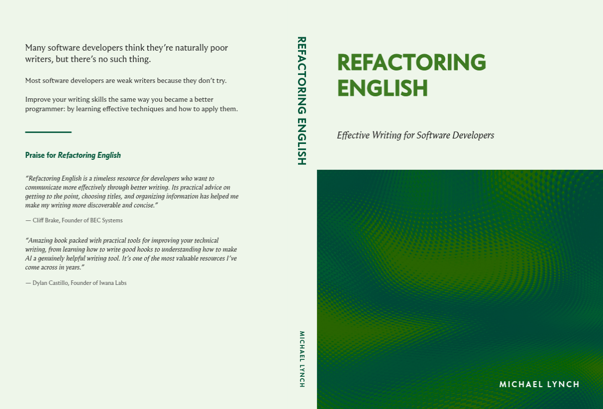
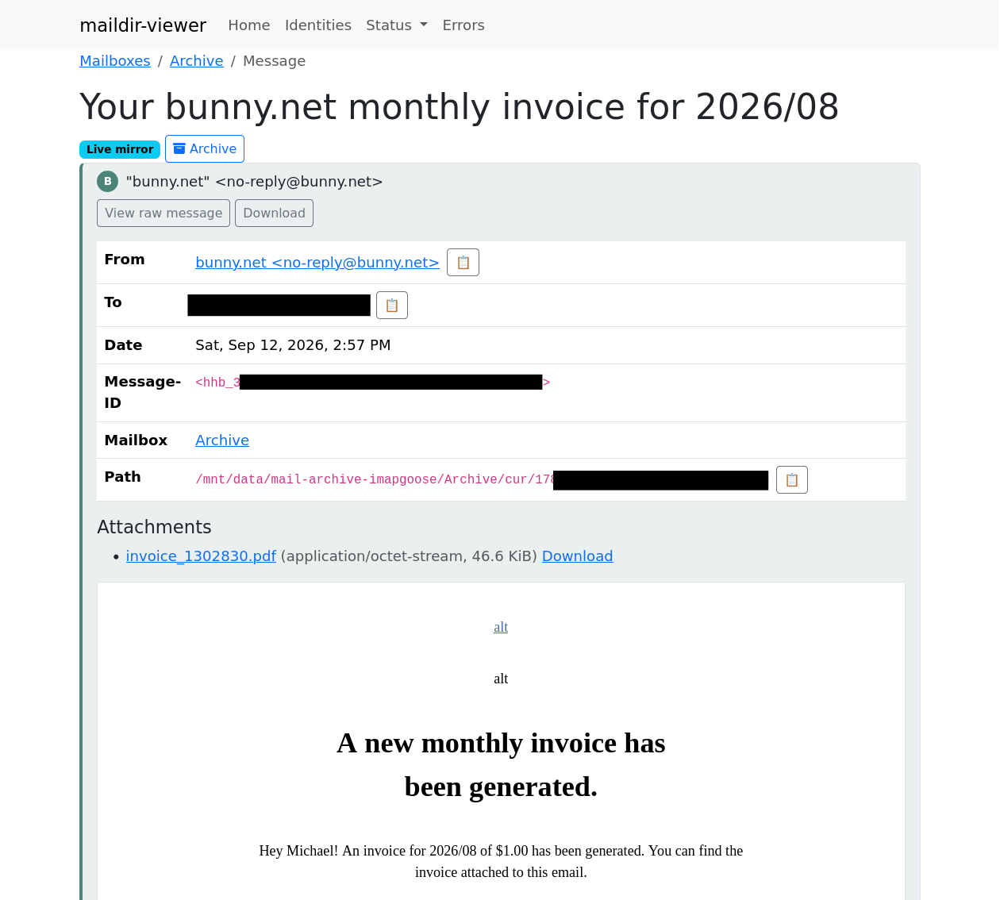



**New here?**

Hi, I'm Michael. I'm a software developer and founder of small, indie tech businesses. I'm currently working on a book called [_Refactoring English: Effective Writing for Software Developers_](https://refactoringenglish.com).

Every month, I publish a retrospective like this one to share how things are going with my book and my professional life overall.



## Highlights

- I'm making a print copy of my book.
- I'm facing my fears of selling a physical product again.
- I wrote a tool to keep most of my email offline.

## Goal grades

At the start of each month, I declare what I'd like to accomplish. Here's how I did against those goals:

### Pitch to 5 podcasts to talk about _Refactoring English_

- **Result**: Pitched to one new podcast
- **Grade**: D

I keep skipping this because before I reach out, I want to listen to a full episode of the podcast so I'm not just spamming them with a generic pitch. After becoming a parent, I don't have many activities that I can do while listening to a podcast, so I almost never listen to podcasts. And then listening to a podcast never feels like the most important thing to do during a workday.

I need to recognize that the right podcast could have a huge impact on the book, so I should allocate time to it even if it doesn't feel like work.

### Attract 30k unique readers to the _Refactoring English_ website

- **Result**: Did zero promotion to the website, but still got 7.8k unique readers
- **Grade**: F

I did a lot of polish on the book website to make it look nicer, but I didn't do much in terms of promotion. I'm working on a blog post that I think will attract readers, but I'm holding off until I'm ready to launch.

### Declare the 1.0 release of my book

- **Result**: Announced the 1.0 version
- **Grade**: A

The book is now at 1.0!

## _Refactoring English_ metrics



Metrics are down but still impressively healthy given that I didn't do any promotion. I hope to turn this around with next month's launch.

## I've reached 1.0 of the book

I feel like I've had "finish the book" as my monthly goal for like a year now, but the book is finally done.

Well, not "done." I want to treat this book kind of like software where I can improve it over time, but I was ready to declare the 1.0 release of the book.

I'm noticing a lot more people reading the book. A lot of readers had been holding off because they didn't want to read an early draft, so I'm now hearing from readers who purchased early access 12+ months ago but only now are beginning to read the book.

I thought I'd do a big launch immediately after hitting 1.0 and then look into a print version later, but I saw another indie author sharing their sales figures, and they had something like a 70/30 split between the print version and the ebook. That made me rethink a print version and defer the official 1.0 launch until I have a print option.

## My fear of selling a physical product

After I [sold TinyPilot](/i-sold-tinypilot/), my attitude toward selling a physical product was: never again.

When I think back to shipping physical products for TinyPilot, here are the memories that immediately spring to mind:

- In the early days of TinyPilot, never wanting to travel because nobody would be home to pack orders and leave them out for the mail carrier.
- Customers threatening a credit card chargeback if their order didn't ship the same day that they placed it.
- Having to eat the cost of hundreds of dollars of merchandise each month for packages that customers reported lost or stolen.
- Dealing with the complexity of syncing my website [with a third-party warehouse's internal logistics software](https://mtlynch.io/retrospectives/2023/04/#everyone-just-gives-us-their-admin-password).

When I started writing _Refactoring English_, I wanted to keep things simple and publish it just as an ebook. If customers asked for a print version, I'd consider it, but I liked the simplicity of a fully digital product.

And then customers started asking for a print version. It's the most common request I receive. I keep thinking, "Sure, if the book becomes popular." As I've gotten closer to the finish line, I've warmed to the idea. A lot of the problems I remember with TinyPilot are either solvable or don't exist with a self-published book.

- When customers buy a self-published book from an indie author, they probably don't expect it to arrive at their house the next day.
- If a book gets lost in shipping, I lose \~$20 in manufacturing costs and $3 in postage as opposed to hundreds of dollars on a hardware product.

## How do you even print a book?

Most self-published authors default to Amazon's print-on-demand service to create physical copies of their books. I hated working with Amazon last time I sold there, so I want to avoid Amazon as long as possible.

So, how do I print a book?

First, I tried asking a local print shop. I reached out to one in July and never heard back. I assume they saw "initial run of 50-100 copies" and decided I wasn't worth the trouble.

A few weeks later, I tried calling a different local print shop I've worked with before for flyers. I asked if they print small runs of books, and they said definitely. A few days later, they sent the official quote:

- Grayscale: $24.35/book @ 50 books
- Color: $78.73/book @ 50 books

Yikes!

The color price was a total non-starter. If it costs $78 to print, I probably have to charge $90 to break even after all my costs. I asked what volume I'd have to hit for price breaks, and they admitted that they just aren't set up to print this kind of book inexpensively.

I checked online for print-on-demand vendors and found more viable prices for color prints:

- IngramSpark: $12.91/book
- Lulu: $18.85/book
- Blurb: $25.17/book

Okay, much more doable.

## How do I ship a self-published print book?

Printing the books is only half of it. Once I print the books, how do I get them to customers?

I found several options:

1. Print a batch of 200+ books and ship them to my house. When a customer orders, I pack and ship the book myself.
   - Fun and personal, but it's also probably 3-10 minutes of work per order, and books take up a lot of space.
1. Order a bunch of books to a [3PL](/bootstrapped-founder-year-6/#outsourcing-order-fulfillment-and-reducing-stress) (warehouse and shipping vendor) and connect a Shopify or Woo store to the 3PL.
   - A lot of moving parts to manage and [a frequent headache in the past](/retrospectives/2023/04/#everyone-just-gives-us-their-admin-password)
1. Sell on Amazon with Amazon's print-on-demand service
   - I've hated working with Amazon on the seller side.
   - I might sell on Amazon eventually, but I definitely don't want it to be the first place I try. They're 10x more complicated and merchant-hostile than everyone else.
1. Sell with a vendor that does print on demand + fulfillment
   - This is like the Amazon option except you don't have to deal with Amazon.

Of these options (4) sounded like the best fit for me right now.

By luck, Lulu added an option in the last few weeks called [Buy Button](https://www.lulu.com/sell/sell-on-your-site/buy-button) that seems appealingly lightweight and simple. Lulu generates a URL to purchase my book, I link to it from my website, and customers can check out through Lulu, and Lulu prints and ships the book to the customer. I think Lulu is using [Stripe Connect](https://stripe.com/connect) so the customer's payment goes directly to my Stripe account with some fee taken out for Lulu.

Lulu's Buy Button option seems like a great path for me at this point because I'm already selling the ebook through Stripe, so it will be nice to keep everything within a single payment platform.

## Printing a test book

I wrote my book using Asciidoctor. The syntax is awkward and the features severely limit the book's layout, but one strong positive is that Asciidoctor can generate multiple output formats from the same source markup.

I tried adapting my Asciidoctor book settings to create a print-optimized PDF, and I was pleasantly surprised. Asciidoctor's defaults for a printed book were mostly good, though its standard method to adapt links for print looks terrible:

{{}}

I wanted to convert my links to footnotes, but Asciidoctor _only_ supports endnotes. I was able to vibecode an Asciidoctor extension that converted the links to proper footnotes.



{{}}

{{}}



One mystery to me was how Lulu knows what to put on the book's back cover and spine. My ebook has a front cover, and I guess I could add a page to the print version for the back cover, but how do I put a book spine into a PDF?

It turns out that the way Lulu and, I guess, all print-on-demand publishers work is that you upload two separate PDFs:

1. The "shell" of your book that includes the front cover, back cover, and spine
1. The inner pages of your book, which are all the printed pages aside from the front and back covers

I worked with an LLM to use [Typst](https://typst.app/) to create the shell for my book:

{{}}

I ordered my first print with Lulu, but the process is a bit slow. It takes 5-7 business days to print and then another 3-5 business days for shipping, so I expect it to arrive next week. If it looks good, I'll set the wheels in motion for the official book launch.

I initially thought the print version was going to be such a headache, but now I'm excited about it. People have said to me, "Wouldn't it be cool to have it on your shelf?" and I felt like, "Eh, not really."

The thing I'm more excited about with a print version is that I can give copies to friends and family ~~whom I wish to burden with the chore of reading my book~~. I could just send them the PDF, but a physical copy feels more fun and gift-like.

## Side project: Mail Archiver

I'm a [longtime data hoarder](https://mtlynch.io/budget-nas/#why-build-a-nas-server). I still have 20-plus-year-old [AIM logs from my college days](/notes/gleam-first-impressions/#my-project-parsing-old-aim-logs). I also never delete emails, so I have all my emails going back to 2004 when Gmail first came out.

This year, we discovered that [LLMs can hack everything](/claude-code-found-linux-vulnerability/). Shortly after writing that post, I used an LLM to find a vulnerability in Fastmail that let me read any user's entire email contents (blog post coming soon). I reported the bug to Fastmail, and they promptly fixed it, but what are the odds that I found the _last_ serious security vulnerability in Fastmail?

After hacking into my own Fastmail account, I started to re-evaluate the tradeoffs of keeping all of my email on a third-party cloud service. On one hand, it's convenient to have a professional vendor keep all of my mail available and searchable at all times. On the other hand, a cloud mail provider is an attractive target for hackers and has more attack surface than my home computer.

Okay, so I want to move my email offline, but how do I do that? How do I move emails without accidentally losing some?

The naïve way to move my emails offline is to just run a mail archiving tool like [imapgoose](https://git.sr.ht/~whynothugo/ImapGoose), trust that it got everything, and then delete whatever I want from my live email server. But what if imapgoose missed some subset of emails? Then, when I purge the supposedly archived emails from Fastmail, I'd be deleting the sole copy.

Instead, I created a custom tool to archive my emails in a more defensive way:

1. I use imapgoose to back up all my emails to my local computer
1. The app has a web UI that lets me view my local emails in a Gmail-like format
   - The app is creating a view of my local backup, not what's available at Fastmail's IMAP server, though the two _should_ match.
1. I can click any message and hit "Archive"
1. The app checks Fastmail and finds the same email by `Message-ID` and verifies that my local copy matches the copy on Fastmail
1. The app moves the email from my "live mirror" folder to my "offline backup" folder on my local computer.
1. The app deletes the email from my Fastmail account via JMAP API calls.
1. The app confirms that the email disappears from the "live mirror" folder when imapgoose next syncs with Fastmail.

This flow minimizes the risk of losing a message because the app won't delete anything unless it confirms there's an identical copy offline.

{{}}

Complexity grew as I scaled from archiving individual messages to archiving message threads. And then it increased again when I went from archiving threads to sets of threads. And there are lots of wacky corner cases among my millions of emails, but after a couple weeks of whack-a-mole, I felt confident enough to delete messages for real from Fastmail, so now most of my personal email is offline.

## Wrap up

### What got done?

- Declared the 1.0 release of my book
- Created a print version of the book and ordered a test copy
- Added options for buying discounted team licenses of the book

### Lessons learned

- It's not so scary to sell a physical product.
  - A lot of the unpleasant parts of selling a physical product I experienced with TinyPilot were unique to that business.

### Goals for next month

- Announce the official launch of the book.
- Pitch to two podcasts.
- Publish a new blog post that attracts readers to the book's website.
